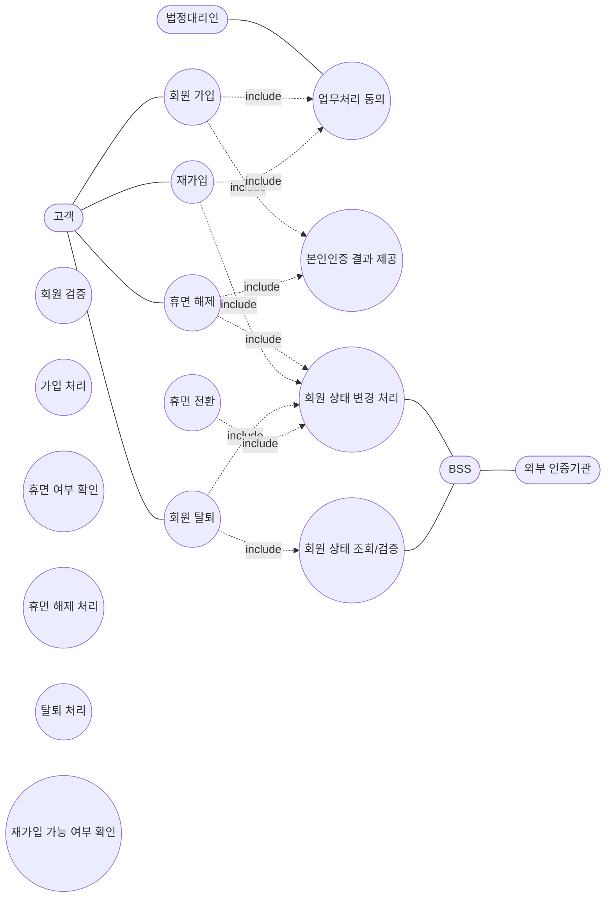
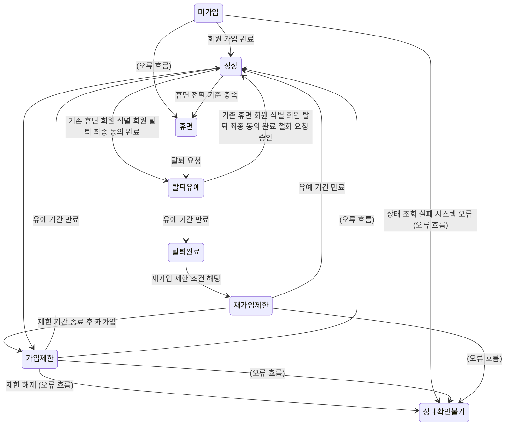
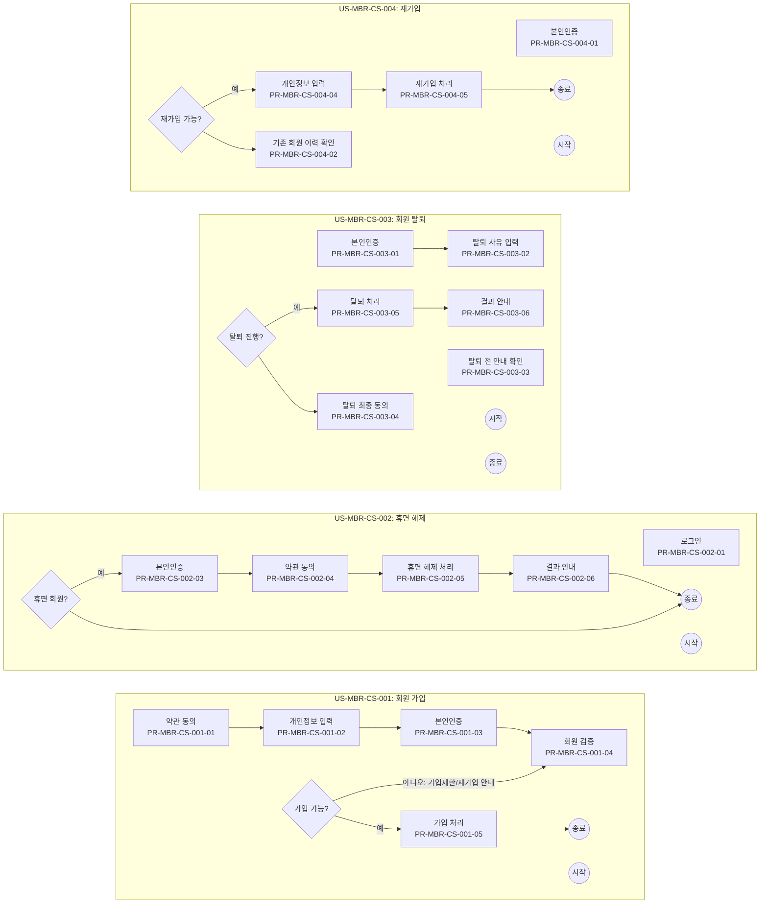

# 00_INDEX — 회원가입 · 회원탈퇴 (POL-MBR Full v1.0)

추출 일시: 2026-05-18T15:19:25+09:00  
원본 HTML: `/Users/1112979/Policy Generator Web Service Clone/ncstudio/input/samples/NC_정책서_Full_v1.0_확정본.html`

## Claude Code 사용 가이드

이 폴더는 정책서 1개를 디자인팀/개발팀 친화 형태로 변환한 결과입니다. Claude Code로 이 폴더를 통째로 받았다면 다음 순서로 활용하세요:

1. **이 INDEX 파일**을 먼저 읽어 전체 구성과 ID 체계를 파악하세요.
2. **유즈케이스 단위 작업**은 `usecase_<UC-ID>.md`를 읽으세요. 한 파일 안에 그 UC의 Process·Function·Policy가 inline으로 응집되어 있습니다.
3. **N:N 관계 navigation**(예: 어떤 Function이 어느 Process들에 쓰이는지)은 `mapping.csv` 또는 `entities.yaml#cross_refs`를 보세요.
4. **머신 처리**(스크립트, 파이프라인 입력)는 `entities.yaml`이 최적입니다.
5. **데이터 무결성 점검**은 `warnings.md`를 보세요. 깨진 참조·고아 엔티티·누락 의심 항목이 자동 검출됩니다.
6. **ID 검색**은 정확한 ID 문자열로 폴더 전체 grep을 권장합니다: `grep -r '<ID>' .`

## 파일 구성

| 파일 | 내용 | 권장 사용 시점 |
|---|---|---|
| `00_INDEX.md` | 이 진입 가이드 + ID 일람 + 계층 트리 | 폴더를 처음 받았을 때 |
| `usecase_*.md` | UC별 슬라이스 (Process·Function·Policy inline 응집) | UC 단위로 작업할 때 |
| `mapping.csv` | UC→Process→Function→Policy→PolicyItem 평탄화 매트릭스 | N:N 관계를 한눈에 볼 때 / Excel 피벗 |
| `entities.yaml` | 정체성·관계·데이터 딕셔너리 머신 dump | 스크립트·파이프라인 입력 |
| `warnings.md` | 자동 검증 리포트 (broken refs, orphans, 누락 의심 정책) | 데이터 무결성 점검 |

## 통계

- 액터 4 · 유즈케이스 13 · 상태 8 · 상태 전이 145
- 프로세스 22 · 기능 29
- 정책 그룹 44 · 정책 항목 475
- 용어 41

## UC 일람 + 슬라이스 링크

| UC ID | UC 이름 | 슬라이스 파일 |
|---|---|---|
| `US-MBR-CS-001` | 회원 가입 | [usecase_US-MBR-CS-001.md](./usecase_US-MBR-CS-001.md) |
| `US-MBR-CS-002` | 휴면 해제 | [usecase_US-MBR-CS-002.md](./usecase_US-MBR-CS-002.md) |
| `US-MBR-CS-003` | 회원 탈퇴 | [usecase_US-MBR-CS-003.md](./usecase_US-MBR-CS-003.md) |
| `US-MBR-CS-004` | 재가입 | [usecase_US-MBR-CS-004.md](./usecase_US-MBR-CS-004.md) |
| `US-MBR-GRD-001` | 업무처리 동의 | [usecase_US-MBR-GRD-001.md](./usecase_US-MBR-GRD-001.md) |
| `US-MBR-AUTH-001` | 본인인증 결과 제공 | [usecase_US-MBR-AUTH-001.md](./usecase_US-MBR-AUTH-001.md) |
| `US-MBR-BSS-001` | 회원 검증 | [usecase_US-MBR-BSS-001.md](./usecase_US-MBR-BSS-001.md) |
| `US-MBR-BSS-002` | 가입 처리 | [usecase_US-MBR-BSS-002.md](./usecase_US-MBR-BSS-002.md) |
| `US-MBR-BSS-003` | 휴면 여부 확인 | [usecase_US-MBR-BSS-003.md](./usecase_US-MBR-BSS-003.md) |
| `US-MBR-BSS-004` | 휴면 전환 | [usecase_US-MBR-BSS-004.md](./usecase_US-MBR-BSS-004.md) |
| `US-MBR-BSS-005` | 휴면 해제 처리 | [usecase_US-MBR-BSS-005.md](./usecase_US-MBR-BSS-005.md) |
| `US-MBR-BSS-006` | 탈퇴 처리 | [usecase_US-MBR-BSS-006.md](./usecase_US-MBR-BSS-006.md) |
| `US-MBR-BSS-007` | 재가입 가능 여부 확인 | [usecase_US-MBR-BSS-007.md](./usecase_US-MBR-BSS-007.md) |

## ID Hierarchy 트리 (UC → Process → Function)

```
- US-MBR-CS-001 — 회원 가입
  - PR-MBR-CS-001-01 — 약관 동의
    - FN-MBR-COM-003 — 약관 동의 처리
    - FN-MBR-COM-004 — 법정대리인 동의 처리
    - FN-MBR-COM-005 — 처리 이력 및 알림 처리
  - PR-MBR-CS-001-02 — 개인정보 입력
    - FN-MBR-JOIN-002 — 회원정보 입력 및 검증
    - FN-MBR-JOIN-001 — 가입 진입 조건 확인
  - PR-MBR-CS-001-03 — 본인인증
    - FN-MBR-COM-002 — 본인인증 처리
  - PR-MBR-CS-001-04 — 회원 검증
    - FN-MBR-COM-001 — 회원 식별 및 상태 조회
    - FN-MBR-COM-004 — 법정대리인 동의 처리
    - FN-MBR-JOIN-003 — 가입 가능 여부 판정
  - PR-MBR-CS-001-05 — 가입 처리
    - FN-MBR-JOIN-004 — 회원 계정 생성
    - FN-MBR-JOIN-005 — 가입 완료 처리
    - FN-MBR-COM-005 — 처리 이력 및 알림 처리
    - FN-MBR-COM-006 — 세션 생성 및 전환
- US-MBR-CS-002 — 휴면 해제
  - PR-MBR-CS-002-01 — 로그인
    - FN-MBR-COM-001 — 회원 식별 및 상태 조회
    - FN-MBR-DORM-001 — 휴면 회원 감지 및 안내
  - PR-MBR-CS-002-02 — 휴면 여부 확인
    - FN-MBR-COM-001 — 회원 식별 및 상태 조회
    - FN-MBR-DORM-002 — 휴면 해제 가능 여부 판정
  - PR-MBR-CS-002-03 — 본인인증
    - FN-MBR-COM-002 — 본인인증 처리
  - PR-MBR-CS-002-04 — 약관 동의
    - FN-MBR-COM-003 — 약관 동의 처리
    - FN-MBR-COM-004 — 법정대리인 동의 처리
  - PR-MBR-CS-002-05 — 휴면 해제 처리
    - FN-MBR-DORM-003 — 휴면 해제 처리
    - FN-MBR-COM-006 — 세션 생성 및 전환
    - FN-MBR-COM-005 — 처리 이력 및 알림 처리
  - PR-MBR-CS-002-06 — 휴면 해제 처리 결과 안내
    - FN-MBR-DORM-004 — 휴면 해제 완료 안내
    - FN-MBR-COM-005 — 처리 이력 및 알림 처리
    - FN-MBR-COM-008 — 업무 결과 재조회 및 이력 확인
- US-MBR-CS-003 — 회원 탈퇴
  - PR-MBR-CS-003-01 — 본인인증
    - FN-MBR-COM-002 — 본인인증 처리
  - PR-MBR-CS-003-02 — 탈퇴 사유 입력
    - FN-MBR-LEAVE-003 — 탈퇴 사유 접수
  - PR-MBR-CS-003-03 — 탈퇴 전 안내 확인
    - FN-MBR-LEAVE-001 — 탈퇴 가능 여부 판정
    - FN-MBR-LEAVE-002 — 탈퇴 영향 안내
  - PR-MBR-CS-003-04 — 탈퇴 최종 동의
    - FN-MBR-LEAVE-004 — 탈퇴 최종 동의 처리
  - PR-MBR-CS-003-05 — 탈퇴 처리
    - FN-MBR-LEAVE-005 — 탈퇴 처리
    - FN-MBR-COM-007 — 개인정보 파기·보관 후속 처리
    - FN-MBR-COM-005 — 처리 이력 및 알림 처리
  - PR-MBR-CS-003-06 — 탈퇴 결과 안내
    - FN-MBR-LEAVE-006 — 탈퇴 완료 및 철회 안내
    - FN-MBR-COM-008 — 업무 결과 재조회 및 이력 확인
    - FN-MBR-COM-005 — 처리 이력 및 알림 처리
- US-MBR-CS-004 — 재가입
  - PR-MBR-CS-004-01 — 본인인증
    - FN-MBR-COM-002 — 본인인증 처리
    - FN-MBR-REJOIN-001 — 재가입 대상 확인
  - PR-MBR-CS-004-02 — 기존 회원 이력 확인
    - FN-MBR-COM-001 — 회원 식별 및 상태 조회
    - FN-MBR-REJOIN-001 — 재가입 대상 확인
    - FN-MBR-REJOIN-003 — 기존 이력 연계 및 복원 범위 판정
  - PR-MBR-CS-004-03 — 재가입 가능 여부 확인
    - FN-MBR-REJOIN-002 — 재가입 제한 여부 판정
    - FN-MBR-REJOIN-003 — 기존 이력 연계 및 복원 범위 판정
  - PR-MBR-CS-004-04 — 개인정보 입력
    - FN-MBR-REJOIN-004 — 재가입 정보 입력 및 약관 동의
    - FN-MBR-COM-003 — 약관 동의 처리
    - FN-MBR-COM-004 — 법정대리인 동의 처리
  - PR-MBR-CS-004-05 — 재가입 처리
    - FN-MBR-REJOIN-005 — 재가입 처리
    - FN-MBR-REJOIN-006 — 재가입 완료 안내
    - FN-MBR-COM-006 — 세션 생성 및 전환
    - FN-MBR-COM-007 — 개인정보 파기·보관 후속 처리
    - FN-MBR-COM-005 — 처리 이력 및 알림 처리
    - FN-MBR-COM-008 — 업무 결과 재조회 및 이력 확인
- US-MBR-GRD-001 — 업무처리 동의
- US-MBR-AUTH-001 — 본인인증 결과 제공
- US-MBR-BSS-001 — 회원 검증
- US-MBR-BSS-002 — 가입 처리
- US-MBR-BSS-003 — 휴면 여부 확인
- US-MBR-BSS-004 — 휴면 전환
- US-MBR-BSS-005 — 휴면 해제 처리
- US-MBR-BSS-006 — 탈퇴 처리
- US-MBR-BSS-007 — 재가입 가능 여부 확인
```

## 엔티티별 ID 일람

### Terms (용어)

정의 위치: `entities.yaml#terms`

| ID | 이름 |
|---|---|
| `TM-MBR-001` | 고객 |
| `TM-MBR-002` | 비회원 |
| `TM-MBR-003` | 회원 |
| `TM-MBR-004` | 정상 회원 |
| `TM-MBR-005` | 휴면 회원 |
| `TM-MBR-006` | 탈퇴 회원 |
| `TM-MBR-007` | 가입 제한 회원 |
| `TM-MBR-008` | 회원 상태 |
| `TM-MBR-009` | 회원 생애주기 |
| `TM-MBR-010` | 본인인증 |
| `TM-MBR-011` | 인증수단 |
| `TM-MBR-012` | 외부 인증기관 |
| `TM-MBR-013` | 인증 세션 |
| `TM-MBR-014` | CI (Connecting Information) |
| `TM-MBR-015` | DI (Duplicated Information) |
| `TM-MBR-016` | 법정대리인 |
| `TM-MBR-017` | 미성년자 |
| `TM-MBR-018` | 외국인 고객 |
| `TM-MBR-019` | 약관 |
| `TM-MBR-020` | 필수 약관 |
| `TM-MBR-021` | 선택 약관 |
| `TM-MBR-022` | 약관 동의 이력 |
| `TM-MBR-023` | 재동의 |
| `TM-MBR-024` | 회원정보 |
| `TM-MBR-025` | 분리보관 데이터 |
| `TM-MBR-026` | 법정보관 데이터 |
| `TM-MBR-027` | 휴면 해제 |
| `TM-MBR-028` | 회원 탈퇴 |
| `TM-MBR-029` | 탈퇴 유예 기간 |
| `TM-MBR-030` | 탈퇴 철회 |
| `TM-MBR-031` | 재가입 |
| `TM-MBR-032` | 계정 복원 |
| `TM-MBR-033` | 세션 |
| `TM-MBR-034` | 토큰 |
| `TM-MBR-035` | 고위험 업무 |
| `TM-MBR-036` | FO |
| `TM-MBR-037` | BSS |
| `TM-MBR-038` | 프로세스 |
| `TM-MBR-039` | 기능 |
| `TM-MBR-040` | 정책 그룹 |
| `TM-MBR-041` | 정책 항목 |

### Actors (액터)

정의 위치: `entities.yaml#actors`

| ID | 이름 |
|---|---|
| `ACT-MBR-001` | 고객 |
| `ACT-MBR-002` | 법정대리인 |
| `ACT-MBR-003` | 외부 인증기관 |
| `ACT-MBR-004` | BSS |

### Use Cases

정의 위치: `각 usecase_*.md`

| ID | 이름 |
|---|---|
| `US-MBR-CS-001` | 회원 가입 |
| `US-MBR-CS-002` | 휴면 해제 |
| `US-MBR-CS-003` | 회원 탈퇴 |
| `US-MBR-CS-004` | 재가입 |
| `US-MBR-GRD-001` | 업무처리 동의 |
| `US-MBR-AUTH-001` | 본인인증 결과 제공 |
| `US-MBR-BSS-001` | 회원 검증 |
| `US-MBR-BSS-002` | 가입 처리 |
| `US-MBR-BSS-003` | 휴면 여부 확인 |
| `US-MBR-BSS-004` | 휴면 전환 |
| `US-MBR-BSS-005` | 휴면 해제 처리 |
| `US-MBR-BSS-006` | 탈퇴 처리 |
| `US-MBR-BSS-007` | 재가입 가능 여부 확인 |

### States

정의 위치: `entities.yaml#states`

| ID | 이름 |
|---|---|
| `MBR_NONE` | 미가입 |
| `MBR_ACTIVE` | 정상 |
| `MBR_DORMANT` | 휴면 |
| `MBR_WITHDRAW_PENDING` | 탈퇴유예 |
| `MBR_WITHDRAWN` | 탈퇴완료 |
| `MBR_REJOIN_BLOCKED` | 재가입제한 |
| `MBR_JOIN_BLOCKED` | 가입제한 |
| `MBR_UNKNOWN` | 상태확인불가 |

### Processes

정의 위치: `해당 UC의 usecase_*.md 안`

| ID | 이름 |
|---|---|
| `PR-MBR-CS-001-01` | 약관 동의 |
| `PR-MBR-CS-001-02` | 개인정보 입력 |
| `PR-MBR-CS-001-03` | 본인인증 |
| `PR-MBR-CS-001-04` | 회원 검증 |
| `PR-MBR-CS-001-05` | 가입 처리 |
| `PR-MBR-CS-002-01` | 로그인 |
| `PR-MBR-CS-002-02` | 휴면 여부 확인 |
| `PR-MBR-CS-002-03` | 본인인증 |
| `PR-MBR-CS-002-04` | 약관 동의 |
| `PR-MBR-CS-002-05` | 휴면 해제 처리 |
| `PR-MBR-CS-002-06` | 휴면 해제 처리 결과 안내 |
| `PR-MBR-CS-003-01` | 본인인증 |
| `PR-MBR-CS-003-02` | 탈퇴 사유 입력 |
| `PR-MBR-CS-003-03` | 탈퇴 전 안내 확인 |
| `PR-MBR-CS-003-04` | 탈퇴 최종 동의 |
| `PR-MBR-CS-003-05` | 탈퇴 처리 |
| `PR-MBR-CS-003-06` | 탈퇴 결과 안내 |
| `PR-MBR-CS-004-01` | 본인인증 |
| `PR-MBR-CS-004-02` | 기존 회원 이력 확인 |
| `PR-MBR-CS-004-03` | 재가입 가능 여부 확인 |
| `PR-MBR-CS-004-04` | 개인정보 입력 |
| `PR-MBR-CS-004-05` | 재가입 처리 |

### Functions

정의 위치: `해당 Process가 속한 usecase_*.md (반복 등장 OK)`

| ID | 이름 |
|---|---|
| `FN-MBR-COM-003` | 약관 동의 처리 |
| `FN-MBR-JOIN-002` | 회원정보 입력 및 검증 |
| `FN-MBR-JOIN-001` | 가입 진입 조건 확인 |
| `FN-MBR-COM-002` | 본인인증 처리 |
| `FN-MBR-COM-001` | 회원 식별 및 상태 조회 |
| `FN-MBR-COM-004` | 법정대리인 동의 처리 |
| `FN-MBR-JOIN-003` | 가입 가능 여부 판정 |
| `FN-MBR-JOIN-004` | 회원 계정 생성 |
| `FN-MBR-JOIN-005` | 가입 완료 처리 |
| `FN-MBR-COM-005` | 처리 이력 및 알림 처리 |
| `FN-MBR-COM-006` | 세션 생성 및 전환 |
| `FN-MBR-DORM-001` | 휴면 회원 감지 및 안내 |
| `FN-MBR-DORM-002` | 휴면 해제 가능 여부 판정 |
| `FN-MBR-DORM-003` | 휴면 해제 처리 |
| `FN-MBR-DORM-004` | 휴면 해제 완료 안내 |
| `FN-MBR-LEAVE-003` | 탈퇴 사유 접수 |
| `FN-MBR-LEAVE-001` | 탈퇴 가능 여부 판정 |
| `FN-MBR-LEAVE-002` | 탈퇴 영향 안내 |
| `FN-MBR-LEAVE-004` | 탈퇴 최종 동의 처리 |
| `FN-MBR-LEAVE-005` | 탈퇴 처리 |
| `FN-MBR-COM-007` | 개인정보 파기·보관 후속 처리 |
| `FN-MBR-LEAVE-006` | 탈퇴 완료 및 철회 안내 |
| `FN-MBR-COM-008` | 업무 결과 재조회 및 이력 확인 |
| `FN-MBR-REJOIN-001` | 재가입 대상 확인 |
| `FN-MBR-REJOIN-002` | 재가입 제한 여부 판정 |
| `FN-MBR-REJOIN-003` | 기존 이력 연계 및 복원 범위 판정 |
| `FN-MBR-REJOIN-004` | 재가입 정보 입력 및 약관 동의 |
| `FN-MBR-REJOIN-005` | 재가입 처리 |
| `FN-MBR-REJOIN-006` | 재가입 완료 안내 |

### Policy Groups

정의 위치: `해당 Process가 속한 usecase_*.md + entities.yaml#policy_groups`

| ID | 이름 |
|---|---|
| `PG-MBR-TERM-001` | 약관 동의 적용 정책 |
| `PG-MBR-TERM-002` | 법정대리인 동의 정책 |
| `PG-MBR-TERM-003` | 약관 동의 이력 관리 정책 |
| `PG-MBR-INFO-001` | 회원 정보 입력 항목 정책 |
| `PG-MBR-INFO-002` | 회원 정보 입력값 검증 정책 |
| `PG-MBR-INFO-003` | 회원 식별정보 중복 확인 정책 |
| `PG-MBR-AUTH-001` | 본인인증 적용 정책 |
| `PG-MBR-AUTH-002` | 인증수단 정책 |
| `PG-MBR-AUTH-003` | 인증번호 발급 정책 |
| `PG-MBR-AUTH-004` | 인증번호 재요청 정책 |
| `PG-MBR-AUTH-005` | 인증 실패 제한 정책 |
| `PG-MBR-AUTH-006` | 인증 결과 판정 정책 |
| `PG-MBR-AUTH-007` | 인증 이력 관리 정책 |
| `PG-MBR-STAT-001` | 회원 상태 조회 정책 |
| `PG-MBR-JOIN-001` | 신규가입 가능 여부 판정 정책 |
| `PG-MBR-ROUTE-001` | 회원 경로 분기 정책 |
| `PG-MBR-ACCT-001` | 회원 계정 생성 정책 |
| `PG-MBR-PROF-001` | 기본 프로필 초기화 정책 |
| `PG-MBR-SESS-001` | 가입 완료 세션 전환 정책 |
| `PG-MBR-LOGIN-001` | 로그인 및 휴면 진입 판정 정책 |
| `PG-MBR-DORM-001` | 휴면 해제 가능 여부 판정 정책 |
| `PG-MBR-DORM-002` | 휴면 상태 전환 정책 |
| `PG-MBR-DORM-003` | 휴면 데이터 복원 정책 |
| `PG-MBR-SESS-002` | 휴면 해제 세션 복구 정책 |
| `PG-MBR-DORM-004` | 휴면 해제 결과 안내 정책 |
| `PG-MBR-AUTH-008` | 고위험 업무 추가 인증 정책 |
| `PG-MBR-LEAVE-001` | 탈퇴 사유 수집 및 저장 정책 |
| `PG-MBR-LEAVE-002` | 탈퇴 가능 여부 사전 점검 정책 |
| `PG-MBR-LEAVE-003` | 미납·미처리 항목 확인 정책 |
| `PG-MBR-LEAVE-004` | 보유 혜택·자산 소멸 안내 정책 |
| `PG-MBR-LEAVE-005` | 연계 서비스 영향 안내 정책 |
| `PG-MBR-LEAVE-006` | 탈퇴 전 안내 확인 정책 |
| `PG-MBR-LEAVE-007` | 탈퇴 최종 동의 정책 |
| `PG-MBR-LEAVE-008` | 회원 탈퇴 상태 전환 정책 |
| `PG-MBR-LEAVE-009` | 탈퇴 세션·토큰 종료 정책 |
| `PG-MBR-LEAVE-010` | 탈퇴 회원 데이터 보관·파기 정책 |
| `PG-MBR-LEAVE-011` | 철회 유예 적용 정책 |
| `PG-MBR-LEAVE-012` | 탈퇴 결과 안내 정책 |
| `PG-MBR-REJOIN-001` | 계정 복원 가능 여부 판정 정책 |
| `PG-MBR-REJOIN-002` | 재가입 가능 여부 판정 정책 |
| `PG-MBR-REJOIN-003` | 재가입 제한 및 예외 적용 정책 |
| `PG-MBR-INFO-004` | 재가입 정보 입력 및 기존 정보 재사용 정책 |
| `PG-MBR-REJOIN-004` | 계정 복원 또는 신규 생성 정책 |
| `PG-MBR-REJOIN-005` | 재가입 완료 안내 및 통지 정책 |

### Policy Items

정의 위치: `해당 PG가 속한 usecase_*.md + entities.yaml#policy_items`

| ID | 이름 |
|---|---|
| `POL-MBR-TERM-001-01` | 회원 가입 필수 약관 |
| `POL-MBR-TERM-001-02` | 회원 가입 선택 약관 |
| `POL-MBR-TERM-001-03` | 휴면 해제 재동의 대상 약관 |
| `POL-MBR-TERM-001-04` | 재가입 필수 약관 |
| `POL-MBR-TERM-001-05` | 재가입 선택 약관 |
| `POL-MBR-TERM-001-06` | 필수 약관 미동의 처리 |
| `POL-MBR-TERM-001-07` | 선택 약관 미동의 처리 |
| `POL-MBR-TERM-001-08` | 전체 동의 적용 범위 |
| `POL-MBR-TERM-001-09` | 선택 약관 개별 해제 허용 여부 |
| `POL-MBR-TERM-001-10` | 약관 버전 적용 기준 |
| `POL-MBR-TERM-001-11` | 약관 상세 노출 대상 |
| `POL-MBR-TERM-001-12` | 휴면 해제 선택 약관 재동의 여부 |
| `POL-MBR-TERM-002-01` | 법정대리인 동의 대상 고객 |
| `POL-MBR-TERM-002-02` | 법정대리인 동의 대상 업무 |
| `POL-MBR-TERM-002-03` | 법정대리인 인증수단 |
| `POL-MBR-TERM-002-04` | 법정대리인 동의 방식 |
| `POL-MBR-TERM-002-05` | 법정대리인 동의 유효시간 |
| `POL-MBR-TERM-002-06` | 법정대리인 동의 미완료 처리 |
| `POL-MBR-TERM-002-07` | 법정대리인 동의 증적 저장 여부 |
| `POL-MBR-TERM-002-08` | 법정대리인 동의 증적 저장 항목 |
| `POL-MBR-TERM-002-09` | 법정대리인 동의 철회 가능 여부 |
| `POL-MBR-TERM-002-10` | 법정대리인 동의 결과 통지 대상 |
| `POL-MBR-TERM-003-01` | 동의 이력 저장 항목 |
| `POL-MBR-TERM-003-02` | 약관 버전 이력 저장 항목 |
| `POL-MBR-TERM-003-03` | 동의 채널 |
| `POL-MBR-TERM-003-04` | 필수 약관 동의 이력 저장 여부 |
| `POL-MBR-TERM-003-05` | 선택 약관 동의 이력 저장 여부 |
| `POL-MBR-TERM-003-06` | 선택 약관 미동의 이력 저장 여부 |
| `POL-MBR-TERM-003-07` | 약관 동의 철회 가능 대상 |
| `POL-MBR-TERM-003-08` | 약관 동의 철회 이력 저장 여부 |
| `POL-MBR-TERM-003-09` | 약관 동의 이력 보관 기간 |
| `POL-MBR-TERM-003-10` | 약관 동의 이력 조회 권한 |
| `POL-MBR-TERM-003-11` | 동의 이력 변경 허용 여부 |
| `POL-MBR-TERM-003-12` | 동의 이력 마스킹 대상 |
| `POL-MBR-INFO-001-01` | 회원 가입 필수 입력 항목 |
| `POL-MBR-INFO-001-02` | 회원 가입 선택 입력 항목 |
| `POL-MBR-INFO-001-03` | 본인인증 결과 연계 항목 |
| `POL-MBR-INFO-001-04` | 고객 유형 구분 항목 |
| `POL-MBR-INFO-001-05` | 미성년자 추가 입력 항목 |
| `POL-MBR-INFO-001-06` | 외국인 추가 입력 항목 |
| `POL-MBR-INFO-001-07` | 고객 직접 입력 제외 항목 |
| `POL-MBR-INFO-001-08` | 항목 노출 기준 |
| `POL-MBR-INFO-001-09` | 입력 생략 가능 항목 |
| `POL-MBR-INFO-001-10` | 입력 임시저장 대상 항목 |
| `POL-MBR-INFO-001-11` | 입력 임시저장 제외 항목 |
| `POL-MBR-INFO-001-12` | 가입 완료 저장 항목 |
| `POL-MBR-INFO-002-01` | 필수값 검증 대상 |
| `POL-MBR-INFO-002-02` | 필수값 누락 처리 |
| `POL-MBR-INFO-002-03` | 아이디 허용 문자 |
| `POL-MBR-INFO-002-04` | 아이디 길이 |
| `POL-MBR-INFO-002-05` | 비밀번호 길이 |
| `POL-MBR-INFO-002-06` | 비밀번호 문자 조합 |
| `POL-MBR-INFO-002-07` | 이메일 형식 |
| `POL-MBR-INFO-002-08` | 연락처 형식 |
| `POL-MBR-INFO-002-09` | 공백 입력 허용 여부 |
| `POL-MBR-INFO-002-10` | 본인인증 연계 항목 수정 허용 여부 |
| `POL-MBR-INFO-002-11` | 검증 실패 처리 |
| `POL-MBR-INFO-002-12` | 검증 시점 |
| `POL-MBR-INFO-002-13` | 오류 안내 문구 |
| `POL-MBR-INFO-003-01` | 중복 확인 대상 식별정보 |
| `POL-MBR-INFO-003-02` | CI 중복 확인 기준 |
| `POL-MBR-INFO-003-03` | DI 중복 확인 기준 |
| `POL-MBR-INFO-003-04` | 아이디 중복 처리 |
| `POL-MBR-INFO-003-05` | 휴대폰번호 중복 처리 |
| `POL-MBR-INFO-003-06` | 이메일 중복 처리 |
| `POL-MBR-INFO-003-07` | 기존 정상 회원 식별 시 처리 |
| `POL-MBR-INFO-003-08` | 기존 휴면 회원 식별 시 처리 |
| `POL-MBR-INFO-003-09` | 기존 탈퇴 회원 식별 시 처리 |
| `POL-MBR-INFO-003-10` | 중복 확인 수행 시스템 |
| `POL-MBR-INFO-003-11` | 중복 확인 시점 |
| `POL-MBR-INFO-003-12` | 중복 확인 실패 시 처리 |
| `POL-MBR-AUTH-001-01` | 회원 가입 본인인증 적용 여부 |
| `POL-MBR-AUTH-001-02` | 휴면 해제 본인인증 적용 여부 |
| `POL-MBR-AUTH-001-03` | 회원 탈퇴 본인인증 적용 여부 |
| `POL-MBR-AUTH-001-04` | 재가입 본인인증 적용 여부 |
| `POL-MBR-AUTH-001-05` | 본인인증 적용 시점 |
| `POL-MBR-AUTH-001-06` | 동일 세션 인증 재사용 여부 |
| `POL-MBR-AUTH-001-07` | 인증 재사용 유효시간 |
| `POL-MBR-AUTH-001-08` | 본인인증 생략 조건 |
| `POL-MBR-AUTH-002-01` | 회원 가입 허용 인증수단 |
| `POL-MBR-AUTH-002-02` | 휴면 해제 허용 인증수단 |
| `POL-MBR-AUTH-002-03` | 회원 탈퇴 허용 인증수단 |
| `POL-MBR-AUTH-002-04` | 재가입 허용 인증수단 |
| `POL-MBR-AUTH-002-05` | 기본 노출 인증수단 |
| `POL-MBR-AUTH-002-06` | 대체 인증수단 |
| `POL-MBR-AUTH-002-07` | 미성년자 인증수단 |
| `POL-MBR-AUTH-002-08` | 외국인 인증수단 |
| `POL-MBR-AUTH-002-09` | 인증수단 노출 순서 |
| `POL-MBR-AUTH-003-01` | 인증번호 자리수 |
| `POL-MBR-AUTH-003-02` | 인증번호 문자 구성 |
| `POL-MBR-AUTH-003-03` | 인증번호 유효시간 |
| `POL-MBR-AUTH-003-04` | 인증번호 발급 채널 |
| `POL-MBR-AUTH-003-05` | 인증번호 재발급 시 기존 번호 처리 |
| `POL-MBR-AUTH-003-06` | 인증번호 원문 저장 여부 |
| `POL-MBR-AUTH-003-07` | 인증번호 발송 문구 템플릿 |
| `POL-MBR-AUTH-004-01` | 인증번호 재요청 가능 시간 |
| `POL-MBR-AUTH-004-02` | 인증번호 재요청 가능 횟수 |
| `POL-MBR-AUTH-004-03` | 재요청 횟수 초기화 기준 |
| `POL-MBR-AUTH-004-04` | 재요청 제한 시 처리 |
| `POL-MBR-AUTH-004-05` | 재요청 후 기존 번호 처리 |
| `POL-MBR-AUTH-005-01` | 인증번호 입력 실패 허용 횟수 |
| `POL-MBR-AUTH-005-02` | 입력 실패 횟수 초기화 기준 |
| `POL-MBR-AUTH-005-03` | 인증 제한 시간 |
| `POL-MBR-AUTH-005-04` | 잠금 해제 조건 |
| `POL-MBR-AUTH-005-05` | 실패 횟수 포함 대상 |
| `POL-MBR-AUTH-005-06` | 실패 횟수 제외 대상 |
| `POL-MBR-AUTH-005-07` | 실패 안내 문구 |
| `POL-MBR-AUTH-006-01` | 인증 성공 판정 기준 |
| `POL-MBR-AUTH-006-02` | 인증 실패 판정 기준 |
| `POL-MBR-AUTH-006-03` | 인증 취소 판정 기준 |
| `POL-MBR-AUTH-006-04` | 인증 오류 판정 기준 |
| `POL-MBR-AUTH-006-05` | 인증 시간초과 판정 기준 |
| `POL-MBR-AUTH-006-06` | 내부 인증 결과 코드 |
| `POL-MBR-AUTH-006-07` | 외부 인증 결과 코드 매핑 |
| `POL-MBR-AUTH-007-01` | 인증 이력 저장 항목 |
| `POL-MBR-AUTH-007-02` | 인증 이력 보관 기간 |
| `POL-MBR-AUTH-007-03` | 인증 이력 조회 권한 |
| `POL-MBR-AUTH-007-04` | 인증 이력 마스킹 대상 |
| `POL-MBR-AUTH-007-05` | 인증번호 원문 로그 저장 여부 |
| `POL-MBR-AUTH-007-06` | 감사 추적 항목 |
| `POL-MBR-AUTH-007-07` | 인증 실패 이력 저장 여부 |
| `POL-MBR-STAT-001-01` | 상태 코드 |
| `POL-MBR-STAT-001-02` | 상태 조회 기준 식별정보 |
| `POL-MBR-STAT-001-03` | 상태 조회 수행 시스템 |
| `POL-MBR-STAT-001-04` | 정상 상태 후속 처리 |
| `POL-MBR-STAT-001-05` | 휴면 상태 후속 처리 |
| `POL-MBR-STAT-001-06` | 탈퇴 상태 후속 처리 |
| `POL-MBR-STAT-001-07` | 가입제한 상태 후속 처리 |
| `POL-MBR-STAT-001-08` | 미가입 상태 후속 처리 |
| `POL-MBR-STAT-001-09` | 상태 불일치 처리 |
| `POL-MBR-STAT-001-10` | 조회 실패 처리 |
| `POL-MBR-STAT-001-11` | 상태 조회 이력 저장 여부 |
| `POL-MBR-STAT-001-12` | 상태 조회 이력 저장 항목 |
| `POL-MBR-JOIN-001-01` | 신규가입 가능 고객 상태 |
| `POL-MBR-JOIN-001-02` | 기존 정상 회원 처리 |
| `POL-MBR-JOIN-001-03` | 기존 휴면 회원 처리 |
| `POL-MBR-JOIN-001-04` | 기존 탈퇴 회원 처리 |
| `POL-MBR-JOIN-001-05` | 가입 제한 고객 처리 |
| `POL-MBR-JOIN-001-06` | 중복 CI 판정 기준 |
| `POL-MBR-JOIN-001-07` | 가입 가능 판정 시스템 |
| `POL-MBR-JOIN-001-08` | 가입 가능 판정 시점 |
| `POL-MBR-JOIN-001-09` | 가입 불가 안내 항목 |
| `POL-MBR-JOIN-001-10` | 판정 실패 처리 |
| `POL-MBR-JOIN-001-11` | 가입 제한 사유 코드 |
| `POL-MBR-JOIN-001-12` | 신규 가입 재시도 허용 여부 |
| `POL-MBR-ROUTE-001-01` | 미가입 상태 이동 경로 |
| `POL-MBR-ROUTE-001-02` | 정상 회원 이동 경로 |
| `POL-MBR-ROUTE-001-03` | 휴면 회원 이동 경로 |
| `POL-MBR-ROUTE-001-04` | 탈퇴 회원 이동 경로 |
| `POL-MBR-ROUTE-001-05` | 가입제한 회원 이동 경로 |
| `POL-MBR-ROUTE-001-06` | 상태 조회 실패 이동 경로 |
| `POL-MBR-ROUTE-001-07` | 고객 선택 가능 분기 |
| `POL-MBR-ROUTE-001-08` | 자동 분기 기준 |
| `POL-MBR-ROUTE-001-09` | 분기 처리 시스템 |
| `POL-MBR-ROUTE-001-10` | 분기 이력 저장 여부 |
| `POL-MBR-ROUTE-001-11` | 분기 이력 저장 항목 |
| `POL-MBR-ACCT-001-01` | 계정 생성 조건 |
| `POL-MBR-ACCT-001-02` | 계정 식별자 생성 기준 |
| `POL-MBR-ACCT-001-03` | CI 저장 여부 |
| `POL-MBR-ACCT-001-04` | DI 저장 여부 |
| `POL-MBR-ACCT-001-05` | 휴대폰번호 저장 여부 |
| `POL-MBR-ACCT-001-06` | 가입 채널 저장 값 |
| `POL-MBR-ACCT-001-07` | 중복 생성 방지 기준 |
| `POL-MBR-ACCT-001-08` | 계정 생성 수행 시스템 |
| `POL-MBR-ACCT-001-09` | 계정 생성 완료 상태 코드 |
| `POL-MBR-ACCT-001-10` | 계정 생성 실패 처리 |
| `POL-MBR-ACCT-001-11` | 생성 이력 저장 항목 |
| `POL-MBR-ACCT-001-12` | 롤백 기준 |
| `POL-MBR-PROF-001-01` | 초기 프로필 항목 |
| `POL-MBR-PROF-001-02` | 기본 프로필 표시명 |
| `POL-MBR-PROF-001-03` | 초기 수신 설정 기준 |
| `POL-MBR-PROF-001-04` | 마케팅 수신 초기값 |
| `POL-MBR-PROF-001-05` | 맞춤형 혜택 제공 초기값 |
| `POL-MBR-PROF-001-06` | 기본 연락처 |
| `POL-MBR-PROF-001-07` | 기본 이메일 |
| `POL-MBR-PROF-001-08` | 초기 권한 상태 |
| `POL-MBR-PROF-001-09` | 프로필 생성 수행 시스템 |
| `POL-MBR-PROF-001-10` | 프로필 초기화 실패 처리 |
| `POL-MBR-PROF-001-11` | 프로필 변경 가능 항목 |
| `POL-MBR-PROF-001-12` | 프로필 변경 불가 항목 |
| `POL-MBR-SESS-001-01` | 임시 세션 종료 시점 |
| `POL-MBR-SESS-001-02` | 로그인 세션 생성 대상 |
| `POL-MBR-SESS-001-03` | 가입 완료 후 로그인 상태 |
| `POL-MBR-SESS-001-04` | 세션 유효시간 |
| `POL-MBR-SESS-001-05` | 자동 로그인 적용 여부 |
| `POL-MBR-SESS-001-06` | 세션 생성 기준 정보 |
| `POL-MBR-SESS-001-07` | 가입 완료 후 이동 경로 |
| `POL-MBR-SESS-001-08` | 세션 생성 실패 처리 |
| `POL-MBR-SESS-001-09` | 임시 세션 데이터 삭제 대상 |
| `POL-MBR-SESS-001-10` | 세션 전환 이력 저장 여부 |
| `POL-MBR-SESS-001-11` | 세션 전환 이력 저장 항목 |
| `POL-MBR-LOGIN-001-01` | 로그인 가능 상태 |
| `POL-MBR-LOGIN-001-02` | 휴면 진입 상태 |
| `POL-MBR-LOGIN-001-03` | 탈퇴 상태 로그인 처리 |
| `POL-MBR-LOGIN-001-04` | 가입제한 상태 로그인 처리 |
| `POL-MBR-LOGIN-001-05` | 로그인 실패 처리 |
| `POL-MBR-LOGIN-001-06` | 휴면 안내 노출 조건 |
| `POL-MBR-LOGIN-001-07` | 휴면 해제 이동 경로 |
| `POL-MBR-LOGIN-001-08` | 로그인 상태 조회 기준 |
| `POL-MBR-LOGIN-001-09` | 로그인 결과 저장 여부 |
| `POL-MBR-LOGIN-001-10` | 로그인 이력 저장 항목 |
| `POL-MBR-LOGIN-001-11` | 로그인 실패 재시도 횟수 |
| `POL-MBR-LOGIN-001-12` | 휴면 진입 안내 문구 |
| `POL-MBR-DORM-001-01` | 휴면 해제 가능 상태 |
| `POL-MBR-DORM-001-02` | 휴면 해제 불가 상태 |
| `POL-MBR-DORM-001-03` | 본인확인 필요 여부 |
| `POL-MBR-DORM-001-04` | 약관 재동의 필요 여부 |
| `POL-MBR-DORM-001-05` | 휴면 해제 가능 채널 |
| `POL-MBR-DORM-001-06` | 휴면 해제 제한 조건 |
| `POL-MBR-DORM-001-07` | 해제 불가 안내 항목 |
| `POL-MBR-DORM-001-08` | 휴면 해제 판정 시스템 |
| `POL-MBR-DORM-001-09` | 판정 시점 |
| `POL-MBR-DORM-001-10` | 판정 실패 처리 |
| `POL-MBR-DORM-001-11` | 해제 가능 여부 이력 저장 여부 |
| `POL-MBR-DORM-001-12` | 해제 가능 여부 이력 저장 항목 |
| `POL-MBR-DORM-002-01` | 상태 전환 대상 상태 |
| `POL-MBR-DORM-002-02` | 전환 후 상태 |
| `POL-MBR-DORM-002-03` | 상태 전환 조건 |
| `POL-MBR-DORM-002-04` | 상태 전환 처리 시스템 |
| `POL-MBR-DORM-002-05` | 상태 전환 기준 시각 |
| `POL-MBR-DORM-002-06` | 중복 요청 처리 |
| `POL-MBR-DORM-002-07` | 상태 전환 실패 처리 |
| `POL-MBR-DORM-002-08` | 상태 전환 이력 저장 여부 |
| `POL-MBR-DORM-002-09` | 상태 전환 이력 저장 항목 |
| `POL-MBR-DORM-002-10` | 상태 전환 알림 여부 |
| `POL-MBR-DORM-002-11` | 상태 전환 알림 채널 |
| `POL-MBR-DORM-002-12` | 상태 전환 결과 코드 |
| `POL-MBR-DORM-003-01` | 복원 대상 데이터 |
| `POL-MBR-DORM-003-02` | 복원 제외 데이터 |
| `POL-MBR-DORM-003-03` | 복원 선행 조건 |
| `POL-MBR-DORM-003-04` | 복원 처리 시스템 |
| `POL-MBR-DORM-003-05` | 복원 처리 순서 |
| `POL-MBR-DORM-003-06` | 복원 기준 시각 |
| `POL-MBR-DORM-003-07` | 부분 복원 허용 여부 |
| `POL-MBR-DORM-003-08` | 복원 실패 처리 |
| `POL-MBR-DORM-003-09` | 복원 후 검증 항목 |
| `POL-MBR-DORM-003-10` | 복원 이력 저장 여부 |
| `POL-MBR-DORM-003-11` | 복원 이력 저장 항목 |
| `POL-MBR-DORM-003-12` | 복원 결과 코드 |
| `POL-MBR-SESS-002-01` | 세션 복구 조건 |
| `POL-MBR-SESS-002-02` | 기존 로그인 세션 처리 |
| `POL-MBR-SESS-002-03` | 신규 로그인 세션 생성 여부 |
| `POL-MBR-SESS-002-04` | 재로그인 필요 여부 |
| `POL-MBR-SESS-002-05` | 세션 유효시간 |
| `POL-MBR-SESS-002-06` | 세션 복구 후 이동 경로 |
| `POL-MBR-SESS-002-07` | 세션 복구 실패 처리 |
| `POL-MBR-SESS-002-08` | 세션 저장 항목 |
| `POL-MBR-SESS-002-09` | 세션 보안 검증 항목 |
| `POL-MBR-SESS-002-10` | 세션 복구 이력 저장 여부 |
| `POL-MBR-SESS-002-11` | 세션 복구 이력 저장 항목 |
| `POL-MBR-SESS-002-12` | 세션 복구 결과 코드 |
| `POL-MBR-DORM-004-01` | 안내 대상 |
| `POL-MBR-DORM-004-02` | 안내 시점 |
| `POL-MBR-DORM-004-03` | 안내 채널 |
| `POL-MBR-DORM-004-04` | 화면 안내 항목 |
| `POL-MBR-DORM-004-05` | 알림 발송 항목 |
| `POL-MBR-DORM-004-06` | 안내 제외 조건 |
| `POL-MBR-DORM-004-07` | 완료 후 기본 이동 경로 |
| `POL-MBR-DORM-004-08` | 후속 권장 경로 |
| `POL-MBR-DORM-004-09` | 결과 안내 이력 저장 여부 |
| `POL-MBR-DORM-004-10` | 결과 안내 이력 저장 항목 |
| `POL-MBR-DORM-004-11` | 발송 실패 처리 |
| `POL-MBR-DORM-004-12` | 결과 안내 문구 |
| `POL-MBR-AUTH-008-01` | 고위험 업무 대상 |
| `POL-MBR-AUTH-008-02` | 추가 인증 적용 시점 |
| `POL-MBR-AUTH-008-03` | 추가 인증수단 |
| `POL-MBR-AUTH-008-04` | 인증 재사용 허용 여부 |
| `POL-MBR-AUTH-008-05` | 동일 세션 인증 재사용 제한 |
| `POL-MBR-AUTH-008-06` | 인증 유효시간 |
| `POL-MBR-AUTH-008-07` | 추가 확인 문구 |
| `POL-MBR-AUTH-008-08` | 추가 인증 실패 처리 |
| `POL-MBR-AUTH-008-09` | 추가 인증 결과 저장 여부 |
| `POL-MBR-AUTH-008-10` | 추가 인증 이력 저장 항목 |
| `POL-MBR-LEAVE-001-01` | 사유 입력 필수 여부 |
| `POL-MBR-LEAVE-001-02` | 사유 코드 |
| `POL-MBR-LEAVE-001-03` | 기타 의견 입력 허용 여부 |
| `POL-MBR-LEAVE-001-04` | 기타 의견 필수 조건 |
| `POL-MBR-LEAVE-001-05` | 기타 의견 최대 길이 |
| `POL-MBR-LEAVE-001-06` | 사유 미선택 처리 |
| `POL-MBR-LEAVE-001-07` | 민감정보 입력 제한 여부 |
| `POL-MBR-LEAVE-001-08` | 사유 저장 여부 |
| `POL-MBR-LEAVE-001-09` | 사유 저장 항목 |
| `POL-MBR-LEAVE-001-10` | 사유 보관 기간 |
| `POL-MBR-LEAVE-001-11` | 탈퇴 사유 마케팅 활용 여부 |
| `POL-MBR-LEAVE-001-12` | 금칙어 처리 기준 |
| `POL-MBR-LEAVE-002-01` | 탈퇴 가능 회원 상태 |
| `POL-MBR-LEAVE-002-02` | 탈퇴 제한 회원 상태 |
| `POL-MBR-LEAVE-002-03` | 선행 인증 조건 |
| `POL-MBR-LEAVE-002-04` | 점검 대상 항목 |
| `POL-MBR-LEAVE-002-05` | 탈퇴 가능 판정 기준 |
| `POL-MBR-LEAVE-002-06` | 탈퇴 불가 판정 기준 |
| `POL-MBR-LEAVE-002-07` | 탈퇴 불가 처리 |
| `POL-MBR-LEAVE-002-08` | 선처리 필요 업무 처리 |
| `POL-MBR-LEAVE-002-09` | 점검 수행 시스템 |
| `POL-MBR-LEAVE-002-10` | 점검 시점 |
| `POL-MBR-LEAVE-002-11` | 점검 실패 처리 |
| `POL-MBR-LEAVE-002-12` | 점검 이력 저장 여부 |
| `POL-MBR-LEAVE-003-01` | 미납 조회 항목 |
| `POL-MBR-LEAVE-003-02` | 미완료 주문 조회 항목 |
| `POL-MBR-LEAVE-003-03` | 진행 중 업무 조회 항목 |
| `POL-MBR-LEAVE-003-04` | 선결제 필요 여부 |
| `POL-MBR-LEAVE-003-05` | 미완료 주문 존재 시 처리 |
| `POL-MBR-LEAVE-003-06` | 진행 중 업무 존재 시 처리 |
| `POL-MBR-LEAVE-003-07` | 부분 미납 허용 여부 |
| `POL-MBR-LEAVE-003-08` | 미처리 항목 안내 항목 |
| `POL-MBR-LEAVE-003-09` | 조회 수행 시스템 |
| `POL-MBR-LEAVE-003-10` | 조회 실패 처리 |
| `POL-MBR-LEAVE-003-11` | 확인 이력 저장 여부 |
| `POL-MBR-LEAVE-003-12` | 확인 이력 저장 항목 |
| `POL-MBR-LEAVE-004-01` | 소멸 대상 자산 |
| `POL-MBR-LEAVE-004-02` | 소멸 시점 |
| `POL-MBR-LEAVE-004-03` | 소멸 예외 대상 |
| `POL-MBR-LEAVE-004-04` | 사용 유도 대상 |
| `POL-MBR-LEAVE-004-05` | 소멸 안내 필수 여부 |
| `POL-MBR-LEAVE-004-06` | 고객 확인 방식 |
| `POL-MBR-LEAVE-004-07` | 보유 자산 조회 기준 |
| `POL-MBR-LEAVE-004-08` | 보유 자산 조회 시스템 |
| `POL-MBR-LEAVE-004-09` | 조회 실패 처리 |
| `POL-MBR-LEAVE-004-10` | 재가입 시 복구 여부 |
| `POL-MBR-LEAVE-004-11` | 안내 이력 저장 여부 |
| `POL-MBR-LEAVE-004-12` | 안내 이력 저장 항목 |
| `POL-MBR-LEAVE-005-01` | 영향 대상 서비스 |
| `POL-MBR-LEAVE-005-02` | 자동 해지 대상 서비스 |
| `POL-MBR-LEAVE-005-03` | 별도 해지 필요 서비스 |
| `POL-MBR-LEAVE-005-04` | 이용 제한 시점 |
| `POL-MBR-LEAVE-005-05` | 구독 영향 안내 여부 |
| `POL-MBR-LEAVE-005-06` | 결합 영향 안내 여부 |
| `POL-MBR-LEAVE-005-07` | 멤버십 영향 안내 여부 |
| `POL-MBR-LEAVE-005-08` | 제휴사 계정 영향 기준 |
| `POL-MBR-LEAVE-005-09` | 영향 조회 수행 시스템 |
| `POL-MBR-LEAVE-005-10` | 조회 실패 처리 |
| `POL-MBR-LEAVE-005-11` | 고객 확인 방식 |
| `POL-MBR-LEAVE-005-12` | 안내 문구 |
| `POL-MBR-LEAVE-006-01` | 필수 확인 항목 |
| `POL-MBR-LEAVE-006-02` | 확인 방식 |
| `POL-MBR-LEAVE-006-03` | 전체 확인 허용 조건 |
| `POL-MBR-LEAVE-006-04` | 미확인 시 처리 |
| `POL-MBR-LEAVE-006-05` | 확인 유효시간 |
| `POL-MBR-LEAVE-006-06` | 재진입 시 확인 유지 기준 |
| `POL-MBR-LEAVE-006-07` | 세션 종료 시 처리 |
| `POL-MBR-LEAVE-006-08` | 확인 증적 저장 여부 |
| `POL-MBR-LEAVE-006-09` | 확인 증적 저장 항목 |
| `POL-MBR-LEAVE-006-10` | 확인 이력 보관 기간 |
| `POL-MBR-LEAVE-007-01` | 탈퇴 최종 동의 대상 |
| `POL-MBR-LEAVE-007-02` | 탈퇴 최종 동의 방식 |
| `POL-MBR-LEAVE-007-03` | 탈퇴 최종 동의 문구 |
| `POL-MBR-LEAVE-007-04` | 동의 유효시간 |
| `POL-MBR-LEAVE-007-05` | 동의 전 필수 조건 |
| `POL-MBR-LEAVE-007-06` | 동의 철회 가능 여부 |
| `POL-MBR-LEAVE-007-07` | 미동의 시 처리 |
| `POL-MBR-LEAVE-007-08` | 동의 후 처리 |
| `POL-MBR-LEAVE-007-09` | 동의 증적 저장 여부 |
| `POL-MBR-LEAVE-007-10` | 동의 증적 저장 항목 |
| `POL-MBR-LEAVE-007-11` | 동의 이력 보관 기간 |
| `POL-MBR-LEAVE-008-01` | 전환 전 상태 |
| `POL-MBR-LEAVE-008-02` | 탈퇴 요청 후 상태 |
| `POL-MBR-LEAVE-008-03` | 유예 종료 후 상태 |
| `POL-MBR-LEAVE-008-04` | 상태 전환 조건 |
| `POL-MBR-LEAVE-008-05` | 상태 전환 처리 시스템 |
| `POL-MBR-LEAVE-008-06` | 처리 기준일시 |
| `POL-MBR-LEAVE-008-07` | 중복 요청 처리 |
| `POL-MBR-LEAVE-008-08` | 상태 전환 실패 처리 |
| `POL-MBR-LEAVE-008-09` | 상태 코드 |
| `POL-MBR-LEAVE-008-10` | 상태 전환 이력 저장 여부 |
| `POL-MBR-LEAVE-008-11` | 상태 전환 이력 저장 항목 |
| `POL-MBR-LEAVE-008-12` | 상태 전환 결과 코드 |
| `POL-MBR-LEAVE-009-01` | 세션 종료 대상 |
| `POL-MBR-LEAVE-009-02` | 토큰 폐기 대상 |
| `POL-MBR-LEAVE-009-03` | 자동 로그인 해제 여부 |
| `POL-MBR-LEAVE-009-04` | 동시 접속 종료 여부 |
| `POL-MBR-LEAVE-009-05` | 종료 시점 |
| `POL-MBR-LEAVE-009-06` | 재로그인 허용 여부 |
| `POL-MBR-LEAVE-009-07` | 인증 세션 처리 |
| `POL-MBR-LEAVE-009-08` | 종료 실패 처리 |
| `POL-MBR-LEAVE-009-09` | 세션 종료 이력 저장 여부 |
| `POL-MBR-LEAVE-009-10` | 세션 종료 이력 저장 항목 |
| `POL-MBR-LEAVE-009-11` | 종료 결과 코드 |
| `POL-MBR-LEAVE-010-01` | 보관 대상 데이터 |
| `POL-MBR-LEAVE-010-02` | 파기 대상 데이터 |
| `POL-MBR-LEAVE-010-03` | 분리 보관 대상 |
| `POL-MBR-LEAVE-010-04` | 법정 보관 기간 |
| `POL-MBR-LEAVE-010-05` | 즉시 파기 대상 |
| `POL-MBR-LEAVE-010-06` | 파기 시점 |
| `POL-MBR-LEAVE-010-07` | 파기 방식 |
| `POL-MBR-LEAVE-010-08` | 재가입 시 복구 대상 |
| `POL-MBR-LEAVE-010-09` | 보관 기간 만료 후 처리 |
| `POL-MBR-LEAVE-010-10` | 파기 이력 저장 여부 |
| `POL-MBR-LEAVE-010-11` | 파기 이력 저장 항목 |
| `POL-MBR-LEAVE-010-12` | 데이터 처리 결과 코드 |
| `POL-MBR-LEAVE-011-01` | 유예 기간 |
| `POL-MBR-LEAVE-011-02` | 유예 시작 시점 |
| `POL-MBR-LEAVE-011-03` | 유예 종료 시점 |
| `POL-MBR-LEAVE-011-04` | 유예 중 회원 상태 |
| `POL-MBR-LEAVE-011-05` | 유예 중 로그인 처리 |
| `POL-MBR-LEAVE-011-06` | 유예 중 서비스 이용 |
| `POL-MBR-LEAVE-011-07` | 철회 가능 조건 |
| `POL-MBR-LEAVE-011-08` | 철회 불가 조건 |
| `POL-MBR-LEAVE-011-09` | 철회 요청 채널 |
| `POL-MBR-LEAVE-011-10` | 유예 종료 처리 |
| `POL-MBR-LEAVE-011-11` | 철회 이력 저장 여부 |
| `POL-MBR-LEAVE-011-12` | 철회 이력 저장 항목 |
| `POL-MBR-LEAVE-012-01` | 안내 대상 |
| `POL-MBR-LEAVE-012-02` | 안내 시점 |
| `POL-MBR-LEAVE-012-03` | 안내 채널 |
| `POL-MBR-LEAVE-012-04` | 결과 안내 항목 |
| `POL-MBR-LEAVE-012-05` | 유예 기간 안내 |
| `POL-MBR-LEAVE-012-06` | 데이터 보관 안내 항목 |
| `POL-MBR-LEAVE-012-07` | 후속 문의 경로 |
| `POL-MBR-LEAVE-012-08` | 발송 제외 조건 |
| `POL-MBR-LEAVE-012-09` | 발송 실패 처리 |
| `POL-MBR-LEAVE-012-10` | 결과 안내 이력 저장 여부 |
| `POL-MBR-LEAVE-012-11` | 결과 안내 이력 저장 항목 |
| `POL-MBR-LEAVE-012-12` | 결과 안내 문구 |
| `POL-MBR-REJOIN-001-01` | 복원 가능 상태 |
| `POL-MBR-REJOIN-001-02` | 복원 불가 상태 |
| `POL-MBR-REJOIN-001-03` | 복원 가능 기간 |
| `POL-MBR-REJOIN-001-04` | 복원 대상 데이터 |
| `POL-MBR-REJOIN-001-05` | 복원 제외 데이터 |
| `POL-MBR-REJOIN-001-06` | 복원 판정 기준 식별자 |
| `POL-MBR-REJOIN-001-07` | 복원 판정 수행 시스템 |
| `POL-MBR-REJOIN-001-08` | 복원 불가 처리 |
| `POL-MBR-REJOIN-001-09` | 판정 실패 처리 |
| `POL-MBR-REJOIN-001-10` | 판정 이력 저장 항목 |
| `POL-MBR-REJOIN-002-01` | 재가입 가능 상태 |
| `POL-MBR-REJOIN-002-02` | 재가입 불가 상태 |
| `POL-MBR-REJOIN-002-03` | 재가입 제한 기간 |
| `POL-MBR-REJOIN-002-04` | 탈퇴 이력 기준 |
| `POL-MBR-REJOIN-002-05` | 중복 계정 기준 |
| `POL-MBR-REJOIN-002-06` | 재가입 가능 채널 |
| `POL-MBR-REJOIN-002-07` | 재가입 불가 안내 항목 |
| `POL-MBR-REJOIN-002-08` | 판정 수행 시스템 |
| `POL-MBR-REJOIN-002-09` | 판정 실패 처리 |
| `POL-MBR-REJOIN-002-10` | 판정 이력 저장 항목 |
| `POL-MBR-REJOIN-003-01` | 제한 대상 |
| `POL-MBR-REJOIN-003-02` | 제한 기준 식별자 |
| `POL-MBR-REJOIN-003-03` | 제한 기간 |
| `POL-MBR-REJOIN-003-04` | 예외 승인 조건 |
| `POL-MBR-REJOIN-003-05` | 예외 승인 권한 |
| `POL-MBR-REJOIN-003-06` | 예외 승인 증빙 |
| `POL-MBR-REJOIN-003-07` | 예외 승인 후 처리 |
| `POL-MBR-REJOIN-003-08` | 예외 거절 처리 |
| `POL-MBR-REJOIN-003-09` | 제한 해제 조건 |
| `POL-MBR-REJOIN-003-10` | 예외 이력 저장 항목 |
| `POL-MBR-INFO-004-01` | 기존 정보 재사용 가능 항목 |
| `POL-MBR-INFO-004-02` | 기존 정보 재사용 제한 항목 |
| `POL-MBR-INFO-004-03` | 신규 입력 필수 항목 |
| `POL-MBR-INFO-004-04` | 고객 확인 대상 항목 |
| `POL-MBR-INFO-004-05` | 정보 최신화 기준 |
| `POL-MBR-INFO-004-06` | 기존 휴대폰번호 사용 조건 |
| `POL-MBR-INFO-004-07` | 기존 이메일 사용 조건 |
| `POL-MBR-INFO-004-08` | 재사용 정보 노출 방식 |
| `POL-MBR-INFO-004-09` | 재사용 불가 처리 |
| `POL-MBR-INFO-004-10` | 입력값 검증 기준 |
| `POL-MBR-INFO-004-11` | 입력 이력 저장 항목 |
| `POL-MBR-REJOIN-004-01` | 복원 처리 조건 |
| `POL-MBR-REJOIN-004-02` | 신규 생성 조건 |
| `POL-MBR-REJOIN-004-03` | 기존 회원ID 재사용 여부 |
| `POL-MBR-REJOIN-004-04` | 신규 회원ID 발급 기준 |
| `POL-MBR-REJOIN-004-05` | CI/DI 연결 기준 |
| `POL-MBR-REJOIN-004-06` | 기존 데이터 연결 대상 |
| `POL-MBR-REJOIN-004-07` | 신규 생성 초기화 대상 |
| `POL-MBR-REJOIN-004-08` | 실패 롤백 대상 |
| `POL-MBR-REJOIN-004-09` | 중복 생성 방지 기준 |
| `POL-MBR-REJOIN-004-10` | 처리 수행 시스템 |
| `POL-MBR-REJOIN-004-11` | 처리 결과 저장 항목 |
| `POL-MBR-REJOIN-005-01` | 완료 안내 항목 |
| `POL-MBR-REJOIN-005-02` | 통지 채널 |
| `POL-MBR-REJOIN-005-03` | 기본 완료 화면 이동 |
| `POL-MBR-REJOIN-005-04` | 후속 이동 경로 |
| `POL-MBR-REJOIN-005-05` | 이용 가능 상태 |
| `POL-MBR-REJOIN-005-06` | 알림 발송 시점 |
| `POL-MBR-REJOIN-005-07` | 알림 발송 실패 처리 |
| `POL-MBR-REJOIN-005-08` | 재가입 이력 저장 여부 |
| `POL-MBR-REJOIN-005-09` | 재가입 이력 저장 항목 |
| `POL-MBR-REJOIN-005-10` | 안내 문구 |

## N:N 관계 안내

- **Process ↔ Function은 N:N**입니다. 한 Function이 여러 Process에서 쓰일 수 있습니다.
- 전체 N:N 매트릭스: `mapping.csv` (Excel 피벗) 또는 `entities.yaml#cross_refs.function_to_processes` 참조.
- UC 슬라이스 안에서는 같은 Function이 여러 Process sub-section에 반복 등장할 수 있습니다 (의도된 응집).

## Diagrams (다이어그램)

원본 HTML의 인라인 SVG에서 추출한 Mermaid 텍스트와 SVG fallback. Mermaid는 Claude Code grep·Read·AI input 친화, SVG는 사람 시각 검토용.

| # | 유형 | 원본 섹션 | Mermaid | SVG |
|---|---|---|---|---|
| 1 | UC 다이어그램 | 다. 유즈케이스 다이어그램 | [보기](#diagram-1-uc) | [diagrams/uc_1.svg](./diagrams/uc_1.svg) |
| 2 | 상태 전이 | 3) 상태 전이 다이어그램 | [보기](#diagram-2-state) | [diagrams/state_1.svg](./diagrams/state_1.svg) |
| 3 | BPMN 업무 흐름도 | 나. 전체 업무 흐름도 | [보기](#diagram-3-bpmn) | [diagrams/bpmn_1.svg](./diagrams/bpmn_1.svg) |

### Diagram 1 UC 다이어그램 {#diagram-1-uc}

- 원본 섹션: 다. 유즈케이스 다이어그램
- 참조 ID: `US-MBR-AUTH-001`, `US-MBR-BSS-001`, `US-MBR-BSS-002`, `US-MBR-BSS-003`, `US-MBR-BSS-004`, `US-MBR-BSS-005`, `US-MBR-BSS-006`, `US-MBR-BSS-007`, `US-MBR-CS-001`, `US-MBR-CS-002`, `US-MBR-CS-003`, `US-MBR-CS-004`, `US-MBR-GRD-001`
- SVG fallback: [diagrams/uc_1.svg](./diagrams/uc_1.svg)
- 주의:
  - uc_diagram_low_confidence: 좌표 휴리스틱 추출 (정확도 보장 X). 의미 검증 필요.
  - unmapped_uc_names: ['회원 상태 변경 처리', '회원 상태 조회/검증']
  - entities_based_supplement: ['US-MBR-BSS-001', 'US-MBR-BSS-002', 'US-MBR-BSS-003', 'US-MBR-BSS-005', 'US-MBR-BSS-006', 'US-MBR-BSS-007'] (원본 SVG에 그려져 있지 않아 entities.usecases 기반으로 보완. actor↔UC edge는 의미 추측을 피해 생략 — entities.yaml/SVG fallback 참조)



### Diagram 2 상태 전이 {#diagram-2-state}

- 원본 섹션: 3) 상태 전이 다이어그램
- 참조 ID: `MBR_ACTIVE`, `MBR_DORMANT`, `MBR_JOIN_BLOCKED`, `MBR_NONE`, `MBR_REJOIN_BLOCKED`, `MBR_UNKNOWN`, `MBR_WITHDRAWN`, `MBR_WITHDRAW_PENDING`
- SVG fallback: [diagrams/state_1.svg](./diagrams/state_1.svg)



### Diagram 3 BPMN 업무 흐름도 {#diagram-3-bpmn}

- 원본 섹션: 나. 전체 업무 흐름도
- 참조 ID: `PR-MBR-CS-001-01`, `PR-MBR-CS-001-02`, `PR-MBR-CS-001-03`, `PR-MBR-CS-001-04`, `PR-MBR-CS-001-05`, `PR-MBR-CS-002-01`, `PR-MBR-CS-002-03`, `PR-MBR-CS-002-04`, `PR-MBR-CS-002-05`, `PR-MBR-CS-002-06`, `PR-MBR-CS-003-01`, `PR-MBR-CS-003-02`, `PR-MBR-CS-003-03`, `PR-MBR-CS-003-04`, `PR-MBR-CS-003-05`, `PR-MBR-CS-003-06`, `PR-MBR-CS-004-01`, `PR-MBR-CS-004-02`, `PR-MBR-CS-004-04`, `PR-MBR-CS-004-05`, `US-MBR-CS-001`, `US-MBR-CS-002`, `US-MBR-CS-003`, `US-MBR-CS-004`
- SVG fallback: [diagrams/bpmn_1.svg](./diagrams/bpmn_1.svg)
- 주의:
  - bpmn_task_missing_from_mermaid: ['PR-MBR-CS-002-02', 'PR-MBR-CS-004-03'] (entities.processes에는 정의됐으나 원본 BPMN SVG에 task 노드로 그려져 있지 않음 — mapping.csv / SVG fallback / entities.yaml 참조)



