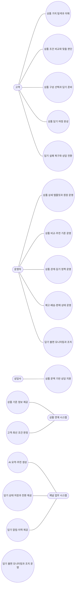

# 00_INDEX — 상품 상세/담기 (POL-PDD v0.11)

추출 일시: 2026-05-18T15:19:25+09:00  
원본 HTML: `/Users/1112979/Policy Generator Web Service Clone/ncstudio/input/samples/NC_상품상세담기_정책서_Full_v0.11.html`

## Claude Code 사용 가이드

이 폴더는 정책서 1개를 디자인팀/개발팀 친화 형태로 변환한 결과입니다. Claude Code로 이 폴더를 통째로 받았다면 다음 순서로 활용하세요:

1. **이 INDEX 파일**을 먼저 읽어 전체 구성과 ID 체계를 파악하세요.
2. **유즈케이스 단위 작업**은 `usecase_<UC-ID>.md`를 읽으세요. 한 파일 안에 그 UC의 Process·Function·Policy가 inline으로 응집되어 있습니다.
3. **N:N 관계 navigation**(예: 어떤 Function이 어느 Process들에 쓰이는지)은 `mapping.csv` 또는 `entities.yaml#cross_refs`를 보세요.
4. **머신 처리**(스크립트, 파이프라인 입력)는 `entities.yaml`이 최적입니다.
5. **데이터 무결성 점검**은 `warnings.md`를 보세요. 깨진 참조·고아 엔티티·누락 의심 항목이 자동 검출됩니다.
6. **ID 검색**은 정확한 ID 문자열로 폴더 전체 grep을 권장합니다: `grep -r '<ID>' .`

## 파일 구성

| 파일 | 내용 | 권장 사용 시점 |
|---|---|---|
| `00_INDEX.md` | 이 진입 가이드 + ID 일람 + 계층 트리 | 폴더를 처음 받았을 때 |
| `usecase_*.md` | UC별 슬라이스 (Process·Function·Policy inline 응집) | UC 단위로 작업할 때 |
| `mapping.csv` | UC→Process→Function→Policy→PolicyItem 평탄화 매트릭스 | N:N 관계를 한눈에 볼 때 / Excel 피벗 |
| `entities.yaml` | 정체성·관계·데이터 딕셔너리 머신 dump | 스크립트·파이프라인 입력 |
| `warnings.md` | 자동 검증 리포트 (broken refs, orphans, 누락 의심 정책) | 데이터 무결성 점검 |

## 통계

- 액터 5 · 유즈케이스 16 · 상태 18 · 상태 전이 22
- 프로세스 40 · 기능 36
- 정책 그룹 21 · 정책 항목 107
- 용어 14

## UC 일람 + 슬라이스 링크

| UC ID | UC 이름 | 슬라이스 파일 |
|---|---|---|
| `US-PDD-CUS-001` | 상품 가치 탐색과 이해 | [usecase_US-PDD-CUS-001.md](./usecase_US-PDD-CUS-001.md) |
| `US-PDD-CUS-002` | 상품 조건 비교와 맞춤 판단 | [usecase_US-PDD-CUS-002.md](./usecase_US-PDD-CUS-002.md) |
| `US-PDD-CUS-003` | 상품 구성 선택과 담기 준비 | [usecase_US-PDD-CUS-003.md](./usecase_US-PDD-CUS-003.md) |
| `US-PDD-CUS-004` | 상품 담기 여정 완성 | [usecase_US-PDD-CUS-004.md](./usecase_US-PDD-CUS-004.md) |
| `US-PDD-CUS-005` | 담기 실패 복구와 상담 전환 | [usecase_US-PDD-CUS-005.md](./usecase_US-PDD-CUS-005.md) |
| `US-PDD-OPS-001` | 상품 상세 템플릿과 원장 운영 | [usecase_US-PDD-OPS-001.md](./usecase_US-PDD-OPS-001.md) |
| `US-PDD-OPS-002` | 상품 비교·추천 기준 운영 | [usecase_US-PDD-OPS-002.md](./usecase_US-PDD-OPS-002.md) |
| `US-PDD-OPS-003` | 상품 관계·담기 정책 운영 | [usecase_US-PDD-OPS-003.md](./usecase_US-PDD-OPS-003.md) |
| `US-PDD-OPS-004` | 재고·배송·판매 상태 운영 | [usecase_US-PDD-OPS-004.md](./usecase_US-PDD-OPS-004.md) |
| `US-PDD-OPS-005` | 담기 불편 모니터링과 조치 운영 | [usecase_US-PDD-OPS-005.md](./usecase_US-PDD-OPS-005.md) |
| `US-PDD-CS-001` | 상품 문맥 기반 상담 지원 | [usecase_US-PDD-CS-001.md](./usecase_US-PDD-CS-001.md) |
| `US-PDD-SYS-001` | 상품 기준 정보 제공 | [usecase_US-PDD-SYS-001.md](./usecase_US-PDD-SYS-001.md) |
| `US-PDD-SYS-002` | 고객·회선 조건 판정 | [usecase_US-PDD-SYS-002.md](./usecase_US-PDD-SYS-002.md) |
| `US-PDD-SYS-003` | AI 요약·추천 생성 | [usecase_US-PDD-SYS-003.md](./usecase_US-PDD-SYS-003.md) |
| `US-PDD-SYS-004` | 담기 상태 저장과 전환 제공 | [usecase_US-PDD-SYS-004.md](./usecase_US-PDD-SYS-004.md) |
| `US-PDD-SYS-005` | 담기 알림·이력 제공 | [usecase_US-PDD-SYS-005.md](./usecase_US-PDD-SYS-005.md) |

## ID Hierarchy 트리 (UC → Process → Function)

```
- US-PDD-CUS-001 — 상품 가치 탐색과 이해
  - PR-PDD-DTL-001 — 상품 상세 핵심 요약 탐색
    - FN-PDD-DTL-001 — 상품 요약·핵심 속성 표시
    - FN-PDD-TEMPLATE-001 — 상품 상세 표준 템플릿 구성
  - PR-PDD-DTL-002 — 미디어·스펙·후기 이해
    - FN-PDD-MEDIA-001 — 미디어·접근성 뷰어
    - FN-PDD-SPEC-001 — 상품 설명·스펙 구조화
    - FN-PDD-REVIEW-001 — 상품 리뷰·평점·Q&A 제공
  - PR-PDD-DTL-003 — 혜택·가격·주의사항 확인
    - FN-PDD-BENEFIT-001 — 혜택·가격·가치 산정 표시
    - FN-PDD-PRICE-001 — 예상 부담·혜택 요약 계산
- US-PDD-CUS-002 — 상품 조건 비교와 맞춤 판단
  - PR-PDD-CMP-001 — 고객 상태 기반 적합성 파악
    - FN-PDD-ELIG-001 — 고객 상태·가입 조건 판정
    - FN-PDD-CATALOG-001 — Product Catalog I/F 수신
  - PR-PDD-CMP-002 — 비교 컴포넌트로 대안 비교
    - FN-PDD-COMPARE-001 — 상품 비교 기준 적용
    - FN-PDD-PRICE-001 — 예상 부담·혜택 요약 계산
  - PR-PDD-CMP-003 — 추천·AI 요약 근거 검토
    - FN-PDD-AI-001 — AI 요약·추천·atomic view
    - FN-PDD-REVIEW-001 — 상품 리뷰·평점·Q&A 제공
- US-PDD-CUS-003 — 상품 구성 선택과 담기 준비
  - PR-PDD-SEL-001 — 옵션·구성 선택
    - FN-PDD-OPTION-001 — 옵션·구성 선택 처리
    - FN-PDD-COMBO-001 — 상품 조합·프로그램 유효성 검증
  - PR-PDD-SEL-002 — 가입·구매 조건 검증
    - FN-PDD-ELIG-001 — 고객 상태·가입 조건 판정
    - FN-PDD-COMBO-001 — 상품 조합·프로그램 유효성 검증
  - PR-PDD-SEL-003 — 예상 비용·혜택 요약
    - FN-PDD-PRICE-001 — 예상 부담·혜택 요약 계산
    - FN-PDD-BENEFIT-001 — 혜택·가격·가치 산정 표시
  - PR-PDD-SEL-004 — 공유·딥링크·문의 맥락 유지
    - FN-PDD-SHARE-001 — 공유·딥링크·원위치 복귀
    - FN-PDD-CS-001 — 상품 문맥 상담 전달
- US-PDD-CUS-004 — 상품 담기 여정 완성
  - PR-PDD-SAVE-001 — 담기 전 유효성 재검증
    - FN-PDD-SAVE-001 — 담기 실행·상태 저장
    - FN-PDD-INVENTORY-001 — 재고·수량·배송 가능성 조회
    - FN-PDD-COMBO-001 — 상품 조합·프로그램 유효성 검증
  - PR-PDD-SAVE-002 — 담기 실행과 상태 저장
    - FN-PDD-SAVE-001 — 담기 실행·상태 저장
    - FN-PDD-AUDIT-001 — 변경·판정·알림 이력 저장
  - PR-PDD-SAVE-003 — 담기 완료 후 다음 행동 선택
    - FN-PDD-NEXT-001 — 담기 완료 후 행동 분기
    - FN-PDD-SHARE-001 — 공유·딥링크·원위치 복귀
    - FN-PDD-CTA-001 — 담기·바로결제·구독 CTA 구분
  - PR-PDD-SAVE-004 — 장바구니·주문 진입 연결
    - FN-PDD-NEXT-001 — 담기 완료 후 행동 분기
    - FN-PDD-CATALOG-001 — Product Catalog I/F 수신
    - FN-PDD-CTA-001 — 담기·바로결제·구독 CTA 구분
- US-PDD-CUS-005 — 담기 실패 복구와 상담 전환
  - PR-PDD-ERR-001 — 선택 불가·충돌 사유 안내
    - FN-PDD-FAIL-001 — 선택 불가·충돌 복구 안내
    - FN-PDD-COMBO-001 — 상품 조합·프로그램 유효성 검증
  - PR-PDD-ERR-002 — 로그인·인증 후 원위치 복귀
    - FN-PDD-AUTH-001 — 로그인·인증 필요 안내
    - FN-PDD-SHARE-001 — 공유·딥링크·원위치 복귀
  - PR-PDD-ERR-003 — 상담 전환과 실패 이력 전달
    - FN-PDD-CS-001 — 상품 문맥 상담 전달
    - FN-PDD-AUDIT-001 — 변경·판정·알림 이력 저장
- US-PDD-OPS-001 — 상품 상세 템플릿과 원장 운영
  - PR-PDD-TPL-001 — 상품 상세 표준 템플릿 등록
    - FN-PDD-TPL-OPS-001 — 템플릿·컴포넌트 운영 관리
    - FN-PDD-TEMPLATE-001 — 상품 상세 표준 템플릿 구성
  - PR-PDD-TPL-002 — 상품군별 모듈·정책 문구 운영
    - FN-PDD-TPL-OPS-001 — 템플릿·컴포넌트 운영 관리
    - FN-PDD-POLICY-001 — 가입·조합·혜택 정책 운영
  - PR-PDD-TPL-003 — 원장·라이프사이클 연동 검수
    - FN-PDD-CATALOG-001 — Product Catalog I/F 수신
    - FN-PDD-LIFECYCLE-001 — 라이프사이클·상태 반영
    - FN-PDD-CODE-001 — 상품·서비스 코드 체계 관리
  - PR-PDD-TPL-004 — 운영 입력·검증·삭제 보호
    - FN-PDD-ADMIN-001 — 운영 입력·검증·삭제 보호
    - FN-PDD-AUDIT-001 — 변경·판정·알림 이력 저장
  - PR-PDD-TPL-005 — 후기·Q&A 운영 기준 관리
    - FN-PDD-REVIEW-OPS-001 — 후기·Q&A 운영 관리
    - FN-PDD-REVIEW-001 — 상품 리뷰·평점·Q&A 제공
- US-PDD-OPS-002 — 상품 비교·추천 기준 운영
  - PR-PDD-REC-001 — 비교 기준·속성 관리
    - FN-PDD-COMPARE-001 — 상품 비교 기준 적용
    - FN-PDD-MARKETING-001 — 마케팅·비교 콘텐츠 운영
  - PR-PDD-REC-002 — AI 요약·후기·추천 운영
    - FN-PDD-AI-001 — AI 요약·추천·atomic view
    - FN-PDD-REVIEW-001 — 상품 리뷰·평점·Q&A 제공
  - PR-PDD-REC-003 — 마케팅 정보·성과 개선
    - FN-PDD-MARKETING-001 — 마케팅·비교 콘텐츠 운영
    - FN-PDD-MONITOR-001 — 담기 활동 모니터링
  - PR-PDD-TPL-006 — 키워드·카테고리 운영 기준 관리
    - FN-PDD-KEYWORD-001 — 키워드·카테고리 관리
    - FN-PDD-TPL-OPS-001 — 템플릿·컴포넌트 운영 관리
- US-PDD-OPS-003 — 상품 관계·담기 정책 운영
  - PR-PDD-RUL-001 — 상품 관계·동시 주문 정책 관리
    - FN-PDD-POLICY-001 — 가입·조합·혜택 정책 운영
    - FN-PDD-COMBO-001 — 상품 조합·프로그램 유효성 검증
  - PR-PDD-RUL-002 — 가입·유지·해지 조건 정책 관리
    - FN-PDD-POLICY-001 — 가입·조합·혜택 정책 운영
    - FN-PDD-LIFECYCLE-001 — 라이프사이클·상태 반영
  - PR-PDD-RUL-003 — 담기 규칙·조합 정책 관리
    - FN-PDD-POLICY-001 — 가입·조합·혜택 정책 운영
    - FN-PDD-SAVE-001 — 담기 실행·상태 저장
- US-PDD-OPS-004 — 재고·배송·판매 상태 운영
  - PR-PDD-STK-001 — 재고·수량·판매 상태 운영
    - FN-PDD-STOCK-OPS-001 — 재고·판매 가능 상태 운영
    - FN-PDD-INVENTORY-001 — 재고·수량·배송 가능성 조회
  - PR-PDD-STK-002 — 배송·픽업 가능성 기준 운영
    - FN-PDD-STOCK-OPS-001 — 재고·판매 가능 상태 운영
    - FN-PDD-INVENTORY-001 — 재고·수량·배송 가능성 조회
  - PR-PDD-STK-003 — 예약판매·시장 대응 자동화
    - FN-PDD-MACRO-001 — 예약판매·시장 대응 자동화
    - FN-PDD-MARKETING-001 — 마케팅·비교 콘텐츠 운영
  - PR-PDD-STK-004 — 디바이스·액세서리·연동기기 상태 운영
    - FN-PDD-DEVICE-001 — 디바이스·액세서리·연동기기 운영
    - FN-PDD-STOCK-OPS-001 — 재고·판매 가능 상태 운영
  - PR-PDD-STK-005 — 외부채널 상품 설정 운영
    - FN-PDD-EXTERNAL-001 — 외부채널 상품 설정 관리
    - FN-PDD-CATALOG-001 — Product Catalog I/F 수신
- US-PDD-OPS-005 — 담기 불편 모니터링과 조치 운영
  - PR-PDD-MON-001 — 담기 활동·실시간 현황 조회
    - FN-PDD-MONITOR-001 — 담기 활동 모니터링
    - FN-PDD-AUDIT-001 — 변경·판정·알림 이력 저장
  - PR-PDD-MON-002 — 불편 이벤트 탐지 기준 관리
    - FN-PDD-MONITOR-001 — 담기 활동 모니터링
    - FN-PDD-ALERT-001 — 불편 이벤트 알림·에스컬레이션
  - PR-PDD-MON-003 — 알림·에스컬레이션 조치
    - FN-PDD-ALERT-001 — 불편 이벤트 알림·에스컬레이션
    - FN-PDD-AUDIT-001 — 변경·판정·알림 이력 저장
  - PR-PDD-MON-004 — 알림 이력·개선 결과 추적
    - FN-PDD-AUDIT-001 — 변경·판정·알림 이력 저장
    - FN-PDD-MONITOR-001 — 담기 활동 모니터링
- US-PDD-CS-001 — 상품 문맥 기반 상담 지원
  - PR-PDD-CS-001 — 상품 선택 문맥 상담 진입
    - FN-PDD-CS-001 — 상품 문맥 상담 전달
    - FN-PDD-SHARE-001 — 공유·딥링크·원위치 복귀
  - PR-PDD-CS-002 — 실패·충돌 상담 처리
    - FN-PDD-CS-001 — 상품 문맥 상담 전달
    - FN-PDD-FAIL-001 — 선택 불가·충돌 복구 안내
- US-PDD-SYS-001 — 상품 기준 정보 제공
- US-PDD-SYS-002 — 고객·회선 조건 판정
- US-PDD-SYS-003 — AI 요약·추천 생성
- US-PDD-SYS-004 — 담기 상태 저장과 전환 제공
- US-PDD-SYS-005 — 담기 알림·이력 제공
```

## 엔티티별 ID 일람

### Terms (용어)

정의 위치: `entities.yaml#terms`

| ID | 이름 |
|---|---|
| `TM-PDD-001` | 상품 상세 원장 |
| `TM-PDD-002` | 상품군 표준 템플릿 |
| `TM-PDD-003` | 담기 |
| `TM-PDD-004` | 담기 가능 여부 |
| `TM-PDD-005` | 상품 조합 정책 |
| `TM-PDD-006` | AI atomic view |
| `TM-PDD-007` | 비교 컴포넌트 |
| `TM-PDD-008` | 원위치 복귀 |
| `TM-PDD-009` | 불편 이벤트 |
| `TM-PDD-010` | Product Offering 관계 |
| `TM-PDD-011` | Product Catalog |
| `TM-PDD-012` | 상품 라이프사이클 |
| `TM-PDD-013` | 운영 검증 기준 |
| `TM-PDD-014` | 외부채널 상품 설정 |

### Actors (액터)

정의 위치: `entities.yaml#actors`

| ID | 이름 |
|---|---|
| `ACT-PDD-001` | 고객 |
| `ACT-PDD-002` | 운영자 |
| `ACT-PDD-003` | 상담사 |
| `ACT-PDD-004` | 채널 업무 시스템 |
| `ACT-PDD-005` | 상품 연계 시스템 |

### Use Cases

정의 위치: `각 usecase_*.md`

| ID | 이름 |
|---|---|
| `US-PDD-CUS-001` | 상품 가치 탐색과 이해 |
| `US-PDD-CUS-002` | 상품 조건 비교와 맞춤 판단 |
| `US-PDD-CUS-003` | 상품 구성 선택과 담기 준비 |
| `US-PDD-CUS-004` | 상품 담기 여정 완성 |
| `US-PDD-CUS-005` | 담기 실패 복구와 상담 전환 |
| `US-PDD-OPS-001` | 상품 상세 템플릿과 원장 운영 |
| `US-PDD-OPS-002` | 상품 비교·추천 기준 운영 |
| `US-PDD-OPS-003` | 상품 관계·담기 정책 운영 |
| `US-PDD-OPS-004` | 재고·배송·판매 상태 운영 |
| `US-PDD-OPS-005` | 담기 불편 모니터링과 조치 운영 |
| `US-PDD-CS-001` | 상품 문맥 기반 상담 지원 |
| `US-PDD-SYS-001` | 상품 기준 정보 제공 |
| `US-PDD-SYS-002` | 고객·회선 조건 판정 |
| `US-PDD-SYS-003` | AI 요약·추천 생성 |
| `US-PDD-SYS-004` | 담기 상태 저장과 전환 제공 |
| `US-PDD-SYS-005` | 담기 알림·이력 제공 |

### States

정의 위치: `entities.yaml#states`

| ID | 이름 |
|---|---|
| `ST-PDD-001` | 탐색 가능 |
| `ST-PDD-002` | 조건 확인 필요 |
| `ST-PDD-003` | 비교 검토 중 |
| `ST-PDD-004` | 구성 선택 중 |
| `ST-PDD-005` | 담기 가능 |
| `ST-PDD-006` | 담기 완료 |
| `ST-PDD-007` | 주문 전환 가능 |
| `ST-PDD-008` | 선택 불가 |
| `ST-PDD-009` | 인증 필요 |
| `ST-PDD-010` | 조합 충돌 |
| `ST-PDD-011` | 재고 부족 |
| `ST-PDD-012` | 상담 전환 필요 |
| `ST-PDD-013` | 운영 확인 필요 |
| `ST-PDD-014` | 판매 중지 |
| `ST-PDD-015` | 재진입 가능 |
| `ST-PDD-016` | 운영 반영 대기 |
| `ST-PDD-017` | 운영 보완 필요 |
| `ST-PDD-018` | 운영 반영 완료 |

### Processes

정의 위치: `해당 UC의 usecase_*.md 안`

| ID | 이름 |
|---|---|
| `PR-PDD-DTL-001` | 상품 상세 핵심 요약 탐색 |
| `PR-PDD-DTL-002` | 미디어·스펙·후기 이해 |
| `PR-PDD-DTL-003` | 혜택·가격·주의사항 확인 |
| `PR-PDD-CMP-001` | 고객 상태 기반 적합성 파악 |
| `PR-PDD-CMP-002` | 비교 컴포넌트로 대안 비교 |
| `PR-PDD-CMP-003` | 추천·AI 요약 근거 검토 |
| `PR-PDD-SEL-001` | 옵션·구성 선택 |
| `PR-PDD-SEL-002` | 가입·구매 조건 검증 |
| `PR-PDD-SEL-003` | 예상 비용·혜택 요약 |
| `PR-PDD-SEL-004` | 공유·딥링크·문의 맥락 유지 |
| `PR-PDD-SAVE-001` | 담기 전 유효성 재검증 |
| `PR-PDD-SAVE-002` | 담기 실행과 상태 저장 |
| `PR-PDD-SAVE-003` | 담기 완료 후 다음 행동 선택 |
| `PR-PDD-SAVE-004` | 장바구니·주문 진입 연결 |
| `PR-PDD-ERR-001` | 선택 불가·충돌 사유 안내 |
| `PR-PDD-ERR-002` | 로그인·인증 후 원위치 복귀 |
| `PR-PDD-ERR-003` | 상담 전환과 실패 이력 전달 |
| `PR-PDD-TPL-001` | 상품 상세 표준 템플릿 등록 |
| `PR-PDD-TPL-002` | 상품군별 모듈·정책 문구 운영 |
| `PR-PDD-TPL-003` | 원장·라이프사이클 연동 검수 |
| `PR-PDD-TPL-004` | 운영 입력·검증·삭제 보호 |
| `PR-PDD-TPL-005` | 후기·Q&A 운영 기준 관리 |
| `PR-PDD-REC-001` | 비교 기준·속성 관리 |
| `PR-PDD-REC-002` | AI 요약·후기·추천 운영 |
| `PR-PDD-REC-003` | 마케팅 정보·성과 개선 |
| `PR-PDD-TPL-006` | 키워드·카테고리 운영 기준 관리 |
| `PR-PDD-RUL-001` | 상품 관계·동시 주문 정책 관리 |
| `PR-PDD-RUL-002` | 가입·유지·해지 조건 정책 관리 |
| `PR-PDD-RUL-003` | 담기 규칙·조합 정책 관리 |
| `PR-PDD-STK-001` | 재고·수량·판매 상태 운영 |
| `PR-PDD-STK-002` | 배송·픽업 가능성 기준 운영 |
| `PR-PDD-STK-003` | 예약판매·시장 대응 자동화 |
| `PR-PDD-STK-004` | 디바이스·액세서리·연동기기 상태 운영 |
| `PR-PDD-STK-005` | 외부채널 상품 설정 운영 |
| `PR-PDD-MON-001` | 담기 활동·실시간 현황 조회 |
| `PR-PDD-MON-002` | 불편 이벤트 탐지 기준 관리 |
| `PR-PDD-MON-003` | 알림·에스컬레이션 조치 |
| `PR-PDD-MON-004` | 알림 이력·개선 결과 추적 |
| `PR-PDD-CS-001` | 상품 선택 문맥 상담 진입 |
| `PR-PDD-CS-002` | 실패·충돌 상담 처리 |

### Functions

정의 위치: `해당 Process가 속한 usecase_*.md (반복 등장 OK)`

| ID | 이름 |
|---|---|
| `FN-PDD-DTL-001` | 상품 요약·핵심 속성 표시 |
| `FN-PDD-TEMPLATE-001` | 상품 상세 표준 템플릿 구성 |
| `FN-PDD-MEDIA-001` | 미디어·접근성 뷰어 |
| `FN-PDD-SPEC-001` | 상품 설명·스펙 구조화 |
| `FN-PDD-REVIEW-001` | 상품 리뷰·평점·Q&A 제공 |
| `FN-PDD-BENEFIT-001` | 혜택·가격·가치 산정 표시 |
| `FN-PDD-ELIG-001` | 고객 상태·가입 조건 판정 |
| `FN-PDD-CATALOG-001` | Product Catalog I/F 수신 |
| `FN-PDD-COMPARE-001` | 상품 비교 기준 적용 |
| `FN-PDD-PRICE-001` | 예상 부담·혜택 요약 계산 |
| `FN-PDD-AI-001` | AI 요약·추천·atomic view |
| `FN-PDD-OPTION-001` | 옵션·구성 선택 처리 |
| `FN-PDD-COMBO-001` | 상품 조합·프로그램 유효성 검증 |
| `FN-PDD-SHARE-001` | 공유·딥링크·원위치 복귀 |
| `FN-PDD-CS-001` | 상품 문맥 상담 전달 |
| `FN-PDD-INVENTORY-001` | 재고·수량·배송 가능성 조회 |
| `FN-PDD-SAVE-001` | 담기 실행·상태 저장 |
| `FN-PDD-AUDIT-001` | 변경·판정·알림 이력 저장 |
| `FN-PDD-NEXT-001` | 담기 완료 후 행동 분기 |
| `FN-PDD-CTA-001` | 담기·바로결제·구독 CTA 구분 |
| `FN-PDD-FAIL-001` | 선택 불가·충돌 복구 안내 |
| `FN-PDD-AUTH-001` | 로그인·인증 필요 안내 |
| `FN-PDD-TPL-OPS-001` | 템플릿·컴포넌트 운영 관리 |
| `FN-PDD-POLICY-001` | 가입·조합·혜택 정책 운영 |
| `FN-PDD-LIFECYCLE-001` | 라이프사이클·상태 반영 |
| `FN-PDD-CODE-001` | 상품·서비스 코드 체계 관리 |
| `FN-PDD-MARKETING-001` | 마케팅·비교 콘텐츠 운영 |
| `FN-PDD-MONITOR-001` | 담기 활동 모니터링 |
| `FN-PDD-STOCK-OPS-001` | 재고·판매 가능 상태 운영 |
| `FN-PDD-MACRO-001` | 예약판매·시장 대응 자동화 |
| `FN-PDD-ALERT-001` | 불편 이벤트 알림·에스컬레이션 |
| `FN-PDD-ADMIN-001` | 운영 입력·검증·삭제 보호 |
| `FN-PDD-REVIEW-OPS-001` | 후기·Q&A 운영 관리 |
| `FN-PDD-KEYWORD-001` | 키워드·카테고리 관리 |
| `FN-PDD-DEVICE-001` | 디바이스·액세서리·연동기기 운영 |
| `FN-PDD-EXTERNAL-001` | 외부채널 상품 설정 관리 |

### Policy Groups

정의 위치: `해당 Process가 속한 usecase_*.md + entities.yaml#policy_groups`

| ID | 이름 |
|---|---|
| `PG-PDD-SCOPE-001` | 상품상세/담기 범위·경계 정책 |
| `PG-PDD-SUMMARY-001` | 상품 요약·미디어·스펙 표시 정책 |
| `PG-PDD-TPL-001` | 상품 상세 표준 템플릿 정책 |
| `PG-PDD-COMPARE-001` | 비교·추천·AI 요약 정책 |
| `PG-PDD-PRICE-001` | 가격·혜택·가치 표시 정책 |
| `PG-PDD-ELIG-001` | 가입·구매 가능성 사전 안내 정책 |
| `PG-PDD-CATALOG-001` | Product Catalog 연동 정책 |
| `PG-PDD-AUDIT-001` | 이력·성과·개선 정책 |
| `PG-PDD-OPTION-001` | 옵션·구성 선택 정책 |
| `PG-PDD-COMBO-001` | 상품 조합·담기 가능성 정책 |
| `PG-PDD-SAVE-001` | 담기 실행·다음 행동 정책 |
| `PG-PDD-CS-001` | 상담·문의 맥락 전달 정책 |
| `PG-PDD-STOCK-001` | 재고·배송·예약판매 운영 정책 |
| `PG-PDD-FAIL-001` | 불가·충돌·인증 복구 정책 |
| `PG-PDD-MON-001` | 담기 모니터링·알림 정책 |
| `PG-PDD-OPS-001` | 운영자 템플릿·정책문구 관리 정책 |
| `PG-PDD-LIFE-001` | 상품 라이프사이클·코드 체계 정책 |
| `PG-PDD-ADMIN-001` | 운영 입력·검증·삭제 보호 정책 |
| `PG-PDD-REVIEW-001` | 후기·Q&A 운영 정책 |
| `PG-PDD-KEYWORD-001` | 키워드·카테고리 운영 정책 |
| `PG-PDD-DEVICE-001` | 디바이스·액세서리·연동기기 운영 정책 |

### Policy Items

정의 위치: `해당 PG가 속한 usecase_*.md + entities.yaml#policy_items`

| ID | 이름 |
|---|---|
| `PI-PDD-SCOPE-001-01` | 범위 경계 |
| `PI-PDD-SCOPE-001-02` | 담기 정의 |
| `PI-PDD-SCOPE-001-03` | 인접 정책서 경계 |
| `PI-PDD-TPL-001-01` | 표준 섹션 |
| `PI-PDD-TPL-001-02` | 상품군 특화 |
| `PI-PDD-TPL-001-03` | 앵커 구조 |
| `PI-PDD-TPL-001-04` | 공통 모듈 |
| `PI-PDD-TPL-001-05` | 상품군별 필수 템플릿 |
| `PI-PDD-TPL-001-06` | 플러스·구독 상품 안내 |
| `PI-PDD-TPL-001-07` | 상품군 CTA 기준 |
| `PI-PDD-SUMMARY-001-01` | 핵심 요약 |
| `PI-PDD-SUMMARY-001-02` | 미디어 뷰어 |
| `PI-PDD-SUMMARY-001-03` | 스펙 요약 |
| `PI-PDD-SUMMARY-001-04` | 상품 리뷰·평점·Q&A |
| `PI-PDD-SUMMARY-001-05` | 브랜드·판매주체·이행방식 |
| `PI-PDD-PRICE-001-01` | 가격 기준 |
| `PI-PDD-PRICE-001-02` | 혜택 분리 |
| `PI-PDD-PRICE-001-03` | 공시지원금 |
| `PI-PDD-PRICE-001-04` | 마케팅 정보 |
| `PI-PDD-PRICE-001-05` | 실사용 빈도 가치 |
| `PI-PDD-PRICE-001-06` | 선물가 문구 |
| `PI-PDD-PRICE-001-07` | 구독가 비교 |
| `PI-PDD-ELIG-001-01` | 사전 판정 |
| `PI-PDD-ELIG-001-02` | 불가 사유 |
| `PI-PDD-ELIG-001-03` | 비회원 전환 |
| `PI-PDD-ELIG-001-04` | 제한 고지 |
| `PI-PDD-ELIG-001-05` | 연령·기간 유효성 |
| `PI-PDD-ELIG-001-06` | 묶음 해지 제약 |
| `PI-PDD-COMPARE-001-01` | 비교 기준 |
| `PI-PDD-COMPARE-001-02` | AI 요약 |
| `PI-PDD-COMPARE-001-03` | 추천 근거 |
| `PI-PDD-COMPARE-001-04` | 후기 요약 |
| `PI-PDD-COMPARE-001-05` | atomic view |
| `PI-PDD-COMPARE-001-06` | 상품군별 비교 템플릿 |
| `PI-PDD-COMPARE-001-07` | 대체 옵션 추천 |
| `PI-PDD-OPTION-001-01` | 옵션 선택 |
| `PI-PDD-OPTION-001-02` | 선택형 혜택 |
| `PI-PDD-OPTION-001-03` | 그룹 상품 |
| `PI-PDD-OPTION-001-04` | 가격 반영 |
| `PI-PDD-OPTION-001-05` | 로밍 시작 옵션 |
| `PI-PDD-OPTION-001-06` | 인기 옵션 적용 |
| `PI-PDD-COMBO-001-01` | 동시 주문 |
| `PI-PDD-COMBO-001-02` | 중복가입 가능여부 확인 |
| `PI-PDD-COMBO-001-03` | 필수 구성 |
| `PI-PDD-COMBO-001-04` | 담기 판정 |
| `PI-PDD-SAVE-001-01` | 담기 저장 |
| `PI-PDD-SAVE-001-02` | 다음 행동 |
| `PI-PDD-SAVE-001-03` | 주문 전환 |
| `PI-PDD-SAVE-001-04` | 재검증 |
| `PI-PDD-SAVE-001-05` | CTA 의미 구분 |
| `PI-PDD-SAVE-001-06` | 고객 표시 상태와 내부 상태 구분 |
| `PI-PDD-FAIL-001-01` | 불가 안내 |
| `PI-PDD-FAIL-001-02` | 충돌 복구 |
| `PI-PDD-FAIL-001-03` | 인증 복귀 |
| `PI-PDD-FAIL-001-04` | 대체 경로 |
| `PI-PDD-CS-001-01` | 상담 문맥 |
| `PI-PDD-CS-001-02` | 실패 이력 |
| `PI-PDD-CS-001-03` | 대체 안내 |
| `PI-PDD-CATALOG-001-01` | 상품 I/F |
| `PI-PDD-CATALOG-001-02` | Spec/Item |
| `PI-PDD-CATALOG-001-03` | 상품 관계 |
| `PI-PDD-CATALOG-001-04` | 정책 수신 |
| `PI-PDD-CATALOG-001-05` | 외부채널 연동 |
| `PI-PDD-LIFE-001-01` | 라이프사이클 |
| `PI-PDD-LIFE-001-02` | 코드 체계 |
| `PI-PDD-LIFE-001-03` | 메타데이터 |
| `PI-PDD-LIFE-001-04` | 판매 상태 |
| `PI-PDD-LIFE-001-05` | 전시 상태 코드 |
| `PI-PDD-OPS-001-01` | 버전 관리 |
| `PI-PDD-OPS-001-02` | 영향도 확인 |
| `PI-PDD-OPS-001-03` | 미리보기 |
| `PI-PDD-OPS-001-04` | 변경 이력 |
| `PI-PDD-STOCK-001-01` | 재고 기준 |
| `PI-PDD-STOCK-001-02` | 배송 가능성 |
| `PI-PDD-STOCK-001-03` | 예약판매 |
| `PI-PDD-STOCK-001-04` | 시장 대응 |
| `PI-PDD-MON-001-01` | 활동 현황 |
| `PI-PDD-MON-001-02` | 불편 이벤트 |
| `PI-PDD-MON-001-03` | 실시간 알림 |
| `PI-PDD-MON-001-04` | 에스컬레이션 |
| `PI-PDD-AUDIT-001-01` | 판정 이력 |
| `PI-PDD-AUDIT-001-02` | 변경 이력 |
| `PI-PDD-AUDIT-001-03` | 성과 리포트 |
| `PI-PDD-AUDIT-001-04` | 개선 추적 |
| `PI-PDD-ADMIN-001-01` | 입력 검증 |
| `PI-PDD-ADMIN-001-02` | 삭제 보호 |
| `PI-PDD-ADMIN-001-03` | 일괄 변경 부분 실패 |
| `PI-PDD-ADMIN-001-04` | 이미지 규격 |
| `PI-PDD-ADMIN-001-05` | 변경 보호 |
| `PI-PDD-ADMIN-001-06` | 관리자 승인 |
| `PI-PDD-REVIEW-001-01` | 공통 컬럼 |
| `PI-PDD-REVIEW-001-02` | 마스킹 |
| `PI-PDD-REVIEW-001-03` | 답변 상태 |
| `PI-PDD-REVIEW-001-04` | 결과 없음 |
| `PI-PDD-REVIEW-001-05` | 후기 작성 유도 |
| `PI-PDD-KEYWORD-001-01` | 키워드 저장 단위 |
| `PI-PDD-KEYWORD-001-02` | 중복 제한 |
| `PI-PDD-KEYWORD-001-03` | 역할 구분 |
| `PI-PDD-KEYWORD-001-04` | 카테고리 종속 |
| `PI-PDD-KEYWORD-001-05` | 순서·이력 |
| `PI-PDD-KEYWORD-001-06` | 카테고리 삭제 |
| `PI-PDD-DEVICE-001-01` | 디바이스 공개상태 |
| `PI-PDD-DEVICE-001-02` | 등록 완료 산출 |
| `PI-PDD-DEVICE-001-03` | 프론트 반영 상태 |
| `PI-PDD-DEVICE-001-04` | 삭제 영향 보호 |
| `PI-PDD-DEVICE-001-05` | 연동기기 라이프사이클 |
| `PI-PDD-DEVICE-001-06` | 외부채널 설정 |

## N:N 관계 안내

- **Process ↔ Function은 N:N**입니다. 한 Function이 여러 Process에서 쓰일 수 있습니다.
- 전체 N:N 매트릭스: `mapping.csv` (Excel 피벗) 또는 `entities.yaml#cross_refs.function_to_processes` 참조.
- UC 슬라이스 안에서는 같은 Function이 여러 Process sub-section에 반복 등장할 수 있습니다 (의도된 응집).

## Diagrams (다이어그램)

원본 HTML의 인라인 SVG에서 추출한 Mermaid 텍스트와 SVG fallback. Mermaid는 Claude Code grep·Read·AI input 친화, SVG는 사람 시각 검토용.

| # | 유형 | 원본 섹션 | Mermaid | SVG |
|---|---|---|---|---|
| 1 | UC 다이어그램 | 다. 유즈케이스 다이어그램 | [보기](#diagram-1-uc) | [diagrams/uc_1.svg](./diagrams/uc_1.svg) |
| 2 | 상태 전이 | 3) 상태 전이 다이어그램 | [보기](#diagram-2-state) | [diagrams/state_1.svg](./diagrams/state_1.svg) |
| 3 | BPMN 업무 흐름도 | 다. 전체 업무 흐름도 | [보기](#diagram-3-bpmn) | [diagrams/bpmn_1.svg](./diagrams/bpmn_1.svg) |

### Diagram 1 UC 다이어그램 {#diagram-1-uc}

- 원본 섹션: 다. 유즈케이스 다이어그램
- 참조 ID: `US-PDD-CS-001`, `US-PDD-CUS-001`, `US-PDD-CUS-002`, `US-PDD-CUS-003`, `US-PDD-CUS-004`, `US-PDD-CUS-005`, `US-PDD-OPS-001`, `US-PDD-OPS-002`, `US-PDD-OPS-003`, `US-PDD-OPS-004`, `US-PDD-OPS-005`, `US-PDD-SYS-001`, `US-PDD-SYS-002`, `US-PDD-SYS-003`, `US-PDD-SYS-004`, `US-PDD-SYS-005`
- SVG fallback: [diagrams/uc_1.svg](./diagrams/uc_1.svg)
- 주의:
  - uc_diagram_low_confidence: 좌표 휴리스틱 추출 (정확도 보장 X). 의미 검증 필요.
  - unmapped_uc_names: ['담기 불편 모니터링과 조치']
  - entities_based_supplement: ['US-PDD-OPS-005'] (원본 SVG에 그려져 있지 않아 entities.usecases 기반으로 보완. actor↔UC edge는 의미 추측을 피해 생략 — entities.yaml/SVG fallback 참조)



### Diagram 2 상태 전이 {#diagram-2-state}

- 원본 섹션: 3) 상태 전이 다이어그램
- 참조 ID: `ST-PDD-001`, `ST-PDD-002`, `ST-PDD-003`, `ST-PDD-004`, `ST-PDD-005`, `ST-PDD-006`, `ST-PDD-007`, `ST-PDD-008`, `ST-PDD-009`, `ST-PDD-010`, `ST-PDD-011`, `ST-PDD-012`, `ST-PDD-013`, `ST-PDD-014`, `ST-PDD-015`, `ST-PDD-016`, `ST-PDD-017`, `ST-PDD-018`
- SVG fallback: [diagrams/state_1.svg](./diagrams/state_1.svg)

```mermaid
stateDiagram-v2
    ST-PDD-013 : 운영 확인 필요
    ST-PDD-001 : 탐색 가능
    ST-PDD-003 : 비교 검토 중
    ST-PDD-004 : 구성 선택 중
    ST-PDD-005 : 담기 가능
    ST-PDD-006 : 담기 완료
    ST-PDD-007 : 주문 전환 가능
    ST-PDD-002 : 조건 확인 필요
    ST-PDD-008 : 선택 불가
    ST-PDD-009 : 인증 필요
    ST-PDD-010 : 조합 충돌
    ST-PDD-011 : 재고 부족
    ST-PDD-015 : 재진입 가능
    ST-PDD-012 : 상담 전환 필요
    ST-PDD-014 : 판매 중지
    ST-PDD-016 : 운영 반영 대기
    ST-PDD-018 : 운영 반영 완료
    ST-PDD-017 : 운영 보완 필요
    ST-PDD-001 --> ST-PDD-003
    ST-PDD-001 --> ST-PDD-002 : 상품 조건 비교와 맞춤 판단 고객·회선 조건 판정 (오류 흐름)
    ST-PDD-002 --> ST-PDD-005 : 고객·회선 조건 판정 상품 구성 선택과 담기 준비 재고·배송·판매 상태 (오류 흐름)
    ST-PDD-002 --> ST-PDD-008 : (오류 흐름)
    ST-PDD-002 --> ST-PDD-009 : (오류 흐름)
    ST-PDD-003 --> ST-PDD-004
    ST-PDD-004 --> ST-PDD-005
    ST-PDD-004 --> ST-PDD-010 : 상품 구성 선택과 담기 준비 담기 실패 복구와 상담 전환 (오류 흐름)
    ST-PDD-004 --> ST-PDD-011 : 운영 (오류 흐름)
    ST-PDD-005 --> ST-PDD-006
    ST-PDD-006 --> ST-PDD-007
    ST-PDD-008 --> ST-PDD-015 : 담기 실패 복구와 상담 전환 상품 기본 정책 I/F (오류 흐름)
    ST-PDD-009 --> ST-PDD-015 : 전환 지원 (오류 흐름)
    ST-PDD-010 --> ST-PDD-004 : 상품 구성 선택과 담기 준비 담기 실패 복구와 상담 전환 (오류 흐름)
    ST-PDD-008 --> ST-PDD-012 : 전환 지원 (오류 흐름)
    ST-PDD-013 --> ST-PDD-001
    ST-PDD-014 --> ST-PDD-001 : 상품 라이프사이클 I/F (오류 흐름)
    ST-PDD-013 --> ST-PDD-016 : 상품 상세 템플릿과 원장 운영 (오류 흐름)
    ST-PDD-016 --> ST-PDD-018 : (오류 흐름)
    ST-PDD-016 --> ST-PDD-017 : (오류 흐름)
    ST-PDD-017 --> ST-PDD-016 : (오류 흐름)
    ST-PDD-018 --> ST-PDD-001 : 담기 실패 복구와 상담 전환 상품 기본 정책 I/F (오류 흐름)
```

### Diagram 3 BPMN 업무 흐름도 {#diagram-3-bpmn}

- 원본 섹션: 다. 전체 업무 흐름도
- SVG fallback: [diagrams/bpmn_1.svg](./diagrams/bpmn_1.svg)

```mermaid
flowchart LR
    subgraph POOL_1["POOL_1: US-PDD-CUS-001"]
    direction LR
        T_1[PR-PDD-DTL-001]
        T_2[PR-PDD-DTL-002]
        T_3[PR-PDD-DTL-003]
    end
    subgraph POOL_2["POOL_2: US-PDD-CUS-002"]
    direction LR
        T_4[PR-PDD-CMP-001]
        T_5[PR-PDD-CMP-002]
        T_6[PR-PDD-CMP-003]
    end
    subgraph POOL_3["POOL_3: US-PDD-CUS-003"]
    direction LR
        T_7[PR-PDD-SEL-001]
        T_8[PR-PDD-SEL-002]
        T_9[PR-PDD-SEL-003]
        T_10[PR-PDD-SEL-004]
    end
    subgraph POOL_4["POOL_4: US-PDD-CUS-004"]
    direction LR
        T_11[PR-PDD-SAVE-001]
        T_12[PR-PDD-SAVE-002]
        T_13[PR-PDD-SAVE-003]
        T_14[PR-PDD-SAVE-004]
    end
    subgraph POOL_5["POOL_5: US-PDD-CUS-005"]
    direction LR
        T_15[PR-PDD-ERR-001]
        T_16[PR-PDD-ERR-002]
        T_17[PR-PDD-ERR-003]
    end
    subgraph POOL_6["POOL_6: US-PDD-OPS-001"]
    direction LR
        T_18[PR-PDD-TPL-001]
        T_19[PR-PDD-TPL-002]
        T_20[PR-PDD-TPL-003]
        T_21[PR-PDD-TPL-004]
        T_22[PR-PDD-TPL-005]
    end
    subgraph POOL_7["POOL_7: US-PDD-OPS-002"]
    direction LR
        T_23[PR-PDD-REC-001]
        T_24[PR-PDD-REC-002]
        T_25[PR-PDD-REC-003]
        T_26[PR-PDD-TPL-006]
    end
    subgraph POOL_8["POOL_8: US-PDD-OPS-003"]
    direction LR
        T_27[PR-PDD-RUL-001]
        T_28[PR-PDD-RUL-002]
        T_29[PR-PDD-RUL-003]
    end
    subgraph POOL_9["POOL_9: US-PDD-OPS-004"]
    direction LR
        T_30[PR-PDD-STK-001]
        T_31[PR-PDD-STK-002]
        T_32[PR-PDD-STK-003]
        T_33[PR-PDD-STK-004]
        T_34[PR-PDD-STK-005]
    end
    subgraph POOL_10["POOL_10: US-PDD-OPS-005"]
    direction LR
        T_35[PR-PDD-MON-001]
        T_36[PR-PDD-MON-002]
        T_37[PR-PDD-MON-003]
        T_38[PR-PDD-MON-004]
    end
    subgraph POOL_11["POOL_11: US-PDD-CS-001"]
    direction LR
        T_39[PR-PDD-CS-001]
        T_40[PR-PDD-CS-002]
    end
```



