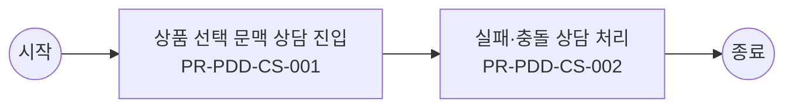

# Usecase: US-PDD-CS-001 — 상품 문맥 기반 상담 지원

## Flowchart

> 단순 직렬 흐름. 분기·게이트웨이는 `00_INDEX.md` BPMN 다이어그램 참조.



## Process: PR-PDD-CS-001 — 상품 선택 문맥 상담 진입 {#process-PR-PDD-CS-001}

```yaml
프로세스_ID: PR-PDD-CS-001
프로세스명: 상품 선택 문맥 상담 진입
설명: 상담사가 고객 상품, 옵션, 선택 회선, 비교 조건, 실패 사유를 이어받아 상담을 시작한다.
관련_기능: [FN-PDD-CS-001, FN-PDD-SHARE-001]
```

| 항목 | 내용 |
| --- | --- |
| 액터 | 상담사 |
| 진입 조건 | 상담사가 상품 문맥 기반 상담 지원 업무를 시작하고 상품군, 고객 상태, 진입 채널, 선택 목적 중 최소 1개 기준이 확인된 경우 진입한다. |
| 종료 조건 | 상품 선택 문맥 상담 진입 결과가 성공, 제한, 보완 필요 중 하나로 확정되고 PR-PDD-CS-002 실패·충돌 상담 처리로 넘길 입력값과 판단 근거가 저장되면 종료한다. |
| 선행 프로세스 | 업무 진입 조건 충족 |
| 후행 프로세스 | PR-PDD-CS-002 실패·충돌 상담 처리 |

### Function: FN-PDD-CS-001

```yaml
기능_ID: FN-PDD-CS-001
기능명: 상품 문맥 상담 전달
설명: 상품 ID, 옵션, 선택 회선, 비교 조건, 실패 사유, 시도 이력을 상담으로 전달한다.
관련_정책_그룹: [PG-PDD-CS-001, PG-PDD-SAVE-001, PG-PDD-MON-001, PG-PDD-FAIL-001, PG-PDD-COMBO-001]
```

| 항목 | 내용 |
| --- | --- |
| 입력 정보 | 고객이 선택한 상품·옵션·혜택 구성 정보 실패 사유, 인증 필요 사유, 충돌 상품, 재고·조건 불일치 정보 원위치 복귀 토큰, 상담 전환 문맥, 이전 시도 이력 대체 상품 또는 수정 가능한 입력 항목 후보 |
| 세부 기능 구성 | 상품 문맥 실패 사유 시도 이력 상담 연결 |
| 출력 정보 | 실패 사유와 고객 안내 문구 복구 가능 경로와 원위치 복귀 정보 상담 전환 시 전달 문맥 반복 실패·인증·충돌 이력 |
| 처리 흐름 | (상태) 담기 실패 또는 인증 필요 발생 → (액션) 상품 문맥 상담 전달 기준으로 실패 사유를 조건 불일치, 인증 필요, 재고 부족, 시스템 지연으로 분류 → (결과) 고객에게 수정 가능 여부와 다음 행동 제시 (상태) 고객이 복구 경로 선택 → (액션) 원위치 복귀 토큰과 이전 선택 구성을 유지하고 필요한 입력만 다시 요청 → (결과) 중복 입력을 줄이고 담기 재시도 가능 상태 복원 (상태) 반복 실패 또는 상담 필요 → (액션) 상품, 옵션, 실패 사유, 시도 이력을 상담 문맥으로 전달 → (결과) 상담사가 동일 설명을 반복 요청하지 않고 대체 경로 안내 |
| 실패/예외 케이스 | 동일 실패가 반복되면 재시도만 제공하지 않고 대체 상품, 상담, 나중에 다시 시도 경로를 제시한다. 상담 전환 시 상품 ID, 옵션, 오류 사유가 누락되면 상담 접수 전 보완한다. 인증 실패 후 원위치 복귀가 불가능하면 고객에게 다시 선택해야 하는 항목을 명확히 안내한다. |

#### Policy Group: PG-PDD-CS-001

```yaml
정책_ID: PG-PDD-CS-001
정책명: 상담·문의 맥락 전달 정책
설명: 상품 상세 문의와 담기 실패 상담 전환 시 전달 기준을 정의한다.
```

| Policy Item ID | 정책 항목명 | 정책 항목 |
| --- | --- | --- |
| `PI-PDD-CS-001-01` | 상담 문맥 | 상품 상세 또는 담기 단계에서 상담으로 전환하면 상품 ID, 선택 옵션, 회선, 비교 조건, 실패 사유, 시도 횟수, 최근 판정 결과를 상담 문맥으로 전달한다. |
| `PI-PDD-CS-001-02` | 실패 이력 | 상담 전환 이력에는 실패 유형, 발생 시각, 고객 선택, 상담 전환 여부, 최종 안내 결과를 저장한다. 고객이 같은 설명을 반복하지 않도록 상담 화면에서 참조 가능해야 한다. |
| `PI-PDD-CS-001-03` | 대체 안내 | 상담사는 상품 정책을 변경하지 않고 고객 조건에 맞는 대체 상품, 옵션, 신청 경로, 재시도 가능 시점을 안내한다. |

#### Policy Group: PG-PDD-SAVE-001

```yaml
정책_ID: PG-PDD-SAVE-001
정책명: 담기 실행·다음 행동 정책
설명: 담기 실행, 상태 저장, 완료 후 다음 행동, 주문 전환 기준을 정의한다.
```

| Policy Item ID | 정책 항목명 | 정책 항목 |
| --- | --- | --- |
| `PI-PDD-SAVE-001-01` | 담기 저장 | 담기 성공 시 상품, 옵션, 프로그램, 혜택, 예상 비용, 판정 결과, 기준 시각을 저장한다. 동일 요청은 멱등 키 또는 동일 고객·상품·옵션·기준 시각으로 중복 요청 여부를 확인하고, 중복 요청이면 새 건을 만들지 않고 기존 담기 상태를 갱신한다. |
| `PI-PDD-SAVE-001-02` | 다음 행동 | 담기 완료 후 계속 탐색, 장바구니 이동, 바로 신청, 비교 계속하기 중 최소 3개 행동을 제공한다. 행동별로 현재 선택 기준의 핵심 혜택 또는 주의사항을 짧게 표시한다. |
| `PI-PDD-SAVE-001-03` | 주문 전환 | 바로 신청 또는 주문 전환 시 상품 상태, 가격, 재고, 혜택, 가입 가능성은 다시 확인한다. 변경이 있으면 변경 전후와 고객 선택지를 안내한다. |
| `PI-PDD-SAVE-001-04` | 재검증 | 담기 이후 장바구니 또는 주문으로 넘어갈 때 10분 이상 경과했거나 상품 상태가 바뀐 경우 재검증을 수행한다. 재검증 실패 시 담기 완료 상태는 유지하되 주문 전환은 제한한다. |
| `PI-PDD-SAVE-001-05` | CTA 의미 구분 | 담기와 구독하기는 장바구니 또는 신청 준비 단계로, 바로 결제하기는 결제 진입으로 구분한다. 상품 유형별 CTA 명칭과 다음 단계는 고객에게 혼동 없이 안내해야 한다. |
| `PI-PDD-SAVE-001-06` | 고객 표시 상태와 내부 상태 구분 | 고객 표시 상태는 탐색 가능, 담기 완료, 주문 전환 가능, 선택 불가처럼 고객 행동을 결정하는 문구로 관리한다. 내부 상태는 조건 확인 필요, 조합 충돌, 재고 부족, 인증 필요, 운영 반영 대기로 구분하고, 고객 행동을 제한할 때만 표시 상태를 변경한다. |

#### Policy Group: PG-PDD-MON-001

```yaml
정책_ID: PG-PDD-MON-001
정책명: 담기 모니터링·알림 정책
설명: 담기 활동, 불편 이벤트, 실시간 알림, 에스컬레이션 기준을 정의한다.
```

| Policy Item ID | 정책 항목명 | 정책 항목 |
| --- | --- | --- |
| `PI-PDD-MON-001-01` | 활동 현황 | 운영자는 상품, 옵션·조합, 고객 여정 단계, 담기 성공·실패, 실패 사유, 인증·연계 상태, 상담 전환 여부를 실시간으로 조회한다. |
| `PI-PDD-MON-001-02` | 불편 이벤트 | 불편 이벤트는 시스템 오류, 상품·정책 충돌, 판매 가능 상태 오류, 인증·연계 실패, 반복 실패, 이탈 급증, 상담 전환 급증으로 분류한다. |
| `PI-PDD-MON-001-03` | 실시간 알림 | 불편 이벤트가 기준을 초과하면 발생 시각, 이벤트 유형, 영향 상품·조합, 발생 규모, 주요 실패 사유, 권장 조치를 포함해 알림을 발송한다. |
| `PI-PDD-MON-001-04` | 에스컬레이션 | 미확인 또는 미조치 상태가 설정 시간 이상 지속되면 심각도와 담당 상품 기준으로 상위 담당자 또는 연관 운영 조직에 자동 에스컬레이션한다. |

#### Policy Group: PG-PDD-FAIL-001

```yaml
정책_ID: PG-PDD-FAIL-001
정책명: 불가·충돌·인증 복구 정책
설명: 선택 불가, 조합 충돌, 인증 필요, 실패 복구 기준을 정의한다.
```

| Policy Item ID | 정책 항목명 | 정책 항목 |
| --- | --- | --- |
| `PI-PDD-FAIL-001-01` | 불가 안내 | 선택 불가 또는 가입 불가가 발생하면 고객에게 상품, 옵션, 조건, 정책 중 어느 축에서 실패했는지 구분해 안내한다. 단순 오류 문구만 표시하는 것은 허용하지 않는다. |
| `PI-PDD-FAIL-001-02` | 충돌 복구 | 조합 충돌은 충돌 상품, 충돌 이유, 해제해야 할 항목, 대체 가능한 구성을 함께 제공한다. 고객이 수정하면 기존 비교·선택 상태로 복귀한다. |
| `PI-PDD-FAIL-001-03` | 인증 복귀 | 로그인, 회선 확인, 추가 인증이 필요하면 필요 사유를 먼저 설명한다. 인증 완료 후에는 고객이 선택한 상품, 옵션, 비교 조건, 이전 스크롤 위치 중 핵심 상태를 복원한다. |
| `PI-PDD-FAIL-001-04` | 대체 경로 | 담기 실패 시 대체 상품 보기, 조건 충족 방법 보기, 상담 연결, 나중에 다시 보기 중 최소 2개 이상의 후속 행동을 제공한다. |

#### Policy Group: PG-PDD-COMBO-001

```yaml
정책_ID: PG-PDD-COMBO-001
정책명: 상품 조합·담기 가능성 정책
설명: 동시 주문, 중복 가입, 필수 구성, 담기 가능성 정책을 정의한다.
```

| Policy Item ID | 정책 항목명 | 정책 항목 |
| --- | --- | --- |
| `PI-PDD-COMBO-001-01` | 동시 주문 | 상품 유형별 동시 주문 가능 조합을 정책으로 정의한다. 단말+요금제+부가+구독은 허용 조합을 둘 수 있고, 단독 구매 상품은 함께 담기를 제한한다. |
| `PI-PDD-COMBO-001-02` | 중복가입 가능여부 확인 | 중복가입 가능여부 확인은 고객 회선과 계정 기준으로 수행한다. 중복 가입이 불가한 상품은 담기, 장바구니, 가입 단계에서 동일한 제한 사유를 표시한다. |
| `PI-PDD-COMBO-001-03` | 필수 구성 | 필수 옵션, 필수 요금제, 필수 프로그램, 그룹 구성 조건이 누락되면 담기를 제한한다. 고객에게 누락 항목과 대체 가능한 구성을 함께 제시한다. |
| `PI-PDD-COMBO-001-04` | 담기 판정 | 담기 가능 여부는 가입 가능 여부, 중복 보유, 선행 조건, 판매 상태, 재고·수량, 판매 기간, 채널 판매 가능성을 실행 시점에 재검증한다. |

### Function: FN-PDD-SHARE-001

```yaml
기능_ID: FN-PDD-SHARE-001
기능명: 공유·딥링크·원위치 복귀
설명: 상품 상세 공유, deferred deeplink, 미설치 유도, 인증 후 원위치 복귀를 처리한다.
관련_정책_그룹: [PG-PDD-CS-001, PG-PDD-SAVE-001, PG-PDD-FAIL-001]
```

| 항목 | 내용 |
| --- | --- |
| 입력 정보 | 상품 ID, 상품군, 판매 상태, 대표 가격·혜택 정보 고객 진입 경로와 조회 세션 정보 상품 상세 템플릿의 필수 섹션과 노출 우선순위 고객에게 숨겨야 할 내부 코드·운영 문구 제외 기준 |
| 세부 기능 구성 | 딥링크 미설치 유도 선택 복원 공유 이력 |
| 출력 정보 | 고객용 상품 요약과 상세 섹션 노출 결과 상품군별 필수 정보 표시 여부 미노출·대체 안내 사유 상품 상세 조회와 비교·담기 전환 이력 |
| 처리 흐름 | (상태) 상품 상세 진입 → (액션) 공유·딥링크·원위치 복귀에 필요한 상품군·판매상태·핵심 속성을 원장 기준으로 조립 → (결과) 고객이 상품 목적과 가입 가능성을 먼저 이해할 수 있는 요약 영역 구성 (상태) 추가 설명 확인 → (액션) 미디어, 스펙, 후기, Q&A, 유의사항을 고객 의사결정 순서로 재배치 → (결과) 상품 이해에 필요한 정보와 내부 운영 문구를 분리 표시 (상태) 정보 부족 또는 노출 제한 발생 → (액션) 대체 설명, 상담 연결, 미노출 사유를 정책 기준으로 선택 → (결과) 빈 화면 없이 다음 탐색 또는 문의 경로 제공 |
| 실패/예외 케이스 | 상품 기준 정보가 누락되면 해당 섹션을 숨기지 않고 보완 필요 또는 상담 가능 경로를 안내한다. 내부 운영 코드나 원장 필드명이 고객 문구로 노출되면 배포를 제한한다. 미디어·후기·스펙 로딩 실패 시 핵심 요약과 가격·조건 판단은 유지한다. |

#### Policy Group: PG-PDD-CS-001

```yaml
정책_ID: PG-PDD-CS-001
정책명: 상담·문의 맥락 전달 정책
설명: 상품 상세 문의와 담기 실패 상담 전환 시 전달 기준을 정의한다.
```

| Policy Item ID | 정책 항목명 | 정책 항목 |
| --- | --- | --- |
| `PI-PDD-CS-001-01` | 상담 문맥 | 상품 상세 또는 담기 단계에서 상담으로 전환하면 상품 ID, 선택 옵션, 회선, 비교 조건, 실패 사유, 시도 횟수, 최근 판정 결과를 상담 문맥으로 전달한다. |
| `PI-PDD-CS-001-02` | 실패 이력 | 상담 전환 이력에는 실패 유형, 발생 시각, 고객 선택, 상담 전환 여부, 최종 안내 결과를 저장한다. 고객이 같은 설명을 반복하지 않도록 상담 화면에서 참조 가능해야 한다. |
| `PI-PDD-CS-001-03` | 대체 안내 | 상담사는 상품 정책을 변경하지 않고 고객 조건에 맞는 대체 상품, 옵션, 신청 경로, 재시도 가능 시점을 안내한다. |

#### Policy Group: PG-PDD-SAVE-001

```yaml
정책_ID: PG-PDD-SAVE-001
정책명: 담기 실행·다음 행동 정책
설명: 담기 실행, 상태 저장, 완료 후 다음 행동, 주문 전환 기준을 정의한다.
```

| Policy Item ID | 정책 항목명 | 정책 항목 |
| --- | --- | --- |
| `PI-PDD-SAVE-001-01` | 담기 저장 | 담기 성공 시 상품, 옵션, 프로그램, 혜택, 예상 비용, 판정 결과, 기준 시각을 저장한다. 동일 요청은 멱등 키 또는 동일 고객·상품·옵션·기준 시각으로 중복 요청 여부를 확인하고, 중복 요청이면 새 건을 만들지 않고 기존 담기 상태를 갱신한다. |
| `PI-PDD-SAVE-001-02` | 다음 행동 | 담기 완료 후 계속 탐색, 장바구니 이동, 바로 신청, 비교 계속하기 중 최소 3개 행동을 제공한다. 행동별로 현재 선택 기준의 핵심 혜택 또는 주의사항을 짧게 표시한다. |
| `PI-PDD-SAVE-001-03` | 주문 전환 | 바로 신청 또는 주문 전환 시 상품 상태, 가격, 재고, 혜택, 가입 가능성은 다시 확인한다. 변경이 있으면 변경 전후와 고객 선택지를 안내한다. |
| `PI-PDD-SAVE-001-04` | 재검증 | 담기 이후 장바구니 또는 주문으로 넘어갈 때 10분 이상 경과했거나 상품 상태가 바뀐 경우 재검증을 수행한다. 재검증 실패 시 담기 완료 상태는 유지하되 주문 전환은 제한한다. |
| `PI-PDD-SAVE-001-05` | CTA 의미 구분 | 담기와 구독하기는 장바구니 또는 신청 준비 단계로, 바로 결제하기는 결제 진입으로 구분한다. 상품 유형별 CTA 명칭과 다음 단계는 고객에게 혼동 없이 안내해야 한다. |
| `PI-PDD-SAVE-001-06` | 고객 표시 상태와 내부 상태 구분 | 고객 표시 상태는 탐색 가능, 담기 완료, 주문 전환 가능, 선택 불가처럼 고객 행동을 결정하는 문구로 관리한다. 내부 상태는 조건 확인 필요, 조합 충돌, 재고 부족, 인증 필요, 운영 반영 대기로 구분하고, 고객 행동을 제한할 때만 표시 상태를 변경한다. |

#### Policy Group: PG-PDD-FAIL-001

```yaml
정책_ID: PG-PDD-FAIL-001
정책명: 불가·충돌·인증 복구 정책
설명: 선택 불가, 조합 충돌, 인증 필요, 실패 복구 기준을 정의한다.
```

| Policy Item ID | 정책 항목명 | 정책 항목 |
| --- | --- | --- |
| `PI-PDD-FAIL-001-01` | 불가 안내 | 선택 불가 또는 가입 불가가 발생하면 고객에게 상품, 옵션, 조건, 정책 중 어느 축에서 실패했는지 구분해 안내한다. 단순 오류 문구만 표시하는 것은 허용하지 않는다. |
| `PI-PDD-FAIL-001-02` | 충돌 복구 | 조합 충돌은 충돌 상품, 충돌 이유, 해제해야 할 항목, 대체 가능한 구성을 함께 제공한다. 고객이 수정하면 기존 비교·선택 상태로 복귀한다. |
| `PI-PDD-FAIL-001-03` | 인증 복귀 | 로그인, 회선 확인, 추가 인증이 필요하면 필요 사유를 먼저 설명한다. 인증 완료 후에는 고객이 선택한 상품, 옵션, 비교 조건, 이전 스크롤 위치 중 핵심 상태를 복원한다. |
| `PI-PDD-FAIL-001-04` | 대체 경로 | 담기 실패 시 대체 상품 보기, 조건 충족 방법 보기, 상담 연결, 나중에 다시 보기 중 최소 2개 이상의 후속 행동을 제공한다. |

## Process: PR-PDD-CS-002 — 실패·충돌 상담 처리 {#process-PR-PDD-CS-002}

```yaml
프로세스_ID: PR-PDD-CS-002
프로세스명: 실패·충돌 상담 처리
설명: 상담사가 조합 충돌, 가입 불가, 인증 실패, 재고 부족에 대한 대체 상품과 처리 경로를 안내한다.
관련_기능: [FN-PDD-CS-001, FN-PDD-FAIL-001]
```

| 항목 | 내용 |
| --- | --- |
| 액터 | 상담사 |
| 진입 조건 | PR-PDD-CS-001 상품 선택 문맥 상담 진입 결과가 고객에게 표시되었고, 고객 또는 운영자가 다음 판단을 계속하기로 선택한 경우 진입한다. |
| 종료 조건 | 상품 문맥 기반 상담 지원의 완료·중단·상담 전환 결과가 확정되고 고객 안내, 상태 이력, 관련 정책 근거가 남으면 종료한다. |
| 선행 프로세스 | PR-PDD-CS-001 상품 선택 문맥 상담 진입 |
| 후행 프로세스 | 결과 안내 또는 후속 업무 연결 |

### Function: FN-PDD-CS-001

```yaml
기능_ID: FN-PDD-CS-001
기능명: 상품 문맥 상담 전달
설명: 상품 ID, 옵션, 선택 회선, 비교 조건, 실패 사유, 시도 이력을 상담으로 전달한다.
관련_정책_그룹: [PG-PDD-CS-001, PG-PDD-SAVE-001, PG-PDD-MON-001, PG-PDD-FAIL-001, PG-PDD-COMBO-001]
```

| 항목 | 내용 |
| --- | --- |
| 입력 정보 | 고객이 선택한 상품·옵션·혜택 구성 정보 실패 사유, 인증 필요 사유, 충돌 상품, 재고·조건 불일치 정보 원위치 복귀 토큰, 상담 전환 문맥, 이전 시도 이력 대체 상품 또는 수정 가능한 입력 항목 후보 |
| 세부 기능 구성 | 상품 문맥 실패 사유 시도 이력 상담 연결 |
| 출력 정보 | 실패 사유와 고객 안내 문구 복구 가능 경로와 원위치 복귀 정보 상담 전환 시 전달 문맥 반복 실패·인증·충돌 이력 |
| 처리 흐름 | (상태) 담기 실패 또는 인증 필요 발생 → (액션) 상품 문맥 상담 전달 기준으로 실패 사유를 조건 불일치, 인증 필요, 재고 부족, 시스템 지연으로 분류 → (결과) 고객에게 수정 가능 여부와 다음 행동 제시 (상태) 고객이 복구 경로 선택 → (액션) 원위치 복귀 토큰과 이전 선택 구성을 유지하고 필요한 입력만 다시 요청 → (결과) 중복 입력을 줄이고 담기 재시도 가능 상태 복원 (상태) 반복 실패 또는 상담 필요 → (액션) 상품, 옵션, 실패 사유, 시도 이력을 상담 문맥으로 전달 → (결과) 상담사가 동일 설명을 반복 요청하지 않고 대체 경로 안내 |
| 실패/예외 케이스 | 동일 실패가 반복되면 재시도만 제공하지 않고 대체 상품, 상담, 나중에 다시 시도 경로를 제시한다. 상담 전환 시 상품 ID, 옵션, 오류 사유가 누락되면 상담 접수 전 보완한다. 인증 실패 후 원위치 복귀가 불가능하면 고객에게 다시 선택해야 하는 항목을 명확히 안내한다. |

#### Policy Group: PG-PDD-CS-001

```yaml
정책_ID: PG-PDD-CS-001
정책명: 상담·문의 맥락 전달 정책
설명: 상품 상세 문의와 담기 실패 상담 전환 시 전달 기준을 정의한다.
```

| Policy Item ID | 정책 항목명 | 정책 항목 |
| --- | --- | --- |
| `PI-PDD-CS-001-01` | 상담 문맥 | 상품 상세 또는 담기 단계에서 상담으로 전환하면 상품 ID, 선택 옵션, 회선, 비교 조건, 실패 사유, 시도 횟수, 최근 판정 결과를 상담 문맥으로 전달한다. |
| `PI-PDD-CS-001-02` | 실패 이력 | 상담 전환 이력에는 실패 유형, 발생 시각, 고객 선택, 상담 전환 여부, 최종 안내 결과를 저장한다. 고객이 같은 설명을 반복하지 않도록 상담 화면에서 참조 가능해야 한다. |
| `PI-PDD-CS-001-03` | 대체 안내 | 상담사는 상품 정책을 변경하지 않고 고객 조건에 맞는 대체 상품, 옵션, 신청 경로, 재시도 가능 시점을 안내한다. |

#### Policy Group: PG-PDD-SAVE-001

```yaml
정책_ID: PG-PDD-SAVE-001
정책명: 담기 실행·다음 행동 정책
설명: 담기 실행, 상태 저장, 완료 후 다음 행동, 주문 전환 기준을 정의한다.
```

| Policy Item ID | 정책 항목명 | 정책 항목 |
| --- | --- | --- |
| `PI-PDD-SAVE-001-01` | 담기 저장 | 담기 성공 시 상품, 옵션, 프로그램, 혜택, 예상 비용, 판정 결과, 기준 시각을 저장한다. 동일 요청은 멱등 키 또는 동일 고객·상품·옵션·기준 시각으로 중복 요청 여부를 확인하고, 중복 요청이면 새 건을 만들지 않고 기존 담기 상태를 갱신한다. |
| `PI-PDD-SAVE-001-02` | 다음 행동 | 담기 완료 후 계속 탐색, 장바구니 이동, 바로 신청, 비교 계속하기 중 최소 3개 행동을 제공한다. 행동별로 현재 선택 기준의 핵심 혜택 또는 주의사항을 짧게 표시한다. |
| `PI-PDD-SAVE-001-03` | 주문 전환 | 바로 신청 또는 주문 전환 시 상품 상태, 가격, 재고, 혜택, 가입 가능성은 다시 확인한다. 변경이 있으면 변경 전후와 고객 선택지를 안내한다. |
| `PI-PDD-SAVE-001-04` | 재검증 | 담기 이후 장바구니 또는 주문으로 넘어갈 때 10분 이상 경과했거나 상품 상태가 바뀐 경우 재검증을 수행한다. 재검증 실패 시 담기 완료 상태는 유지하되 주문 전환은 제한한다. |
| `PI-PDD-SAVE-001-05` | CTA 의미 구분 | 담기와 구독하기는 장바구니 또는 신청 준비 단계로, 바로 결제하기는 결제 진입으로 구분한다. 상품 유형별 CTA 명칭과 다음 단계는 고객에게 혼동 없이 안내해야 한다. |
| `PI-PDD-SAVE-001-06` | 고객 표시 상태와 내부 상태 구분 | 고객 표시 상태는 탐색 가능, 담기 완료, 주문 전환 가능, 선택 불가처럼 고객 행동을 결정하는 문구로 관리한다. 내부 상태는 조건 확인 필요, 조합 충돌, 재고 부족, 인증 필요, 운영 반영 대기로 구분하고, 고객 행동을 제한할 때만 표시 상태를 변경한다. |

#### Policy Group: PG-PDD-MON-001

```yaml
정책_ID: PG-PDD-MON-001
정책명: 담기 모니터링·알림 정책
설명: 담기 활동, 불편 이벤트, 실시간 알림, 에스컬레이션 기준을 정의한다.
```

| Policy Item ID | 정책 항목명 | 정책 항목 |
| --- | --- | --- |
| `PI-PDD-MON-001-01` | 활동 현황 | 운영자는 상품, 옵션·조합, 고객 여정 단계, 담기 성공·실패, 실패 사유, 인증·연계 상태, 상담 전환 여부를 실시간으로 조회한다. |
| `PI-PDD-MON-001-02` | 불편 이벤트 | 불편 이벤트는 시스템 오류, 상품·정책 충돌, 판매 가능 상태 오류, 인증·연계 실패, 반복 실패, 이탈 급증, 상담 전환 급증으로 분류한다. |
| `PI-PDD-MON-001-03` | 실시간 알림 | 불편 이벤트가 기준을 초과하면 발생 시각, 이벤트 유형, 영향 상품·조합, 발생 규모, 주요 실패 사유, 권장 조치를 포함해 알림을 발송한다. |
| `PI-PDD-MON-001-04` | 에스컬레이션 | 미확인 또는 미조치 상태가 설정 시간 이상 지속되면 심각도와 담당 상품 기준으로 상위 담당자 또는 연관 운영 조직에 자동 에스컬레이션한다. |

#### Policy Group: PG-PDD-FAIL-001

```yaml
정책_ID: PG-PDD-FAIL-001
정책명: 불가·충돌·인증 복구 정책
설명: 선택 불가, 조합 충돌, 인증 필요, 실패 복구 기준을 정의한다.
```

| Policy Item ID | 정책 항목명 | 정책 항목 |
| --- | --- | --- |
| `PI-PDD-FAIL-001-01` | 불가 안내 | 선택 불가 또는 가입 불가가 발생하면 고객에게 상품, 옵션, 조건, 정책 중 어느 축에서 실패했는지 구분해 안내한다. 단순 오류 문구만 표시하는 것은 허용하지 않는다. |
| `PI-PDD-FAIL-001-02` | 충돌 복구 | 조합 충돌은 충돌 상품, 충돌 이유, 해제해야 할 항목, 대체 가능한 구성을 함께 제공한다. 고객이 수정하면 기존 비교·선택 상태로 복귀한다. |
| `PI-PDD-FAIL-001-03` | 인증 복귀 | 로그인, 회선 확인, 추가 인증이 필요하면 필요 사유를 먼저 설명한다. 인증 완료 후에는 고객이 선택한 상품, 옵션, 비교 조건, 이전 스크롤 위치 중 핵심 상태를 복원한다. |
| `PI-PDD-FAIL-001-04` | 대체 경로 | 담기 실패 시 대체 상품 보기, 조건 충족 방법 보기, 상담 연결, 나중에 다시 보기 중 최소 2개 이상의 후속 행동을 제공한다. |

#### Policy Group: PG-PDD-COMBO-001

```yaml
정책_ID: PG-PDD-COMBO-001
정책명: 상품 조합·담기 가능성 정책
설명: 동시 주문, 중복 가입, 필수 구성, 담기 가능성 정책을 정의한다.
```

| Policy Item ID | 정책 항목명 | 정책 항목 |
| --- | --- | --- |
| `PI-PDD-COMBO-001-01` | 동시 주문 | 상품 유형별 동시 주문 가능 조합을 정책으로 정의한다. 단말+요금제+부가+구독은 허용 조합을 둘 수 있고, 단독 구매 상품은 함께 담기를 제한한다. |
| `PI-PDD-COMBO-001-02` | 중복가입 가능여부 확인 | 중복가입 가능여부 확인은 고객 회선과 계정 기준으로 수행한다. 중복 가입이 불가한 상품은 담기, 장바구니, 가입 단계에서 동일한 제한 사유를 표시한다. |
| `PI-PDD-COMBO-001-03` | 필수 구성 | 필수 옵션, 필수 요금제, 필수 프로그램, 그룹 구성 조건이 누락되면 담기를 제한한다. 고객에게 누락 항목과 대체 가능한 구성을 함께 제시한다. |
| `PI-PDD-COMBO-001-04` | 담기 판정 | 담기 가능 여부는 가입 가능 여부, 중복 보유, 선행 조건, 판매 상태, 재고·수량, 판매 기간, 채널 판매 가능성을 실행 시점에 재검증한다. |

### Function: FN-PDD-FAIL-001

```yaml
기능_ID: FN-PDD-FAIL-001
기능명: 선택 불가·충돌 복구 안내
설명: 선택 불가, 조합 충돌, 가입 불가, 재고 부족 사유와 수정 방법을 안내한다.
관련_정책_그룹: [PG-PDD-FAIL-001, PG-PDD-COMBO-001, PG-PDD-CS-001]
```

| 항목 | 내용 |
| --- | --- |
| 입력 정보 | 고객이 선택한 상품·옵션·혜택 구성 정보 실패 사유, 인증 필요 사유, 충돌 상품, 재고·조건 불일치 정보 원위치 복귀 토큰, 상담 전환 문맥, 이전 시도 이력 대체 상품 또는 수정 가능한 입력 항목 후보 |
| 세부 기능 구성 | 불가 사유 수정 방법 대체 상품 나중에 보기 |
| 출력 정보 | 실패 사유와 고객 안내 문구 복구 가능 경로와 원위치 복귀 정보 상담 전환 시 전달 문맥 반복 실패·인증·충돌 이력 |
| 처리 흐름 | (상태) 담기 실패 또는 인증 필요 발생 → (액션) 선택 불가·충돌 복구 안내 기준으로 실패 사유를 조건 불일치, 인증 필요, 재고 부족, 시스템 지연으로 분류 → (결과) 고객에게 수정 가능 여부와 다음 행동 제시 (상태) 고객이 복구 경로 선택 → (액션) 원위치 복귀 토큰과 이전 선택 구성을 유지하고 필요한 입력만 다시 요청 → (결과) 중복 입력을 줄이고 담기 재시도 가능 상태 복원 (상태) 반복 실패 또는 상담 필요 → (액션) 상품, 옵션, 실패 사유, 시도 이력을 상담 문맥으로 전달 → (결과) 상담사가 동일 설명을 반복 요청하지 않고 대체 경로 안내 |
| 실패/예외 케이스 | 동일 실패가 반복되면 재시도만 제공하지 않고 대체 상품, 상담, 나중에 다시 시도 경로를 제시한다. 상담 전환 시 상품 ID, 옵션, 오류 사유가 누락되면 상담 접수 전 보완한다. 인증 실패 후 원위치 복귀가 불가능하면 고객에게 다시 선택해야 하는 항목을 명확히 안내한다. |

#### Policy Group: PG-PDD-FAIL-001

```yaml
정책_ID: PG-PDD-FAIL-001
정책명: 불가·충돌·인증 복구 정책
설명: 선택 불가, 조합 충돌, 인증 필요, 실패 복구 기준을 정의한다.
```

| Policy Item ID | 정책 항목명 | 정책 항목 |
| --- | --- | --- |
| `PI-PDD-FAIL-001-01` | 불가 안내 | 선택 불가 또는 가입 불가가 발생하면 고객에게 상품, 옵션, 조건, 정책 중 어느 축에서 실패했는지 구분해 안내한다. 단순 오류 문구만 표시하는 것은 허용하지 않는다. |
| `PI-PDD-FAIL-001-02` | 충돌 복구 | 조합 충돌은 충돌 상품, 충돌 이유, 해제해야 할 항목, 대체 가능한 구성을 함께 제공한다. 고객이 수정하면 기존 비교·선택 상태로 복귀한다. |
| `PI-PDD-FAIL-001-03` | 인증 복귀 | 로그인, 회선 확인, 추가 인증이 필요하면 필요 사유를 먼저 설명한다. 인증 완료 후에는 고객이 선택한 상품, 옵션, 비교 조건, 이전 스크롤 위치 중 핵심 상태를 복원한다. |
| `PI-PDD-FAIL-001-04` | 대체 경로 | 담기 실패 시 대체 상품 보기, 조건 충족 방법 보기, 상담 연결, 나중에 다시 보기 중 최소 2개 이상의 후속 행동을 제공한다. |

#### Policy Group: PG-PDD-COMBO-001

```yaml
정책_ID: PG-PDD-COMBO-001
정책명: 상품 조합·담기 가능성 정책
설명: 동시 주문, 중복 가입, 필수 구성, 담기 가능성 정책을 정의한다.
```

| Policy Item ID | 정책 항목명 | 정책 항목 |
| --- | --- | --- |
| `PI-PDD-COMBO-001-01` | 동시 주문 | 상품 유형별 동시 주문 가능 조합을 정책으로 정의한다. 단말+요금제+부가+구독은 허용 조합을 둘 수 있고, 단독 구매 상품은 함께 담기를 제한한다. |
| `PI-PDD-COMBO-001-02` | 중복가입 가능여부 확인 | 중복가입 가능여부 확인은 고객 회선과 계정 기준으로 수행한다. 중복 가입이 불가한 상품은 담기, 장바구니, 가입 단계에서 동일한 제한 사유를 표시한다. |
| `PI-PDD-COMBO-001-03` | 필수 구성 | 필수 옵션, 필수 요금제, 필수 프로그램, 그룹 구성 조건이 누락되면 담기를 제한한다. 고객에게 누락 항목과 대체 가능한 구성을 함께 제시한다. |
| `PI-PDD-COMBO-001-04` | 담기 판정 | 담기 가능 여부는 가입 가능 여부, 중복 보유, 선행 조건, 판매 상태, 재고·수량, 판매 기간, 채널 판매 가능성을 실행 시점에 재검증한다. |

#### Policy Group: PG-PDD-CS-001

```yaml
정책_ID: PG-PDD-CS-001
정책명: 상담·문의 맥락 전달 정책
설명: 상품 상세 문의와 담기 실패 상담 전환 시 전달 기준을 정의한다.
```

| Policy Item ID | 정책 항목명 | 정책 항목 |
| --- | --- | --- |
| `PI-PDD-CS-001-01` | 상담 문맥 | 상품 상세 또는 담기 단계에서 상담으로 전환하면 상품 ID, 선택 옵션, 회선, 비교 조건, 실패 사유, 시도 횟수, 최근 판정 결과를 상담 문맥으로 전달한다. |
| `PI-PDD-CS-001-02` | 실패 이력 | 상담 전환 이력에는 실패 유형, 발생 시각, 고객 선택, 상담 전환 여부, 최종 안내 결과를 저장한다. 고객이 같은 설명을 반복하지 않도록 상담 화면에서 참조 가능해야 한다. |
| `PI-PDD-CS-001-03` | 대체 안내 | 상담사는 상품 정책을 변경하지 않고 고객 조건에 맞는 대체 상품, 옵션, 신청 경로, 재시도 가능 시점을 안내한다. |

---

## Cross-refs (this UC)

- 정의된 ID: `FN-PDD-CS-001`, `FN-PDD-FAIL-001`, `FN-PDD-SHARE-001`, `PG-PDD-COMBO-001`, `PG-PDD-CS-001`, `PG-PDD-FAIL-001`, `PG-PDD-MON-001`, `PG-PDD-SAVE-001`, `PI-PDD-COMBO-001-01`, `PI-PDD-COMBO-001-02`, `PI-PDD-COMBO-001-03`, `PI-PDD-COMBO-001-04`, `PI-PDD-CS-001-01`, `PI-PDD-CS-001-02`, `PI-PDD-CS-001-03`, `PI-PDD-FAIL-001-01`, `PI-PDD-FAIL-001-02`, `PI-PDD-FAIL-001-03`, `PI-PDD-FAIL-001-04`, `PI-PDD-MON-001-01`, `PI-PDD-MON-001-02`, `PI-PDD-MON-001-03`, `PI-PDD-MON-001-04`, `PI-PDD-SAVE-001-01`, `PI-PDD-SAVE-001-02`, `PI-PDD-SAVE-001-03`, `PI-PDD-SAVE-001-04`, `PI-PDD-SAVE-001-05`, `PI-PDD-SAVE-001-06`, `PR-PDD-CS-001`, `PR-PDD-CS-002`, `US-PDD-CS-001`
