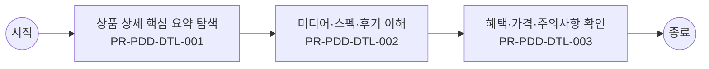

# Usecase: US-PDD-CUS-001 — 상품 가치 탐색과 이해

## Flowchart

> 단순 직렬 흐름. 분기·게이트웨이는 `00_INDEX.md` BPMN 다이어그램 참조.



## Process: PR-PDD-DTL-001 — 상품 상세 핵심 요약 탐색 {#process-PR-PDD-DTL-001}

```yaml
프로세스_ID: PR-PDD-DTL-001
프로세스명: 상품 상세 핵심 요약 탐색
설명: 고객이 상품명, 유형, 대표 가격, 핵심 혜택, 대상 조건을 조회하고 가입 가능 요약을 확인해 다음 탐색 기준을 판단한다.
관련_기능: [FN-PDD-DTL-001, FN-PDD-TEMPLATE-001]
```

| 항목 | 내용 |
| --- | --- |
| 액터 | 고객 |
| 진입 조건 | 고객가 상품 가치 탐색과 이해 업무를 시작하고 상품군, 고객 상태, 진입 채널, 선택 목적 중 최소 1개 기준이 확인된 경우 진입한다. |
| 종료 조건 | 상품 상세 핵심 요약 탐색 결과가 성공, 제한, 보완 필요 중 하나로 확정되고 PR-PDD-DTL-002 미디어·스펙·후기 이해로 넘길 입력값과 판단 근거가 저장되면 종료한다. |
| 선행 프로세스 | 업무 진입 조건 충족 |
| 후행 프로세스 | PR-PDD-DTL-002 미디어·스펙·후기 이해 |

### Function: FN-PDD-DTL-001

```yaml
기능_ID: FN-PDD-DTL-001
기능명: 상품 요약·핵심 속성 표시
설명: 상품정보 및 가격 확인에 필요한 상품명, 이미지, 유형, 가격, 할인유형, 가입 가능 요약을 고객 맥락에 맞게 표시한다.
관련_정책_그룹: [PG-PDD-SUMMARY-001, PG-PDD-TPL-001]
```

| 항목 | 내용 |
| --- | --- |
| 입력 정보 | 상품 ID, 상품군, 판매 상태, 대표 가격·혜택 정보 고객 진입 경로와 조회 세션 정보 상품 상세 템플릿의 필수 섹션과 노출 우선순위 고객에게 숨겨야 할 내부 코드·운영 문구 제외 기준 |
| 세부 기능 구성 | 요약 카드 핵심 속성 상태별 강조 원장 이동 상품정보 확인 |
| 출력 정보 | 고객용 상품 요약과 상세 섹션 노출 결과 상품군별 필수 정보 표시 여부 미노출·대체 안내 사유 상품 상세 조회와 비교·담기 전환 이력 |
| 처리 흐름 | (상태) 상품 상세 진입 → (액션) 상품 요약·핵심 속성 표시에 필요한 상품군·판매상태·핵심 속성을 원장 기준으로 조립 → (결과) 고객이 상품 목적과 가입 가능성을 먼저 이해할 수 있는 요약 영역 구성 (상태) 추가 설명 확인 → (액션) 미디어, 스펙, 후기, Q&A, 유의사항을 고객 의사결정 순서로 재배치 → (결과) 상품 이해에 필요한 정보와 내부 운영 문구를 분리 표시 (상태) 정보 부족 또는 노출 제한 발생 → (액션) 대체 설명, 상담 연결, 미노출 사유를 정책 기준으로 선택 → (결과) 빈 화면 없이 다음 탐색 또는 문의 경로 제공 |
| 실패/예외 케이스 | 상품 기준 정보가 누락되면 해당 섹션을 숨기지 않고 보완 필요 또는 상담 가능 경로를 안내한다. 내부 운영 코드나 원장 필드명이 고객 문구로 노출되면 배포를 제한한다. 미디어·후기·스펙 로딩 실패 시 핵심 요약과 가격·조건 판단은 유지한다. |

#### Policy Group: PG-PDD-SUMMARY-001

```yaml
정책_ID: PG-PDD-SUMMARY-001
정책명: 상품 요약·미디어·스펙 표시 정책
설명: 상품 요약, 이미지, 미디어, 스펙, 후기, Q&A 표시 기준을 정의한다.
```

| Policy Item ID | 정책 항목명 | 정책 항목 |
| --- | --- | --- |
| `PI-PDD-SUMMARY-001-01` | 핵심 요약 | 상품 상세 요약은 상품명, 대표 이미지, 상품 유형, 가격·할인 유형, 핵심 혜택, 가입 가능성 중 최소 5개 항목을 상단에 제공한다. 고객 상태 기반 문구는 로그인 상태에서만 개인화한다. 상품정보 및 가격 확인은 고객이 담기 전 동일 요약 영역에서 수행할 수 있어야 한다. |
| `PI-PDD-SUMMARY-001-02` | 미디어 뷰어 | 상품 이미지, 배너, 동영상은 확대와 스와이프를 허용하고, 대체텍스트를 필수로 둔다. 미디어가 상품 조건을 설명하는 경우 동일 정보를 텍스트로도 제공한다. |
| `PI-PDD-SUMMARY-001-03` | 스펙 요약 | 상품 설명과 스펙은 요약과 상세 펼침으로 구분한다. 요약 영역에는 고객이 담기 전 판단해야 할 조건, 제한, 기간, 대상 여부를 우선 표시한다. |
| `PI-PDD-SUMMARY-001-04` | 상품 리뷰·평점·Q&A | 상품 리뷰·평점·Q&A 제공 영역은 최신순, 도움순, 유형별 필터를 제공한다. 신고·가림 대상은 운영 정책에 따라 제한하고, 답변 상태와 원문 이동 경로를 함께 제공한다. |
| `PI-PDD-SUMMARY-001-05` | 브랜드·판매주체·이행방식 | 상품 상세에는 브랜드, 판매주체, 즉시 사용·배송·설치·외부 제휴·전문 채널 연계 같은 이행방식을 명확히 표시한다. 고객이 주문 후 누가 이행하고 어디에서 처리되는지 알 수 있어야 한다. |

#### Policy Group: PG-PDD-TPL-001

```yaml
정책_ID: PG-PDD-TPL-001
정책명: 상품 상세 표준 템플릿 정책
설명: 상품군별 표준 템플릿, 섹션, 모듈, 문구 기준을 정의한다.
```

| Policy Item ID | 정책 항목명 | 정책 항목 |
| --- | --- | --- |
| `PI-PDD-TPL-001-01` | 표준 섹션 | 상품 상세 표준 템플릿은 핵심 요약, 혜택 구성, 이용 조건, 가격·혜택, 비교, 후기·Q&A, 유의 문구, 담기 행동 영역을 기본 섹션으로 둔다. 상품군별로 숨김은 허용하되 섹션 순서 기준은 유지한다. |
| `PI-PDD-TPL-001-02` | 상품군 특화 | 휴대폰은 단말 가격과 배송 유형, 요금제는 기본 혜택과 약정 비교, 로밍·부가서비스는 이용 조건·과금 방식·적용 시점·해지 조건을 필수 항목으로 표시한다. |
| `PI-PDD-TPL-001-03` | 앵커 구조 | 탭 또는 앵커 전환 시 스크롤과 선택 상태는 유지한다. 정보량이 많은 상품은 요약+상세 펼침으로 나누고, 고객이 담기 전에 확인해야 할 제한 조건은 접힌 영역 안에만 두지 않는다. |
| `PI-PDD-TPL-001-04` | 공통 모듈 | 가격, 상품 구성, 체감 혜택, 사용 방법, 고시 정보는 공통 모듈로 관리한다. 상품군별 데이터가 달라도 위치, 명칭, 단위, 문구 구조는 동일하게 유지한다. |
| `PI-PDD-TPL-001-05` | 상품군별 필수 템플릿 | 상품군별 표준 템플릿은 공통 모듈과 특화 모듈을 구분한다. 휴대폰은 단말·배송·공시지원금, 요금제는 데이터·약정·혜택, 부가서비스·로밍은 이용 조건·과금 방식·적용 시점·해지 조건을 필수 검토 항목으로 둔다. |
| `PI-PDD-TPL-001-06` | 플러스·구독 상품 안내 | 플러스 상품과 우주패스처럼 결합 구매 구조가 낯선 상품은 상품 상세 상단에서 개념, 동시 구매 조건, 할인 적용 방식, 해지 영향, 구독 전환 단계를 별도 안내한다. |
| `PI-PDD-TPL-001-07` | 상품군 CTA 기준 | 인터넷, B tv, 구독, 단품, 복합 상품은 담기, 바로가입, 바로결제, 구독하기 CTA를 상품군과 주문 방식에 맞게 구분한다. 고객에게 다음 단계가 장바구니인지 결제창인지 신청서인지 명확히 알려야 한다. |

### Function: FN-PDD-TEMPLATE-001

```yaml
기능_ID: FN-PDD-TEMPLATE-001
기능명: 상품 상세 표준 템플릿 구성
설명: 상품군별 필수 섹션, 앵커, 공통·특화 모듈을 의사결정 순서로 구성해 상세 템플릿 결과를 생성한다.
관련_정책_그룹: [PG-PDD-SUMMARY-001, PG-PDD-TPL-001, PG-PDD-OPS-001]
```

| 항목 | 내용 |
| --- | --- |
| 입력 정보 | 상품 ID, 상품군, 판매 상태, 대표 가격·혜택 정보 고객 진입 경로와 조회 세션 정보 상품 상세 템플릿의 필수 섹션과 노출 우선순위 고객에게 숨겨야 할 내부 코드·운영 문구 제외 기준 |
| 세부 기능 구성 | 섹션 앵커 상품군 슬롯 공통 모듈 특화 모듈 |
| 출력 정보 | 고객용 상품 요약과 상세 섹션 노출 결과 상품군별 필수 정보 표시 여부 미노출·대체 안내 사유 상품 상세 조회와 비교·담기 전환 이력 |
| 처리 흐름 | (상태) 상품 상세 진입 → (액션) 상품 상세 표준 템플릿 구성에 필요한 상품군·판매상태·핵심 속성을 원장 기준으로 조립 → (결과) 고객이 상품 목적과 가입 가능성을 먼저 이해할 수 있는 요약 영역 구성 (상태) 추가 설명 확인 → (액션) 미디어, 스펙, 후기, Q&A, 유의사항을 고객 의사결정 순서로 재배치 → (결과) 상품 이해에 필요한 정보와 내부 운영 문구를 분리 표시 (상태) 정보 부족 또는 노출 제한 발생 → (액션) 대체 설명, 상담 연결, 미노출 사유를 정책 기준으로 선택 → (결과) 빈 화면 없이 다음 탐색 또는 문의 경로 제공 |
| 실패/예외 케이스 | 상품 기준 정보가 누락되면 해당 섹션을 숨기지 않고 보완 필요 또는 상담 가능 경로를 안내한다. 내부 운영 코드나 원장 필드명이 고객 문구로 노출되면 배포를 제한한다. 미디어·후기·스펙 로딩 실패 시 핵심 요약과 가격·조건 판단은 유지한다. |

#### Policy Group: PG-PDD-SUMMARY-001

```yaml
정책_ID: PG-PDD-SUMMARY-001
정책명: 상품 요약·미디어·스펙 표시 정책
설명: 상품 요약, 이미지, 미디어, 스펙, 후기, Q&A 표시 기준을 정의한다.
```

| Policy Item ID | 정책 항목명 | 정책 항목 |
| --- | --- | --- |
| `PI-PDD-SUMMARY-001-01` | 핵심 요약 | 상품 상세 요약은 상품명, 대표 이미지, 상품 유형, 가격·할인 유형, 핵심 혜택, 가입 가능성 중 최소 5개 항목을 상단에 제공한다. 고객 상태 기반 문구는 로그인 상태에서만 개인화한다. 상품정보 및 가격 확인은 고객이 담기 전 동일 요약 영역에서 수행할 수 있어야 한다. |
| `PI-PDD-SUMMARY-001-02` | 미디어 뷰어 | 상품 이미지, 배너, 동영상은 확대와 스와이프를 허용하고, 대체텍스트를 필수로 둔다. 미디어가 상품 조건을 설명하는 경우 동일 정보를 텍스트로도 제공한다. |
| `PI-PDD-SUMMARY-001-03` | 스펙 요약 | 상품 설명과 스펙은 요약과 상세 펼침으로 구분한다. 요약 영역에는 고객이 담기 전 판단해야 할 조건, 제한, 기간, 대상 여부를 우선 표시한다. |
| `PI-PDD-SUMMARY-001-04` | 상품 리뷰·평점·Q&A | 상품 리뷰·평점·Q&A 제공 영역은 최신순, 도움순, 유형별 필터를 제공한다. 신고·가림 대상은 운영 정책에 따라 제한하고, 답변 상태와 원문 이동 경로를 함께 제공한다. |
| `PI-PDD-SUMMARY-001-05` | 브랜드·판매주체·이행방식 | 상품 상세에는 브랜드, 판매주체, 즉시 사용·배송·설치·외부 제휴·전문 채널 연계 같은 이행방식을 명확히 표시한다. 고객이 주문 후 누가 이행하고 어디에서 처리되는지 알 수 있어야 한다. |

#### Policy Group: PG-PDD-TPL-001

```yaml
정책_ID: PG-PDD-TPL-001
정책명: 상품 상세 표준 템플릿 정책
설명: 상품군별 표준 템플릿, 섹션, 모듈, 문구 기준을 정의한다.
```

| Policy Item ID | 정책 항목명 | 정책 항목 |
| --- | --- | --- |
| `PI-PDD-TPL-001-01` | 표준 섹션 | 상품 상세 표준 템플릿은 핵심 요약, 혜택 구성, 이용 조건, 가격·혜택, 비교, 후기·Q&A, 유의 문구, 담기 행동 영역을 기본 섹션으로 둔다. 상품군별로 숨김은 허용하되 섹션 순서 기준은 유지한다. |
| `PI-PDD-TPL-001-02` | 상품군 특화 | 휴대폰은 단말 가격과 배송 유형, 요금제는 기본 혜택과 약정 비교, 로밍·부가서비스는 이용 조건·과금 방식·적용 시점·해지 조건을 필수 항목으로 표시한다. |
| `PI-PDD-TPL-001-03` | 앵커 구조 | 탭 또는 앵커 전환 시 스크롤과 선택 상태는 유지한다. 정보량이 많은 상품은 요약+상세 펼침으로 나누고, 고객이 담기 전에 확인해야 할 제한 조건은 접힌 영역 안에만 두지 않는다. |
| `PI-PDD-TPL-001-04` | 공통 모듈 | 가격, 상품 구성, 체감 혜택, 사용 방법, 고시 정보는 공통 모듈로 관리한다. 상품군별 데이터가 달라도 위치, 명칭, 단위, 문구 구조는 동일하게 유지한다. |
| `PI-PDD-TPL-001-05` | 상품군별 필수 템플릿 | 상품군별 표준 템플릿은 공통 모듈과 특화 모듈을 구분한다. 휴대폰은 단말·배송·공시지원금, 요금제는 데이터·약정·혜택, 부가서비스·로밍은 이용 조건·과금 방식·적용 시점·해지 조건을 필수 검토 항목으로 둔다. |
| `PI-PDD-TPL-001-06` | 플러스·구독 상품 안내 | 플러스 상품과 우주패스처럼 결합 구매 구조가 낯선 상품은 상품 상세 상단에서 개념, 동시 구매 조건, 할인 적용 방식, 해지 영향, 구독 전환 단계를 별도 안내한다. |
| `PI-PDD-TPL-001-07` | 상품군 CTA 기준 | 인터넷, B tv, 구독, 단품, 복합 상품은 담기, 바로가입, 바로결제, 구독하기 CTA를 상품군과 주문 방식에 맞게 구분한다. 고객에게 다음 단계가 장바구니인지 결제창인지 신청서인지 명확히 알려야 한다. |

#### Policy Group: PG-PDD-OPS-001

```yaml
정책_ID: PG-PDD-OPS-001
정책명: 운영자 템플릿·정책문구 관리 정책
설명: 운영자가 템플릿, 비교 기준, 정책 문구를 안전하게 운영하는 기준을 정의한다.
```

| Policy Item ID | 정책 항목명 | 정책 항목 |
| --- | --- | --- |
| `PI-PDD-OPS-001-01` | 버전 관리 | 템플릿, 정책 문구, 비교 기준, 상품 조합 정책 변경은 버전, 적용일, 변경자, 변경 전후, 영향 상품을 저장한다. |
| `PI-PDD-OPS-001-02` | 영향도 확인 | 운영 정책 변경 전에는 고객 판정 결과, 담기 가능성, 노출 문구, 기존 담기 상태에 미치는 영향을 미리 확인한다. |
| `PI-PDD-OPS-001-03` | 미리보기 | 운영자는 상품군, 고객 상태, 판매 상태, 재고 상태, 혜택 조건을 바꿔가며 상품 상세와 담기 문구를 미리보기로 확인할 수 있어야 한다. |
| `PI-PDD-OPS-001-04` | 변경 이력 | 정책 문구와 템플릿 변경 이력은 최소 1년 보관한다. 고객 안내에 영향을 준 변경은 고객 문의와 재현 검증이 가능해야 한다. |

## Process: PR-PDD-DTL-002 — 미디어·스펙·후기 이해 {#process-PR-PDD-DTL-002}

```yaml
프로세스_ID: PR-PDD-DTL-002
프로세스명: 미디어·스펙·후기 이해
설명: 고객이 이미지, 동영상, 스펙 요약, 후기와 Q&A를 조회하고 상품 이용 맥락과 주의사항을 확인한다.
관련_기능: [FN-PDD-MEDIA-001, FN-PDD-SPEC-001, FN-PDD-REVIEW-001]
```

| 항목 | 내용 |
| --- | --- |
| 액터 | 고객 |
| 진입 조건 | PR-PDD-DTL-001 상품 상세 핵심 요약 탐색 결과가 고객에게 표시되었고, 고객 또는 운영자가 다음 판단을 계속하기로 선택한 경우 진입한다. |
| 종료 조건 | 미디어·스펙·후기 이해 결과가 성공, 제한, 보완 필요 중 하나로 확정되고 PR-PDD-DTL-003 혜택·가격·주의사항 확인로 넘길 입력값과 판단 근거가 저장되면 종료한다. |
| 선행 프로세스 | PR-PDD-DTL-001 상품 상세 핵심 요약 탐색 |
| 후행 프로세스 | PR-PDD-DTL-003 혜택·가격·주의사항 확인 |

### Function: FN-PDD-MEDIA-001

```yaml
기능_ID: FN-PDD-MEDIA-001
기능명: 미디어·접근성 뷰어
설명: 상품 이미지, 배너, 동영상을 확대·스와이프 가능한 방식으로 제공하고 대체텍스트를 포함한다.
관련_정책_그룹: [PG-PDD-SUMMARY-001, PG-PDD-COMPARE-001]
```

| 항목 | 내용 |
| --- | --- |
| 입력 정보 | 상품 ID, 상품군, 판매 상태, 대표 가격·혜택 정보 고객 진입 경로와 조회 세션 정보 상품 상세 템플릿의 필수 섹션과 노출 우선순위 고객에게 숨겨야 할 내부 코드·운영 문구 제외 기준 |
| 세부 기능 구성 | 이미지 뷰어 동영상 뷰어 대체텍스트 확대 보기 |
| 출력 정보 | 고객용 상품 요약과 상세 섹션 노출 결과 상품군별 필수 정보 표시 여부 미노출·대체 안내 사유 상품 상세 조회와 비교·담기 전환 이력 |
| 처리 흐름 | (상태) 상품 상세 진입 → (액션) 미디어·접근성 뷰어에 필요한 상품군·판매상태·핵심 속성을 원장 기준으로 조립 → (결과) 고객이 상품 목적과 가입 가능성을 먼저 이해할 수 있는 요약 영역 구성 (상태) 추가 설명 확인 → (액션) 미디어, 스펙, 후기, Q&A, 유의사항을 고객 의사결정 순서로 재배치 → (결과) 상품 이해에 필요한 정보와 내부 운영 문구를 분리 표시 (상태) 정보 부족 또는 노출 제한 발생 → (액션) 대체 설명, 상담 연결, 미노출 사유를 정책 기준으로 선택 → (결과) 빈 화면 없이 다음 탐색 또는 문의 경로 제공 |
| 실패/예외 케이스 | 상품 기준 정보가 누락되면 해당 섹션을 숨기지 않고 보완 필요 또는 상담 가능 경로를 안내한다. 내부 운영 코드나 원장 필드명이 고객 문구로 노출되면 배포를 제한한다. 미디어·후기·스펙 로딩 실패 시 핵심 요약과 가격·조건 판단은 유지한다. |

#### Policy Group: PG-PDD-SUMMARY-001

```yaml
정책_ID: PG-PDD-SUMMARY-001
정책명: 상품 요약·미디어·스펙 표시 정책
설명: 상품 요약, 이미지, 미디어, 스펙, 후기, Q&A 표시 기준을 정의한다.
```

| Policy Item ID | 정책 항목명 | 정책 항목 |
| --- | --- | --- |
| `PI-PDD-SUMMARY-001-01` | 핵심 요약 | 상품 상세 요약은 상품명, 대표 이미지, 상품 유형, 가격·할인 유형, 핵심 혜택, 가입 가능성 중 최소 5개 항목을 상단에 제공한다. 고객 상태 기반 문구는 로그인 상태에서만 개인화한다. 상품정보 및 가격 확인은 고객이 담기 전 동일 요약 영역에서 수행할 수 있어야 한다. |
| `PI-PDD-SUMMARY-001-02` | 미디어 뷰어 | 상품 이미지, 배너, 동영상은 확대와 스와이프를 허용하고, 대체텍스트를 필수로 둔다. 미디어가 상품 조건을 설명하는 경우 동일 정보를 텍스트로도 제공한다. |
| `PI-PDD-SUMMARY-001-03` | 스펙 요약 | 상품 설명과 스펙은 요약과 상세 펼침으로 구분한다. 요약 영역에는 고객이 담기 전 판단해야 할 조건, 제한, 기간, 대상 여부를 우선 표시한다. |
| `PI-PDD-SUMMARY-001-04` | 상품 리뷰·평점·Q&A | 상품 리뷰·평점·Q&A 제공 영역은 최신순, 도움순, 유형별 필터를 제공한다. 신고·가림 대상은 운영 정책에 따라 제한하고, 답변 상태와 원문 이동 경로를 함께 제공한다. |
| `PI-PDD-SUMMARY-001-05` | 브랜드·판매주체·이행방식 | 상품 상세에는 브랜드, 판매주체, 즉시 사용·배송·설치·외부 제휴·전문 채널 연계 같은 이행방식을 명확히 표시한다. 고객이 주문 후 누가 이행하고 어디에서 처리되는지 알 수 있어야 한다. |

#### Policy Group: PG-PDD-COMPARE-001

```yaml
정책_ID: PG-PDD-COMPARE-001
정책명: 비교·추천·AI 요약 정책
설명: 상품 비교, AI 요약, 추천, 후기 요약, atomic view 기준을 정의한다.
```

| Policy Item ID | 정책 항목명 | 정책 항목 |
| --- | --- | --- |
| `PI-PDD-COMPARE-001-01` | 비교 기준 | 비교표는 상품군별 표준 속성, 단위, 용어, 노출 우선순위를 따른다. 요금제, 로밍, 약정, 보험, 웨이브, 단말 비교는 상품군별 필수 비교 항목을 다르게 둔다. |
| `PI-PDD-COMPARE-001-02` | AI 요약 | 상품 핵심 특징 AI 요약은 원장 정보 상위에 제공하되 생성 기준, 반영 시점, 요약 대상 범위, 원문 이동 경로를 함께 표시한다. |
| `PI-PDD-COMPARE-001-03` | 추천 근거 | AI 추천은 고객의 가입 정보, 데이터 사용량, 결합 여부, 보유 혜택, 월 예상 부담 중 사용한 기준을 표시한다. 고객이 조건을 수정하면 추천 결과를 재탐색할 수 있어야 한다. |
| `PI-PDD-COMPARE-001-04` | 후기 요약 | 상품 구매 후기 AI 요약은 장점과 단점을 균형 있게 제공한다. 요약만으로 판단하지 않도록 원문 후기, 평점 세부, Q&A로 이동할 수 있게 한다. |
| `PI-PDD-COMPARE-001-05` | atomic view | 상품 상세 AI atomic view는 고객 세그먼트, 가입·해지 맥락, 현재 상태에 맞춰 원장 정보를 재조립하되 원장 값과 다르게 표현할 수 없다. |
| `PI-PDD-COMPARE-001-06` | 상품군별 비교 템플릿 | 요금제, 로밍, 약정, 보험, 웨이브, 단말 비교는 각 상품군의 필수 비교 속성을 다르게 둔다. BSS 또는 Product Catalog에서 제공한 기준값을 사용하고 고객이 조건을 수정하면 비교 결과를 다시 산정한다. |
| `PI-PDD-COMPARE-001-07` | 대체 옵션 추천 | 선택한 색상·용량이 품절 또는 일시품절이면 재고가 있는 대체 색상·용량, 입고 알림, 다른 상품 비교 중 하나 이상을 제공한다. 대체 추천은 재고 기준 시각을 함께 표시한다. |

### Function: FN-PDD-SPEC-001

```yaml
기능_ID: FN-PDD-SPEC-001
기능명: 상품 설명·스펙 구조화
설명: 상품 설명, 고시 정보, 스펙 항목을 표준 용어와 상품군 기준으로 구조화해 요약·상세 표시 결과를 생성한다.
관련_정책_그룹: [PG-PDD-SUMMARY-001, PG-PDD-COMPARE-001]
```

| 항목 | 내용 |
| --- | --- |
| 입력 정보 | 상품 ID, 상품군, 판매 상태, 대표 가격·혜택 정보 고객 진입 경로와 조회 세션 정보 상품 상세 템플릿의 필수 섹션과 노출 우선순위 고객에게 숨겨야 할 내부 코드·운영 문구 제외 기준 |
| 세부 기능 구성 | 요약 스펙 상세 펼침 용어 표준 고시 정보 |
| 출력 정보 | 고객용 상품 요약과 상세 섹션 노출 결과 상품군별 필수 정보 표시 여부 미노출·대체 안내 사유 상품 상세 조회와 비교·담기 전환 이력 |
| 처리 흐름 | (상태) 상품 상세 진입 → (액션) 상품 설명·스펙 구조화에 필요한 상품군·판매상태·핵심 속성을 원장 기준으로 조립 → (결과) 고객이 상품 목적과 가입 가능성을 먼저 이해할 수 있는 요약 영역 구성 (상태) 추가 설명 확인 → (액션) 미디어, 스펙, 후기, Q&A, 유의사항을 고객 의사결정 순서로 재배치 → (결과) 상품 이해에 필요한 정보와 내부 운영 문구를 분리 표시 (상태) 정보 부족 또는 노출 제한 발생 → (액션) 대체 설명, 상담 연결, 미노출 사유를 정책 기준으로 선택 → (결과) 빈 화면 없이 다음 탐색 또는 문의 경로 제공 |
| 실패/예외 케이스 | 상품 기준 정보가 누락되면 해당 섹션을 숨기지 않고 보완 필요 또는 상담 가능 경로를 안내한다. 내부 운영 코드나 원장 필드명이 고객 문구로 노출되면 배포를 제한한다. 미디어·후기·스펙 로딩 실패 시 핵심 요약과 가격·조건 판단은 유지한다. |

#### Policy Group: PG-PDD-SUMMARY-001

```yaml
정책_ID: PG-PDD-SUMMARY-001
정책명: 상품 요약·미디어·스펙 표시 정책
설명: 상품 요약, 이미지, 미디어, 스펙, 후기, Q&A 표시 기준을 정의한다.
```

| Policy Item ID | 정책 항목명 | 정책 항목 |
| --- | --- | --- |
| `PI-PDD-SUMMARY-001-01` | 핵심 요약 | 상품 상세 요약은 상품명, 대표 이미지, 상품 유형, 가격·할인 유형, 핵심 혜택, 가입 가능성 중 최소 5개 항목을 상단에 제공한다. 고객 상태 기반 문구는 로그인 상태에서만 개인화한다. 상품정보 및 가격 확인은 고객이 담기 전 동일 요약 영역에서 수행할 수 있어야 한다. |
| `PI-PDD-SUMMARY-001-02` | 미디어 뷰어 | 상품 이미지, 배너, 동영상은 확대와 스와이프를 허용하고, 대체텍스트를 필수로 둔다. 미디어가 상품 조건을 설명하는 경우 동일 정보를 텍스트로도 제공한다. |
| `PI-PDD-SUMMARY-001-03` | 스펙 요약 | 상품 설명과 스펙은 요약과 상세 펼침으로 구분한다. 요약 영역에는 고객이 담기 전 판단해야 할 조건, 제한, 기간, 대상 여부를 우선 표시한다. |
| `PI-PDD-SUMMARY-001-04` | 상품 리뷰·평점·Q&A | 상품 리뷰·평점·Q&A 제공 영역은 최신순, 도움순, 유형별 필터를 제공한다. 신고·가림 대상은 운영 정책에 따라 제한하고, 답변 상태와 원문 이동 경로를 함께 제공한다. |
| `PI-PDD-SUMMARY-001-05` | 브랜드·판매주체·이행방식 | 상품 상세에는 브랜드, 판매주체, 즉시 사용·배송·설치·외부 제휴·전문 채널 연계 같은 이행방식을 명확히 표시한다. 고객이 주문 후 누가 이행하고 어디에서 처리되는지 알 수 있어야 한다. |

#### Policy Group: PG-PDD-COMPARE-001

```yaml
정책_ID: PG-PDD-COMPARE-001
정책명: 비교·추천·AI 요약 정책
설명: 상품 비교, AI 요약, 추천, 후기 요약, atomic view 기준을 정의한다.
```

| Policy Item ID | 정책 항목명 | 정책 항목 |
| --- | --- | --- |
| `PI-PDD-COMPARE-001-01` | 비교 기준 | 비교표는 상품군별 표준 속성, 단위, 용어, 노출 우선순위를 따른다. 요금제, 로밍, 약정, 보험, 웨이브, 단말 비교는 상품군별 필수 비교 항목을 다르게 둔다. |
| `PI-PDD-COMPARE-001-02` | AI 요약 | 상품 핵심 특징 AI 요약은 원장 정보 상위에 제공하되 생성 기준, 반영 시점, 요약 대상 범위, 원문 이동 경로를 함께 표시한다. |
| `PI-PDD-COMPARE-001-03` | 추천 근거 | AI 추천은 고객의 가입 정보, 데이터 사용량, 결합 여부, 보유 혜택, 월 예상 부담 중 사용한 기준을 표시한다. 고객이 조건을 수정하면 추천 결과를 재탐색할 수 있어야 한다. |
| `PI-PDD-COMPARE-001-04` | 후기 요약 | 상품 구매 후기 AI 요약은 장점과 단점을 균형 있게 제공한다. 요약만으로 판단하지 않도록 원문 후기, 평점 세부, Q&A로 이동할 수 있게 한다. |
| `PI-PDD-COMPARE-001-05` | atomic view | 상품 상세 AI atomic view는 고객 세그먼트, 가입·해지 맥락, 현재 상태에 맞춰 원장 정보를 재조립하되 원장 값과 다르게 표현할 수 없다. |
| `PI-PDD-COMPARE-001-06` | 상품군별 비교 템플릿 | 요금제, 로밍, 약정, 보험, 웨이브, 단말 비교는 각 상품군의 필수 비교 속성을 다르게 둔다. BSS 또는 Product Catalog에서 제공한 기준값을 사용하고 고객이 조건을 수정하면 비교 결과를 다시 산정한다. |
| `PI-PDD-COMPARE-001-07` | 대체 옵션 추천 | 선택한 색상·용량이 품절 또는 일시품절이면 재고가 있는 대체 색상·용량, 입고 알림, 다른 상품 비교 중 하나 이상을 제공한다. 대체 추천은 재고 기준 시각을 함께 표시한다. |

### Function: FN-PDD-REVIEW-001

```yaml
기능_ID: FN-PDD-REVIEW-001
기능명: 상품 리뷰·평점·Q&A 제공
설명: 상품 리뷰, 평점, Q&A와 구매후기 AI 요약을 최신순·도움순·유형별 필터와 신고·가림 기준으로 제공한다.
관련_정책_그룹: [PG-PDD-SUMMARY-001, PG-PDD-COMPARE-001, PG-PDD-AUDIT-001, PG-PDD-REVIEW-001]
```

| 항목 | 내용 |
| --- | --- |
| 입력 정보 | 상품 ID, 상품군, 판매 상태, 대표 가격·혜택 정보 고객 진입 경로와 조회 세션 정보 상품 상세 템플릿의 필수 섹션과 노출 우선순위 고객에게 숨겨야 할 내부 코드·운영 문구 제외 기준 |
| 세부 기능 구성 | 후기 목록 평점 요약 Q&A 필터 신고 처리 필터 완화 안내 |
| 출력 정보 | 고객용 상품 요약과 상세 섹션 노출 결과 상품군별 필수 정보 표시 여부 미노출·대체 안내 사유 상품 상세 조회와 비교·담기 전환 이력 |
| 처리 흐름 | (상태) 상품 상세 진입 → (액션) 상품 리뷰·평점·Q&A 제공에 필요한 상품군·판매상태·핵심 속성을 원장 기준으로 조립 → (결과) 고객이 상품 목적과 가입 가능성을 먼저 이해할 수 있는 요약 영역 구성 (상태) 추가 설명 확인 → (액션) 미디어, 스펙, 후기, Q&A, 유의사항을 고객 의사결정 순서로 재배치 → (결과) 상품 이해에 필요한 정보와 내부 운영 문구를 분리 표시 (상태) 정보 부족 또는 노출 제한 발생 → (액션) 대체 설명, 상담 연결, 미노출 사유를 정책 기준으로 선택 → (결과) 빈 화면 없이 다음 탐색 또는 문의 경로 제공 |
| 실패/예외 케이스 | 상품 기준 정보가 누락되면 해당 섹션을 숨기지 않고 보완 필요 또는 상담 가능 경로를 안내한다. 내부 운영 코드나 원장 필드명이 고객 문구로 노출되면 배포를 제한한다. 미디어·후기·스펙 로딩 실패 시 핵심 요약과 가격·조건 판단은 유지한다. |

#### Policy Group: PG-PDD-SUMMARY-001

```yaml
정책_ID: PG-PDD-SUMMARY-001
정책명: 상품 요약·미디어·스펙 표시 정책
설명: 상품 요약, 이미지, 미디어, 스펙, 후기, Q&A 표시 기준을 정의한다.
```

| Policy Item ID | 정책 항목명 | 정책 항목 |
| --- | --- | --- |
| `PI-PDD-SUMMARY-001-01` | 핵심 요약 | 상품 상세 요약은 상품명, 대표 이미지, 상품 유형, 가격·할인 유형, 핵심 혜택, 가입 가능성 중 최소 5개 항목을 상단에 제공한다. 고객 상태 기반 문구는 로그인 상태에서만 개인화한다. 상품정보 및 가격 확인은 고객이 담기 전 동일 요약 영역에서 수행할 수 있어야 한다. |
| `PI-PDD-SUMMARY-001-02` | 미디어 뷰어 | 상품 이미지, 배너, 동영상은 확대와 스와이프를 허용하고, 대체텍스트를 필수로 둔다. 미디어가 상품 조건을 설명하는 경우 동일 정보를 텍스트로도 제공한다. |
| `PI-PDD-SUMMARY-001-03` | 스펙 요약 | 상품 설명과 스펙은 요약과 상세 펼침으로 구분한다. 요약 영역에는 고객이 담기 전 판단해야 할 조건, 제한, 기간, 대상 여부를 우선 표시한다. |
| `PI-PDD-SUMMARY-001-04` | 상품 리뷰·평점·Q&A | 상품 리뷰·평점·Q&A 제공 영역은 최신순, 도움순, 유형별 필터를 제공한다. 신고·가림 대상은 운영 정책에 따라 제한하고, 답변 상태와 원문 이동 경로를 함께 제공한다. |
| `PI-PDD-SUMMARY-001-05` | 브랜드·판매주체·이행방식 | 상품 상세에는 브랜드, 판매주체, 즉시 사용·배송·설치·외부 제휴·전문 채널 연계 같은 이행방식을 명확히 표시한다. 고객이 주문 후 누가 이행하고 어디에서 처리되는지 알 수 있어야 한다. |

#### Policy Group: PG-PDD-COMPARE-001

```yaml
정책_ID: PG-PDD-COMPARE-001
정책명: 비교·추천·AI 요약 정책
설명: 상품 비교, AI 요약, 추천, 후기 요약, atomic view 기준을 정의한다.
```

| Policy Item ID | 정책 항목명 | 정책 항목 |
| --- | --- | --- |
| `PI-PDD-COMPARE-001-01` | 비교 기준 | 비교표는 상품군별 표준 속성, 단위, 용어, 노출 우선순위를 따른다. 요금제, 로밍, 약정, 보험, 웨이브, 단말 비교는 상품군별 필수 비교 항목을 다르게 둔다. |
| `PI-PDD-COMPARE-001-02` | AI 요약 | 상품 핵심 특징 AI 요약은 원장 정보 상위에 제공하되 생성 기준, 반영 시점, 요약 대상 범위, 원문 이동 경로를 함께 표시한다. |
| `PI-PDD-COMPARE-001-03` | 추천 근거 | AI 추천은 고객의 가입 정보, 데이터 사용량, 결합 여부, 보유 혜택, 월 예상 부담 중 사용한 기준을 표시한다. 고객이 조건을 수정하면 추천 결과를 재탐색할 수 있어야 한다. |
| `PI-PDD-COMPARE-001-04` | 후기 요약 | 상품 구매 후기 AI 요약은 장점과 단점을 균형 있게 제공한다. 요약만으로 판단하지 않도록 원문 후기, 평점 세부, Q&A로 이동할 수 있게 한다. |
| `PI-PDD-COMPARE-001-05` | atomic view | 상품 상세 AI atomic view는 고객 세그먼트, 가입·해지 맥락, 현재 상태에 맞춰 원장 정보를 재조립하되 원장 값과 다르게 표현할 수 없다. |
| `PI-PDD-COMPARE-001-06` | 상품군별 비교 템플릿 | 요금제, 로밍, 약정, 보험, 웨이브, 단말 비교는 각 상품군의 필수 비교 속성을 다르게 둔다. BSS 또는 Product Catalog에서 제공한 기준값을 사용하고 고객이 조건을 수정하면 비교 결과를 다시 산정한다. |
| `PI-PDD-COMPARE-001-07` | 대체 옵션 추천 | 선택한 색상·용량이 품절 또는 일시품절이면 재고가 있는 대체 색상·용량, 입고 알림, 다른 상품 비교 중 하나 이상을 제공한다. 대체 추천은 재고 기준 시각을 함께 표시한다. |

#### Policy Group: PG-PDD-AUDIT-001

```yaml
정책_ID: PG-PDD-AUDIT-001
정책명: 이력·성과·개선 정책
설명: 담기와 상품 상세의 판정·변경·성과·개선 이력 기준을 정의한다.
```

| Policy Item ID | 정책 항목명 | 정책 항목 |
| --- | --- | --- |
| `PI-PDD-AUDIT-001-01` | 판정 이력 | 가입 가능성, 담기 가능성, 조합 충돌, 재고 부족, 인증 필요 판정은 기준 시각과 판정 근거를 이력으로 저장한다. |
| `PI-PDD-AUDIT-001-02` | 변경 이력 | 상품 원장, 템플릿, 비교 기준, 마케팅 정보, 정책 문구 변경은 변경 전후와 승인 결과를 함께 저장한다. |
| `PI-PDD-AUDIT-001-03` | 성과 리포트 | 상품 상세과 담기 성과는 노출 수, 진입 수, 비교 이용 수, 담기 성공률, 실패율, 상담 전환율, 주문 전환율 기준으로 집계한다. |
| `PI-PDD-AUDIT-001-04` | 개선 추적 | 반복 실패 유형과 미조치 알림은 개선 대상 목록으로 관리한다. 조치 완료 후 동일 유형 재발 여부를 확인해 정책 또는 원장 개선으로 연결한다. |

#### Policy Group: PG-PDD-REVIEW-001

```yaml
정책_ID: PG-PDD-REVIEW-001
정책명: 후기·Q&A 운영 정책
설명: 구매후기, 평점, Q&A, 답변, 신고·가림, 마스킹, 결과 없음 처리 기준을 정의한다.
```

| Policy Item ID | 정책 항목명 | 정책 항목 |
| --- | --- | --- |
| `PI-PDD-REVIEW-001-01` | 공통 컬럼 | 구매후기와 Q&A는 상품군별로 다른 컬럼을 쓰더라도 고객 표시 기준은 작성자, 작성일, 평점, 유형, 답변 상태, 신고·가림 여부 중심으로 표준화한다. |
| `PI-PDD-REVIEW-001-02` | 마스킹 | 후기 작성자 정보는 개인정보가 드러나지 않도록 마스킹한다. 마스킹 전 원문은 권한 있는 운영자만 확인하고 조회 이력을 저장한다. |
| `PI-PDD-REVIEW-001-03` | 답변 상태 | Q&A 답변은 답변 등록 여부에 따라 미답변, 답변완료, 수정완료 상태를 자동 전환한다. 답변 수정 시 변경 전후와 수정자를 이력으로 저장한다. |
| `PI-PDD-REVIEW-001-04` | 결과 없음 | 후기 필터와 카테고리 탭을 동시에 적용해 결과가 없으면 조건 완화, 전체 후기 보기, 후기 작성 가능 여부 중 하나 이상을 안내한다. |
| `PI-PDD-REVIEW-001-05` | 후기 작성 유도 | 구매후기가 없는 상품에서 고객에게 구매 이력이 확인되면 후기 작성 유도 안내를 제공한다. 구매 이력이 없거나 작성 제한 상태인 고객에게는 작성 요청을 노출하지 않는다. |

## Process: PR-PDD-DTL-003 — 혜택·가격·주의사항 확인 {#process-PR-PDD-DTL-003}

```yaml
프로세스_ID: PR-PDD-DTL-003
프로세스명: 혜택·가격·주의사항 확인
설명: 고객이 가격, 할인, 혜택 구성, 고시 정보, 유의 문구를 의사결정 순서로 확인한다.
관련_기능: [FN-PDD-BENEFIT-001, FN-PDD-PRICE-001]
```

| 항목 | 내용 |
| --- | --- |
| 액터 | 고객 |
| 진입 조건 | PR-PDD-DTL-002 미디어·스펙·후기 이해 결과가 고객에게 표시되었고, 고객 또는 운영자가 다음 판단을 계속하기로 선택한 경우 진입한다. |
| 종료 조건 | 상품 가치 탐색과 이해의 완료·중단·상담 전환 결과가 확정되고 고객 안내, 상태 이력, 관련 정책 근거가 남으면 종료한다. |
| 선행 프로세스 | PR-PDD-DTL-002 미디어·스펙·후기 이해 |
| 후행 프로세스 | 결과 안내 또는 후속 업무 연결 |

### Function: FN-PDD-BENEFIT-001

```yaml
기능_ID: FN-PDD-BENEFIT-001
기능명: 혜택·가격·가치 산정 표시
설명: 정가, 할인가, 실구매가, 예상 절감, 혜택 구성과 적용 조건을 산정해 표시한다.
관련_정책_그룹: [PG-PDD-PRICE-001, PG-PDD-ELIG-001, PG-PDD-SAVE-001]
```

| 항목 | 내용 |
| --- | --- |
| 입력 정보 | 정가, 할인, 약정, 혜택, 포인트, 사은품 적용 후보 고객 유형, 회선 상태, 보유 상품, 적용 가능 프로모션 예상 월 부담액과 1회성 비용 산정 기준 가격 변동, 혜택 제외, 유의사항 고지 기준 |
| 세부 기능 구성 | 정가·할인가 실구매가 예상 절감 혜택 상세 실사용 빈도 예시 |
| 출력 정보 | 예상 부담액, 할인·혜택 적용 결과 혜택 제외 또는 중복 제한 사유 고객 고지용 유의사항 가격·혜택 산정 이력 |
| 처리 흐름 | (상태) 가격·혜택 확인 요청 → (액션) 고객 상태와 상품 조건 기준으로 정가, 할인, 혜택, 예상 부담액을 산정 → (결과) 고객에게 적용 가능 금액과 제외 사유를 구분 표시 (상태) 혜택 조합 변경 → (액션) 중복 적용, 우선순위, 사은품·포인트·제휴카드 조건을 재계산 → (결과) 담기 전 예상 비용과 유의사항 갱신 (상태) 산정 근거 부족 또는 혜택 만료 → (액션) 미적용 사유와 실제 청구 차이 가능성을 고지 → (결과) 고객 오인 없이 비교·담기 판단 가능 |
| 실패/예외 케이스 | 혜택 산정 결과가 원장 또는 프로모션 기간과 불일치하면 예상 금액 표시를 보류하고 사유를 남긴다. 고객 조건을 확인할 수 없으면 확정 금액이 아니라 예상 범위와 확인 필요 항목으로 표시한다. 혜택 만료·소진·중복 불가가 발생하면 담기 전에 미적용 사유를 고지한다. |

#### Policy Group: PG-PDD-PRICE-001

```yaml
정책_ID: PG-PDD-PRICE-001
정책명: 가격·혜택·가치 표시 정책
설명: 가격, 할인, 혜택, 예상 부담, 마케팅 정보 표시 기준을 정의한다.
```

| Policy Item ID | 정책 항목명 | 정책 항목 |
| --- | --- | --- |
| `PI-PDD-PRICE-001-01` | 가격 기준 | 가격은 정가, 할인가, 실구매가, 예상 절감, 월 기준, 1회성 비용을 구분한다. 고객 상태가 반영된 실구매가는 담기 전까지 최신 조건으로 재산정한다. |
| `PI-PDD-PRICE-001-02` | 혜택 분리 | 쿠폰, 포인트, 제휴 혜택, 사은품, 마케팅 프로그램 혜택은 혜택별 적용 조건, 기간, 사용처, 제외 사유를 분리해 표시한다. 중복 적용 불가 혜택은 불가 사유를 함께 표시한다. |
| `PI-PDD-PRICE-001-03` | 공시지원금 | 단말 상품은 출고가, 공시지원금, 선택약정 할인 적용가, 약정 기간 차이를 비교 가능한 단위로 제공한다. 공시지원금 고지 기준은 고객이 담기 전 확인 가능한 위치에 둔다. |
| `PI-PDD-PRICE-001-04` | 마케팅 정보 | 제휴카드 할인, 사은품, 구매 유도 혜택은 적용 조건, 유지 조건, 제외 조건을 함께 표시한다. 마케팅 문구가 가격 또는 가입 가능성을 오인하게 하면 노출을 제한한다. |
| `PI-PDD-PRICE-001-05` | 실사용 빈도 가치 | 구독·혜택성 상품은 월 N회 사용 시 구독료 이상의 가치처럼 고객이 이해할 수 있는 실사용 빈도 예시를 제공한다. 예시는 과장 없이 적용 조건과 제외 조건을 함께 표시한다. |
| `PI-PDD-PRICE-001-06` | 선물가 문구 | 일반 가격과 동일한 선물가는 별도 선물가로 강조하지 않는다. 고객에게 가격 차이가 있는 것처럼 오인될 수 있는 툴팁이나 문구는 노출하지 않는다. |
| `PI-PDD-PRICE-001-07` | 구독가 비교 | 기존 일반 구독가와 T우주 또는 채널 내 구독가 혜택을 비교할 때는 월 기준 금액, 할인 기간, 할인 종료 후 금액, 적용 제외 조건을 함께 표시한다. |

#### Policy Group: PG-PDD-ELIG-001

```yaml
정책_ID: PG-PDD-ELIG-001
정책명: 가입·구매 가능성 사전 안내 정책
설명: 고객 상태, 가입 조건, 구매 제한, 불가 사유 사전 고지 기준을 정의한다.
```

| Policy Item ID | 정책 항목명 | 정책 항목 |
| --- | --- | --- |
| `PI-PDD-ELIG-001-01` | 사전 판정 | 가입·구매 가능 여부는 연령, 회선, 고객 등급, 지역, 재고, 보유 상품, 판매 기간, 채널 판매 가능성을 기준으로 주문 진입 전 또는 담기 직전에 판정한다. |
| `PI-PDD-ELIG-001-02` | 불가 사유 | 상품 선택 불가 시 재고 부족, 옵션 상태, 가입 조건 불충족, 중복 가입, 선행 조건 미충족, 판매 중지 중 하나 이상의 사유와 해결 방법을 함께 표시한다. |
| `PI-PDD-ELIG-001-03` | 비회원 전환 | 비회원은 구매·가입·개통을 완료할 수 없다. 비로그인 고객이 담기 또는 구매를 시도하면 로그인과 본인확인이 필요한 이유와 전환 이점을 먼저 안내한다. |
| `PI-PDD-ELIG-001-04` | 제한 고지 | 결제수단, 포인트, 쿠폰, 할인, 가입 가능 시점, 예약 가능 시점의 제한은 상세와 담기 단계에서 사전 고지한다. 제한 조건이 바뀌면 기존 선택 상태에 즉시 반영한다. |
| `PI-PDD-ELIG-001-05` | 연령·기간 유효성 | 가입 제한 기준연령은 시작 나이와 종료 나이의 범위가 유효한 경우에만 저장한다. 판매 기간, 예약 가능 시점, 가입 가능 시점이 있는 상품은 주문 전에 제한 조건을 표시한다. |
| `PI-PDD-ELIG-001-06` | 묶음 해지 제약 | 패키지 상품 또는 묶음 혜택은 구성 혜택별 개별 해지 가능 여부를 가입 전에 안내한다. 묶음 단위로만 해지 가능한 경우 고객에게 해지 영향과 환불 기준 참조 경로를 함께 제공한다. |

#### Policy Group: PG-PDD-SAVE-001

```yaml
정책_ID: PG-PDD-SAVE-001
정책명: 담기 실행·다음 행동 정책
설명: 담기 실행, 상태 저장, 완료 후 다음 행동, 주문 전환 기준을 정의한다.
```

| Policy Item ID | 정책 항목명 | 정책 항목 |
| --- | --- | --- |
| `PI-PDD-SAVE-001-01` | 담기 저장 | 담기 성공 시 상품, 옵션, 프로그램, 혜택, 예상 비용, 판정 결과, 기준 시각을 저장한다. 동일 요청은 멱등 키 또는 동일 고객·상품·옵션·기준 시각으로 중복 요청 여부를 확인하고, 중복 요청이면 새 건을 만들지 않고 기존 담기 상태를 갱신한다. |
| `PI-PDD-SAVE-001-02` | 다음 행동 | 담기 완료 후 계속 탐색, 장바구니 이동, 바로 신청, 비교 계속하기 중 최소 3개 행동을 제공한다. 행동별로 현재 선택 기준의 핵심 혜택 또는 주의사항을 짧게 표시한다. |
| `PI-PDD-SAVE-001-03` | 주문 전환 | 바로 신청 또는 주문 전환 시 상품 상태, 가격, 재고, 혜택, 가입 가능성은 다시 확인한다. 변경이 있으면 변경 전후와 고객 선택지를 안내한다. |
| `PI-PDD-SAVE-001-04` | 재검증 | 담기 이후 장바구니 또는 주문으로 넘어갈 때 10분 이상 경과했거나 상품 상태가 바뀐 경우 재검증을 수행한다. 재검증 실패 시 담기 완료 상태는 유지하되 주문 전환은 제한한다. |
| `PI-PDD-SAVE-001-05` | CTA 의미 구분 | 담기와 구독하기는 장바구니 또는 신청 준비 단계로, 바로 결제하기는 결제 진입으로 구분한다. 상품 유형별 CTA 명칭과 다음 단계는 고객에게 혼동 없이 안내해야 한다. |
| `PI-PDD-SAVE-001-06` | 고객 표시 상태와 내부 상태 구분 | 고객 표시 상태는 탐색 가능, 담기 완료, 주문 전환 가능, 선택 불가처럼 고객 행동을 결정하는 문구로 관리한다. 내부 상태는 조건 확인 필요, 조합 충돌, 재고 부족, 인증 필요, 운영 반영 대기로 구분하고, 고객 행동을 제한할 때만 표시 상태를 변경한다. |

### Function: FN-PDD-PRICE-001

```yaml
기능_ID: FN-PDD-PRICE-001
기능명: 예상 부담·혜택 요약 계산
설명: 선택 상품과 고객 조건을 기준으로 월 예상액, 1회성 비용, 적용·제외 혜택, 지원금 차이를 계산해 예상 부담 결과를 생성한다.
관련_정책_그룹: [PG-PDD-COMPARE-001, PG-PDD-PRICE-001, PG-PDD-SAVE-001]
```

| 항목 | 내용 |
| --- | --- |
| 입력 정보 | 상품 ID, 상품군, 판매 상태, 대표 가격·혜택 정보 고객 진입 경로와 조회 세션 정보 상품 상세 템플릿의 필수 섹션과 노출 우선순위 고객에게 숨겨야 할 내부 코드·운영 문구 제외 기준 |
| 세부 기능 구성 | 월 예상액 1회성 비용 제외 혜택 공시지원금 |
| 출력 정보 | 고객용 상품 요약과 상세 섹션 노출 결과 상품군별 필수 정보 표시 여부 미노출·대체 안내 사유 상품 상세 조회와 비교·담기 전환 이력 |
| 처리 흐름 | (상태) 상품 상세 진입 → (액션) 예상 부담·혜택 요약 계산에 필요한 상품군·판매상태·핵심 속성을 원장 기준으로 조립 → (결과) 고객이 상품 목적과 가입 가능성을 먼저 이해할 수 있는 요약 영역 구성 (상태) 추가 설명 확인 → (액션) 미디어, 스펙, 후기, Q&A, 유의사항을 고객 의사결정 순서로 재배치 → (결과) 상품 이해에 필요한 정보와 내부 운영 문구를 분리 표시 (상태) 정보 부족 또는 노출 제한 발생 → (액션) 대체 설명, 상담 연결, 미노출 사유를 정책 기준으로 선택 → (결과) 빈 화면 없이 다음 탐색 또는 문의 경로 제공 |
| 실패/예외 케이스 | 상품 기준 정보가 누락되면 해당 섹션을 숨기지 않고 보완 필요 또는 상담 가능 경로를 안내한다. 내부 운영 코드나 원장 필드명이 고객 문구로 노출되면 배포를 제한한다. 미디어·후기·스펙 로딩 실패 시 핵심 요약과 가격·조건 판단은 유지한다. |

#### Policy Group: PG-PDD-COMPARE-001

```yaml
정책_ID: PG-PDD-COMPARE-001
정책명: 비교·추천·AI 요약 정책
설명: 상품 비교, AI 요약, 추천, 후기 요약, atomic view 기준을 정의한다.
```

| Policy Item ID | 정책 항목명 | 정책 항목 |
| --- | --- | --- |
| `PI-PDD-COMPARE-001-01` | 비교 기준 | 비교표는 상품군별 표준 속성, 단위, 용어, 노출 우선순위를 따른다. 요금제, 로밍, 약정, 보험, 웨이브, 단말 비교는 상품군별 필수 비교 항목을 다르게 둔다. |
| `PI-PDD-COMPARE-001-02` | AI 요약 | 상품 핵심 특징 AI 요약은 원장 정보 상위에 제공하되 생성 기준, 반영 시점, 요약 대상 범위, 원문 이동 경로를 함께 표시한다. |
| `PI-PDD-COMPARE-001-03` | 추천 근거 | AI 추천은 고객의 가입 정보, 데이터 사용량, 결합 여부, 보유 혜택, 월 예상 부담 중 사용한 기준을 표시한다. 고객이 조건을 수정하면 추천 결과를 재탐색할 수 있어야 한다. |
| `PI-PDD-COMPARE-001-04` | 후기 요약 | 상품 구매 후기 AI 요약은 장점과 단점을 균형 있게 제공한다. 요약만으로 판단하지 않도록 원문 후기, 평점 세부, Q&A로 이동할 수 있게 한다. |
| `PI-PDD-COMPARE-001-05` | atomic view | 상품 상세 AI atomic view는 고객 세그먼트, 가입·해지 맥락, 현재 상태에 맞춰 원장 정보를 재조립하되 원장 값과 다르게 표현할 수 없다. |
| `PI-PDD-COMPARE-001-06` | 상품군별 비교 템플릿 | 요금제, 로밍, 약정, 보험, 웨이브, 단말 비교는 각 상품군의 필수 비교 속성을 다르게 둔다. BSS 또는 Product Catalog에서 제공한 기준값을 사용하고 고객이 조건을 수정하면 비교 결과를 다시 산정한다. |
| `PI-PDD-COMPARE-001-07` | 대체 옵션 추천 | 선택한 색상·용량이 품절 또는 일시품절이면 재고가 있는 대체 색상·용량, 입고 알림, 다른 상품 비교 중 하나 이상을 제공한다. 대체 추천은 재고 기준 시각을 함께 표시한다. |

#### Policy Group: PG-PDD-PRICE-001

```yaml
정책_ID: PG-PDD-PRICE-001
정책명: 가격·혜택·가치 표시 정책
설명: 가격, 할인, 혜택, 예상 부담, 마케팅 정보 표시 기준을 정의한다.
```

| Policy Item ID | 정책 항목명 | 정책 항목 |
| --- | --- | --- |
| `PI-PDD-PRICE-001-01` | 가격 기준 | 가격은 정가, 할인가, 실구매가, 예상 절감, 월 기준, 1회성 비용을 구분한다. 고객 상태가 반영된 실구매가는 담기 전까지 최신 조건으로 재산정한다. |
| `PI-PDD-PRICE-001-02` | 혜택 분리 | 쿠폰, 포인트, 제휴 혜택, 사은품, 마케팅 프로그램 혜택은 혜택별 적용 조건, 기간, 사용처, 제외 사유를 분리해 표시한다. 중복 적용 불가 혜택은 불가 사유를 함께 표시한다. |
| `PI-PDD-PRICE-001-03` | 공시지원금 | 단말 상품은 출고가, 공시지원금, 선택약정 할인 적용가, 약정 기간 차이를 비교 가능한 단위로 제공한다. 공시지원금 고지 기준은 고객이 담기 전 확인 가능한 위치에 둔다. |
| `PI-PDD-PRICE-001-04` | 마케팅 정보 | 제휴카드 할인, 사은품, 구매 유도 혜택은 적용 조건, 유지 조건, 제외 조건을 함께 표시한다. 마케팅 문구가 가격 또는 가입 가능성을 오인하게 하면 노출을 제한한다. |
| `PI-PDD-PRICE-001-05` | 실사용 빈도 가치 | 구독·혜택성 상품은 월 N회 사용 시 구독료 이상의 가치처럼 고객이 이해할 수 있는 실사용 빈도 예시를 제공한다. 예시는 과장 없이 적용 조건과 제외 조건을 함께 표시한다. |
| `PI-PDD-PRICE-001-06` | 선물가 문구 | 일반 가격과 동일한 선물가는 별도 선물가로 강조하지 않는다. 고객에게 가격 차이가 있는 것처럼 오인될 수 있는 툴팁이나 문구는 노출하지 않는다. |
| `PI-PDD-PRICE-001-07` | 구독가 비교 | 기존 일반 구독가와 T우주 또는 채널 내 구독가 혜택을 비교할 때는 월 기준 금액, 할인 기간, 할인 종료 후 금액, 적용 제외 조건을 함께 표시한다. |

#### Policy Group: PG-PDD-SAVE-001

```yaml
정책_ID: PG-PDD-SAVE-001
정책명: 담기 실행·다음 행동 정책
설명: 담기 실행, 상태 저장, 완료 후 다음 행동, 주문 전환 기준을 정의한다.
```

| Policy Item ID | 정책 항목명 | 정책 항목 |
| --- | --- | --- |
| `PI-PDD-SAVE-001-01` | 담기 저장 | 담기 성공 시 상품, 옵션, 프로그램, 혜택, 예상 비용, 판정 결과, 기준 시각을 저장한다. 동일 요청은 멱등 키 또는 동일 고객·상품·옵션·기준 시각으로 중복 요청 여부를 확인하고, 중복 요청이면 새 건을 만들지 않고 기존 담기 상태를 갱신한다. |
| `PI-PDD-SAVE-001-02` | 다음 행동 | 담기 완료 후 계속 탐색, 장바구니 이동, 바로 신청, 비교 계속하기 중 최소 3개 행동을 제공한다. 행동별로 현재 선택 기준의 핵심 혜택 또는 주의사항을 짧게 표시한다. |
| `PI-PDD-SAVE-001-03` | 주문 전환 | 바로 신청 또는 주문 전환 시 상품 상태, 가격, 재고, 혜택, 가입 가능성은 다시 확인한다. 변경이 있으면 변경 전후와 고객 선택지를 안내한다. |
| `PI-PDD-SAVE-001-04` | 재검증 | 담기 이후 장바구니 또는 주문으로 넘어갈 때 10분 이상 경과했거나 상품 상태가 바뀐 경우 재검증을 수행한다. 재검증 실패 시 담기 완료 상태는 유지하되 주문 전환은 제한한다. |
| `PI-PDD-SAVE-001-05` | CTA 의미 구분 | 담기와 구독하기는 장바구니 또는 신청 준비 단계로, 바로 결제하기는 결제 진입으로 구분한다. 상품 유형별 CTA 명칭과 다음 단계는 고객에게 혼동 없이 안내해야 한다. |
| `PI-PDD-SAVE-001-06` | 고객 표시 상태와 내부 상태 구분 | 고객 표시 상태는 탐색 가능, 담기 완료, 주문 전환 가능, 선택 불가처럼 고객 행동을 결정하는 문구로 관리한다. 내부 상태는 조건 확인 필요, 조합 충돌, 재고 부족, 인증 필요, 운영 반영 대기로 구분하고, 고객 행동을 제한할 때만 표시 상태를 변경한다. |

---

## Cross-refs (this UC)

- 정의된 ID: `FN-PDD-BENEFIT-001`, `FN-PDD-DTL-001`, `FN-PDD-MEDIA-001`, `FN-PDD-PRICE-001`, `FN-PDD-REVIEW-001`, `FN-PDD-SPEC-001`, `FN-PDD-TEMPLATE-001`, `PG-PDD-AUDIT-001`, `PG-PDD-COMPARE-001`, `PG-PDD-ELIG-001`, `PG-PDD-OPS-001`, `PG-PDD-PRICE-001`, `PG-PDD-REVIEW-001`, `PG-PDD-SAVE-001`, `PG-PDD-SUMMARY-001`, `PG-PDD-TPL-001`, `PI-PDD-AUDIT-001-01`, `PI-PDD-AUDIT-001-02`, `PI-PDD-AUDIT-001-03`, `PI-PDD-AUDIT-001-04`, `PI-PDD-COMPARE-001-01`, `PI-PDD-COMPARE-001-02`, `PI-PDD-COMPARE-001-03`, `PI-PDD-COMPARE-001-04`, `PI-PDD-COMPARE-001-05`, `PI-PDD-COMPARE-001-06`, `PI-PDD-COMPARE-001-07`, `PI-PDD-ELIG-001-01`, `PI-PDD-ELIG-001-02`, `PI-PDD-ELIG-001-03`, `PI-PDD-ELIG-001-04`, `PI-PDD-ELIG-001-05`, `PI-PDD-ELIG-001-06`, `PI-PDD-OPS-001-01`, `PI-PDD-OPS-001-02`, `PI-PDD-OPS-001-03`, `PI-PDD-OPS-001-04`, `PI-PDD-PRICE-001-01`, `PI-PDD-PRICE-001-02`, `PI-PDD-PRICE-001-03`, `PI-PDD-PRICE-001-04`, `PI-PDD-PRICE-001-05`, `PI-PDD-PRICE-001-06`, `PI-PDD-PRICE-001-07`, `PI-PDD-REVIEW-001-01`, `PI-PDD-REVIEW-001-02`, `PI-PDD-REVIEW-001-03`, `PI-PDD-REVIEW-001-04`, `PI-PDD-REVIEW-001-05`, `PI-PDD-SAVE-001-01`, `PI-PDD-SAVE-001-02`, `PI-PDD-SAVE-001-03`, `PI-PDD-SAVE-001-04`, `PI-PDD-SAVE-001-05`, `PI-PDD-SAVE-001-06`, `PI-PDD-SUMMARY-001-01`, `PI-PDD-SUMMARY-001-02`, `PI-PDD-SUMMARY-001-03`, `PI-PDD-SUMMARY-001-04`, `PI-PDD-SUMMARY-001-05`, `PI-PDD-TPL-001-01`, `PI-PDD-TPL-001-02`, `PI-PDD-TPL-001-03`, `PI-PDD-TPL-001-04`, `PI-PDD-TPL-001-05`, `PI-PDD-TPL-001-06`, `PI-PDD-TPL-001-07`, `PR-PDD-DTL-001`, `PR-PDD-DTL-002`, `PR-PDD-DTL-003`, `US-PDD-CUS-001`
