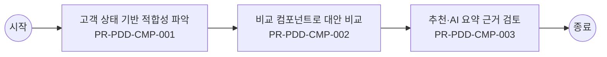

# Usecase: US-PDD-CUS-002 — 상품 조건 비교와 맞춤 판단

## Flowchart

> 단순 직렬 흐름. 분기·게이트웨이는 `00_INDEX.md` BPMN 다이어그램 참조.



## Process: PR-PDD-CMP-001 — 고객 상태 기반 적합성 파악 {#process-PR-PDD-CMP-001}

```yaml
프로세스_ID: PR-PDD-CMP-001
프로세스명: 고객 상태 기반 적합성 파악
설명: 고객의 가입 상태, 보유 상품, 회선, 약정 조건을 조회·검증해 현재 상품의 적합성과 제한 사유를 판단한다.
관련_기능: [FN-PDD-ELIG-001, FN-PDD-CATALOG-001]
```

| 항목 | 내용 |
| --- | --- |
| 액터 | 고객 |
| 진입 조건 | 고객가 상품 조건 비교와 맞춤 판단 업무를 시작하고 상품군, 고객 상태, 진입 채널, 선택 목적 중 최소 1개 기준이 확인된 경우 진입한다. |
| 종료 조건 | 고객 상태 기반 적합성 파악 결과가 성공, 제한, 보완 필요 중 하나로 확정되고 PR-PDD-CMP-002 비교 컴포넌트로 대안 비교로 넘길 입력값과 판단 근거가 저장되면 종료한다. |
| 선행 프로세스 | 업무 진입 조건 충족 |
| 후행 프로세스 | PR-PDD-CMP-002 비교 컴포넌트로 대안 비교 |

### Function: FN-PDD-ELIG-001

```yaml
기능_ID: FN-PDD-ELIG-001
기능명: 고객 상태·가입 조건 판정
설명: 연령, 회선, 보유 상품, 등급, 지역, 가입 가능 요금제, 선행 조건을 판정한다.
관련_정책_그룹: [PG-PDD-ELIG-001, PG-PDD-CATALOG-001, PG-PDD-COMBO-001]
```

| 항목 | 내용 |
| --- | --- |
| 입력 정보 | 고객 가입 상태, 회선/요금제/권한/인증 상태 선택 옵션, 필수 구성, 동시 주문 가능 상품, 재고·배송 조건 담기 가능 여부와 장바구니·주문 전환 대상 정보 상품 관계, 중복 가입, 판매 상태, 제한 사유 정책 |
| 세부 기능 구성 | 고객 상태 가입 조건 불가 사유 대체 경로 |
| 출력 정보 | 담기 가능 여부와 선택 구성 상태 수정 필요 옵션과 제한 사유 장바구니·주문·계속 탐색 전환값 상품 조합·재고·조건 판정 이력 |
| 처리 흐름 | (상태) 상품 구성 선택 → (액션) 고객 상태·가입 조건 판정 기준으로 옵션, 재고, 가입 조건, 상품 관계를 동시 검증 → (결과) 담기 가능, 보완 필요, 선택 불가 중 하나로 판정 (상태) 고객 조건 또는 선택값 변경 → (액션) 기존 선택 구성과 충돌 여부, 필수 구성 누락, 동시 주문 제한을 재확인 → (결과) 수정해야 할 항목과 유지 가능한 항목 분리 (상태) 담기 또는 다음 행동 요청 → (액션) 유효한 선택 구성만 상태 저장하고 장바구니·주문·계속 탐색 경로를 결정 → (결과) 고객 선택 맥락이 끊기지 않고 후속 업무로 전달 |
| 실패/예외 케이스 | 재고, 판매 상태, 가입 조건 중 하나라도 미확정이면 담기를 확정하지 않고 보완 가능한 항목을 안내한다. 선택 조합이 충돌하면 전체 초기화가 아니라 충돌 항목만 수정하도록 한다. 로그인·인증 후 복귀 시 기존 선택 구성이 사라지면 재선택 없이 복원 가능한 상태로 전환한다. |

#### Policy Group: PG-PDD-ELIG-001

```yaml
정책_ID: PG-PDD-ELIG-001
정책명: 가입·구매 가능성 사전 안내 정책
설명: 고객 상태, 가입 조건, 구매 제한, 불가 사유 사전 고지 기준을 정의한다.
```

| Policy Item ID | 정책 항목명 | 정책 항목 |
| --- | --- | --- |
| `PI-PDD-ELIG-001-01` | 사전 판정 | 가입·구매 가능 여부는 연령, 회선, 고객 등급, 지역, 재고, 보유 상품, 판매 기간, 채널 판매 가능성을 기준으로 주문 진입 전 또는 담기 직전에 판정한다. |
| `PI-PDD-ELIG-001-02` | 불가 사유 | 상품 선택 불가 시 재고 부족, 옵션 상태, 가입 조건 불충족, 중복 가입, 선행 조건 미충족, 판매 중지 중 하나 이상의 사유와 해결 방법을 함께 표시한다. |
| `PI-PDD-ELIG-001-03` | 비회원 전환 | 비회원은 구매·가입·개통을 완료할 수 없다. 비로그인 고객이 담기 또는 구매를 시도하면 로그인과 본인확인이 필요한 이유와 전환 이점을 먼저 안내한다. |
| `PI-PDD-ELIG-001-04` | 제한 고지 | 결제수단, 포인트, 쿠폰, 할인, 가입 가능 시점, 예약 가능 시점의 제한은 상세와 담기 단계에서 사전 고지한다. 제한 조건이 바뀌면 기존 선택 상태에 즉시 반영한다. |
| `PI-PDD-ELIG-001-05` | 연령·기간 유효성 | 가입 제한 기준연령은 시작 나이와 종료 나이의 범위가 유효한 경우에만 저장한다. 판매 기간, 예약 가능 시점, 가입 가능 시점이 있는 상품은 주문 전에 제한 조건을 표시한다. |
| `PI-PDD-ELIG-001-06` | 묶음 해지 제약 | 패키지 상품 또는 묶음 혜택은 구성 혜택별 개별 해지 가능 여부를 가입 전에 안내한다. 묶음 단위로만 해지 가능한 경우 고객에게 해지 영향과 환불 기준 참조 경로를 함께 제공한다. |

#### Policy Group: PG-PDD-CATALOG-001

```yaml
정책_ID: PG-PDD-CATALOG-001
정책명: Product Catalog 연동 정책
설명: NOVA Product Catalog 기준 정보와 채널 표시·판정 연계 기준을 정의한다.
```

| Policy Item ID | 정책 항목명 | 정책 항목 |
| --- | --- | --- |
| `PI-PDD-CATALOG-001-01` | 상품 I/F | Product Catalog에서 상품, 마케팅, 서비스, 혜택, 정책, 가입조건, 가격 정보를 통합 수신한다. 채널은 원장 기준과 다른 임의 값을 표시하지 않는다. |
| `PI-PDD-CATALOG-001-02` | Spec/Item | Product Spec은 제공 단위, Item은 사용 단위로 구분한다. Item Type 관계가 있는 상품은 상세와 담기 모두에서 동일한 구성 관계를 사용한다. |
| `PI-PDD-CATALOG-001-03` | 상품 관계 | Product Offering과 마케팅 프로그램 관계는 동시 가입, 자동 가입, 자동 해지, 선가입·선해지 기준으로 판정한다. |
| `PI-PDD-CATALOG-001-04` | 정책 수신 | 가입 조건, 혜택 조건, 조합 정책, 제한 문구는 Product Catalog 또는 BSS 기준을 우선한다. 채널 보조 문구는 정책값을 덮어쓸 수 없다. |
| `PI-PDD-CATALOG-001-05` | 외부채널 연동 | 외부채널 상품 설정은 Product Catalog와 채널 운영값의 매핑을 기준으로 수신한다. 외부채널 또는 Product Catalog 연동 장애가 발생하면 고객 표시를 제한하거나 보조 안내로 전환하고, 채널 간 영향 확대 여부와 복구 결과를 이력으로 남긴다. |

#### Policy Group: PG-PDD-COMBO-001

```yaml
정책_ID: PG-PDD-COMBO-001
정책명: 상품 조합·담기 가능성 정책
설명: 동시 주문, 중복 가입, 필수 구성, 담기 가능성 정책을 정의한다.
```

| Policy Item ID | 정책 항목명 | 정책 항목 |
| --- | --- | --- |
| `PI-PDD-COMBO-001-01` | 동시 주문 | 상품 유형별 동시 주문 가능 조합을 정책으로 정의한다. 단말+요금제+부가+구독은 허용 조합을 둘 수 있고, 단독 구매 상품은 함께 담기를 제한한다. |
| `PI-PDD-COMBO-001-02` | 중복가입 가능여부 확인 | 중복가입 가능여부 확인은 고객 회선과 계정 기준으로 수행한다. 중복 가입이 불가한 상품은 담기, 장바구니, 가입 단계에서 동일한 제한 사유를 표시한다. |
| `PI-PDD-COMBO-001-03` | 필수 구성 | 필수 옵션, 필수 요금제, 필수 프로그램, 그룹 구성 조건이 누락되면 담기를 제한한다. 고객에게 누락 항목과 대체 가능한 구성을 함께 제시한다. |
| `PI-PDD-COMBO-001-04` | 담기 판정 | 담기 가능 여부는 가입 가능 여부, 중복 보유, 선행 조건, 판매 상태, 재고·수량, 판매 기간, 채널 판매 가능성을 실행 시점에 재검증한다. |

### Function: FN-PDD-CATALOG-001

```yaml
기능_ID: FN-PDD-CATALOG-001
기능명: Product Catalog I/F 수신
설명: Product Offering, Spec, Item, 가격, 혜택, 가입 조건, 정책 정보를 수신·정합성 확인해 채널 표시·판정 기준을 생성한다.
관련_정책_그룹: [PG-PDD-ELIG-001, PG-PDD-CATALOG-001, PG-PDD-SAVE-001, PG-PDD-LIFE-001, PG-PDD-DEVICE-001]
```

| 항목 | 내용 |
| --- | --- |
| 입력 정보 | Product Catalog 상품 ID와 상품군·스펙·가격·혜택 메타데이터 상품 라이프사이클 상태와 판매 가능 여부 채널 노출 기준과 외부채널 매핑 정보 원장 변경 시각, 변경 주체, 검수 이력 |
| 세부 기능 구성 | Offering 수신 Spec/Item 가격·혜택 가입 조건 전시 상태 코드 |
| 출력 정보 | 운영 변경 결과와 배포 상태 검수 오류·경고·승인 필요 항목 고객 노출 영향도와 롤백 가능 여부 운영 변경·알림·조치 이력 |
| 처리 흐름 | (상태) 운영 변경 요청 → (액션) Product Catalog I/F 수신 대상의 상품군, 변경 사유, 검수 상태, 배포 범위를 확인 → (결과) 운영자가 변경 가능한 항목과 승인 필요 항목 구분 (상태) 검수·배포 준비 → (액션) Product Catalog, 판매 상태, 정책 문구, 외부채널 설정 간 불일치를 점검 → (결과) 고객 노출 전 오류·누락·충돌 항목 차단 (상태) 배포 후 이상 감지 → (액션) 실패율, 담기 전환율, 고객 문의, 알림 이력을 기준으로 영향 범위 산정 → (결과) 롤백, 보정, 재배포, 상담 공지 중 후속 조치 실행 |
| 실패/예외 케이스 | 운영 입력값이 상품군 필수 기준을 충족하지 않으면 저장보다 검수 보류를 우선한다. 배포 후 고객 영향이 큰 오류가 감지되면 자동 보정 대신 롤백 또는 임시 중단 기준을 적용한다. 외부채널 또는 Product Catalog 회신이 지연되면 고객 노출 상태와 운영 알림을 분리 관리한다. |

#### Policy Group: PG-PDD-ELIG-001

```yaml
정책_ID: PG-PDD-ELIG-001
정책명: 가입·구매 가능성 사전 안내 정책
설명: 고객 상태, 가입 조건, 구매 제한, 불가 사유 사전 고지 기준을 정의한다.
```

| Policy Item ID | 정책 항목명 | 정책 항목 |
| --- | --- | --- |
| `PI-PDD-ELIG-001-01` | 사전 판정 | 가입·구매 가능 여부는 연령, 회선, 고객 등급, 지역, 재고, 보유 상품, 판매 기간, 채널 판매 가능성을 기준으로 주문 진입 전 또는 담기 직전에 판정한다. |
| `PI-PDD-ELIG-001-02` | 불가 사유 | 상품 선택 불가 시 재고 부족, 옵션 상태, 가입 조건 불충족, 중복 가입, 선행 조건 미충족, 판매 중지 중 하나 이상의 사유와 해결 방법을 함께 표시한다. |
| `PI-PDD-ELIG-001-03` | 비회원 전환 | 비회원은 구매·가입·개통을 완료할 수 없다. 비로그인 고객이 담기 또는 구매를 시도하면 로그인과 본인확인이 필요한 이유와 전환 이점을 먼저 안내한다. |
| `PI-PDD-ELIG-001-04` | 제한 고지 | 결제수단, 포인트, 쿠폰, 할인, 가입 가능 시점, 예약 가능 시점의 제한은 상세와 담기 단계에서 사전 고지한다. 제한 조건이 바뀌면 기존 선택 상태에 즉시 반영한다. |
| `PI-PDD-ELIG-001-05` | 연령·기간 유효성 | 가입 제한 기준연령은 시작 나이와 종료 나이의 범위가 유효한 경우에만 저장한다. 판매 기간, 예약 가능 시점, 가입 가능 시점이 있는 상품은 주문 전에 제한 조건을 표시한다. |
| `PI-PDD-ELIG-001-06` | 묶음 해지 제약 | 패키지 상품 또는 묶음 혜택은 구성 혜택별 개별 해지 가능 여부를 가입 전에 안내한다. 묶음 단위로만 해지 가능한 경우 고객에게 해지 영향과 환불 기준 참조 경로를 함께 제공한다. |

#### Policy Group: PG-PDD-CATALOG-001

```yaml
정책_ID: PG-PDD-CATALOG-001
정책명: Product Catalog 연동 정책
설명: NOVA Product Catalog 기준 정보와 채널 표시·판정 연계 기준을 정의한다.
```

| Policy Item ID | 정책 항목명 | 정책 항목 |
| --- | --- | --- |
| `PI-PDD-CATALOG-001-01` | 상품 I/F | Product Catalog에서 상품, 마케팅, 서비스, 혜택, 정책, 가입조건, 가격 정보를 통합 수신한다. 채널은 원장 기준과 다른 임의 값을 표시하지 않는다. |
| `PI-PDD-CATALOG-001-02` | Spec/Item | Product Spec은 제공 단위, Item은 사용 단위로 구분한다. Item Type 관계가 있는 상품은 상세와 담기 모두에서 동일한 구성 관계를 사용한다. |
| `PI-PDD-CATALOG-001-03` | 상품 관계 | Product Offering과 마케팅 프로그램 관계는 동시 가입, 자동 가입, 자동 해지, 선가입·선해지 기준으로 판정한다. |
| `PI-PDD-CATALOG-001-04` | 정책 수신 | 가입 조건, 혜택 조건, 조합 정책, 제한 문구는 Product Catalog 또는 BSS 기준을 우선한다. 채널 보조 문구는 정책값을 덮어쓸 수 없다. |
| `PI-PDD-CATALOG-001-05` | 외부채널 연동 | 외부채널 상품 설정은 Product Catalog와 채널 운영값의 매핑을 기준으로 수신한다. 외부채널 또는 Product Catalog 연동 장애가 발생하면 고객 표시를 제한하거나 보조 안내로 전환하고, 채널 간 영향 확대 여부와 복구 결과를 이력으로 남긴다. |

#### Policy Group: PG-PDD-SAVE-001

```yaml
정책_ID: PG-PDD-SAVE-001
정책명: 담기 실행·다음 행동 정책
설명: 담기 실행, 상태 저장, 완료 후 다음 행동, 주문 전환 기준을 정의한다.
```

| Policy Item ID | 정책 항목명 | 정책 항목 |
| --- | --- | --- |
| `PI-PDD-SAVE-001-01` | 담기 저장 | 담기 성공 시 상품, 옵션, 프로그램, 혜택, 예상 비용, 판정 결과, 기준 시각을 저장한다. 동일 요청은 멱등 키 또는 동일 고객·상품·옵션·기준 시각으로 중복 요청 여부를 확인하고, 중복 요청이면 새 건을 만들지 않고 기존 담기 상태를 갱신한다. |
| `PI-PDD-SAVE-001-02` | 다음 행동 | 담기 완료 후 계속 탐색, 장바구니 이동, 바로 신청, 비교 계속하기 중 최소 3개 행동을 제공한다. 행동별로 현재 선택 기준의 핵심 혜택 또는 주의사항을 짧게 표시한다. |
| `PI-PDD-SAVE-001-03` | 주문 전환 | 바로 신청 또는 주문 전환 시 상품 상태, 가격, 재고, 혜택, 가입 가능성은 다시 확인한다. 변경이 있으면 변경 전후와 고객 선택지를 안내한다. |
| `PI-PDD-SAVE-001-04` | 재검증 | 담기 이후 장바구니 또는 주문으로 넘어갈 때 10분 이상 경과했거나 상품 상태가 바뀐 경우 재검증을 수행한다. 재검증 실패 시 담기 완료 상태는 유지하되 주문 전환은 제한한다. |
| `PI-PDD-SAVE-001-05` | CTA 의미 구분 | 담기와 구독하기는 장바구니 또는 신청 준비 단계로, 바로 결제하기는 결제 진입으로 구분한다. 상품 유형별 CTA 명칭과 다음 단계는 고객에게 혼동 없이 안내해야 한다. |
| `PI-PDD-SAVE-001-06` | 고객 표시 상태와 내부 상태 구분 | 고객 표시 상태는 탐색 가능, 담기 완료, 주문 전환 가능, 선택 불가처럼 고객 행동을 결정하는 문구로 관리한다. 내부 상태는 조건 확인 필요, 조합 충돌, 재고 부족, 인증 필요, 운영 반영 대기로 구분하고, 고객 행동을 제한할 때만 표시 상태를 변경한다. |

#### Policy Group: PG-PDD-LIFE-001

```yaml
정책_ID: PG-PDD-LIFE-001
정책명: 상품 라이프사이클·코드 체계 정책
설명: 상품 라이프사이클, 코드 체계, 서비스 메타데이터 반영 기준을 정의한다.
```

| Policy Item ID | 정책 항목명 | 정책 항목 |
| --- | --- | --- |
| `PI-PDD-LIFE-001-01` | 라이프사이클 | 상품기획, 검토, 개발, 검증, 출시, 운영, 가입중단, 퇴출 상태는 채널 노출과 담기 가능성을 결정한다. 가입중단·퇴출 상품은 신규 담기를 제한한다. |
| `PI-PDD-LIFE-001-02` | 코드 체계 | 요금제, 부가서비스, 혜택, 단말, 서비스 코드는 구분 가능한 코드 체계로 수신한다. 신규 상품군이 추가되어도 채널 판매 불가가 발생하지 않도록 코드 유형을 확장 가능하게 둔다. |
| `PI-PDD-LIFE-001-03` | 메타데이터 | 전시 단위 기본 식별 정보 관리 대상에는 이미지, 마케팅 문구, Product 설명, 전사 상품·서비스 메타데이터가 포함된다. 채널은 NOVA 연동 데이터를 우선 사용하고 별도 운영 값은 제한한다. |
| `PI-PDD-LIFE-001-04` | 판매 상태 | 판매 가능, 판매 중지, 품절, 예약 판매, 채널 판매 제외 상태는 상품 상세와 담기 단계에서 동일하게 적용한다. |
| `PI-PDD-LIFE-001-05` | 전시 상태 코드 | 전시, 비전시, 사전예약, 판매종료, 사용, 미사용 상태는 표준 코드로 관리한다. 채널별 다른 표현을 쓰더라도 담기 가능성 판정은 같은 상태 코드를 따른다. |

#### Policy Group: PG-PDD-DEVICE-001

```yaml
정책_ID: PG-PDD-DEVICE-001
정책명: 디바이스·액세서리·연동기기 운영 정책
설명: 디바이스, 액세서리, 자급제, 연동기기, 꼬리 단말기, 스마트홈/NUGU 운영 기준을 정의한다.
```

| Policy Item ID | 정책 항목명 | 정책 항목 |
| --- | --- | --- |
| `PI-PDD-DEVICE-001-01` | 디바이스 공개상태 | 디바이스 기본정보는 공개, 비공개, 사용, 미사용 상태를 구분한다. 다건 공개상태 변경은 부분 실패 기준과 변경 이력을 적용한다. |
| `PI-PDD-DEVICE-001-02` | 등록 완료 산출 | 디바이스 기본정보, 이미지, 특장점 등록 여부를 기준으로 등록완료 상태를 산출한다. 누락 항목이 있으면 프론트 반영 가능 상태로 보지 않는다. |
| `PI-PDD-DEVICE-001-03` | 프론트 반영 상태 | 디바이스, 액세서리, 인터넷/IPTV/셋톱박스, 사은품 정책은 사용여부, 전시기간, 매핑 상태를 기준으로 프론트 반영 여부를 산출하고 운영자가 확인할 수 있어야 한다. |
| `PI-PDD-DEVICE-001-04` | 삭제 영향 보호 | 액세서리, 꼬리 단말기, 연동기기, 자급제 상품 삭제는 연관 데이터와 고객 노출 영향 확인 후 허용한다. 삭제 대상 범위는 실행 전에 운영자에게 표시한다. |
| `PI-PDD-DEVICE-001-05` | 연동기기 라이프사이클 | 연동기기는 등록, 수정, 사용여부 변경, 삭제, 이력 조회 흐름을 가진다. SWING 연동 데이터는 자동 등록 가능하되 수신 기준과 예외 처리 이력을 남긴다. |
| `PI-PDD-DEVICE-001-06` | 외부채널 설정 | 외부 제휴처 판매용 모상품, 모상품그룹, 요금제, 부가서비스, 모바일 카테고리는 내부 상품 정책과 동일한 가입·판매·노출 기준을 적용한다. |

## Process: PR-PDD-CMP-002 — 비교 컴포넌트로 대안 비교 {#process-PR-PDD-CMP-002}

```yaml
프로세스_ID: PR-PDD-CMP-002
프로세스명: 비교 컴포넌트로 대안 비교
설명: 고객이 상품군별 비교 속성과 현재 조건을 입력·수정하고 2개 이상 상품의 비용·혜택·제약 차이를 확인한다.
관련_기능: [FN-PDD-COMPARE-001, FN-PDD-PRICE-001]
```

| 항목 | 내용 |
| --- | --- |
| 액터 | 고객 |
| 진입 조건 | PR-PDD-CMP-001 고객 상태 기반 적합성 파악 결과가 고객에게 표시되었고, 고객 또는 운영자가 다음 판단을 계속하기로 선택한 경우 진입한다. |
| 종료 조건 | 비교 컴포넌트로 대안 비교 결과가 성공, 제한, 보완 필요 중 하나로 확정되고 PR-PDD-CMP-003 추천·AI 요약 근거 검토로 넘길 입력값과 판단 근거가 저장되면 종료한다. |
| 선행 프로세스 | PR-PDD-CMP-001 고객 상태 기반 적합성 파악 |
| 후행 프로세스 | PR-PDD-CMP-003 추천·AI 요약 근거 검토 |

### Function: FN-PDD-COMPARE-001

```yaml
기능_ID: FN-PDD-COMPARE-001
기능명: 상품 비교 기준 적용
설명: 상품군별 비교 속성과 고객 현재 조건을 기준으로 비교표를 구성한다.
관련_정책_그룹: [PG-PDD-COMPARE-001, PG-PDD-PRICE-001, PG-PDD-OPS-001]
```

| 항목 | 내용 |
| --- | --- |
| 입력 정보 | 상품 ID, 상품군, 판매 상태, 대표 가격·혜택 정보 고객 진입 경로와 조회 세션 정보 상품 상세 템플릿의 필수 섹션과 노출 우선순위 고객에게 숨겨야 할 내부 코드·운영 문구 제외 기준 |
| 세부 기능 구성 | 비교 속성 기본 비교세트 고객 기준값 조건 수정 요금제 비교 |
| 출력 정보 | 고객용 상품 요약과 상세 섹션 노출 결과 상품군별 필수 정보 표시 여부 미노출·대체 안내 사유 상품 상세 조회와 비교·담기 전환 이력 |
| 처리 흐름 | (상태) 상품 상세 진입 → (액션) 상품 비교 기준 적용에 필요한 상품군·판매상태·핵심 속성을 원장 기준으로 조립 → (결과) 고객이 상품 목적과 가입 가능성을 먼저 이해할 수 있는 요약 영역 구성 (상태) 추가 설명 확인 → (액션) 미디어, 스펙, 후기, Q&A, 유의사항을 고객 의사결정 순서로 재배치 → (결과) 상품 이해에 필요한 정보와 내부 운영 문구를 분리 표시 (상태) 정보 부족 또는 노출 제한 발생 → (액션) 대체 설명, 상담 연결, 미노출 사유를 정책 기준으로 선택 → (결과) 빈 화면 없이 다음 탐색 또는 문의 경로 제공 |
| 실패/예외 케이스 | 상품 기준 정보가 누락되면 해당 섹션을 숨기지 않고 보완 필요 또는 상담 가능 경로를 안내한다. 내부 운영 코드나 원장 필드명이 고객 문구로 노출되면 배포를 제한한다. 미디어·후기·스펙 로딩 실패 시 핵심 요약과 가격·조건 판단은 유지한다. |

#### Policy Group: PG-PDD-COMPARE-001

```yaml
정책_ID: PG-PDD-COMPARE-001
정책명: 비교·추천·AI 요약 정책
설명: 상품 비교, AI 요약, 추천, 후기 요약, atomic view 기준을 정의한다.
```

| Policy Item ID | 정책 항목명 | 정책 항목 |
| --- | --- | --- |
| `PI-PDD-COMPARE-001-01` | 비교 기준 | 비교표는 상품군별 표준 속성, 단위, 용어, 노출 우선순위를 따른다. 요금제, 로밍, 약정, 보험, 웨이브, 단말 비교는 상품군별 필수 비교 항목을 다르게 둔다. |
| `PI-PDD-COMPARE-001-02` | AI 요약 | 상품 핵심 특징 AI 요약은 원장 정보 상위에 제공하되 생성 기준, 반영 시점, 요약 대상 범위, 원문 이동 경로를 함께 표시한다. |
| `PI-PDD-COMPARE-001-03` | 추천 근거 | AI 추천은 고객의 가입 정보, 데이터 사용량, 결합 여부, 보유 혜택, 월 예상 부담 중 사용한 기준을 표시한다. 고객이 조건을 수정하면 추천 결과를 재탐색할 수 있어야 한다. |
| `PI-PDD-COMPARE-001-04` | 후기 요약 | 상품 구매 후기 AI 요약은 장점과 단점을 균형 있게 제공한다. 요약만으로 판단하지 않도록 원문 후기, 평점 세부, Q&A로 이동할 수 있게 한다. |
| `PI-PDD-COMPARE-001-05` | atomic view | 상품 상세 AI atomic view는 고객 세그먼트, 가입·해지 맥락, 현재 상태에 맞춰 원장 정보를 재조립하되 원장 값과 다르게 표현할 수 없다. |
| `PI-PDD-COMPARE-001-06` | 상품군별 비교 템플릿 | 요금제, 로밍, 약정, 보험, 웨이브, 단말 비교는 각 상품군의 필수 비교 속성을 다르게 둔다. BSS 또는 Product Catalog에서 제공한 기준값을 사용하고 고객이 조건을 수정하면 비교 결과를 다시 산정한다. |
| `PI-PDD-COMPARE-001-07` | 대체 옵션 추천 | 선택한 색상·용량이 품절 또는 일시품절이면 재고가 있는 대체 색상·용량, 입고 알림, 다른 상품 비교 중 하나 이상을 제공한다. 대체 추천은 재고 기준 시각을 함께 표시한다. |

#### Policy Group: PG-PDD-PRICE-001

```yaml
정책_ID: PG-PDD-PRICE-001
정책명: 가격·혜택·가치 표시 정책
설명: 가격, 할인, 혜택, 예상 부담, 마케팅 정보 표시 기준을 정의한다.
```

| Policy Item ID | 정책 항목명 | 정책 항목 |
| --- | --- | --- |
| `PI-PDD-PRICE-001-01` | 가격 기준 | 가격은 정가, 할인가, 실구매가, 예상 절감, 월 기준, 1회성 비용을 구분한다. 고객 상태가 반영된 실구매가는 담기 전까지 최신 조건으로 재산정한다. |
| `PI-PDD-PRICE-001-02` | 혜택 분리 | 쿠폰, 포인트, 제휴 혜택, 사은품, 마케팅 프로그램 혜택은 혜택별 적용 조건, 기간, 사용처, 제외 사유를 분리해 표시한다. 중복 적용 불가 혜택은 불가 사유를 함께 표시한다. |
| `PI-PDD-PRICE-001-03` | 공시지원금 | 단말 상품은 출고가, 공시지원금, 선택약정 할인 적용가, 약정 기간 차이를 비교 가능한 단위로 제공한다. 공시지원금 고지 기준은 고객이 담기 전 확인 가능한 위치에 둔다. |
| `PI-PDD-PRICE-001-04` | 마케팅 정보 | 제휴카드 할인, 사은품, 구매 유도 혜택은 적용 조건, 유지 조건, 제외 조건을 함께 표시한다. 마케팅 문구가 가격 또는 가입 가능성을 오인하게 하면 노출을 제한한다. |
| `PI-PDD-PRICE-001-05` | 실사용 빈도 가치 | 구독·혜택성 상품은 월 N회 사용 시 구독료 이상의 가치처럼 고객이 이해할 수 있는 실사용 빈도 예시를 제공한다. 예시는 과장 없이 적용 조건과 제외 조건을 함께 표시한다. |
| `PI-PDD-PRICE-001-06` | 선물가 문구 | 일반 가격과 동일한 선물가는 별도 선물가로 강조하지 않는다. 고객에게 가격 차이가 있는 것처럼 오인될 수 있는 툴팁이나 문구는 노출하지 않는다. |
| `PI-PDD-PRICE-001-07` | 구독가 비교 | 기존 일반 구독가와 T우주 또는 채널 내 구독가 혜택을 비교할 때는 월 기준 금액, 할인 기간, 할인 종료 후 금액, 적용 제외 조건을 함께 표시한다. |

#### Policy Group: PG-PDD-OPS-001

```yaml
정책_ID: PG-PDD-OPS-001
정책명: 운영자 템플릿·정책문구 관리 정책
설명: 운영자가 템플릿, 비교 기준, 정책 문구를 안전하게 운영하는 기준을 정의한다.
```

| Policy Item ID | 정책 항목명 | 정책 항목 |
| --- | --- | --- |
| `PI-PDD-OPS-001-01` | 버전 관리 | 템플릿, 정책 문구, 비교 기준, 상품 조합 정책 변경은 버전, 적용일, 변경자, 변경 전후, 영향 상품을 저장한다. |
| `PI-PDD-OPS-001-02` | 영향도 확인 | 운영 정책 변경 전에는 고객 판정 결과, 담기 가능성, 노출 문구, 기존 담기 상태에 미치는 영향을 미리 확인한다. |
| `PI-PDD-OPS-001-03` | 미리보기 | 운영자는 상품군, 고객 상태, 판매 상태, 재고 상태, 혜택 조건을 바꿔가며 상품 상세와 담기 문구를 미리보기로 확인할 수 있어야 한다. |
| `PI-PDD-OPS-001-04` | 변경 이력 | 정책 문구와 템플릿 변경 이력은 최소 1년 보관한다. 고객 안내에 영향을 준 변경은 고객 문의와 재현 검증이 가능해야 한다. |

### Function: FN-PDD-PRICE-001

```yaml
기능_ID: FN-PDD-PRICE-001
기능명: 예상 부담·혜택 요약 계산
설명: 선택 상품과 고객 조건을 기준으로 월 예상액, 1회성 비용, 적용·제외 혜택, 지원금 차이를 계산해 예상 부담 결과를 생성한다.
관련_정책_그룹: [PG-PDD-COMPARE-001, PG-PDD-PRICE-001, PG-PDD-SAVE-001]
```

| 항목 | 내용 |
| --- | --- |
| 입력 정보 | 상품 ID, 상품군, 판매 상태, 대표 가격·혜택 정보 고객 진입 경로와 조회 세션 정보 상품 상세 템플릿의 필수 섹션과 노출 우선순위 고객에게 숨겨야 할 내부 코드·운영 문구 제외 기준 |
| 세부 기능 구성 | 월 예상액 1회성 비용 제외 혜택 공시지원금 |
| 출력 정보 | 고객용 상품 요약과 상세 섹션 노출 결과 상품군별 필수 정보 표시 여부 미노출·대체 안내 사유 상품 상세 조회와 비교·담기 전환 이력 |
| 처리 흐름 | (상태) 상품 상세 진입 → (액션) 예상 부담·혜택 요약 계산에 필요한 상품군·판매상태·핵심 속성을 원장 기준으로 조립 → (결과) 고객이 상품 목적과 가입 가능성을 먼저 이해할 수 있는 요약 영역 구성 (상태) 추가 설명 확인 → (액션) 미디어, 스펙, 후기, Q&A, 유의사항을 고객 의사결정 순서로 재배치 → (결과) 상품 이해에 필요한 정보와 내부 운영 문구를 분리 표시 (상태) 정보 부족 또는 노출 제한 발생 → (액션) 대체 설명, 상담 연결, 미노출 사유를 정책 기준으로 선택 → (결과) 빈 화면 없이 다음 탐색 또는 문의 경로 제공 |
| 실패/예외 케이스 | 상품 기준 정보가 누락되면 해당 섹션을 숨기지 않고 보완 필요 또는 상담 가능 경로를 안내한다. 내부 운영 코드나 원장 필드명이 고객 문구로 노출되면 배포를 제한한다. 미디어·후기·스펙 로딩 실패 시 핵심 요약과 가격·조건 판단은 유지한다. |

#### Policy Group: PG-PDD-COMPARE-001

```yaml
정책_ID: PG-PDD-COMPARE-001
정책명: 비교·추천·AI 요약 정책
설명: 상품 비교, AI 요약, 추천, 후기 요약, atomic view 기준을 정의한다.
```

| Policy Item ID | 정책 항목명 | 정책 항목 |
| --- | --- | --- |
| `PI-PDD-COMPARE-001-01` | 비교 기준 | 비교표는 상품군별 표준 속성, 단위, 용어, 노출 우선순위를 따른다. 요금제, 로밍, 약정, 보험, 웨이브, 단말 비교는 상품군별 필수 비교 항목을 다르게 둔다. |
| `PI-PDD-COMPARE-001-02` | AI 요약 | 상품 핵심 특징 AI 요약은 원장 정보 상위에 제공하되 생성 기준, 반영 시점, 요약 대상 범위, 원문 이동 경로를 함께 표시한다. |
| `PI-PDD-COMPARE-001-03` | 추천 근거 | AI 추천은 고객의 가입 정보, 데이터 사용량, 결합 여부, 보유 혜택, 월 예상 부담 중 사용한 기준을 표시한다. 고객이 조건을 수정하면 추천 결과를 재탐색할 수 있어야 한다. |
| `PI-PDD-COMPARE-001-04` | 후기 요약 | 상품 구매 후기 AI 요약은 장점과 단점을 균형 있게 제공한다. 요약만으로 판단하지 않도록 원문 후기, 평점 세부, Q&A로 이동할 수 있게 한다. |
| `PI-PDD-COMPARE-001-05` | atomic view | 상품 상세 AI atomic view는 고객 세그먼트, 가입·해지 맥락, 현재 상태에 맞춰 원장 정보를 재조립하되 원장 값과 다르게 표현할 수 없다. |
| `PI-PDD-COMPARE-001-06` | 상품군별 비교 템플릿 | 요금제, 로밍, 약정, 보험, 웨이브, 단말 비교는 각 상품군의 필수 비교 속성을 다르게 둔다. BSS 또는 Product Catalog에서 제공한 기준값을 사용하고 고객이 조건을 수정하면 비교 결과를 다시 산정한다. |
| `PI-PDD-COMPARE-001-07` | 대체 옵션 추천 | 선택한 색상·용량이 품절 또는 일시품절이면 재고가 있는 대체 색상·용량, 입고 알림, 다른 상품 비교 중 하나 이상을 제공한다. 대체 추천은 재고 기준 시각을 함께 표시한다. |

#### Policy Group: PG-PDD-PRICE-001

```yaml
정책_ID: PG-PDD-PRICE-001
정책명: 가격·혜택·가치 표시 정책
설명: 가격, 할인, 혜택, 예상 부담, 마케팅 정보 표시 기준을 정의한다.
```

| Policy Item ID | 정책 항목명 | 정책 항목 |
| --- | --- | --- |
| `PI-PDD-PRICE-001-01` | 가격 기준 | 가격은 정가, 할인가, 실구매가, 예상 절감, 월 기준, 1회성 비용을 구분한다. 고객 상태가 반영된 실구매가는 담기 전까지 최신 조건으로 재산정한다. |
| `PI-PDD-PRICE-001-02` | 혜택 분리 | 쿠폰, 포인트, 제휴 혜택, 사은품, 마케팅 프로그램 혜택은 혜택별 적용 조건, 기간, 사용처, 제외 사유를 분리해 표시한다. 중복 적용 불가 혜택은 불가 사유를 함께 표시한다. |
| `PI-PDD-PRICE-001-03` | 공시지원금 | 단말 상품은 출고가, 공시지원금, 선택약정 할인 적용가, 약정 기간 차이를 비교 가능한 단위로 제공한다. 공시지원금 고지 기준은 고객이 담기 전 확인 가능한 위치에 둔다. |
| `PI-PDD-PRICE-001-04` | 마케팅 정보 | 제휴카드 할인, 사은품, 구매 유도 혜택은 적용 조건, 유지 조건, 제외 조건을 함께 표시한다. 마케팅 문구가 가격 또는 가입 가능성을 오인하게 하면 노출을 제한한다. |
| `PI-PDD-PRICE-001-05` | 실사용 빈도 가치 | 구독·혜택성 상품은 월 N회 사용 시 구독료 이상의 가치처럼 고객이 이해할 수 있는 실사용 빈도 예시를 제공한다. 예시는 과장 없이 적용 조건과 제외 조건을 함께 표시한다. |
| `PI-PDD-PRICE-001-06` | 선물가 문구 | 일반 가격과 동일한 선물가는 별도 선물가로 강조하지 않는다. 고객에게 가격 차이가 있는 것처럼 오인될 수 있는 툴팁이나 문구는 노출하지 않는다. |
| `PI-PDD-PRICE-001-07` | 구독가 비교 | 기존 일반 구독가와 T우주 또는 채널 내 구독가 혜택을 비교할 때는 월 기준 금액, 할인 기간, 할인 종료 후 금액, 적용 제외 조건을 함께 표시한다. |

#### Policy Group: PG-PDD-SAVE-001

```yaml
정책_ID: PG-PDD-SAVE-001
정책명: 담기 실행·다음 행동 정책
설명: 담기 실행, 상태 저장, 완료 후 다음 행동, 주문 전환 기준을 정의한다.
```

| Policy Item ID | 정책 항목명 | 정책 항목 |
| --- | --- | --- |
| `PI-PDD-SAVE-001-01` | 담기 저장 | 담기 성공 시 상품, 옵션, 프로그램, 혜택, 예상 비용, 판정 결과, 기준 시각을 저장한다. 동일 요청은 멱등 키 또는 동일 고객·상품·옵션·기준 시각으로 중복 요청 여부를 확인하고, 중복 요청이면 새 건을 만들지 않고 기존 담기 상태를 갱신한다. |
| `PI-PDD-SAVE-001-02` | 다음 행동 | 담기 완료 후 계속 탐색, 장바구니 이동, 바로 신청, 비교 계속하기 중 최소 3개 행동을 제공한다. 행동별로 현재 선택 기준의 핵심 혜택 또는 주의사항을 짧게 표시한다. |
| `PI-PDD-SAVE-001-03` | 주문 전환 | 바로 신청 또는 주문 전환 시 상품 상태, 가격, 재고, 혜택, 가입 가능성은 다시 확인한다. 변경이 있으면 변경 전후와 고객 선택지를 안내한다. |
| `PI-PDD-SAVE-001-04` | 재검증 | 담기 이후 장바구니 또는 주문으로 넘어갈 때 10분 이상 경과했거나 상품 상태가 바뀐 경우 재검증을 수행한다. 재검증 실패 시 담기 완료 상태는 유지하되 주문 전환은 제한한다. |
| `PI-PDD-SAVE-001-05` | CTA 의미 구분 | 담기와 구독하기는 장바구니 또는 신청 준비 단계로, 바로 결제하기는 결제 진입으로 구분한다. 상품 유형별 CTA 명칭과 다음 단계는 고객에게 혼동 없이 안내해야 한다. |
| `PI-PDD-SAVE-001-06` | 고객 표시 상태와 내부 상태 구분 | 고객 표시 상태는 탐색 가능, 담기 완료, 주문 전환 가능, 선택 불가처럼 고객 행동을 결정하는 문구로 관리한다. 내부 상태는 조건 확인 필요, 조합 충돌, 재고 부족, 인증 필요, 운영 반영 대기로 구분하고, 고객 행동을 제한할 때만 표시 상태를 변경한다. |

## Process: PR-PDD-CMP-003 — 추천·AI 요약 근거 검토 {#process-PR-PDD-CMP-003}

```yaml
프로세스_ID: PR-PDD-CMP-003
프로세스명: 추천·AI 요약 근거 검토
설명: 고객이 AI 요약, 추천, 후기 요약의 기준과 원문 정보를 확인하고 선택 후보를 좁힌다.
관련_기능: [FN-PDD-AI-001, FN-PDD-REVIEW-001]
```

| 항목 | 내용 |
| --- | --- |
| 액터 | 고객 |
| 진입 조건 | PR-PDD-CMP-002 비교 컴포넌트로 대안 비교 결과가 고객에게 표시되었고, 고객 또는 운영자가 다음 판단을 계속하기로 선택한 경우 진입한다. |
| 종료 조건 | 상품 조건 비교와 맞춤 판단의 완료·중단·상담 전환 결과가 확정되고 고객 안내, 상태 이력, 관련 정책 근거가 남으면 종료한다. |
| 선행 프로세스 | PR-PDD-CMP-002 비교 컴포넌트로 대안 비교 |
| 후행 프로세스 | 결과 안내 또는 후속 업무 연결 |

### Function: FN-PDD-AI-001

```yaml
기능_ID: FN-PDD-AI-001
기능명: AI 요약·추천·atomic view
설명: 상품 원장, 후기, 고객 맥락을 바탕으로 AI 요약, 추천, atomic view를 생성한다.
관련_정책_그룹: [PG-PDD-COMPARE-001, PG-PDD-AUDIT-001]
```

| 항목 | 내용 |
| --- | --- |
| 입력 정보 | 상품 설명, 후기·Q&A, 비교 속성, 고객 질의 문맥 출처가 확인된 상품 기준 정보와 운영자가 승인한 문구 추천 제외 조건, 미충족 사유, 자동화 신뢰도 기준 AI 결과 고객 통제와 상담 전환 기준 |
| 세부 기능 구성 | AI 요약 추천 근거 후기 요약 atomic view 유사상품 AI 비교 |
| 출력 정보 | 고객용 상품 요약과 상세 섹션 노출 결과 상품군별 필수 정보 표시 여부 미노출·대체 안내 사유 상품 상세 조회와 비교·담기 전환 이력 |
| 처리 흐름 | (상태) 상품 상세 진입 → (액션) AI 요약·추천·atomic view에 필요한 상품군·판매상태·핵심 속성을 원장 기준으로 조립 → (결과) 고객이 상품 목적과 가입 가능성을 먼저 이해할 수 있는 요약 영역 구성 (상태) 추가 설명 확인 → (액션) 미디어, 스펙, 후기, Q&A, 유의사항을 고객 의사결정 순서로 재배치 → (결과) 상품 이해에 필요한 정보와 내부 운영 문구를 분리 표시 (상태) 정보 부족 또는 노출 제한 발생 → (액션) 대체 설명, 상담 연결, 미노출 사유를 정책 기준으로 선택 → (결과) 빈 화면 없이 다음 탐색 또는 문의 경로 제공 |
| 실패/예외 케이스 | 상품 기준 정보가 누락되면 해당 섹션을 숨기지 않고 보완 필요 또는 상담 가능 경로를 안내한다. 내부 운영 코드나 원장 필드명이 고객 문구로 노출되면 배포를 제한한다. 미디어·후기·스펙 로딩 실패 시 핵심 요약과 가격·조건 판단은 유지한다. |

#### Policy Group: PG-PDD-COMPARE-001

```yaml
정책_ID: PG-PDD-COMPARE-001
정책명: 비교·추천·AI 요약 정책
설명: 상품 비교, AI 요약, 추천, 후기 요약, atomic view 기준을 정의한다.
```

| Policy Item ID | 정책 항목명 | 정책 항목 |
| --- | --- | --- |
| `PI-PDD-COMPARE-001-01` | 비교 기준 | 비교표는 상품군별 표준 속성, 단위, 용어, 노출 우선순위를 따른다. 요금제, 로밍, 약정, 보험, 웨이브, 단말 비교는 상품군별 필수 비교 항목을 다르게 둔다. |
| `PI-PDD-COMPARE-001-02` | AI 요약 | 상품 핵심 특징 AI 요약은 원장 정보 상위에 제공하되 생성 기준, 반영 시점, 요약 대상 범위, 원문 이동 경로를 함께 표시한다. |
| `PI-PDD-COMPARE-001-03` | 추천 근거 | AI 추천은 고객의 가입 정보, 데이터 사용량, 결합 여부, 보유 혜택, 월 예상 부담 중 사용한 기준을 표시한다. 고객이 조건을 수정하면 추천 결과를 재탐색할 수 있어야 한다. |
| `PI-PDD-COMPARE-001-04` | 후기 요약 | 상품 구매 후기 AI 요약은 장점과 단점을 균형 있게 제공한다. 요약만으로 판단하지 않도록 원문 후기, 평점 세부, Q&A로 이동할 수 있게 한다. |
| `PI-PDD-COMPARE-001-05` | atomic view | 상품 상세 AI atomic view는 고객 세그먼트, 가입·해지 맥락, 현재 상태에 맞춰 원장 정보를 재조립하되 원장 값과 다르게 표현할 수 없다. |
| `PI-PDD-COMPARE-001-06` | 상품군별 비교 템플릿 | 요금제, 로밍, 약정, 보험, 웨이브, 단말 비교는 각 상품군의 필수 비교 속성을 다르게 둔다. BSS 또는 Product Catalog에서 제공한 기준값을 사용하고 고객이 조건을 수정하면 비교 결과를 다시 산정한다. |
| `PI-PDD-COMPARE-001-07` | 대체 옵션 추천 | 선택한 색상·용량이 품절 또는 일시품절이면 재고가 있는 대체 색상·용량, 입고 알림, 다른 상품 비교 중 하나 이상을 제공한다. 대체 추천은 재고 기준 시각을 함께 표시한다. |

#### Policy Group: PG-PDD-AUDIT-001

```yaml
정책_ID: PG-PDD-AUDIT-001
정책명: 이력·성과·개선 정책
설명: 담기와 상품 상세의 판정·변경·성과·개선 이력 기준을 정의한다.
```

| Policy Item ID | 정책 항목명 | 정책 항목 |
| --- | --- | --- |
| `PI-PDD-AUDIT-001-01` | 판정 이력 | 가입 가능성, 담기 가능성, 조합 충돌, 재고 부족, 인증 필요 판정은 기준 시각과 판정 근거를 이력으로 저장한다. |
| `PI-PDD-AUDIT-001-02` | 변경 이력 | 상품 원장, 템플릿, 비교 기준, 마케팅 정보, 정책 문구 변경은 변경 전후와 승인 결과를 함께 저장한다. |
| `PI-PDD-AUDIT-001-03` | 성과 리포트 | 상품 상세과 담기 성과는 노출 수, 진입 수, 비교 이용 수, 담기 성공률, 실패율, 상담 전환율, 주문 전환율 기준으로 집계한다. |
| `PI-PDD-AUDIT-001-04` | 개선 추적 | 반복 실패 유형과 미조치 알림은 개선 대상 목록으로 관리한다. 조치 완료 후 동일 유형 재발 여부를 확인해 정책 또는 원장 개선으로 연결한다. |

### Function: FN-PDD-REVIEW-001

```yaml
기능_ID: FN-PDD-REVIEW-001
기능명: 상품 리뷰·평점·Q&A 제공
설명: 상품 리뷰, 평점, Q&A와 구매후기 AI 요약을 최신순·도움순·유형별 필터와 신고·가림 기준으로 제공한다.
관련_정책_그룹: [PG-PDD-SUMMARY-001, PG-PDD-COMPARE-001, PG-PDD-AUDIT-001, PG-PDD-REVIEW-001]
```

| 항목 | 내용 |
| --- | --- |
| 입력 정보 | 상품 ID, 상품군, 판매 상태, 대표 가격·혜택 정보 고객 진입 경로와 조회 세션 정보 상품 상세 템플릿의 필수 섹션과 노출 우선순위 고객에게 숨겨야 할 내부 코드·운영 문구 제외 기준 |
| 세부 기능 구성 | 후기 목록 평점 요약 Q&A 필터 신고 처리 필터 완화 안내 |
| 출력 정보 | 고객용 상품 요약과 상세 섹션 노출 결과 상품군별 필수 정보 표시 여부 미노출·대체 안내 사유 상품 상세 조회와 비교·담기 전환 이력 |
| 처리 흐름 | (상태) 상품 상세 진입 → (액션) 상품 리뷰·평점·Q&A 제공에 필요한 상품군·판매상태·핵심 속성을 원장 기준으로 조립 → (결과) 고객이 상품 목적과 가입 가능성을 먼저 이해할 수 있는 요약 영역 구성 (상태) 추가 설명 확인 → (액션) 미디어, 스펙, 후기, Q&A, 유의사항을 고객 의사결정 순서로 재배치 → (결과) 상품 이해에 필요한 정보와 내부 운영 문구를 분리 표시 (상태) 정보 부족 또는 노출 제한 발생 → (액션) 대체 설명, 상담 연결, 미노출 사유를 정책 기준으로 선택 → (결과) 빈 화면 없이 다음 탐색 또는 문의 경로 제공 |
| 실패/예외 케이스 | 상품 기준 정보가 누락되면 해당 섹션을 숨기지 않고 보완 필요 또는 상담 가능 경로를 안내한다. 내부 운영 코드나 원장 필드명이 고객 문구로 노출되면 배포를 제한한다. 미디어·후기·스펙 로딩 실패 시 핵심 요약과 가격·조건 판단은 유지한다. |

#### Policy Group: PG-PDD-SUMMARY-001

```yaml
정책_ID: PG-PDD-SUMMARY-001
정책명: 상품 요약·미디어·스펙 표시 정책
설명: 상품 요약, 이미지, 미디어, 스펙, 후기, Q&A 표시 기준을 정의한다.
```

| Policy Item ID | 정책 항목명 | 정책 항목 |
| --- | --- | --- |
| `PI-PDD-SUMMARY-001-01` | 핵심 요약 | 상품 상세 요약은 상품명, 대표 이미지, 상품 유형, 가격·할인 유형, 핵심 혜택, 가입 가능성 중 최소 5개 항목을 상단에 제공한다. 고객 상태 기반 문구는 로그인 상태에서만 개인화한다. 상품정보 및 가격 확인은 고객이 담기 전 동일 요약 영역에서 수행할 수 있어야 한다. |
| `PI-PDD-SUMMARY-001-02` | 미디어 뷰어 | 상품 이미지, 배너, 동영상은 확대와 스와이프를 허용하고, 대체텍스트를 필수로 둔다. 미디어가 상품 조건을 설명하는 경우 동일 정보를 텍스트로도 제공한다. |
| `PI-PDD-SUMMARY-001-03` | 스펙 요약 | 상품 설명과 스펙은 요약과 상세 펼침으로 구분한다. 요약 영역에는 고객이 담기 전 판단해야 할 조건, 제한, 기간, 대상 여부를 우선 표시한다. |
| `PI-PDD-SUMMARY-001-04` | 상품 리뷰·평점·Q&A | 상품 리뷰·평점·Q&A 제공 영역은 최신순, 도움순, 유형별 필터를 제공한다. 신고·가림 대상은 운영 정책에 따라 제한하고, 답변 상태와 원문 이동 경로를 함께 제공한다. |
| `PI-PDD-SUMMARY-001-05` | 브랜드·판매주체·이행방식 | 상품 상세에는 브랜드, 판매주체, 즉시 사용·배송·설치·외부 제휴·전문 채널 연계 같은 이행방식을 명확히 표시한다. 고객이 주문 후 누가 이행하고 어디에서 처리되는지 알 수 있어야 한다. |

#### Policy Group: PG-PDD-COMPARE-001

```yaml
정책_ID: PG-PDD-COMPARE-001
정책명: 비교·추천·AI 요약 정책
설명: 상품 비교, AI 요약, 추천, 후기 요약, atomic view 기준을 정의한다.
```

| Policy Item ID | 정책 항목명 | 정책 항목 |
| --- | --- | --- |
| `PI-PDD-COMPARE-001-01` | 비교 기준 | 비교표는 상품군별 표준 속성, 단위, 용어, 노출 우선순위를 따른다. 요금제, 로밍, 약정, 보험, 웨이브, 단말 비교는 상품군별 필수 비교 항목을 다르게 둔다. |
| `PI-PDD-COMPARE-001-02` | AI 요약 | 상품 핵심 특징 AI 요약은 원장 정보 상위에 제공하되 생성 기준, 반영 시점, 요약 대상 범위, 원문 이동 경로를 함께 표시한다. |
| `PI-PDD-COMPARE-001-03` | 추천 근거 | AI 추천은 고객의 가입 정보, 데이터 사용량, 결합 여부, 보유 혜택, 월 예상 부담 중 사용한 기준을 표시한다. 고객이 조건을 수정하면 추천 결과를 재탐색할 수 있어야 한다. |
| `PI-PDD-COMPARE-001-04` | 후기 요약 | 상품 구매 후기 AI 요약은 장점과 단점을 균형 있게 제공한다. 요약만으로 판단하지 않도록 원문 후기, 평점 세부, Q&A로 이동할 수 있게 한다. |
| `PI-PDD-COMPARE-001-05` | atomic view | 상품 상세 AI atomic view는 고객 세그먼트, 가입·해지 맥락, 현재 상태에 맞춰 원장 정보를 재조립하되 원장 값과 다르게 표현할 수 없다. |
| `PI-PDD-COMPARE-001-06` | 상품군별 비교 템플릿 | 요금제, 로밍, 약정, 보험, 웨이브, 단말 비교는 각 상품군의 필수 비교 속성을 다르게 둔다. BSS 또는 Product Catalog에서 제공한 기준값을 사용하고 고객이 조건을 수정하면 비교 결과를 다시 산정한다. |
| `PI-PDD-COMPARE-001-07` | 대체 옵션 추천 | 선택한 색상·용량이 품절 또는 일시품절이면 재고가 있는 대체 색상·용량, 입고 알림, 다른 상품 비교 중 하나 이상을 제공한다. 대체 추천은 재고 기준 시각을 함께 표시한다. |

#### Policy Group: PG-PDD-AUDIT-001

```yaml
정책_ID: PG-PDD-AUDIT-001
정책명: 이력·성과·개선 정책
설명: 담기와 상품 상세의 판정·변경·성과·개선 이력 기준을 정의한다.
```

| Policy Item ID | 정책 항목명 | 정책 항목 |
| --- | --- | --- |
| `PI-PDD-AUDIT-001-01` | 판정 이력 | 가입 가능성, 담기 가능성, 조합 충돌, 재고 부족, 인증 필요 판정은 기준 시각과 판정 근거를 이력으로 저장한다. |
| `PI-PDD-AUDIT-001-02` | 변경 이력 | 상품 원장, 템플릿, 비교 기준, 마케팅 정보, 정책 문구 변경은 변경 전후와 승인 결과를 함께 저장한다. |
| `PI-PDD-AUDIT-001-03` | 성과 리포트 | 상품 상세과 담기 성과는 노출 수, 진입 수, 비교 이용 수, 담기 성공률, 실패율, 상담 전환율, 주문 전환율 기준으로 집계한다. |
| `PI-PDD-AUDIT-001-04` | 개선 추적 | 반복 실패 유형과 미조치 알림은 개선 대상 목록으로 관리한다. 조치 완료 후 동일 유형 재발 여부를 확인해 정책 또는 원장 개선으로 연결한다. |

#### Policy Group: PG-PDD-REVIEW-001

```yaml
정책_ID: PG-PDD-REVIEW-001
정책명: 후기·Q&A 운영 정책
설명: 구매후기, 평점, Q&A, 답변, 신고·가림, 마스킹, 결과 없음 처리 기준을 정의한다.
```

| Policy Item ID | 정책 항목명 | 정책 항목 |
| --- | --- | --- |
| `PI-PDD-REVIEW-001-01` | 공통 컬럼 | 구매후기와 Q&A는 상품군별로 다른 컬럼을 쓰더라도 고객 표시 기준은 작성자, 작성일, 평점, 유형, 답변 상태, 신고·가림 여부 중심으로 표준화한다. |
| `PI-PDD-REVIEW-001-02` | 마스킹 | 후기 작성자 정보는 개인정보가 드러나지 않도록 마스킹한다. 마스킹 전 원문은 권한 있는 운영자만 확인하고 조회 이력을 저장한다. |
| `PI-PDD-REVIEW-001-03` | 답변 상태 | Q&A 답변은 답변 등록 여부에 따라 미답변, 답변완료, 수정완료 상태를 자동 전환한다. 답변 수정 시 변경 전후와 수정자를 이력으로 저장한다. |
| `PI-PDD-REVIEW-001-04` | 결과 없음 | 후기 필터와 카테고리 탭을 동시에 적용해 결과가 없으면 조건 완화, 전체 후기 보기, 후기 작성 가능 여부 중 하나 이상을 안내한다. |
| `PI-PDD-REVIEW-001-05` | 후기 작성 유도 | 구매후기가 없는 상품에서 고객에게 구매 이력이 확인되면 후기 작성 유도 안내를 제공한다. 구매 이력이 없거나 작성 제한 상태인 고객에게는 작성 요청을 노출하지 않는다. |

---

## Cross-refs (this UC)

- 정의된 ID: `FN-PDD-AI-001`, `FN-PDD-CATALOG-001`, `FN-PDD-COMPARE-001`, `FN-PDD-ELIG-001`, `FN-PDD-PRICE-001`, `FN-PDD-REVIEW-001`, `PG-PDD-AUDIT-001`, `PG-PDD-CATALOG-001`, `PG-PDD-COMBO-001`, `PG-PDD-COMPARE-001`, `PG-PDD-DEVICE-001`, `PG-PDD-ELIG-001`, `PG-PDD-LIFE-001`, `PG-PDD-OPS-001`, `PG-PDD-PRICE-001`, `PG-PDD-REVIEW-001`, `PG-PDD-SAVE-001`, `PG-PDD-SUMMARY-001`, `PI-PDD-AUDIT-001-01`, `PI-PDD-AUDIT-001-02`, `PI-PDD-AUDIT-001-03`, `PI-PDD-AUDIT-001-04`, `PI-PDD-CATALOG-001-01`, `PI-PDD-CATALOG-001-02`, `PI-PDD-CATALOG-001-03`, `PI-PDD-CATALOG-001-04`, `PI-PDD-CATALOG-001-05`, `PI-PDD-COMBO-001-01`, `PI-PDD-COMBO-001-02`, `PI-PDD-COMBO-001-03`, `PI-PDD-COMBO-001-04`, `PI-PDD-COMPARE-001-01`, `PI-PDD-COMPARE-001-02`, `PI-PDD-COMPARE-001-03`, `PI-PDD-COMPARE-001-04`, `PI-PDD-COMPARE-001-05`, `PI-PDD-COMPARE-001-06`, `PI-PDD-COMPARE-001-07`, `PI-PDD-DEVICE-001-01`, `PI-PDD-DEVICE-001-02`, `PI-PDD-DEVICE-001-03`, `PI-PDD-DEVICE-001-04`, `PI-PDD-DEVICE-001-05`, `PI-PDD-DEVICE-001-06`, `PI-PDD-ELIG-001-01`, `PI-PDD-ELIG-001-02`, `PI-PDD-ELIG-001-03`, `PI-PDD-ELIG-001-04`, `PI-PDD-ELIG-001-05`, `PI-PDD-ELIG-001-06`, `PI-PDD-LIFE-001-01`, `PI-PDD-LIFE-001-02`, `PI-PDD-LIFE-001-03`, `PI-PDD-LIFE-001-04`, `PI-PDD-LIFE-001-05`, `PI-PDD-OPS-001-01`, `PI-PDD-OPS-001-02`, `PI-PDD-OPS-001-03`, `PI-PDD-OPS-001-04`, `PI-PDD-PRICE-001-01`, `PI-PDD-PRICE-001-02`, `PI-PDD-PRICE-001-03`, `PI-PDD-PRICE-001-04`, `PI-PDD-PRICE-001-05`, `PI-PDD-PRICE-001-06`, `PI-PDD-PRICE-001-07`, `PI-PDD-REVIEW-001-01`, `PI-PDD-REVIEW-001-02`, `PI-PDD-REVIEW-001-03`, `PI-PDD-REVIEW-001-04`, `PI-PDD-REVIEW-001-05`, `PI-PDD-SAVE-001-01`, `PI-PDD-SAVE-001-02`, `PI-PDD-SAVE-001-03`, `PI-PDD-SAVE-001-04`, `PI-PDD-SAVE-001-05`, `PI-PDD-SAVE-001-06`, `PI-PDD-SUMMARY-001-01`, `PI-PDD-SUMMARY-001-02`, `PI-PDD-SUMMARY-001-03`, `PI-PDD-SUMMARY-001-04`, `PI-PDD-SUMMARY-001-05`, `PR-PDD-CMP-001`, `PR-PDD-CMP-002`, `PR-PDD-CMP-003`, `US-PDD-CUS-002`
