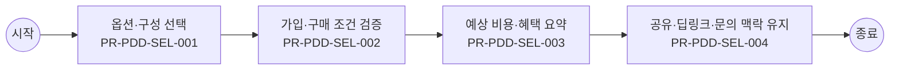

# Usecase: US-PDD-CUS-003 — 상품 구성 선택과 담기 준비

## Flowchart

> 단순 직렬 흐름. 분기·게이트웨이는 `00_INDEX.md` BPMN 다이어그램 참조.



## Process: PR-PDD-SEL-001 — 옵션·구성 선택 {#process-PR-PDD-SEL-001}

```yaml
프로세스_ID: PR-PDD-SEL-001
프로세스명: 옵션·구성 선택
설명: 고객이 색상, 용량, 요금제, 부가서비스, 프로그램, 혜택 구성을 선택한다.
관련_기능: [FN-PDD-OPTION-001, FN-PDD-COMBO-001]
```

| 항목 | 내용 |
| --- | --- |
| 액터 | 고객 |
| 진입 조건 | 고객가 상품 구성 선택과 담기 준비 업무를 시작하고 상품군, 고객 상태, 진입 채널, 선택 목적 중 최소 1개 기준이 확인된 경우 진입한다. |
| 종료 조건 | 옵션·구성 선택 결과가 성공, 제한, 보완 필요 중 하나로 확정되고 PR-PDD-SEL-002 가입·구매 조건 검증로 넘길 입력값과 판단 근거가 저장되면 종료한다. |
| 선행 프로세스 | 업무 진입 조건 충족 |
| 후행 프로세스 | PR-PDD-SEL-002 가입·구매 조건 검증 |

### Function: FN-PDD-OPTION-001

```yaml
기능_ID: FN-PDD-OPTION-001
기능명: 옵션·구성 선택 처리
설명: 색상, 용량, 약정, 요금제, 부가서비스, 선택형 혜택 구성을 선택 상태로 관리한다.
관련_정책_그룹: [PG-PDD-OPTION-001, PG-PDD-COMBO-001]
```

| 항목 | 내용 |
| --- | --- |
| 입력 정보 | 고객 가입 상태, 회선/요금제/권한/인증 상태 선택 옵션, 필수 구성, 동시 주문 가능 상품, 재고·배송 조건 담기 가능 여부와 장바구니·주문 전환 대상 정보 상품 관계, 중복 가입, 판매 상태, 제한 사유 정책 |
| 세부 기능 구성 | 색상·용량 약정 선택 혜택 선택 선택 상태 |
| 출력 정보 | 담기 가능 여부와 선택 구성 상태 수정 필요 옵션과 제한 사유 장바구니·주문·계속 탐색 전환값 상품 조합·재고·조건 판정 이력 |
| 처리 흐름 | (상태) 상품 구성 선택 → (액션) 옵션·구성 선택 처리 기준으로 옵션, 재고, 가입 조건, 상품 관계를 동시 검증 → (결과) 담기 가능, 보완 필요, 선택 불가 중 하나로 판정 (상태) 고객 조건 또는 선택값 변경 → (액션) 기존 선택 구성과 충돌 여부, 필수 구성 누락, 동시 주문 제한을 재확인 → (결과) 수정해야 할 항목과 유지 가능한 항목 분리 (상태) 담기 또는 다음 행동 요청 → (액션) 유효한 선택 구성만 상태 저장하고 장바구니·주문·계속 탐색 경로를 결정 → (결과) 고객 선택 맥락이 끊기지 않고 후속 업무로 전달 |
| 실패/예외 케이스 | 재고, 판매 상태, 가입 조건 중 하나라도 미확정이면 담기를 확정하지 않고 보완 가능한 항목을 안내한다. 선택 조합이 충돌하면 전체 초기화가 아니라 충돌 항목만 수정하도록 한다. 로그인·인증 후 복귀 시 기존 선택 구성이 사라지면 재선택 없이 복원 가능한 상태로 전환한다. |

#### Policy Group: PG-PDD-OPTION-001

```yaml
정책_ID: PG-PDD-OPTION-001
정책명: 옵션·구성 선택 정책
설명: 색상, 용량, 요금제, 부가서비스, 혜택 선택 기준을 정의한다.
```

| Policy Item ID | 정책 항목명 | 정책 항목 |
| --- | --- | --- |
| `PI-PDD-OPTION-001-01` | 옵션 선택 | 색상, 용량, 약정, 요금제, 부가서비스, 배송 유형은 선택 즉시 가격, 혜택, 재고, 가입 조건 변화를 재산정한다. |
| `PI-PDD-OPTION-001-02` | 선택형 혜택 | 여러 혜택 중 1개 또는 N개를 선택해야 하는 경우 선택 가능 기한, 선택 전 비교 정보, 선택 완료 상태, 재선택 가능 여부를 표시한다. |
| `PI-PDD-OPTION-001-03` | 그룹 상품 | 그룹 상품은 필수 구성과 선택 구성을 구분한다. 구성원 상태값과 그룹 상품 조건은 실시간 또는 수동 검증 결과를 기준으로 표시한다. 그룹상품 선택 시 고객은 그룹에 속한 상품과 구성원 조건을 확인한 뒤 담을 수 있어야 한다. |
| `PI-PDD-OPTION-001-04` | 가격 반영 | 옵션과 프로그램 선택에 따라 가격 또는 혜택이 바뀌면 고객 액션 시점에 즉시 반영한다. 재계산 중에는 이전 금액을 확정 금액처럼 표시하지 않는다. |
| `PI-PDD-OPTION-001-05` | 로밍 시작 옵션 | 로밍 상품은 데이터 용량, 자동개시·수동개시, 데이터 이용 안 함, 해지·차단·QoS 가능 여부를 고객이 같은 선택 흐름에서 확인할 수 있게 한다. |
| `PI-PDD-OPTION-001-06` | 인기 옵션 적용 | 통계 팝업이나 인기 옵션 안내에서 고객이 색상·용량을 선택하면 상품 상세의 현재 옵션에 즉시 반영한다. 반영 전 재고와 가격 변동 여부를 다시 확인한다. |

#### Policy Group: PG-PDD-COMBO-001

```yaml
정책_ID: PG-PDD-COMBO-001
정책명: 상품 조합·담기 가능성 정책
설명: 동시 주문, 중복 가입, 필수 구성, 담기 가능성 정책을 정의한다.
```

| Policy Item ID | 정책 항목명 | 정책 항목 |
| --- | --- | --- |
| `PI-PDD-COMBO-001-01` | 동시 주문 | 상품 유형별 동시 주문 가능 조합을 정책으로 정의한다. 단말+요금제+부가+구독은 허용 조합을 둘 수 있고, 단독 구매 상품은 함께 담기를 제한한다. |
| `PI-PDD-COMBO-001-02` | 중복가입 가능여부 확인 | 중복가입 가능여부 확인은 고객 회선과 계정 기준으로 수행한다. 중복 가입이 불가한 상품은 담기, 장바구니, 가입 단계에서 동일한 제한 사유를 표시한다. |
| `PI-PDD-COMBO-001-03` | 필수 구성 | 필수 옵션, 필수 요금제, 필수 프로그램, 그룹 구성 조건이 누락되면 담기를 제한한다. 고객에게 누락 항목과 대체 가능한 구성을 함께 제시한다. |
| `PI-PDD-COMBO-001-04` | 담기 판정 | 담기 가능 여부는 가입 가능 여부, 중복 보유, 선행 조건, 판매 상태, 재고·수량, 판매 기간, 채널 판매 가능성을 실행 시점에 재검증한다. |

### Function: FN-PDD-COMBO-001

```yaml
기능_ID: FN-PDD-COMBO-001
기능명: 상품 조합·프로그램 유효성 검증
설명: 단말, 요금제, 부가서비스, 구독, 혜택, 마케팅 프로그램 조합과 그룹상품 선택, 중복가입 가능여부 확인을 검증한다.
관련_정책_그룹: [PG-PDD-OPTION-001, PG-PDD-COMBO-001, PG-PDD-ELIG-001, PG-PDD-CATALOG-001, PG-PDD-FAIL-001]
```

| 항목 | 내용 |
| --- | --- |
| 입력 정보 | 고객 가입 상태, 회선/요금제/권한/인증 상태 선택 옵션, 필수 구성, 동시 주문 가능 상품, 재고·배송 조건 담기 가능 여부와 장바구니·주문 전환 대상 정보 상품 관계, 중복 가입, 판매 상태, 제한 사유 정책 |
| 세부 기능 구성 | 동시 주문 필수 구성 중복 불가 그룹 상품 중복가입 확인 그룹상품 선택 |
| 출력 정보 | 담기 가능 여부와 선택 구성 상태 수정 필요 옵션과 제한 사유 장바구니·주문·계속 탐색 전환값 상품 조합·재고·조건 판정 이력 |
| 처리 흐름 | (상태) 상품 구성 선택 → (액션) 상품 조합·프로그램 유효성 검증 기준으로 옵션, 재고, 가입 조건, 상품 관계를 동시 검증 → (결과) 담기 가능, 보완 필요, 선택 불가 중 하나로 판정 (상태) 고객 조건 또는 선택값 변경 → (액션) 기존 선택 구성과 충돌 여부, 필수 구성 누락, 동시 주문 제한을 재확인 → (결과) 수정해야 할 항목과 유지 가능한 항목 분리 (상태) 담기 또는 다음 행동 요청 → (액션) 유효한 선택 구성만 상태 저장하고 장바구니·주문·계속 탐색 경로를 결정 → (결과) 고객 선택 맥락이 끊기지 않고 후속 업무로 전달 |
| 실패/예외 케이스 | 재고, 판매 상태, 가입 조건 중 하나라도 미확정이면 담기를 확정하지 않고 보완 가능한 항목을 안내한다. 선택 조합이 충돌하면 전체 초기화가 아니라 충돌 항목만 수정하도록 한다. 로그인·인증 후 복귀 시 기존 선택 구성이 사라지면 재선택 없이 복원 가능한 상태로 전환한다. |

#### Policy Group: PG-PDD-OPTION-001

```yaml
정책_ID: PG-PDD-OPTION-001
정책명: 옵션·구성 선택 정책
설명: 색상, 용량, 요금제, 부가서비스, 혜택 선택 기준을 정의한다.
```

| Policy Item ID | 정책 항목명 | 정책 항목 |
| --- | --- | --- |
| `PI-PDD-OPTION-001-01` | 옵션 선택 | 색상, 용량, 약정, 요금제, 부가서비스, 배송 유형은 선택 즉시 가격, 혜택, 재고, 가입 조건 변화를 재산정한다. |
| `PI-PDD-OPTION-001-02` | 선택형 혜택 | 여러 혜택 중 1개 또는 N개를 선택해야 하는 경우 선택 가능 기한, 선택 전 비교 정보, 선택 완료 상태, 재선택 가능 여부를 표시한다. |
| `PI-PDD-OPTION-001-03` | 그룹 상품 | 그룹 상품은 필수 구성과 선택 구성을 구분한다. 구성원 상태값과 그룹 상품 조건은 실시간 또는 수동 검증 결과를 기준으로 표시한다. 그룹상품 선택 시 고객은 그룹에 속한 상품과 구성원 조건을 확인한 뒤 담을 수 있어야 한다. |
| `PI-PDD-OPTION-001-04` | 가격 반영 | 옵션과 프로그램 선택에 따라 가격 또는 혜택이 바뀌면 고객 액션 시점에 즉시 반영한다. 재계산 중에는 이전 금액을 확정 금액처럼 표시하지 않는다. |
| `PI-PDD-OPTION-001-05` | 로밍 시작 옵션 | 로밍 상품은 데이터 용량, 자동개시·수동개시, 데이터 이용 안 함, 해지·차단·QoS 가능 여부를 고객이 같은 선택 흐름에서 확인할 수 있게 한다. |
| `PI-PDD-OPTION-001-06` | 인기 옵션 적용 | 통계 팝업이나 인기 옵션 안내에서 고객이 색상·용량을 선택하면 상품 상세의 현재 옵션에 즉시 반영한다. 반영 전 재고와 가격 변동 여부를 다시 확인한다. |

#### Policy Group: PG-PDD-COMBO-001

```yaml
정책_ID: PG-PDD-COMBO-001
정책명: 상품 조합·담기 가능성 정책
설명: 동시 주문, 중복 가입, 필수 구성, 담기 가능성 정책을 정의한다.
```

| Policy Item ID | 정책 항목명 | 정책 항목 |
| --- | --- | --- |
| `PI-PDD-COMBO-001-01` | 동시 주문 | 상품 유형별 동시 주문 가능 조합을 정책으로 정의한다. 단말+요금제+부가+구독은 허용 조합을 둘 수 있고, 단독 구매 상품은 함께 담기를 제한한다. |
| `PI-PDD-COMBO-001-02` | 중복가입 가능여부 확인 | 중복가입 가능여부 확인은 고객 회선과 계정 기준으로 수행한다. 중복 가입이 불가한 상품은 담기, 장바구니, 가입 단계에서 동일한 제한 사유를 표시한다. |
| `PI-PDD-COMBO-001-03` | 필수 구성 | 필수 옵션, 필수 요금제, 필수 프로그램, 그룹 구성 조건이 누락되면 담기를 제한한다. 고객에게 누락 항목과 대체 가능한 구성을 함께 제시한다. |
| `PI-PDD-COMBO-001-04` | 담기 판정 | 담기 가능 여부는 가입 가능 여부, 중복 보유, 선행 조건, 판매 상태, 재고·수량, 판매 기간, 채널 판매 가능성을 실행 시점에 재검증한다. |

#### Policy Group: PG-PDD-ELIG-001

```yaml
정책_ID: PG-PDD-ELIG-001
정책명: 가입·구매 가능성 사전 안내 정책
설명: 고객 상태, 가입 조건, 구매 제한, 불가 사유 사전 고지 기준을 정의한다.
```

| Policy Item ID | 정책 항목명 | 정책 항목 |
| --- | --- | --- |
| `PI-PDD-ELIG-001-01` | 사전 판정 | 가입·구매 가능 여부는 연령, 회선, 고객 등급, 지역, 재고, 보유 상품, 판매 기간, 채널 판매 가능성을 기준으로 주문 진입 전 또는 담기 직전에 판정한다. |
| `PI-PDD-ELIG-001-02` | 불가 사유 | 상품 선택 불가 시 재고 부족, 옵션 상태, 가입 조건 불충족, 중복 가입, 선행 조건 미충족, 판매 중지 중 하나 이상의 사유와 해결 방법을 함께 표시한다. |
| `PI-PDD-ELIG-001-03` | 비회원 전환 | 비회원은 구매·가입·개통을 완료할 수 없다. 비로그인 고객이 담기 또는 구매를 시도하면 로그인과 본인확인이 필요한 이유와 전환 이점을 먼저 안내한다. |
| `PI-PDD-ELIG-001-04` | 제한 고지 | 결제수단, 포인트, 쿠폰, 할인, 가입 가능 시점, 예약 가능 시점의 제한은 상세와 담기 단계에서 사전 고지한다. 제한 조건이 바뀌면 기존 선택 상태에 즉시 반영한다. |
| `PI-PDD-ELIG-001-05` | 연령·기간 유효성 | 가입 제한 기준연령은 시작 나이와 종료 나이의 범위가 유효한 경우에만 저장한다. 판매 기간, 예약 가능 시점, 가입 가능 시점이 있는 상품은 주문 전에 제한 조건을 표시한다. |
| `PI-PDD-ELIG-001-06` | 묶음 해지 제약 | 패키지 상품 또는 묶음 혜택은 구성 혜택별 개별 해지 가능 여부를 가입 전에 안내한다. 묶음 단위로만 해지 가능한 경우 고객에게 해지 영향과 환불 기준 참조 경로를 함께 제공한다. |

#### Policy Group: PG-PDD-CATALOG-001

```yaml
정책_ID: PG-PDD-CATALOG-001
정책명: Product Catalog 연동 정책
설명: NOVA Product Catalog 기준 정보와 채널 표시·판정 연계 기준을 정의한다.
```

| Policy Item ID | 정책 항목명 | 정책 항목 |
| --- | --- | --- |
| `PI-PDD-CATALOG-001-01` | 상품 I/F | Product Catalog에서 상품, 마케팅, 서비스, 혜택, 정책, 가입조건, 가격 정보를 통합 수신한다. 채널은 원장 기준과 다른 임의 값을 표시하지 않는다. |
| `PI-PDD-CATALOG-001-02` | Spec/Item | Product Spec은 제공 단위, Item은 사용 단위로 구분한다. Item Type 관계가 있는 상품은 상세와 담기 모두에서 동일한 구성 관계를 사용한다. |
| `PI-PDD-CATALOG-001-03` | 상품 관계 | Product Offering과 마케팅 프로그램 관계는 동시 가입, 자동 가입, 자동 해지, 선가입·선해지 기준으로 판정한다. |
| `PI-PDD-CATALOG-001-04` | 정책 수신 | 가입 조건, 혜택 조건, 조합 정책, 제한 문구는 Product Catalog 또는 BSS 기준을 우선한다. 채널 보조 문구는 정책값을 덮어쓸 수 없다. |
| `PI-PDD-CATALOG-001-05` | 외부채널 연동 | 외부채널 상품 설정은 Product Catalog와 채널 운영값의 매핑을 기준으로 수신한다. 외부채널 또는 Product Catalog 연동 장애가 발생하면 고객 표시를 제한하거나 보조 안내로 전환하고, 채널 간 영향 확대 여부와 복구 결과를 이력으로 남긴다. |

#### Policy Group: PG-PDD-FAIL-001

```yaml
정책_ID: PG-PDD-FAIL-001
정책명: 불가·충돌·인증 복구 정책
설명: 선택 불가, 조합 충돌, 인증 필요, 실패 복구 기준을 정의한다.
```

| Policy Item ID | 정책 항목명 | 정책 항목 |
| --- | --- | --- |
| `PI-PDD-FAIL-001-01` | 불가 안내 | 선택 불가 또는 가입 불가가 발생하면 고객에게 상품, 옵션, 조건, 정책 중 어느 축에서 실패했는지 구분해 안내한다. 단순 오류 문구만 표시하는 것은 허용하지 않는다. |
| `PI-PDD-FAIL-001-02` | 충돌 복구 | 조합 충돌은 충돌 상품, 충돌 이유, 해제해야 할 항목, 대체 가능한 구성을 함께 제공한다. 고객이 수정하면 기존 비교·선택 상태로 복귀한다. |
| `PI-PDD-FAIL-001-03` | 인증 복귀 | 로그인, 회선 확인, 추가 인증이 필요하면 필요 사유를 먼저 설명한다. 인증 완료 후에는 고객이 선택한 상품, 옵션, 비교 조건, 이전 스크롤 위치 중 핵심 상태를 복원한다. |
| `PI-PDD-FAIL-001-04` | 대체 경로 | 담기 실패 시 대체 상품 보기, 조건 충족 방법 보기, 상담 연결, 나중에 다시 보기 중 최소 2개 이상의 후속 행동을 제공한다. |

## Process: PR-PDD-SEL-002 — 가입·구매 조건 검증 {#process-PR-PDD-SEL-002}

```yaml
프로세스_ID: PR-PDD-SEL-002
프로세스명: 가입·구매 조건 검증
설명: 채널이 선택 구성의 가입 가능성, 중복 보유, 선행 조건, 판매 가능 상태를 검증한다.
관련_기능: [FN-PDD-ELIG-001, FN-PDD-COMBO-001]
```

| 항목 | 내용 |
| --- | --- |
| 액터 | 고객 |
| 진입 조건 | PR-PDD-SEL-001 옵션·구성 선택 결과가 고객에게 표시되었고, 고객 또는 운영자가 다음 판단을 계속하기로 선택한 경우 진입한다. |
| 종료 조건 | 가입·구매 조건 검증 결과가 성공, 제한, 보완 필요 중 하나로 확정되고 PR-PDD-SEL-003 예상 비용·혜택 요약로 넘길 입력값과 판단 근거가 저장되면 종료한다. |
| 선행 프로세스 | PR-PDD-SEL-001 옵션·구성 선택 |
| 후행 프로세스 | PR-PDD-SEL-003 예상 비용·혜택 요약 |

### Function: FN-PDD-ELIG-001

```yaml
기능_ID: FN-PDD-ELIG-001
기능명: 고객 상태·가입 조건 판정
설명: 연령, 회선, 보유 상품, 등급, 지역, 가입 가능 요금제, 선행 조건을 판정한다.
관련_정책_그룹: [PG-PDD-ELIG-001, PG-PDD-CATALOG-001, PG-PDD-COMBO-001]
```

| 항목 | 내용 |
| --- | --- |
| 입력 정보 | 고객 가입 상태, 회선/요금제/권한/인증 상태 선택 옵션, 필수 구성, 동시 주문 가능 상품, 재고·배송 조건 담기 가능 여부와 장바구니·주문 전환 대상 정보 상품 관계, 중복 가입, 판매 상태, 제한 사유 정책 |
| 세부 기능 구성 | 고객 상태 가입 조건 불가 사유 대체 경로 |
| 출력 정보 | 담기 가능 여부와 선택 구성 상태 수정 필요 옵션과 제한 사유 장바구니·주문·계속 탐색 전환값 상품 조합·재고·조건 판정 이력 |
| 처리 흐름 | (상태) 상품 구성 선택 → (액션) 고객 상태·가입 조건 판정 기준으로 옵션, 재고, 가입 조건, 상품 관계를 동시 검증 → (결과) 담기 가능, 보완 필요, 선택 불가 중 하나로 판정 (상태) 고객 조건 또는 선택값 변경 → (액션) 기존 선택 구성과 충돌 여부, 필수 구성 누락, 동시 주문 제한을 재확인 → (결과) 수정해야 할 항목과 유지 가능한 항목 분리 (상태) 담기 또는 다음 행동 요청 → (액션) 유효한 선택 구성만 상태 저장하고 장바구니·주문·계속 탐색 경로를 결정 → (결과) 고객 선택 맥락이 끊기지 않고 후속 업무로 전달 |
| 실패/예외 케이스 | 재고, 판매 상태, 가입 조건 중 하나라도 미확정이면 담기를 확정하지 않고 보완 가능한 항목을 안내한다. 선택 조합이 충돌하면 전체 초기화가 아니라 충돌 항목만 수정하도록 한다. 로그인·인증 후 복귀 시 기존 선택 구성이 사라지면 재선택 없이 복원 가능한 상태로 전환한다. |

#### Policy Group: PG-PDD-ELIG-001

```yaml
정책_ID: PG-PDD-ELIG-001
정책명: 가입·구매 가능성 사전 안내 정책
설명: 고객 상태, 가입 조건, 구매 제한, 불가 사유 사전 고지 기준을 정의한다.
```

| Policy Item ID | 정책 항목명 | 정책 항목 |
| --- | --- | --- |
| `PI-PDD-ELIG-001-01` | 사전 판정 | 가입·구매 가능 여부는 연령, 회선, 고객 등급, 지역, 재고, 보유 상품, 판매 기간, 채널 판매 가능성을 기준으로 주문 진입 전 또는 담기 직전에 판정한다. |
| `PI-PDD-ELIG-001-02` | 불가 사유 | 상품 선택 불가 시 재고 부족, 옵션 상태, 가입 조건 불충족, 중복 가입, 선행 조건 미충족, 판매 중지 중 하나 이상의 사유와 해결 방법을 함께 표시한다. |
| `PI-PDD-ELIG-001-03` | 비회원 전환 | 비회원은 구매·가입·개통을 완료할 수 없다. 비로그인 고객이 담기 또는 구매를 시도하면 로그인과 본인확인이 필요한 이유와 전환 이점을 먼저 안내한다. |
| `PI-PDD-ELIG-001-04` | 제한 고지 | 결제수단, 포인트, 쿠폰, 할인, 가입 가능 시점, 예약 가능 시점의 제한은 상세와 담기 단계에서 사전 고지한다. 제한 조건이 바뀌면 기존 선택 상태에 즉시 반영한다. |
| `PI-PDD-ELIG-001-05` | 연령·기간 유효성 | 가입 제한 기준연령은 시작 나이와 종료 나이의 범위가 유효한 경우에만 저장한다. 판매 기간, 예약 가능 시점, 가입 가능 시점이 있는 상품은 주문 전에 제한 조건을 표시한다. |
| `PI-PDD-ELIG-001-06` | 묶음 해지 제약 | 패키지 상품 또는 묶음 혜택은 구성 혜택별 개별 해지 가능 여부를 가입 전에 안내한다. 묶음 단위로만 해지 가능한 경우 고객에게 해지 영향과 환불 기준 참조 경로를 함께 제공한다. |

#### Policy Group: PG-PDD-CATALOG-001

```yaml
정책_ID: PG-PDD-CATALOG-001
정책명: Product Catalog 연동 정책
설명: NOVA Product Catalog 기준 정보와 채널 표시·판정 연계 기준을 정의한다.
```

| Policy Item ID | 정책 항목명 | 정책 항목 |
| --- | --- | --- |
| `PI-PDD-CATALOG-001-01` | 상품 I/F | Product Catalog에서 상품, 마케팅, 서비스, 혜택, 정책, 가입조건, 가격 정보를 통합 수신한다. 채널은 원장 기준과 다른 임의 값을 표시하지 않는다. |
| `PI-PDD-CATALOG-001-02` | Spec/Item | Product Spec은 제공 단위, Item은 사용 단위로 구분한다. Item Type 관계가 있는 상품은 상세와 담기 모두에서 동일한 구성 관계를 사용한다. |
| `PI-PDD-CATALOG-001-03` | 상품 관계 | Product Offering과 마케팅 프로그램 관계는 동시 가입, 자동 가입, 자동 해지, 선가입·선해지 기준으로 판정한다. |
| `PI-PDD-CATALOG-001-04` | 정책 수신 | 가입 조건, 혜택 조건, 조합 정책, 제한 문구는 Product Catalog 또는 BSS 기준을 우선한다. 채널 보조 문구는 정책값을 덮어쓸 수 없다. |
| `PI-PDD-CATALOG-001-05` | 외부채널 연동 | 외부채널 상품 설정은 Product Catalog와 채널 운영값의 매핑을 기준으로 수신한다. 외부채널 또는 Product Catalog 연동 장애가 발생하면 고객 표시를 제한하거나 보조 안내로 전환하고, 채널 간 영향 확대 여부와 복구 결과를 이력으로 남긴다. |

#### Policy Group: PG-PDD-COMBO-001

```yaml
정책_ID: PG-PDD-COMBO-001
정책명: 상품 조합·담기 가능성 정책
설명: 동시 주문, 중복 가입, 필수 구성, 담기 가능성 정책을 정의한다.
```

| Policy Item ID | 정책 항목명 | 정책 항목 |
| --- | --- | --- |
| `PI-PDD-COMBO-001-01` | 동시 주문 | 상품 유형별 동시 주문 가능 조합을 정책으로 정의한다. 단말+요금제+부가+구독은 허용 조합을 둘 수 있고, 단독 구매 상품은 함께 담기를 제한한다. |
| `PI-PDD-COMBO-001-02` | 중복가입 가능여부 확인 | 중복가입 가능여부 확인은 고객 회선과 계정 기준으로 수행한다. 중복 가입이 불가한 상품은 담기, 장바구니, 가입 단계에서 동일한 제한 사유를 표시한다. |
| `PI-PDD-COMBO-001-03` | 필수 구성 | 필수 옵션, 필수 요금제, 필수 프로그램, 그룹 구성 조건이 누락되면 담기를 제한한다. 고객에게 누락 항목과 대체 가능한 구성을 함께 제시한다. |
| `PI-PDD-COMBO-001-04` | 담기 판정 | 담기 가능 여부는 가입 가능 여부, 중복 보유, 선행 조건, 판매 상태, 재고·수량, 판매 기간, 채널 판매 가능성을 실행 시점에 재검증한다. |

### Function: FN-PDD-COMBO-001

```yaml
기능_ID: FN-PDD-COMBO-001
기능명: 상품 조합·프로그램 유효성 검증
설명: 단말, 요금제, 부가서비스, 구독, 혜택, 마케팅 프로그램 조합과 그룹상품 선택, 중복가입 가능여부 확인을 검증한다.
관련_정책_그룹: [PG-PDD-OPTION-001, PG-PDD-COMBO-001, PG-PDD-ELIG-001, PG-PDD-CATALOG-001, PG-PDD-FAIL-001]
```

| 항목 | 내용 |
| --- | --- |
| 입력 정보 | 고객 가입 상태, 회선/요금제/권한/인증 상태 선택 옵션, 필수 구성, 동시 주문 가능 상품, 재고·배송 조건 담기 가능 여부와 장바구니·주문 전환 대상 정보 상품 관계, 중복 가입, 판매 상태, 제한 사유 정책 |
| 세부 기능 구성 | 동시 주문 필수 구성 중복 불가 그룹 상품 중복가입 확인 그룹상품 선택 |
| 출력 정보 | 담기 가능 여부와 선택 구성 상태 수정 필요 옵션과 제한 사유 장바구니·주문·계속 탐색 전환값 상품 조합·재고·조건 판정 이력 |
| 처리 흐름 | (상태) 상품 구성 선택 → (액션) 상품 조합·프로그램 유효성 검증 기준으로 옵션, 재고, 가입 조건, 상품 관계를 동시 검증 → (결과) 담기 가능, 보완 필요, 선택 불가 중 하나로 판정 (상태) 고객 조건 또는 선택값 변경 → (액션) 기존 선택 구성과 충돌 여부, 필수 구성 누락, 동시 주문 제한을 재확인 → (결과) 수정해야 할 항목과 유지 가능한 항목 분리 (상태) 담기 또는 다음 행동 요청 → (액션) 유효한 선택 구성만 상태 저장하고 장바구니·주문·계속 탐색 경로를 결정 → (결과) 고객 선택 맥락이 끊기지 않고 후속 업무로 전달 |
| 실패/예외 케이스 | 재고, 판매 상태, 가입 조건 중 하나라도 미확정이면 담기를 확정하지 않고 보완 가능한 항목을 안내한다. 선택 조합이 충돌하면 전체 초기화가 아니라 충돌 항목만 수정하도록 한다. 로그인·인증 후 복귀 시 기존 선택 구성이 사라지면 재선택 없이 복원 가능한 상태로 전환한다. |

#### Policy Group: PG-PDD-OPTION-001

```yaml
정책_ID: PG-PDD-OPTION-001
정책명: 옵션·구성 선택 정책
설명: 색상, 용량, 요금제, 부가서비스, 혜택 선택 기준을 정의한다.
```

| Policy Item ID | 정책 항목명 | 정책 항목 |
| --- | --- | --- |
| `PI-PDD-OPTION-001-01` | 옵션 선택 | 색상, 용량, 약정, 요금제, 부가서비스, 배송 유형은 선택 즉시 가격, 혜택, 재고, 가입 조건 변화를 재산정한다. |
| `PI-PDD-OPTION-001-02` | 선택형 혜택 | 여러 혜택 중 1개 또는 N개를 선택해야 하는 경우 선택 가능 기한, 선택 전 비교 정보, 선택 완료 상태, 재선택 가능 여부를 표시한다. |
| `PI-PDD-OPTION-001-03` | 그룹 상품 | 그룹 상품은 필수 구성과 선택 구성을 구분한다. 구성원 상태값과 그룹 상품 조건은 실시간 또는 수동 검증 결과를 기준으로 표시한다. 그룹상품 선택 시 고객은 그룹에 속한 상품과 구성원 조건을 확인한 뒤 담을 수 있어야 한다. |
| `PI-PDD-OPTION-001-04` | 가격 반영 | 옵션과 프로그램 선택에 따라 가격 또는 혜택이 바뀌면 고객 액션 시점에 즉시 반영한다. 재계산 중에는 이전 금액을 확정 금액처럼 표시하지 않는다. |
| `PI-PDD-OPTION-001-05` | 로밍 시작 옵션 | 로밍 상품은 데이터 용량, 자동개시·수동개시, 데이터 이용 안 함, 해지·차단·QoS 가능 여부를 고객이 같은 선택 흐름에서 확인할 수 있게 한다. |
| `PI-PDD-OPTION-001-06` | 인기 옵션 적용 | 통계 팝업이나 인기 옵션 안내에서 고객이 색상·용량을 선택하면 상품 상세의 현재 옵션에 즉시 반영한다. 반영 전 재고와 가격 변동 여부를 다시 확인한다. |

#### Policy Group: PG-PDD-COMBO-001

```yaml
정책_ID: PG-PDD-COMBO-001
정책명: 상품 조합·담기 가능성 정책
설명: 동시 주문, 중복 가입, 필수 구성, 담기 가능성 정책을 정의한다.
```

| Policy Item ID | 정책 항목명 | 정책 항목 |
| --- | --- | --- |
| `PI-PDD-COMBO-001-01` | 동시 주문 | 상품 유형별 동시 주문 가능 조합을 정책으로 정의한다. 단말+요금제+부가+구독은 허용 조합을 둘 수 있고, 단독 구매 상품은 함께 담기를 제한한다. |
| `PI-PDD-COMBO-001-02` | 중복가입 가능여부 확인 | 중복가입 가능여부 확인은 고객 회선과 계정 기준으로 수행한다. 중복 가입이 불가한 상품은 담기, 장바구니, 가입 단계에서 동일한 제한 사유를 표시한다. |
| `PI-PDD-COMBO-001-03` | 필수 구성 | 필수 옵션, 필수 요금제, 필수 프로그램, 그룹 구성 조건이 누락되면 담기를 제한한다. 고객에게 누락 항목과 대체 가능한 구성을 함께 제시한다. |
| `PI-PDD-COMBO-001-04` | 담기 판정 | 담기 가능 여부는 가입 가능 여부, 중복 보유, 선행 조건, 판매 상태, 재고·수량, 판매 기간, 채널 판매 가능성을 실행 시점에 재검증한다. |

#### Policy Group: PG-PDD-ELIG-001

```yaml
정책_ID: PG-PDD-ELIG-001
정책명: 가입·구매 가능성 사전 안내 정책
설명: 고객 상태, 가입 조건, 구매 제한, 불가 사유 사전 고지 기준을 정의한다.
```

| Policy Item ID | 정책 항목명 | 정책 항목 |
| --- | --- | --- |
| `PI-PDD-ELIG-001-01` | 사전 판정 | 가입·구매 가능 여부는 연령, 회선, 고객 등급, 지역, 재고, 보유 상품, 판매 기간, 채널 판매 가능성을 기준으로 주문 진입 전 또는 담기 직전에 판정한다. |
| `PI-PDD-ELIG-001-02` | 불가 사유 | 상품 선택 불가 시 재고 부족, 옵션 상태, 가입 조건 불충족, 중복 가입, 선행 조건 미충족, 판매 중지 중 하나 이상의 사유와 해결 방법을 함께 표시한다. |
| `PI-PDD-ELIG-001-03` | 비회원 전환 | 비회원은 구매·가입·개통을 완료할 수 없다. 비로그인 고객이 담기 또는 구매를 시도하면 로그인과 본인확인이 필요한 이유와 전환 이점을 먼저 안내한다. |
| `PI-PDD-ELIG-001-04` | 제한 고지 | 결제수단, 포인트, 쿠폰, 할인, 가입 가능 시점, 예약 가능 시점의 제한은 상세와 담기 단계에서 사전 고지한다. 제한 조건이 바뀌면 기존 선택 상태에 즉시 반영한다. |
| `PI-PDD-ELIG-001-05` | 연령·기간 유효성 | 가입 제한 기준연령은 시작 나이와 종료 나이의 범위가 유효한 경우에만 저장한다. 판매 기간, 예약 가능 시점, 가입 가능 시점이 있는 상품은 주문 전에 제한 조건을 표시한다. |
| `PI-PDD-ELIG-001-06` | 묶음 해지 제약 | 패키지 상품 또는 묶음 혜택은 구성 혜택별 개별 해지 가능 여부를 가입 전에 안내한다. 묶음 단위로만 해지 가능한 경우 고객에게 해지 영향과 환불 기준 참조 경로를 함께 제공한다. |

#### Policy Group: PG-PDD-CATALOG-001

```yaml
정책_ID: PG-PDD-CATALOG-001
정책명: Product Catalog 연동 정책
설명: NOVA Product Catalog 기준 정보와 채널 표시·판정 연계 기준을 정의한다.
```

| Policy Item ID | 정책 항목명 | 정책 항목 |
| --- | --- | --- |
| `PI-PDD-CATALOG-001-01` | 상품 I/F | Product Catalog에서 상품, 마케팅, 서비스, 혜택, 정책, 가입조건, 가격 정보를 통합 수신한다. 채널은 원장 기준과 다른 임의 값을 표시하지 않는다. |
| `PI-PDD-CATALOG-001-02` | Spec/Item | Product Spec은 제공 단위, Item은 사용 단위로 구분한다. Item Type 관계가 있는 상품은 상세와 담기 모두에서 동일한 구성 관계를 사용한다. |
| `PI-PDD-CATALOG-001-03` | 상품 관계 | Product Offering과 마케팅 프로그램 관계는 동시 가입, 자동 가입, 자동 해지, 선가입·선해지 기준으로 판정한다. |
| `PI-PDD-CATALOG-001-04` | 정책 수신 | 가입 조건, 혜택 조건, 조합 정책, 제한 문구는 Product Catalog 또는 BSS 기준을 우선한다. 채널 보조 문구는 정책값을 덮어쓸 수 없다. |
| `PI-PDD-CATALOG-001-05` | 외부채널 연동 | 외부채널 상품 설정은 Product Catalog와 채널 운영값의 매핑을 기준으로 수신한다. 외부채널 또는 Product Catalog 연동 장애가 발생하면 고객 표시를 제한하거나 보조 안내로 전환하고, 채널 간 영향 확대 여부와 복구 결과를 이력으로 남긴다. |

#### Policy Group: PG-PDD-FAIL-001

```yaml
정책_ID: PG-PDD-FAIL-001
정책명: 불가·충돌·인증 복구 정책
설명: 선택 불가, 조합 충돌, 인증 필요, 실패 복구 기준을 정의한다.
```

| Policy Item ID | 정책 항목명 | 정책 항목 |
| --- | --- | --- |
| `PI-PDD-FAIL-001-01` | 불가 안내 | 선택 불가 또는 가입 불가가 발생하면 고객에게 상품, 옵션, 조건, 정책 중 어느 축에서 실패했는지 구분해 안내한다. 단순 오류 문구만 표시하는 것은 허용하지 않는다. |
| `PI-PDD-FAIL-001-02` | 충돌 복구 | 조합 충돌은 충돌 상품, 충돌 이유, 해제해야 할 항목, 대체 가능한 구성을 함께 제공한다. 고객이 수정하면 기존 비교·선택 상태로 복귀한다. |
| `PI-PDD-FAIL-001-03` | 인증 복귀 | 로그인, 회선 확인, 추가 인증이 필요하면 필요 사유를 먼저 설명한다. 인증 완료 후에는 고객이 선택한 상품, 옵션, 비교 조건, 이전 스크롤 위치 중 핵심 상태를 복원한다. |
| `PI-PDD-FAIL-001-04` | 대체 경로 | 담기 실패 시 대체 상품 보기, 조건 충족 방법 보기, 상담 연결, 나중에 다시 보기 중 최소 2개 이상의 후속 행동을 제공한다. |

## Process: PR-PDD-SEL-003 — 예상 비용·혜택 요약 {#process-PR-PDD-SEL-003}

```yaml
프로세스_ID: PR-PDD-SEL-003
프로세스명: 예상 비용·혜택 요약
설명: 고객이 담기 전 예상 월 이용금액, 1회성 비용, 적용·제외 혜택, 주요 유의사항을 확인한다.
관련_기능: [FN-PDD-PRICE-001, FN-PDD-BENEFIT-001]
```

| 항목 | 내용 |
| --- | --- |
| 액터 | 고객 |
| 진입 조건 | PR-PDD-SEL-002 가입·구매 조건 검증 결과가 고객에게 표시되었고, 고객 또는 운영자가 다음 판단을 계속하기로 선택한 경우 진입한다. |
| 종료 조건 | 예상 비용·혜택 요약 결과가 성공, 제한, 보완 필요 중 하나로 확정되고 PR-PDD-SEL-004 공유·딥링크·문의 맥락 유지로 넘길 입력값과 판단 근거가 저장되면 종료한다. |
| 선행 프로세스 | PR-PDD-SEL-002 가입·구매 조건 검증 |
| 후행 프로세스 | PR-PDD-SEL-004 공유·딥링크·문의 맥락 유지 |

### Function: FN-PDD-PRICE-001

```yaml
기능_ID: FN-PDD-PRICE-001
기능명: 예상 부담·혜택 요약 계산
설명: 선택 상품과 고객 조건을 기준으로 월 예상액, 1회성 비용, 적용·제외 혜택, 지원금 차이를 계산해 예상 부담 결과를 생성한다.
관련_정책_그룹: [PG-PDD-COMPARE-001, PG-PDD-PRICE-001, PG-PDD-SAVE-001]
```

| 항목 | 내용 |
| --- | --- |
| 입력 정보 | 상품 ID, 상품군, 판매 상태, 대표 가격·혜택 정보 고객 진입 경로와 조회 세션 정보 상품 상세 템플릿의 필수 섹션과 노출 우선순위 고객에게 숨겨야 할 내부 코드·운영 문구 제외 기준 |
| 세부 기능 구성 | 월 예상액 1회성 비용 제외 혜택 공시지원금 |
| 출력 정보 | 고객용 상품 요약과 상세 섹션 노출 결과 상품군별 필수 정보 표시 여부 미노출·대체 안내 사유 상품 상세 조회와 비교·담기 전환 이력 |
| 처리 흐름 | (상태) 상품 상세 진입 → (액션) 예상 부담·혜택 요약 계산에 필요한 상품군·판매상태·핵심 속성을 원장 기준으로 조립 → (결과) 고객이 상품 목적과 가입 가능성을 먼저 이해할 수 있는 요약 영역 구성 (상태) 추가 설명 확인 → (액션) 미디어, 스펙, 후기, Q&A, 유의사항을 고객 의사결정 순서로 재배치 → (결과) 상품 이해에 필요한 정보와 내부 운영 문구를 분리 표시 (상태) 정보 부족 또는 노출 제한 발생 → (액션) 대체 설명, 상담 연결, 미노출 사유를 정책 기준으로 선택 → (결과) 빈 화면 없이 다음 탐색 또는 문의 경로 제공 |
| 실패/예외 케이스 | 상품 기준 정보가 누락되면 해당 섹션을 숨기지 않고 보완 필요 또는 상담 가능 경로를 안내한다. 내부 운영 코드나 원장 필드명이 고객 문구로 노출되면 배포를 제한한다. 미디어·후기·스펙 로딩 실패 시 핵심 요약과 가격·조건 판단은 유지한다. |

#### Policy Group: PG-PDD-COMPARE-001

```yaml
정책_ID: PG-PDD-COMPARE-001
정책명: 비교·추천·AI 요약 정책
설명: 상품 비교, AI 요약, 추천, 후기 요약, atomic view 기준을 정의한다.
```

| Policy Item ID | 정책 항목명 | 정책 항목 |
| --- | --- | --- |
| `PI-PDD-COMPARE-001-01` | 비교 기준 | 비교표는 상품군별 표준 속성, 단위, 용어, 노출 우선순위를 따른다. 요금제, 로밍, 약정, 보험, 웨이브, 단말 비교는 상품군별 필수 비교 항목을 다르게 둔다. |
| `PI-PDD-COMPARE-001-02` | AI 요약 | 상품 핵심 특징 AI 요약은 원장 정보 상위에 제공하되 생성 기준, 반영 시점, 요약 대상 범위, 원문 이동 경로를 함께 표시한다. |
| `PI-PDD-COMPARE-001-03` | 추천 근거 | AI 추천은 고객의 가입 정보, 데이터 사용량, 결합 여부, 보유 혜택, 월 예상 부담 중 사용한 기준을 표시한다. 고객이 조건을 수정하면 추천 결과를 재탐색할 수 있어야 한다. |
| `PI-PDD-COMPARE-001-04` | 후기 요약 | 상품 구매 후기 AI 요약은 장점과 단점을 균형 있게 제공한다. 요약만으로 판단하지 않도록 원문 후기, 평점 세부, Q&A로 이동할 수 있게 한다. |
| `PI-PDD-COMPARE-001-05` | atomic view | 상품 상세 AI atomic view는 고객 세그먼트, 가입·해지 맥락, 현재 상태에 맞춰 원장 정보를 재조립하되 원장 값과 다르게 표현할 수 없다. |
| `PI-PDD-COMPARE-001-06` | 상품군별 비교 템플릿 | 요금제, 로밍, 약정, 보험, 웨이브, 단말 비교는 각 상품군의 필수 비교 속성을 다르게 둔다. BSS 또는 Product Catalog에서 제공한 기준값을 사용하고 고객이 조건을 수정하면 비교 결과를 다시 산정한다. |
| `PI-PDD-COMPARE-001-07` | 대체 옵션 추천 | 선택한 색상·용량이 품절 또는 일시품절이면 재고가 있는 대체 색상·용량, 입고 알림, 다른 상품 비교 중 하나 이상을 제공한다. 대체 추천은 재고 기준 시각을 함께 표시한다. |

#### Policy Group: PG-PDD-PRICE-001

```yaml
정책_ID: PG-PDD-PRICE-001
정책명: 가격·혜택·가치 표시 정책
설명: 가격, 할인, 혜택, 예상 부담, 마케팅 정보 표시 기준을 정의한다.
```

| Policy Item ID | 정책 항목명 | 정책 항목 |
| --- | --- | --- |
| `PI-PDD-PRICE-001-01` | 가격 기준 | 가격은 정가, 할인가, 실구매가, 예상 절감, 월 기준, 1회성 비용을 구분한다. 고객 상태가 반영된 실구매가는 담기 전까지 최신 조건으로 재산정한다. |
| `PI-PDD-PRICE-001-02` | 혜택 분리 | 쿠폰, 포인트, 제휴 혜택, 사은품, 마케팅 프로그램 혜택은 혜택별 적용 조건, 기간, 사용처, 제외 사유를 분리해 표시한다. 중복 적용 불가 혜택은 불가 사유를 함께 표시한다. |
| `PI-PDD-PRICE-001-03` | 공시지원금 | 단말 상품은 출고가, 공시지원금, 선택약정 할인 적용가, 약정 기간 차이를 비교 가능한 단위로 제공한다. 공시지원금 고지 기준은 고객이 담기 전 확인 가능한 위치에 둔다. |
| `PI-PDD-PRICE-001-04` | 마케팅 정보 | 제휴카드 할인, 사은품, 구매 유도 혜택은 적용 조건, 유지 조건, 제외 조건을 함께 표시한다. 마케팅 문구가 가격 또는 가입 가능성을 오인하게 하면 노출을 제한한다. |
| `PI-PDD-PRICE-001-05` | 실사용 빈도 가치 | 구독·혜택성 상품은 월 N회 사용 시 구독료 이상의 가치처럼 고객이 이해할 수 있는 실사용 빈도 예시를 제공한다. 예시는 과장 없이 적용 조건과 제외 조건을 함께 표시한다. |
| `PI-PDD-PRICE-001-06` | 선물가 문구 | 일반 가격과 동일한 선물가는 별도 선물가로 강조하지 않는다. 고객에게 가격 차이가 있는 것처럼 오인될 수 있는 툴팁이나 문구는 노출하지 않는다. |
| `PI-PDD-PRICE-001-07` | 구독가 비교 | 기존 일반 구독가와 T우주 또는 채널 내 구독가 혜택을 비교할 때는 월 기준 금액, 할인 기간, 할인 종료 후 금액, 적용 제외 조건을 함께 표시한다. |

#### Policy Group: PG-PDD-SAVE-001

```yaml
정책_ID: PG-PDD-SAVE-001
정책명: 담기 실행·다음 행동 정책
설명: 담기 실행, 상태 저장, 완료 후 다음 행동, 주문 전환 기준을 정의한다.
```

| Policy Item ID | 정책 항목명 | 정책 항목 |
| --- | --- | --- |
| `PI-PDD-SAVE-001-01` | 담기 저장 | 담기 성공 시 상품, 옵션, 프로그램, 혜택, 예상 비용, 판정 결과, 기준 시각을 저장한다. 동일 요청은 멱등 키 또는 동일 고객·상품·옵션·기준 시각으로 중복 요청 여부를 확인하고, 중복 요청이면 새 건을 만들지 않고 기존 담기 상태를 갱신한다. |
| `PI-PDD-SAVE-001-02` | 다음 행동 | 담기 완료 후 계속 탐색, 장바구니 이동, 바로 신청, 비교 계속하기 중 최소 3개 행동을 제공한다. 행동별로 현재 선택 기준의 핵심 혜택 또는 주의사항을 짧게 표시한다. |
| `PI-PDD-SAVE-001-03` | 주문 전환 | 바로 신청 또는 주문 전환 시 상품 상태, 가격, 재고, 혜택, 가입 가능성은 다시 확인한다. 변경이 있으면 변경 전후와 고객 선택지를 안내한다. |
| `PI-PDD-SAVE-001-04` | 재검증 | 담기 이후 장바구니 또는 주문으로 넘어갈 때 10분 이상 경과했거나 상품 상태가 바뀐 경우 재검증을 수행한다. 재검증 실패 시 담기 완료 상태는 유지하되 주문 전환은 제한한다. |
| `PI-PDD-SAVE-001-05` | CTA 의미 구분 | 담기와 구독하기는 장바구니 또는 신청 준비 단계로, 바로 결제하기는 결제 진입으로 구분한다. 상품 유형별 CTA 명칭과 다음 단계는 고객에게 혼동 없이 안내해야 한다. |
| `PI-PDD-SAVE-001-06` | 고객 표시 상태와 내부 상태 구분 | 고객 표시 상태는 탐색 가능, 담기 완료, 주문 전환 가능, 선택 불가처럼 고객 행동을 결정하는 문구로 관리한다. 내부 상태는 조건 확인 필요, 조합 충돌, 재고 부족, 인증 필요, 운영 반영 대기로 구분하고, 고객 행동을 제한할 때만 표시 상태를 변경한다. |

### Function: FN-PDD-BENEFIT-001

```yaml
기능_ID: FN-PDD-BENEFIT-001
기능명: 혜택·가격·가치 산정 표시
설명: 정가, 할인가, 실구매가, 예상 절감, 혜택 구성과 적용 조건을 산정해 표시한다.
관련_정책_그룹: [PG-PDD-PRICE-001, PG-PDD-ELIG-001, PG-PDD-SAVE-001]
```

| 항목 | 내용 |
| --- | --- |
| 입력 정보 | 정가, 할인, 약정, 혜택, 포인트, 사은품 적용 후보 고객 유형, 회선 상태, 보유 상품, 적용 가능 프로모션 예상 월 부담액과 1회성 비용 산정 기준 가격 변동, 혜택 제외, 유의사항 고지 기준 |
| 세부 기능 구성 | 정가·할인가 실구매가 예상 절감 혜택 상세 실사용 빈도 예시 |
| 출력 정보 | 예상 부담액, 할인·혜택 적용 결과 혜택 제외 또는 중복 제한 사유 고객 고지용 유의사항 가격·혜택 산정 이력 |
| 처리 흐름 | (상태) 가격·혜택 확인 요청 → (액션) 고객 상태와 상품 조건 기준으로 정가, 할인, 혜택, 예상 부담액을 산정 → (결과) 고객에게 적용 가능 금액과 제외 사유를 구분 표시 (상태) 혜택 조합 변경 → (액션) 중복 적용, 우선순위, 사은품·포인트·제휴카드 조건을 재계산 → (결과) 담기 전 예상 비용과 유의사항 갱신 (상태) 산정 근거 부족 또는 혜택 만료 → (액션) 미적용 사유와 실제 청구 차이 가능성을 고지 → (결과) 고객 오인 없이 비교·담기 판단 가능 |
| 실패/예외 케이스 | 혜택 산정 결과가 원장 또는 프로모션 기간과 불일치하면 예상 금액 표시를 보류하고 사유를 남긴다. 고객 조건을 확인할 수 없으면 확정 금액이 아니라 예상 범위와 확인 필요 항목으로 표시한다. 혜택 만료·소진·중복 불가가 발생하면 담기 전에 미적용 사유를 고지한다. |

#### Policy Group: PG-PDD-PRICE-001

```yaml
정책_ID: PG-PDD-PRICE-001
정책명: 가격·혜택·가치 표시 정책
설명: 가격, 할인, 혜택, 예상 부담, 마케팅 정보 표시 기준을 정의한다.
```

| Policy Item ID | 정책 항목명 | 정책 항목 |
| --- | --- | --- |
| `PI-PDD-PRICE-001-01` | 가격 기준 | 가격은 정가, 할인가, 실구매가, 예상 절감, 월 기준, 1회성 비용을 구분한다. 고객 상태가 반영된 실구매가는 담기 전까지 최신 조건으로 재산정한다. |
| `PI-PDD-PRICE-001-02` | 혜택 분리 | 쿠폰, 포인트, 제휴 혜택, 사은품, 마케팅 프로그램 혜택은 혜택별 적용 조건, 기간, 사용처, 제외 사유를 분리해 표시한다. 중복 적용 불가 혜택은 불가 사유를 함께 표시한다. |
| `PI-PDD-PRICE-001-03` | 공시지원금 | 단말 상품은 출고가, 공시지원금, 선택약정 할인 적용가, 약정 기간 차이를 비교 가능한 단위로 제공한다. 공시지원금 고지 기준은 고객이 담기 전 확인 가능한 위치에 둔다. |
| `PI-PDD-PRICE-001-04` | 마케팅 정보 | 제휴카드 할인, 사은품, 구매 유도 혜택은 적용 조건, 유지 조건, 제외 조건을 함께 표시한다. 마케팅 문구가 가격 또는 가입 가능성을 오인하게 하면 노출을 제한한다. |
| `PI-PDD-PRICE-001-05` | 실사용 빈도 가치 | 구독·혜택성 상품은 월 N회 사용 시 구독료 이상의 가치처럼 고객이 이해할 수 있는 실사용 빈도 예시를 제공한다. 예시는 과장 없이 적용 조건과 제외 조건을 함께 표시한다. |
| `PI-PDD-PRICE-001-06` | 선물가 문구 | 일반 가격과 동일한 선물가는 별도 선물가로 강조하지 않는다. 고객에게 가격 차이가 있는 것처럼 오인될 수 있는 툴팁이나 문구는 노출하지 않는다. |
| `PI-PDD-PRICE-001-07` | 구독가 비교 | 기존 일반 구독가와 T우주 또는 채널 내 구독가 혜택을 비교할 때는 월 기준 금액, 할인 기간, 할인 종료 후 금액, 적용 제외 조건을 함께 표시한다. |

#### Policy Group: PG-PDD-ELIG-001

```yaml
정책_ID: PG-PDD-ELIG-001
정책명: 가입·구매 가능성 사전 안내 정책
설명: 고객 상태, 가입 조건, 구매 제한, 불가 사유 사전 고지 기준을 정의한다.
```

| Policy Item ID | 정책 항목명 | 정책 항목 |
| --- | --- | --- |
| `PI-PDD-ELIG-001-01` | 사전 판정 | 가입·구매 가능 여부는 연령, 회선, 고객 등급, 지역, 재고, 보유 상품, 판매 기간, 채널 판매 가능성을 기준으로 주문 진입 전 또는 담기 직전에 판정한다. |
| `PI-PDD-ELIG-001-02` | 불가 사유 | 상품 선택 불가 시 재고 부족, 옵션 상태, 가입 조건 불충족, 중복 가입, 선행 조건 미충족, 판매 중지 중 하나 이상의 사유와 해결 방법을 함께 표시한다. |
| `PI-PDD-ELIG-001-03` | 비회원 전환 | 비회원은 구매·가입·개통을 완료할 수 없다. 비로그인 고객이 담기 또는 구매를 시도하면 로그인과 본인확인이 필요한 이유와 전환 이점을 먼저 안내한다. |
| `PI-PDD-ELIG-001-04` | 제한 고지 | 결제수단, 포인트, 쿠폰, 할인, 가입 가능 시점, 예약 가능 시점의 제한은 상세와 담기 단계에서 사전 고지한다. 제한 조건이 바뀌면 기존 선택 상태에 즉시 반영한다. |
| `PI-PDD-ELIG-001-05` | 연령·기간 유효성 | 가입 제한 기준연령은 시작 나이와 종료 나이의 범위가 유효한 경우에만 저장한다. 판매 기간, 예약 가능 시점, 가입 가능 시점이 있는 상품은 주문 전에 제한 조건을 표시한다. |
| `PI-PDD-ELIG-001-06` | 묶음 해지 제약 | 패키지 상품 또는 묶음 혜택은 구성 혜택별 개별 해지 가능 여부를 가입 전에 안내한다. 묶음 단위로만 해지 가능한 경우 고객에게 해지 영향과 환불 기준 참조 경로를 함께 제공한다. |

#### Policy Group: PG-PDD-SAVE-001

```yaml
정책_ID: PG-PDD-SAVE-001
정책명: 담기 실행·다음 행동 정책
설명: 담기 실행, 상태 저장, 완료 후 다음 행동, 주문 전환 기준을 정의한다.
```

| Policy Item ID | 정책 항목명 | 정책 항목 |
| --- | --- | --- |
| `PI-PDD-SAVE-001-01` | 담기 저장 | 담기 성공 시 상품, 옵션, 프로그램, 혜택, 예상 비용, 판정 결과, 기준 시각을 저장한다. 동일 요청은 멱등 키 또는 동일 고객·상품·옵션·기준 시각으로 중복 요청 여부를 확인하고, 중복 요청이면 새 건을 만들지 않고 기존 담기 상태를 갱신한다. |
| `PI-PDD-SAVE-001-02` | 다음 행동 | 담기 완료 후 계속 탐색, 장바구니 이동, 바로 신청, 비교 계속하기 중 최소 3개 행동을 제공한다. 행동별로 현재 선택 기준의 핵심 혜택 또는 주의사항을 짧게 표시한다. |
| `PI-PDD-SAVE-001-03` | 주문 전환 | 바로 신청 또는 주문 전환 시 상품 상태, 가격, 재고, 혜택, 가입 가능성은 다시 확인한다. 변경이 있으면 변경 전후와 고객 선택지를 안내한다. |
| `PI-PDD-SAVE-001-04` | 재검증 | 담기 이후 장바구니 또는 주문으로 넘어갈 때 10분 이상 경과했거나 상품 상태가 바뀐 경우 재검증을 수행한다. 재검증 실패 시 담기 완료 상태는 유지하되 주문 전환은 제한한다. |
| `PI-PDD-SAVE-001-05` | CTA 의미 구분 | 담기와 구독하기는 장바구니 또는 신청 준비 단계로, 바로 결제하기는 결제 진입으로 구분한다. 상품 유형별 CTA 명칭과 다음 단계는 고객에게 혼동 없이 안내해야 한다. |
| `PI-PDD-SAVE-001-06` | 고객 표시 상태와 내부 상태 구분 | 고객 표시 상태는 탐색 가능, 담기 완료, 주문 전환 가능, 선택 불가처럼 고객 행동을 결정하는 문구로 관리한다. 내부 상태는 조건 확인 필요, 조합 충돌, 재고 부족, 인증 필요, 운영 반영 대기로 구분하고, 고객 행동을 제한할 때만 표시 상태를 변경한다. |

## Process: PR-PDD-SEL-004 — 공유·딥링크·문의 맥락 유지 {#process-PR-PDD-SEL-004}

```yaml
프로세스_ID: PR-PDD-SEL-004
프로세스명: 공유·딥링크·문의 맥락 유지
설명: 고객이 상품 상세를 공유하거나 문의로 이동해도 상품과 선택 맥락을 유지한다.
관련_기능: [FN-PDD-SHARE-001, FN-PDD-CS-001]
```

| 항목 | 내용 |
| --- | --- |
| 액터 | 고객 |
| 진입 조건 | PR-PDD-SEL-003 예상 비용·혜택 요약 결과가 고객에게 표시되었고, 고객 또는 운영자가 다음 판단을 계속하기로 선택한 경우 진입한다. |
| 종료 조건 | 상품 구성 선택과 담기 준비의 완료·중단·상담 전환 결과가 확정되고 고객 안내, 상태 이력, 관련 정책 근거가 남으면 종료한다. |
| 선행 프로세스 | PR-PDD-SEL-003 예상 비용·혜택 요약 |
| 후행 프로세스 | 결과 안내 또는 후속 업무 연결 |

### Function: FN-PDD-SHARE-001

```yaml
기능_ID: FN-PDD-SHARE-001
기능명: 공유·딥링크·원위치 복귀
설명: 상품 상세 공유, deferred deeplink, 미설치 유도, 인증 후 원위치 복귀를 처리한다.
관련_정책_그룹: [PG-PDD-CS-001, PG-PDD-SAVE-001, PG-PDD-FAIL-001]
```

| 항목 | 내용 |
| --- | --- |
| 입력 정보 | 상품 ID, 상품군, 판매 상태, 대표 가격·혜택 정보 고객 진입 경로와 조회 세션 정보 상품 상세 템플릿의 필수 섹션과 노출 우선순위 고객에게 숨겨야 할 내부 코드·운영 문구 제외 기준 |
| 세부 기능 구성 | 딥링크 미설치 유도 선택 복원 공유 이력 |
| 출력 정보 | 고객용 상품 요약과 상세 섹션 노출 결과 상품군별 필수 정보 표시 여부 미노출·대체 안내 사유 상품 상세 조회와 비교·담기 전환 이력 |
| 처리 흐름 | (상태) 상품 상세 진입 → (액션) 공유·딥링크·원위치 복귀에 필요한 상품군·판매상태·핵심 속성을 원장 기준으로 조립 → (결과) 고객이 상품 목적과 가입 가능성을 먼저 이해할 수 있는 요약 영역 구성 (상태) 추가 설명 확인 → (액션) 미디어, 스펙, 후기, Q&A, 유의사항을 고객 의사결정 순서로 재배치 → (결과) 상품 이해에 필요한 정보와 내부 운영 문구를 분리 표시 (상태) 정보 부족 또는 노출 제한 발생 → (액션) 대체 설명, 상담 연결, 미노출 사유를 정책 기준으로 선택 → (결과) 빈 화면 없이 다음 탐색 또는 문의 경로 제공 |
| 실패/예외 케이스 | 상품 기준 정보가 누락되면 해당 섹션을 숨기지 않고 보완 필요 또는 상담 가능 경로를 안내한다. 내부 운영 코드나 원장 필드명이 고객 문구로 노출되면 배포를 제한한다. 미디어·후기·스펙 로딩 실패 시 핵심 요약과 가격·조건 판단은 유지한다. |

#### Policy Group: PG-PDD-CS-001

```yaml
정책_ID: PG-PDD-CS-001
정책명: 상담·문의 맥락 전달 정책
설명: 상품 상세 문의와 담기 실패 상담 전환 시 전달 기준을 정의한다.
```

| Policy Item ID | 정책 항목명 | 정책 항목 |
| --- | --- | --- |
| `PI-PDD-CS-001-01` | 상담 문맥 | 상품 상세 또는 담기 단계에서 상담으로 전환하면 상품 ID, 선택 옵션, 회선, 비교 조건, 실패 사유, 시도 횟수, 최근 판정 결과를 상담 문맥으로 전달한다. |
| `PI-PDD-CS-001-02` | 실패 이력 | 상담 전환 이력에는 실패 유형, 발생 시각, 고객 선택, 상담 전환 여부, 최종 안내 결과를 저장한다. 고객이 같은 설명을 반복하지 않도록 상담 화면에서 참조 가능해야 한다. |
| `PI-PDD-CS-001-03` | 대체 안내 | 상담사는 상품 정책을 변경하지 않고 고객 조건에 맞는 대체 상품, 옵션, 신청 경로, 재시도 가능 시점을 안내한다. |

#### Policy Group: PG-PDD-SAVE-001

```yaml
정책_ID: PG-PDD-SAVE-001
정책명: 담기 실행·다음 행동 정책
설명: 담기 실행, 상태 저장, 완료 후 다음 행동, 주문 전환 기준을 정의한다.
```

| Policy Item ID | 정책 항목명 | 정책 항목 |
| --- | --- | --- |
| `PI-PDD-SAVE-001-01` | 담기 저장 | 담기 성공 시 상품, 옵션, 프로그램, 혜택, 예상 비용, 판정 결과, 기준 시각을 저장한다. 동일 요청은 멱등 키 또는 동일 고객·상품·옵션·기준 시각으로 중복 요청 여부를 확인하고, 중복 요청이면 새 건을 만들지 않고 기존 담기 상태를 갱신한다. |
| `PI-PDD-SAVE-001-02` | 다음 행동 | 담기 완료 후 계속 탐색, 장바구니 이동, 바로 신청, 비교 계속하기 중 최소 3개 행동을 제공한다. 행동별로 현재 선택 기준의 핵심 혜택 또는 주의사항을 짧게 표시한다. |
| `PI-PDD-SAVE-001-03` | 주문 전환 | 바로 신청 또는 주문 전환 시 상품 상태, 가격, 재고, 혜택, 가입 가능성은 다시 확인한다. 변경이 있으면 변경 전후와 고객 선택지를 안내한다. |
| `PI-PDD-SAVE-001-04` | 재검증 | 담기 이후 장바구니 또는 주문으로 넘어갈 때 10분 이상 경과했거나 상품 상태가 바뀐 경우 재검증을 수행한다. 재검증 실패 시 담기 완료 상태는 유지하되 주문 전환은 제한한다. |
| `PI-PDD-SAVE-001-05` | CTA 의미 구분 | 담기와 구독하기는 장바구니 또는 신청 준비 단계로, 바로 결제하기는 결제 진입으로 구분한다. 상품 유형별 CTA 명칭과 다음 단계는 고객에게 혼동 없이 안내해야 한다. |
| `PI-PDD-SAVE-001-06` | 고객 표시 상태와 내부 상태 구분 | 고객 표시 상태는 탐색 가능, 담기 완료, 주문 전환 가능, 선택 불가처럼 고객 행동을 결정하는 문구로 관리한다. 내부 상태는 조건 확인 필요, 조합 충돌, 재고 부족, 인증 필요, 운영 반영 대기로 구분하고, 고객 행동을 제한할 때만 표시 상태를 변경한다. |

#### Policy Group: PG-PDD-FAIL-001

```yaml
정책_ID: PG-PDD-FAIL-001
정책명: 불가·충돌·인증 복구 정책
설명: 선택 불가, 조합 충돌, 인증 필요, 실패 복구 기준을 정의한다.
```

| Policy Item ID | 정책 항목명 | 정책 항목 |
| --- | --- | --- |
| `PI-PDD-FAIL-001-01` | 불가 안내 | 선택 불가 또는 가입 불가가 발생하면 고객에게 상품, 옵션, 조건, 정책 중 어느 축에서 실패했는지 구분해 안내한다. 단순 오류 문구만 표시하는 것은 허용하지 않는다. |
| `PI-PDD-FAIL-001-02` | 충돌 복구 | 조합 충돌은 충돌 상품, 충돌 이유, 해제해야 할 항목, 대체 가능한 구성을 함께 제공한다. 고객이 수정하면 기존 비교·선택 상태로 복귀한다. |
| `PI-PDD-FAIL-001-03` | 인증 복귀 | 로그인, 회선 확인, 추가 인증이 필요하면 필요 사유를 먼저 설명한다. 인증 완료 후에는 고객이 선택한 상품, 옵션, 비교 조건, 이전 스크롤 위치 중 핵심 상태를 복원한다. |
| `PI-PDD-FAIL-001-04` | 대체 경로 | 담기 실패 시 대체 상품 보기, 조건 충족 방법 보기, 상담 연결, 나중에 다시 보기 중 최소 2개 이상의 후속 행동을 제공한다. |

### Function: FN-PDD-CS-001

```yaml
기능_ID: FN-PDD-CS-001
기능명: 상품 문맥 상담 전달
설명: 상품 ID, 옵션, 선택 회선, 비교 조건, 실패 사유, 시도 이력을 상담으로 전달한다.
관련_정책_그룹: [PG-PDD-CS-001, PG-PDD-SAVE-001, PG-PDD-MON-001, PG-PDD-FAIL-001, PG-PDD-COMBO-001]
```

| 항목 | 내용 |
| --- | --- |
| 입력 정보 | 고객이 선택한 상품·옵션·혜택 구성 정보 실패 사유, 인증 필요 사유, 충돌 상품, 재고·조건 불일치 정보 원위치 복귀 토큰, 상담 전환 문맥, 이전 시도 이력 대체 상품 또는 수정 가능한 입력 항목 후보 |
| 세부 기능 구성 | 상품 문맥 실패 사유 시도 이력 상담 연결 |
| 출력 정보 | 실패 사유와 고객 안내 문구 복구 가능 경로와 원위치 복귀 정보 상담 전환 시 전달 문맥 반복 실패·인증·충돌 이력 |
| 처리 흐름 | (상태) 담기 실패 또는 인증 필요 발생 → (액션) 상품 문맥 상담 전달 기준으로 실패 사유를 조건 불일치, 인증 필요, 재고 부족, 시스템 지연으로 분류 → (결과) 고객에게 수정 가능 여부와 다음 행동 제시 (상태) 고객이 복구 경로 선택 → (액션) 원위치 복귀 토큰과 이전 선택 구성을 유지하고 필요한 입력만 다시 요청 → (결과) 중복 입력을 줄이고 담기 재시도 가능 상태 복원 (상태) 반복 실패 또는 상담 필요 → (액션) 상품, 옵션, 실패 사유, 시도 이력을 상담 문맥으로 전달 → (결과) 상담사가 동일 설명을 반복 요청하지 않고 대체 경로 안내 |
| 실패/예외 케이스 | 동일 실패가 반복되면 재시도만 제공하지 않고 대체 상품, 상담, 나중에 다시 시도 경로를 제시한다. 상담 전환 시 상품 ID, 옵션, 오류 사유가 누락되면 상담 접수 전 보완한다. 인증 실패 후 원위치 복귀가 불가능하면 고객에게 다시 선택해야 하는 항목을 명확히 안내한다. |

#### Policy Group: PG-PDD-CS-001

```yaml
정책_ID: PG-PDD-CS-001
정책명: 상담·문의 맥락 전달 정책
설명: 상품 상세 문의와 담기 실패 상담 전환 시 전달 기준을 정의한다.
```

| Policy Item ID | 정책 항목명 | 정책 항목 |
| --- | --- | --- |
| `PI-PDD-CS-001-01` | 상담 문맥 | 상품 상세 또는 담기 단계에서 상담으로 전환하면 상품 ID, 선택 옵션, 회선, 비교 조건, 실패 사유, 시도 횟수, 최근 판정 결과를 상담 문맥으로 전달한다. |
| `PI-PDD-CS-001-02` | 실패 이력 | 상담 전환 이력에는 실패 유형, 발생 시각, 고객 선택, 상담 전환 여부, 최종 안내 결과를 저장한다. 고객이 같은 설명을 반복하지 않도록 상담 화면에서 참조 가능해야 한다. |
| `PI-PDD-CS-001-03` | 대체 안내 | 상담사는 상품 정책을 변경하지 않고 고객 조건에 맞는 대체 상품, 옵션, 신청 경로, 재시도 가능 시점을 안내한다. |

#### Policy Group: PG-PDD-SAVE-001

```yaml
정책_ID: PG-PDD-SAVE-001
정책명: 담기 실행·다음 행동 정책
설명: 담기 실행, 상태 저장, 완료 후 다음 행동, 주문 전환 기준을 정의한다.
```

| Policy Item ID | 정책 항목명 | 정책 항목 |
| --- | --- | --- |
| `PI-PDD-SAVE-001-01` | 담기 저장 | 담기 성공 시 상품, 옵션, 프로그램, 혜택, 예상 비용, 판정 결과, 기준 시각을 저장한다. 동일 요청은 멱등 키 또는 동일 고객·상품·옵션·기준 시각으로 중복 요청 여부를 확인하고, 중복 요청이면 새 건을 만들지 않고 기존 담기 상태를 갱신한다. |
| `PI-PDD-SAVE-001-02` | 다음 행동 | 담기 완료 후 계속 탐색, 장바구니 이동, 바로 신청, 비교 계속하기 중 최소 3개 행동을 제공한다. 행동별로 현재 선택 기준의 핵심 혜택 또는 주의사항을 짧게 표시한다. |
| `PI-PDD-SAVE-001-03` | 주문 전환 | 바로 신청 또는 주문 전환 시 상품 상태, 가격, 재고, 혜택, 가입 가능성은 다시 확인한다. 변경이 있으면 변경 전후와 고객 선택지를 안내한다. |
| `PI-PDD-SAVE-001-04` | 재검증 | 담기 이후 장바구니 또는 주문으로 넘어갈 때 10분 이상 경과했거나 상품 상태가 바뀐 경우 재검증을 수행한다. 재검증 실패 시 담기 완료 상태는 유지하되 주문 전환은 제한한다. |
| `PI-PDD-SAVE-001-05` | CTA 의미 구분 | 담기와 구독하기는 장바구니 또는 신청 준비 단계로, 바로 결제하기는 결제 진입으로 구분한다. 상품 유형별 CTA 명칭과 다음 단계는 고객에게 혼동 없이 안내해야 한다. |
| `PI-PDD-SAVE-001-06` | 고객 표시 상태와 내부 상태 구분 | 고객 표시 상태는 탐색 가능, 담기 완료, 주문 전환 가능, 선택 불가처럼 고객 행동을 결정하는 문구로 관리한다. 내부 상태는 조건 확인 필요, 조합 충돌, 재고 부족, 인증 필요, 운영 반영 대기로 구분하고, 고객 행동을 제한할 때만 표시 상태를 변경한다. |

#### Policy Group: PG-PDD-MON-001

```yaml
정책_ID: PG-PDD-MON-001
정책명: 담기 모니터링·알림 정책
설명: 담기 활동, 불편 이벤트, 실시간 알림, 에스컬레이션 기준을 정의한다.
```

| Policy Item ID | 정책 항목명 | 정책 항목 |
| --- | --- | --- |
| `PI-PDD-MON-001-01` | 활동 현황 | 운영자는 상품, 옵션·조합, 고객 여정 단계, 담기 성공·실패, 실패 사유, 인증·연계 상태, 상담 전환 여부를 실시간으로 조회한다. |
| `PI-PDD-MON-001-02` | 불편 이벤트 | 불편 이벤트는 시스템 오류, 상품·정책 충돌, 판매 가능 상태 오류, 인증·연계 실패, 반복 실패, 이탈 급증, 상담 전환 급증으로 분류한다. |
| `PI-PDD-MON-001-03` | 실시간 알림 | 불편 이벤트가 기준을 초과하면 발생 시각, 이벤트 유형, 영향 상품·조합, 발생 규모, 주요 실패 사유, 권장 조치를 포함해 알림을 발송한다. |
| `PI-PDD-MON-001-04` | 에스컬레이션 | 미확인 또는 미조치 상태가 설정 시간 이상 지속되면 심각도와 담당 상품 기준으로 상위 담당자 또는 연관 운영 조직에 자동 에스컬레이션한다. |

#### Policy Group: PG-PDD-FAIL-001

```yaml
정책_ID: PG-PDD-FAIL-001
정책명: 불가·충돌·인증 복구 정책
설명: 선택 불가, 조합 충돌, 인증 필요, 실패 복구 기준을 정의한다.
```

| Policy Item ID | 정책 항목명 | 정책 항목 |
| --- | --- | --- |
| `PI-PDD-FAIL-001-01` | 불가 안내 | 선택 불가 또는 가입 불가가 발생하면 고객에게 상품, 옵션, 조건, 정책 중 어느 축에서 실패했는지 구분해 안내한다. 단순 오류 문구만 표시하는 것은 허용하지 않는다. |
| `PI-PDD-FAIL-001-02` | 충돌 복구 | 조합 충돌은 충돌 상품, 충돌 이유, 해제해야 할 항목, 대체 가능한 구성을 함께 제공한다. 고객이 수정하면 기존 비교·선택 상태로 복귀한다. |
| `PI-PDD-FAIL-001-03` | 인증 복귀 | 로그인, 회선 확인, 추가 인증이 필요하면 필요 사유를 먼저 설명한다. 인증 완료 후에는 고객이 선택한 상품, 옵션, 비교 조건, 이전 스크롤 위치 중 핵심 상태를 복원한다. |
| `PI-PDD-FAIL-001-04` | 대체 경로 | 담기 실패 시 대체 상품 보기, 조건 충족 방법 보기, 상담 연결, 나중에 다시 보기 중 최소 2개 이상의 후속 행동을 제공한다. |

#### Policy Group: PG-PDD-COMBO-001

```yaml
정책_ID: PG-PDD-COMBO-001
정책명: 상품 조합·담기 가능성 정책
설명: 동시 주문, 중복 가입, 필수 구성, 담기 가능성 정책을 정의한다.
```

| Policy Item ID | 정책 항목명 | 정책 항목 |
| --- | --- | --- |
| `PI-PDD-COMBO-001-01` | 동시 주문 | 상품 유형별 동시 주문 가능 조합을 정책으로 정의한다. 단말+요금제+부가+구독은 허용 조합을 둘 수 있고, 단독 구매 상품은 함께 담기를 제한한다. |
| `PI-PDD-COMBO-001-02` | 중복가입 가능여부 확인 | 중복가입 가능여부 확인은 고객 회선과 계정 기준으로 수행한다. 중복 가입이 불가한 상품은 담기, 장바구니, 가입 단계에서 동일한 제한 사유를 표시한다. |
| `PI-PDD-COMBO-001-03` | 필수 구성 | 필수 옵션, 필수 요금제, 필수 프로그램, 그룹 구성 조건이 누락되면 담기를 제한한다. 고객에게 누락 항목과 대체 가능한 구성을 함께 제시한다. |
| `PI-PDD-COMBO-001-04` | 담기 판정 | 담기 가능 여부는 가입 가능 여부, 중복 보유, 선행 조건, 판매 상태, 재고·수량, 판매 기간, 채널 판매 가능성을 실행 시점에 재검증한다. |

---

## Cross-refs (this UC)

- 정의된 ID: `FN-PDD-BENEFIT-001`, `FN-PDD-COMBO-001`, `FN-PDD-CS-001`, `FN-PDD-ELIG-001`, `FN-PDD-OPTION-001`, `FN-PDD-PRICE-001`, `FN-PDD-SHARE-001`, `PG-PDD-CATALOG-001`, `PG-PDD-COMBO-001`, `PG-PDD-COMPARE-001`, `PG-PDD-CS-001`, `PG-PDD-ELIG-001`, `PG-PDD-FAIL-001`, `PG-PDD-MON-001`, `PG-PDD-OPTION-001`, `PG-PDD-PRICE-001`, `PG-PDD-SAVE-001`, `PI-PDD-CATALOG-001-01`, `PI-PDD-CATALOG-001-02`, `PI-PDD-CATALOG-001-03`, `PI-PDD-CATALOG-001-04`, `PI-PDD-CATALOG-001-05`, `PI-PDD-COMBO-001-01`, `PI-PDD-COMBO-001-02`, `PI-PDD-COMBO-001-03`, `PI-PDD-COMBO-001-04`, `PI-PDD-COMPARE-001-01`, `PI-PDD-COMPARE-001-02`, `PI-PDD-COMPARE-001-03`, `PI-PDD-COMPARE-001-04`, `PI-PDD-COMPARE-001-05`, `PI-PDD-COMPARE-001-06`, `PI-PDD-COMPARE-001-07`, `PI-PDD-CS-001-01`, `PI-PDD-CS-001-02`, `PI-PDD-CS-001-03`, `PI-PDD-ELIG-001-01`, `PI-PDD-ELIG-001-02`, `PI-PDD-ELIG-001-03`, `PI-PDD-ELIG-001-04`, `PI-PDD-ELIG-001-05`, `PI-PDD-ELIG-001-06`, `PI-PDD-FAIL-001-01`, `PI-PDD-FAIL-001-02`, `PI-PDD-FAIL-001-03`, `PI-PDD-FAIL-001-04`, `PI-PDD-MON-001-01`, `PI-PDD-MON-001-02`, `PI-PDD-MON-001-03`, `PI-PDD-MON-001-04`, `PI-PDD-OPTION-001-01`, `PI-PDD-OPTION-001-02`, `PI-PDD-OPTION-001-03`, `PI-PDD-OPTION-001-04`, `PI-PDD-OPTION-001-05`, `PI-PDD-OPTION-001-06`, `PI-PDD-PRICE-001-01`, `PI-PDD-PRICE-001-02`, `PI-PDD-PRICE-001-03`, `PI-PDD-PRICE-001-04`, `PI-PDD-PRICE-001-05`, `PI-PDD-PRICE-001-06`, `PI-PDD-PRICE-001-07`, `PI-PDD-SAVE-001-01`, `PI-PDD-SAVE-001-02`, `PI-PDD-SAVE-001-03`, `PI-PDD-SAVE-001-04`, `PI-PDD-SAVE-001-05`, `PI-PDD-SAVE-001-06`, `PR-PDD-SEL-001`, `PR-PDD-SEL-002`, `PR-PDD-SEL-003`, `PR-PDD-SEL-004`, `US-PDD-CUS-003`
