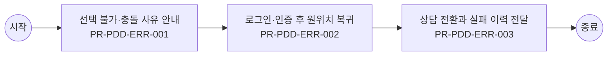

# Usecase: US-PDD-CUS-005 — 담기 실패 복구와 상담 전환

## Flowchart

> 단순 직렬 흐름. 분기·게이트웨이는 `00_INDEX.md` BPMN 다이어그램 참조.



## Process: PR-PDD-ERR-001 — 선택 불가·충돌 사유 안내 {#process-PR-PDD-ERR-001}

```yaml
프로세스_ID: PR-PDD-ERR-001
프로세스명: 선택 불가·충돌 사유 안내
설명: 선택 불가, 중복 가입, 조합 충돌, 상품 정책 제한 사유와 해결 방향을 안내한다.
관련_기능: [FN-PDD-FAIL-001, FN-PDD-COMBO-001]
```

| 항목 | 내용 |
| --- | --- |
| 액터 | 고객 |
| 진입 조건 | 고객가 담기 실패 복구와 상담 전환 업무를 시작하고 상품군, 고객 상태, 진입 채널, 선택 목적 중 최소 1개 기준이 확인된 경우 진입한다. |
| 종료 조건 | 선택 불가·충돌 사유 안내 결과가 성공, 제한, 보완 필요 중 하나로 확정되고 PR-PDD-ERR-002 로그인·인증 후 원위치 복귀로 넘길 입력값과 판단 근거가 저장되면 종료한다. |
| 선행 프로세스 | 업무 진입 조건 충족 |
| 후행 프로세스 | PR-PDD-ERR-002 로그인·인증 후 원위치 복귀 |

### Function: FN-PDD-FAIL-001

```yaml
기능_ID: FN-PDD-FAIL-001
기능명: 선택 불가·충돌 복구 안내
설명: 선택 불가, 조합 충돌, 가입 불가, 재고 부족 사유와 수정 방법을 안내한다.
관련_정책_그룹: [PG-PDD-FAIL-001, PG-PDD-COMBO-001, PG-PDD-CS-001]
```

| 항목 | 내용 |
| --- | --- |
| 입력 정보 | 고객이 선택한 상품·옵션·혜택 구성 정보 실패 사유, 인증 필요 사유, 충돌 상품, 재고·조건 불일치 정보 원위치 복귀 토큰, 상담 전환 문맥, 이전 시도 이력 대체 상품 또는 수정 가능한 입력 항목 후보 |
| 세부 기능 구성 | 불가 사유 수정 방법 대체 상품 나중에 보기 |
| 출력 정보 | 실패 사유와 고객 안내 문구 복구 가능 경로와 원위치 복귀 정보 상담 전환 시 전달 문맥 반복 실패·인증·충돌 이력 |
| 처리 흐름 | (상태) 담기 실패 또는 인증 필요 발생 → (액션) 선택 불가·충돌 복구 안내 기준으로 실패 사유를 조건 불일치, 인증 필요, 재고 부족, 시스템 지연으로 분류 → (결과) 고객에게 수정 가능 여부와 다음 행동 제시 (상태) 고객이 복구 경로 선택 → (액션) 원위치 복귀 토큰과 이전 선택 구성을 유지하고 필요한 입력만 다시 요청 → (결과) 중복 입력을 줄이고 담기 재시도 가능 상태 복원 (상태) 반복 실패 또는 상담 필요 → (액션) 상품, 옵션, 실패 사유, 시도 이력을 상담 문맥으로 전달 → (결과) 상담사가 동일 설명을 반복 요청하지 않고 대체 경로 안내 |
| 실패/예외 케이스 | 동일 실패가 반복되면 재시도만 제공하지 않고 대체 상품, 상담, 나중에 다시 시도 경로를 제시한다. 상담 전환 시 상품 ID, 옵션, 오류 사유가 누락되면 상담 접수 전 보완한다. 인증 실패 후 원위치 복귀가 불가능하면 고객에게 다시 선택해야 하는 항목을 명확히 안내한다. |

#### Policy Group: PG-PDD-FAIL-001

```yaml
정책_ID: PG-PDD-FAIL-001
정책명: 불가·충돌·인증 복구 정책
설명: 선택 불가, 조합 충돌, 인증 필요, 실패 복구 기준을 정의한다.
```

| Policy Item ID | 정책 항목명 | 정책 항목 |
| --- | --- | --- |
| `PI-PDD-FAIL-001-01` | 불가 안내 | 선택 불가 또는 가입 불가가 발생하면 고객에게 상품, 옵션, 조건, 정책 중 어느 축에서 실패했는지 구분해 안내한다. 단순 오류 문구만 표시하는 것은 허용하지 않는다. |
| `PI-PDD-FAIL-001-02` | 충돌 복구 | 조합 충돌은 충돌 상품, 충돌 이유, 해제해야 할 항목, 대체 가능한 구성을 함께 제공한다. 고객이 수정하면 기존 비교·선택 상태로 복귀한다. |
| `PI-PDD-FAIL-001-03` | 인증 복귀 | 로그인, 회선 확인, 추가 인증이 필요하면 필요 사유를 먼저 설명한다. 인증 완료 후에는 고객이 선택한 상품, 옵션, 비교 조건, 이전 스크롤 위치 중 핵심 상태를 복원한다. |
| `PI-PDD-FAIL-001-04` | 대체 경로 | 담기 실패 시 대체 상품 보기, 조건 충족 방법 보기, 상담 연결, 나중에 다시 보기 중 최소 2개 이상의 후속 행동을 제공한다. |

#### Policy Group: PG-PDD-COMBO-001

```yaml
정책_ID: PG-PDD-COMBO-001
정책명: 상품 조합·담기 가능성 정책
설명: 동시 주문, 중복 가입, 필수 구성, 담기 가능성 정책을 정의한다.
```

| Policy Item ID | 정책 항목명 | 정책 항목 |
| --- | --- | --- |
| `PI-PDD-COMBO-001-01` | 동시 주문 | 상품 유형별 동시 주문 가능 조합을 정책으로 정의한다. 단말+요금제+부가+구독은 허용 조합을 둘 수 있고, 단독 구매 상품은 함께 담기를 제한한다. |
| `PI-PDD-COMBO-001-02` | 중복가입 가능여부 확인 | 중복가입 가능여부 확인은 고객 회선과 계정 기준으로 수행한다. 중복 가입이 불가한 상품은 담기, 장바구니, 가입 단계에서 동일한 제한 사유를 표시한다. |
| `PI-PDD-COMBO-001-03` | 필수 구성 | 필수 옵션, 필수 요금제, 필수 프로그램, 그룹 구성 조건이 누락되면 담기를 제한한다. 고객에게 누락 항목과 대체 가능한 구성을 함께 제시한다. |
| `PI-PDD-COMBO-001-04` | 담기 판정 | 담기 가능 여부는 가입 가능 여부, 중복 보유, 선행 조건, 판매 상태, 재고·수량, 판매 기간, 채널 판매 가능성을 실행 시점에 재검증한다. |

#### Policy Group: PG-PDD-CS-001

```yaml
정책_ID: PG-PDD-CS-001
정책명: 상담·문의 맥락 전달 정책
설명: 상품 상세 문의와 담기 실패 상담 전환 시 전달 기준을 정의한다.
```

| Policy Item ID | 정책 항목명 | 정책 항목 |
| --- | --- | --- |
| `PI-PDD-CS-001-01` | 상담 문맥 | 상품 상세 또는 담기 단계에서 상담으로 전환하면 상품 ID, 선택 옵션, 회선, 비교 조건, 실패 사유, 시도 횟수, 최근 판정 결과를 상담 문맥으로 전달한다. |
| `PI-PDD-CS-001-02` | 실패 이력 | 상담 전환 이력에는 실패 유형, 발생 시각, 고객 선택, 상담 전환 여부, 최종 안내 결과를 저장한다. 고객이 같은 설명을 반복하지 않도록 상담 화면에서 참조 가능해야 한다. |
| `PI-PDD-CS-001-03` | 대체 안내 | 상담사는 상품 정책을 변경하지 않고 고객 조건에 맞는 대체 상품, 옵션, 신청 경로, 재시도 가능 시점을 안내한다. |

### Function: FN-PDD-COMBO-001

```yaml
기능_ID: FN-PDD-COMBO-001
기능명: 상품 조합·프로그램 유효성 검증
설명: 단말, 요금제, 부가서비스, 구독, 혜택, 마케팅 프로그램 조합과 그룹상품 선택, 중복가입 가능여부 확인을 검증한다.
관련_정책_그룹: [PG-PDD-OPTION-001, PG-PDD-COMBO-001, PG-PDD-ELIG-001, PG-PDD-CATALOG-001, PG-PDD-FAIL-001]
```

| 항목 | 내용 |
| --- | --- |
| 입력 정보 | 고객 가입 상태, 회선/요금제/권한/인증 상태 선택 옵션, 필수 구성, 동시 주문 가능 상품, 재고·배송 조건 담기 가능 여부와 장바구니·주문 전환 대상 정보 상품 관계, 중복 가입, 판매 상태, 제한 사유 정책 |
| 세부 기능 구성 | 동시 주문 필수 구성 중복 불가 그룹 상품 중복가입 확인 그룹상품 선택 |
| 출력 정보 | 담기 가능 여부와 선택 구성 상태 수정 필요 옵션과 제한 사유 장바구니·주문·계속 탐색 전환값 상품 조합·재고·조건 판정 이력 |
| 처리 흐름 | (상태) 상품 구성 선택 → (액션) 상품 조합·프로그램 유효성 검증 기준으로 옵션, 재고, 가입 조건, 상품 관계를 동시 검증 → (결과) 담기 가능, 보완 필요, 선택 불가 중 하나로 판정 (상태) 고객 조건 또는 선택값 변경 → (액션) 기존 선택 구성과 충돌 여부, 필수 구성 누락, 동시 주문 제한을 재확인 → (결과) 수정해야 할 항목과 유지 가능한 항목 분리 (상태) 담기 또는 다음 행동 요청 → (액션) 유효한 선택 구성만 상태 저장하고 장바구니·주문·계속 탐색 경로를 결정 → (결과) 고객 선택 맥락이 끊기지 않고 후속 업무로 전달 |
| 실패/예외 케이스 | 재고, 판매 상태, 가입 조건 중 하나라도 미확정이면 담기를 확정하지 않고 보완 가능한 항목을 안내한다. 선택 조합이 충돌하면 전체 초기화가 아니라 충돌 항목만 수정하도록 한다. 로그인·인증 후 복귀 시 기존 선택 구성이 사라지면 재선택 없이 복원 가능한 상태로 전환한다. |

#### Policy Group: PG-PDD-OPTION-001

```yaml
정책_ID: PG-PDD-OPTION-001
정책명: 옵션·구성 선택 정책
설명: 색상, 용량, 요금제, 부가서비스, 혜택 선택 기준을 정의한다.
```

| Policy Item ID | 정책 항목명 | 정책 항목 |
| --- | --- | --- |
| `PI-PDD-OPTION-001-01` | 옵션 선택 | 색상, 용량, 약정, 요금제, 부가서비스, 배송 유형은 선택 즉시 가격, 혜택, 재고, 가입 조건 변화를 재산정한다. |
| `PI-PDD-OPTION-001-02` | 선택형 혜택 | 여러 혜택 중 1개 또는 N개를 선택해야 하는 경우 선택 가능 기한, 선택 전 비교 정보, 선택 완료 상태, 재선택 가능 여부를 표시한다. |
| `PI-PDD-OPTION-001-03` | 그룹 상품 | 그룹 상품은 필수 구성과 선택 구성을 구분한다. 구성원 상태값과 그룹 상품 조건은 실시간 또는 수동 검증 결과를 기준으로 표시한다. 그룹상품 선택 시 고객은 그룹에 속한 상품과 구성원 조건을 확인한 뒤 담을 수 있어야 한다. |
| `PI-PDD-OPTION-001-04` | 가격 반영 | 옵션과 프로그램 선택에 따라 가격 또는 혜택이 바뀌면 고객 액션 시점에 즉시 반영한다. 재계산 중에는 이전 금액을 확정 금액처럼 표시하지 않는다. |
| `PI-PDD-OPTION-001-05` | 로밍 시작 옵션 | 로밍 상품은 데이터 용량, 자동개시·수동개시, 데이터 이용 안 함, 해지·차단·QoS 가능 여부를 고객이 같은 선택 흐름에서 확인할 수 있게 한다. |
| `PI-PDD-OPTION-001-06` | 인기 옵션 적용 | 통계 팝업이나 인기 옵션 안내에서 고객이 색상·용량을 선택하면 상품 상세의 현재 옵션에 즉시 반영한다. 반영 전 재고와 가격 변동 여부를 다시 확인한다. |

#### Policy Group: PG-PDD-COMBO-001

```yaml
정책_ID: PG-PDD-COMBO-001
정책명: 상품 조합·담기 가능성 정책
설명: 동시 주문, 중복 가입, 필수 구성, 담기 가능성 정책을 정의한다.
```

| Policy Item ID | 정책 항목명 | 정책 항목 |
| --- | --- | --- |
| `PI-PDD-COMBO-001-01` | 동시 주문 | 상품 유형별 동시 주문 가능 조합을 정책으로 정의한다. 단말+요금제+부가+구독은 허용 조합을 둘 수 있고, 단독 구매 상품은 함께 담기를 제한한다. |
| `PI-PDD-COMBO-001-02` | 중복가입 가능여부 확인 | 중복가입 가능여부 확인은 고객 회선과 계정 기준으로 수행한다. 중복 가입이 불가한 상품은 담기, 장바구니, 가입 단계에서 동일한 제한 사유를 표시한다. |
| `PI-PDD-COMBO-001-03` | 필수 구성 | 필수 옵션, 필수 요금제, 필수 프로그램, 그룹 구성 조건이 누락되면 담기를 제한한다. 고객에게 누락 항목과 대체 가능한 구성을 함께 제시한다. |
| `PI-PDD-COMBO-001-04` | 담기 판정 | 담기 가능 여부는 가입 가능 여부, 중복 보유, 선행 조건, 판매 상태, 재고·수량, 판매 기간, 채널 판매 가능성을 실행 시점에 재검증한다. |

#### Policy Group: PG-PDD-ELIG-001

```yaml
정책_ID: PG-PDD-ELIG-001
정책명: 가입·구매 가능성 사전 안내 정책
설명: 고객 상태, 가입 조건, 구매 제한, 불가 사유 사전 고지 기준을 정의한다.
```

| Policy Item ID | 정책 항목명 | 정책 항목 |
| --- | --- | --- |
| `PI-PDD-ELIG-001-01` | 사전 판정 | 가입·구매 가능 여부는 연령, 회선, 고객 등급, 지역, 재고, 보유 상품, 판매 기간, 채널 판매 가능성을 기준으로 주문 진입 전 또는 담기 직전에 판정한다. |
| `PI-PDD-ELIG-001-02` | 불가 사유 | 상품 선택 불가 시 재고 부족, 옵션 상태, 가입 조건 불충족, 중복 가입, 선행 조건 미충족, 판매 중지 중 하나 이상의 사유와 해결 방법을 함께 표시한다. |
| `PI-PDD-ELIG-001-03` | 비회원 전환 | 비회원은 구매·가입·개통을 완료할 수 없다. 비로그인 고객이 담기 또는 구매를 시도하면 로그인과 본인확인이 필요한 이유와 전환 이점을 먼저 안내한다. |
| `PI-PDD-ELIG-001-04` | 제한 고지 | 결제수단, 포인트, 쿠폰, 할인, 가입 가능 시점, 예약 가능 시점의 제한은 상세와 담기 단계에서 사전 고지한다. 제한 조건이 바뀌면 기존 선택 상태에 즉시 반영한다. |
| `PI-PDD-ELIG-001-05` | 연령·기간 유효성 | 가입 제한 기준연령은 시작 나이와 종료 나이의 범위가 유효한 경우에만 저장한다. 판매 기간, 예약 가능 시점, 가입 가능 시점이 있는 상품은 주문 전에 제한 조건을 표시한다. |
| `PI-PDD-ELIG-001-06` | 묶음 해지 제약 | 패키지 상품 또는 묶음 혜택은 구성 혜택별 개별 해지 가능 여부를 가입 전에 안내한다. 묶음 단위로만 해지 가능한 경우 고객에게 해지 영향과 환불 기준 참조 경로를 함께 제공한다. |

#### Policy Group: PG-PDD-CATALOG-001

```yaml
정책_ID: PG-PDD-CATALOG-001
정책명: Product Catalog 연동 정책
설명: NOVA Product Catalog 기준 정보와 채널 표시·판정 연계 기준을 정의한다.
```

| Policy Item ID | 정책 항목명 | 정책 항목 |
| --- | --- | --- |
| `PI-PDD-CATALOG-001-01` | 상품 I/F | Product Catalog에서 상품, 마케팅, 서비스, 혜택, 정책, 가입조건, 가격 정보를 통합 수신한다. 채널은 원장 기준과 다른 임의 값을 표시하지 않는다. |
| `PI-PDD-CATALOG-001-02` | Spec/Item | Product Spec은 제공 단위, Item은 사용 단위로 구분한다. Item Type 관계가 있는 상품은 상세와 담기 모두에서 동일한 구성 관계를 사용한다. |
| `PI-PDD-CATALOG-001-03` | 상품 관계 | Product Offering과 마케팅 프로그램 관계는 동시 가입, 자동 가입, 자동 해지, 선가입·선해지 기준으로 판정한다. |
| `PI-PDD-CATALOG-001-04` | 정책 수신 | 가입 조건, 혜택 조건, 조합 정책, 제한 문구는 Product Catalog 또는 BSS 기준을 우선한다. 채널 보조 문구는 정책값을 덮어쓸 수 없다. |
| `PI-PDD-CATALOG-001-05` | 외부채널 연동 | 외부채널 상품 설정은 Product Catalog와 채널 운영값의 매핑을 기준으로 수신한다. 외부채널 또는 Product Catalog 연동 장애가 발생하면 고객 표시를 제한하거나 보조 안내로 전환하고, 채널 간 영향 확대 여부와 복구 결과를 이력으로 남긴다. |

#### Policy Group: PG-PDD-FAIL-001

```yaml
정책_ID: PG-PDD-FAIL-001
정책명: 불가·충돌·인증 복구 정책
설명: 선택 불가, 조합 충돌, 인증 필요, 실패 복구 기준을 정의한다.
```

| Policy Item ID | 정책 항목명 | 정책 항목 |
| --- | --- | --- |
| `PI-PDD-FAIL-001-01` | 불가 안내 | 선택 불가 또는 가입 불가가 발생하면 고객에게 상품, 옵션, 조건, 정책 중 어느 축에서 실패했는지 구분해 안내한다. 단순 오류 문구만 표시하는 것은 허용하지 않는다. |
| `PI-PDD-FAIL-001-02` | 충돌 복구 | 조합 충돌은 충돌 상품, 충돌 이유, 해제해야 할 항목, 대체 가능한 구성을 함께 제공한다. 고객이 수정하면 기존 비교·선택 상태로 복귀한다. |
| `PI-PDD-FAIL-001-03` | 인증 복귀 | 로그인, 회선 확인, 추가 인증이 필요하면 필요 사유를 먼저 설명한다. 인증 완료 후에는 고객이 선택한 상품, 옵션, 비교 조건, 이전 스크롤 위치 중 핵심 상태를 복원한다. |
| `PI-PDD-FAIL-001-04` | 대체 경로 | 담기 실패 시 대체 상품 보기, 조건 충족 방법 보기, 상담 연결, 나중에 다시 보기 중 최소 2개 이상의 후속 행동을 제공한다. |

## Process: PR-PDD-ERR-002 — 로그인·인증 후 원위치 복귀 {#process-PR-PDD-ERR-002}

```yaml
프로세스_ID: PR-PDD-ERR-002
프로세스명: 로그인·인증 후 원위치 복귀
설명: 로그인, 회선 확인, 추가 인증이 필요한 이유를 안내하고 완료 후 기존 선택 상태로 복귀한다.
관련_기능: [FN-PDD-AUTH-001, FN-PDD-SHARE-001]
```

| 항목 | 내용 |
| --- | --- |
| 액터 | 고객 |
| 진입 조건 | PR-PDD-ERR-001 선택 불가·충돌 사유 안내 결과가 고객에게 표시되었고, 고객 또는 운영자가 다음 판단을 계속하기로 선택한 경우 진입한다. |
| 종료 조건 | 로그인·인증 후 원위치 복귀 결과가 성공, 제한, 보완 필요 중 하나로 확정되고 PR-PDD-ERR-003 상담 전환과 실패 이력 전달로 넘길 입력값과 판단 근거가 저장되면 종료한다. |
| 선행 프로세스 | PR-PDD-ERR-001 선택 불가·충돌 사유 안내 |
| 후행 프로세스 | PR-PDD-ERR-003 상담 전환과 실패 이력 전달 |

### Function: FN-PDD-AUTH-001

```yaml
기능_ID: FN-PDD-AUTH-001
기능명: 로그인·인증 필요 안내
설명: 로그인, 회선 확인, 본인확인, 추가 인증이 필요한 이유와 복귀 기준을 안내한다.
관련_정책_그룹: [PG-PDD-FAIL-001, PG-PDD-CS-001]
```

| 항목 | 내용 |
| --- | --- |
| 입력 정보 | 고객이 선택한 상품·옵션·혜택 구성 정보 실패 사유, 인증 필요 사유, 충돌 상품, 재고·조건 불일치 정보 원위치 복귀 토큰, 상담 전환 문맥, 이전 시도 이력 대체 상품 또는 수정 가능한 입력 항목 후보 |
| 세부 기능 구성 | 필요 사유 인증 이동 복귀 토큰 선택 유지 |
| 출력 정보 | 실패 사유와 고객 안내 문구 복구 가능 경로와 원위치 복귀 정보 상담 전환 시 전달 문맥 반복 실패·인증·충돌 이력 |
| 처리 흐름 | (상태) 담기 실패 또는 인증 필요 발생 → (액션) 로그인·인증 필요 안내 기준으로 실패 사유를 조건 불일치, 인증 필요, 재고 부족, 시스템 지연으로 분류 → (결과) 고객에게 수정 가능 여부와 다음 행동 제시 (상태) 고객이 복구 경로 선택 → (액션) 원위치 복귀 토큰과 이전 선택 구성을 유지하고 필요한 입력만 다시 요청 → (결과) 중복 입력을 줄이고 담기 재시도 가능 상태 복원 (상태) 반복 실패 또는 상담 필요 → (액션) 상품, 옵션, 실패 사유, 시도 이력을 상담 문맥으로 전달 → (결과) 상담사가 동일 설명을 반복 요청하지 않고 대체 경로 안내 |
| 실패/예외 케이스 | 동일 실패가 반복되면 재시도만 제공하지 않고 대체 상품, 상담, 나중에 다시 시도 경로를 제시한다. 상담 전환 시 상품 ID, 옵션, 오류 사유가 누락되면 상담 접수 전 보완한다. 인증 실패 후 원위치 복귀가 불가능하면 고객에게 다시 선택해야 하는 항목을 명확히 안내한다. |

#### Policy Group: PG-PDD-FAIL-001

```yaml
정책_ID: PG-PDD-FAIL-001
정책명: 불가·충돌·인증 복구 정책
설명: 선택 불가, 조합 충돌, 인증 필요, 실패 복구 기준을 정의한다.
```

| Policy Item ID | 정책 항목명 | 정책 항목 |
| --- | --- | --- |
| `PI-PDD-FAIL-001-01` | 불가 안내 | 선택 불가 또는 가입 불가가 발생하면 고객에게 상품, 옵션, 조건, 정책 중 어느 축에서 실패했는지 구분해 안내한다. 단순 오류 문구만 표시하는 것은 허용하지 않는다. |
| `PI-PDD-FAIL-001-02` | 충돌 복구 | 조합 충돌은 충돌 상품, 충돌 이유, 해제해야 할 항목, 대체 가능한 구성을 함께 제공한다. 고객이 수정하면 기존 비교·선택 상태로 복귀한다. |
| `PI-PDD-FAIL-001-03` | 인증 복귀 | 로그인, 회선 확인, 추가 인증이 필요하면 필요 사유를 먼저 설명한다. 인증 완료 후에는 고객이 선택한 상품, 옵션, 비교 조건, 이전 스크롤 위치 중 핵심 상태를 복원한다. |
| `PI-PDD-FAIL-001-04` | 대체 경로 | 담기 실패 시 대체 상품 보기, 조건 충족 방법 보기, 상담 연결, 나중에 다시 보기 중 최소 2개 이상의 후속 행동을 제공한다. |

#### Policy Group: PG-PDD-CS-001

```yaml
정책_ID: PG-PDD-CS-001
정책명: 상담·문의 맥락 전달 정책
설명: 상품 상세 문의와 담기 실패 상담 전환 시 전달 기준을 정의한다.
```

| Policy Item ID | 정책 항목명 | 정책 항목 |
| --- | --- | --- |
| `PI-PDD-CS-001-01` | 상담 문맥 | 상품 상세 또는 담기 단계에서 상담으로 전환하면 상품 ID, 선택 옵션, 회선, 비교 조건, 실패 사유, 시도 횟수, 최근 판정 결과를 상담 문맥으로 전달한다. |
| `PI-PDD-CS-001-02` | 실패 이력 | 상담 전환 이력에는 실패 유형, 발생 시각, 고객 선택, 상담 전환 여부, 최종 안내 결과를 저장한다. 고객이 같은 설명을 반복하지 않도록 상담 화면에서 참조 가능해야 한다. |
| `PI-PDD-CS-001-03` | 대체 안내 | 상담사는 상품 정책을 변경하지 않고 고객 조건에 맞는 대체 상품, 옵션, 신청 경로, 재시도 가능 시점을 안내한다. |

### Function: FN-PDD-SHARE-001

```yaml
기능_ID: FN-PDD-SHARE-001
기능명: 공유·딥링크·원위치 복귀
설명: 상품 상세 공유, deferred deeplink, 미설치 유도, 인증 후 원위치 복귀를 처리한다.
관련_정책_그룹: [PG-PDD-CS-001, PG-PDD-SAVE-001, PG-PDD-FAIL-001]
```

| 항목 | 내용 |
| --- | --- |
| 입력 정보 | 상품 ID, 상품군, 판매 상태, 대표 가격·혜택 정보 고객 진입 경로와 조회 세션 정보 상품 상세 템플릿의 필수 섹션과 노출 우선순위 고객에게 숨겨야 할 내부 코드·운영 문구 제외 기준 |
| 세부 기능 구성 | 딥링크 미설치 유도 선택 복원 공유 이력 |
| 출력 정보 | 고객용 상품 요약과 상세 섹션 노출 결과 상품군별 필수 정보 표시 여부 미노출·대체 안내 사유 상품 상세 조회와 비교·담기 전환 이력 |
| 처리 흐름 | (상태) 상품 상세 진입 → (액션) 공유·딥링크·원위치 복귀에 필요한 상품군·판매상태·핵심 속성을 원장 기준으로 조립 → (결과) 고객이 상품 목적과 가입 가능성을 먼저 이해할 수 있는 요약 영역 구성 (상태) 추가 설명 확인 → (액션) 미디어, 스펙, 후기, Q&A, 유의사항을 고객 의사결정 순서로 재배치 → (결과) 상품 이해에 필요한 정보와 내부 운영 문구를 분리 표시 (상태) 정보 부족 또는 노출 제한 발생 → (액션) 대체 설명, 상담 연결, 미노출 사유를 정책 기준으로 선택 → (결과) 빈 화면 없이 다음 탐색 또는 문의 경로 제공 |
| 실패/예외 케이스 | 상품 기준 정보가 누락되면 해당 섹션을 숨기지 않고 보완 필요 또는 상담 가능 경로를 안내한다. 내부 운영 코드나 원장 필드명이 고객 문구로 노출되면 배포를 제한한다. 미디어·후기·스펙 로딩 실패 시 핵심 요약과 가격·조건 판단은 유지한다. |

#### Policy Group: PG-PDD-CS-001

```yaml
정책_ID: PG-PDD-CS-001
정책명: 상담·문의 맥락 전달 정책
설명: 상품 상세 문의와 담기 실패 상담 전환 시 전달 기준을 정의한다.
```

| Policy Item ID | 정책 항목명 | 정책 항목 |
| --- | --- | --- |
| `PI-PDD-CS-001-01` | 상담 문맥 | 상품 상세 또는 담기 단계에서 상담으로 전환하면 상품 ID, 선택 옵션, 회선, 비교 조건, 실패 사유, 시도 횟수, 최근 판정 결과를 상담 문맥으로 전달한다. |
| `PI-PDD-CS-001-02` | 실패 이력 | 상담 전환 이력에는 실패 유형, 발생 시각, 고객 선택, 상담 전환 여부, 최종 안내 결과를 저장한다. 고객이 같은 설명을 반복하지 않도록 상담 화면에서 참조 가능해야 한다. |
| `PI-PDD-CS-001-03` | 대체 안내 | 상담사는 상품 정책을 변경하지 않고 고객 조건에 맞는 대체 상품, 옵션, 신청 경로, 재시도 가능 시점을 안내한다. |

#### Policy Group: PG-PDD-SAVE-001

```yaml
정책_ID: PG-PDD-SAVE-001
정책명: 담기 실행·다음 행동 정책
설명: 담기 실행, 상태 저장, 완료 후 다음 행동, 주문 전환 기준을 정의한다.
```

| Policy Item ID | 정책 항목명 | 정책 항목 |
| --- | --- | --- |
| `PI-PDD-SAVE-001-01` | 담기 저장 | 담기 성공 시 상품, 옵션, 프로그램, 혜택, 예상 비용, 판정 결과, 기준 시각을 저장한다. 동일 요청은 멱등 키 또는 동일 고객·상품·옵션·기준 시각으로 중복 요청 여부를 확인하고, 중복 요청이면 새 건을 만들지 않고 기존 담기 상태를 갱신한다. |
| `PI-PDD-SAVE-001-02` | 다음 행동 | 담기 완료 후 계속 탐색, 장바구니 이동, 바로 신청, 비교 계속하기 중 최소 3개 행동을 제공한다. 행동별로 현재 선택 기준의 핵심 혜택 또는 주의사항을 짧게 표시한다. |
| `PI-PDD-SAVE-001-03` | 주문 전환 | 바로 신청 또는 주문 전환 시 상품 상태, 가격, 재고, 혜택, 가입 가능성은 다시 확인한다. 변경이 있으면 변경 전후와 고객 선택지를 안내한다. |
| `PI-PDD-SAVE-001-04` | 재검증 | 담기 이후 장바구니 또는 주문으로 넘어갈 때 10분 이상 경과했거나 상품 상태가 바뀐 경우 재검증을 수행한다. 재검증 실패 시 담기 완료 상태는 유지하되 주문 전환은 제한한다. |
| `PI-PDD-SAVE-001-05` | CTA 의미 구분 | 담기와 구독하기는 장바구니 또는 신청 준비 단계로, 바로 결제하기는 결제 진입으로 구분한다. 상품 유형별 CTA 명칭과 다음 단계는 고객에게 혼동 없이 안내해야 한다. |
| `PI-PDD-SAVE-001-06` | 고객 표시 상태와 내부 상태 구분 | 고객 표시 상태는 탐색 가능, 담기 완료, 주문 전환 가능, 선택 불가처럼 고객 행동을 결정하는 문구로 관리한다. 내부 상태는 조건 확인 필요, 조합 충돌, 재고 부족, 인증 필요, 운영 반영 대기로 구분하고, 고객 행동을 제한할 때만 표시 상태를 변경한다. |

#### Policy Group: PG-PDD-FAIL-001

```yaml
정책_ID: PG-PDD-FAIL-001
정책명: 불가·충돌·인증 복구 정책
설명: 선택 불가, 조합 충돌, 인증 필요, 실패 복구 기준을 정의한다.
```

| Policy Item ID | 정책 항목명 | 정책 항목 |
| --- | --- | --- |
| `PI-PDD-FAIL-001-01` | 불가 안내 | 선택 불가 또는 가입 불가가 발생하면 고객에게 상품, 옵션, 조건, 정책 중 어느 축에서 실패했는지 구분해 안내한다. 단순 오류 문구만 표시하는 것은 허용하지 않는다. |
| `PI-PDD-FAIL-001-02` | 충돌 복구 | 조합 충돌은 충돌 상품, 충돌 이유, 해제해야 할 항목, 대체 가능한 구성을 함께 제공한다. 고객이 수정하면 기존 비교·선택 상태로 복귀한다. |
| `PI-PDD-FAIL-001-03` | 인증 복귀 | 로그인, 회선 확인, 추가 인증이 필요하면 필요 사유를 먼저 설명한다. 인증 완료 후에는 고객이 선택한 상품, 옵션, 비교 조건, 이전 스크롤 위치 중 핵심 상태를 복원한다. |
| `PI-PDD-FAIL-001-04` | 대체 경로 | 담기 실패 시 대체 상품 보기, 조건 충족 방법 보기, 상담 연결, 나중에 다시 보기 중 최소 2개 이상의 후속 행동을 제공한다. |

## Process: PR-PDD-ERR-003 — 상담 전환과 실패 이력 전달 {#process-PR-PDD-ERR-003}

```yaml
프로세스_ID: PR-PDD-ERR-003
프로세스명: 상담 전환과 실패 이력 전달
설명: 셀프 해결이 어려운 경우 선택 상품, 옵션, 실패 사유, 시도 이력을 상담 문맥으로 전달한다.
관련_기능: [FN-PDD-CS-001, FN-PDD-AUDIT-001]
```

| 항목 | 내용 |
| --- | --- |
| 액터 | 고객 |
| 진입 조건 | PR-PDD-ERR-002 로그인·인증 후 원위치 복귀 결과가 고객에게 표시되었고, 고객 또는 운영자가 다음 판단을 계속하기로 선택한 경우 진입한다. |
| 종료 조건 | 담기 실패 복구와 상담 전환의 완료·중단·상담 전환 결과가 확정되고 고객 안내, 상태 이력, 관련 정책 근거가 남으면 종료한다. |
| 선행 프로세스 | PR-PDD-ERR-002 로그인·인증 후 원위치 복귀 |
| 후행 프로세스 | 결과 안내 또는 후속 업무 연결 |

### Function: FN-PDD-CS-001

```yaml
기능_ID: FN-PDD-CS-001
기능명: 상품 문맥 상담 전달
설명: 상품 ID, 옵션, 선택 회선, 비교 조건, 실패 사유, 시도 이력을 상담으로 전달한다.
관련_정책_그룹: [PG-PDD-CS-001, PG-PDD-SAVE-001, PG-PDD-MON-001, PG-PDD-FAIL-001, PG-PDD-COMBO-001]
```

| 항목 | 내용 |
| --- | --- |
| 입력 정보 | 고객이 선택한 상품·옵션·혜택 구성 정보 실패 사유, 인증 필요 사유, 충돌 상품, 재고·조건 불일치 정보 원위치 복귀 토큰, 상담 전환 문맥, 이전 시도 이력 대체 상품 또는 수정 가능한 입력 항목 후보 |
| 세부 기능 구성 | 상품 문맥 실패 사유 시도 이력 상담 연결 |
| 출력 정보 | 실패 사유와 고객 안내 문구 복구 가능 경로와 원위치 복귀 정보 상담 전환 시 전달 문맥 반복 실패·인증·충돌 이력 |
| 처리 흐름 | (상태) 담기 실패 또는 인증 필요 발생 → (액션) 상품 문맥 상담 전달 기준으로 실패 사유를 조건 불일치, 인증 필요, 재고 부족, 시스템 지연으로 분류 → (결과) 고객에게 수정 가능 여부와 다음 행동 제시 (상태) 고객이 복구 경로 선택 → (액션) 원위치 복귀 토큰과 이전 선택 구성을 유지하고 필요한 입력만 다시 요청 → (결과) 중복 입력을 줄이고 담기 재시도 가능 상태 복원 (상태) 반복 실패 또는 상담 필요 → (액션) 상품, 옵션, 실패 사유, 시도 이력을 상담 문맥으로 전달 → (결과) 상담사가 동일 설명을 반복 요청하지 않고 대체 경로 안내 |
| 실패/예외 케이스 | 동일 실패가 반복되면 재시도만 제공하지 않고 대체 상품, 상담, 나중에 다시 시도 경로를 제시한다. 상담 전환 시 상품 ID, 옵션, 오류 사유가 누락되면 상담 접수 전 보완한다. 인증 실패 후 원위치 복귀가 불가능하면 고객에게 다시 선택해야 하는 항목을 명확히 안내한다. |

#### Policy Group: PG-PDD-CS-001

```yaml
정책_ID: PG-PDD-CS-001
정책명: 상담·문의 맥락 전달 정책
설명: 상품 상세 문의와 담기 실패 상담 전환 시 전달 기준을 정의한다.
```

| Policy Item ID | 정책 항목명 | 정책 항목 |
| --- | --- | --- |
| `PI-PDD-CS-001-01` | 상담 문맥 | 상품 상세 또는 담기 단계에서 상담으로 전환하면 상품 ID, 선택 옵션, 회선, 비교 조건, 실패 사유, 시도 횟수, 최근 판정 결과를 상담 문맥으로 전달한다. |
| `PI-PDD-CS-001-02` | 실패 이력 | 상담 전환 이력에는 실패 유형, 발생 시각, 고객 선택, 상담 전환 여부, 최종 안내 결과를 저장한다. 고객이 같은 설명을 반복하지 않도록 상담 화면에서 참조 가능해야 한다. |
| `PI-PDD-CS-001-03` | 대체 안내 | 상담사는 상품 정책을 변경하지 않고 고객 조건에 맞는 대체 상품, 옵션, 신청 경로, 재시도 가능 시점을 안내한다. |

#### Policy Group: PG-PDD-SAVE-001

```yaml
정책_ID: PG-PDD-SAVE-001
정책명: 담기 실행·다음 행동 정책
설명: 담기 실행, 상태 저장, 완료 후 다음 행동, 주문 전환 기준을 정의한다.
```

| Policy Item ID | 정책 항목명 | 정책 항목 |
| --- | --- | --- |
| `PI-PDD-SAVE-001-01` | 담기 저장 | 담기 성공 시 상품, 옵션, 프로그램, 혜택, 예상 비용, 판정 결과, 기준 시각을 저장한다. 동일 요청은 멱등 키 또는 동일 고객·상품·옵션·기준 시각으로 중복 요청 여부를 확인하고, 중복 요청이면 새 건을 만들지 않고 기존 담기 상태를 갱신한다. |
| `PI-PDD-SAVE-001-02` | 다음 행동 | 담기 완료 후 계속 탐색, 장바구니 이동, 바로 신청, 비교 계속하기 중 최소 3개 행동을 제공한다. 행동별로 현재 선택 기준의 핵심 혜택 또는 주의사항을 짧게 표시한다. |
| `PI-PDD-SAVE-001-03` | 주문 전환 | 바로 신청 또는 주문 전환 시 상품 상태, 가격, 재고, 혜택, 가입 가능성은 다시 확인한다. 변경이 있으면 변경 전후와 고객 선택지를 안내한다. |
| `PI-PDD-SAVE-001-04` | 재검증 | 담기 이후 장바구니 또는 주문으로 넘어갈 때 10분 이상 경과했거나 상품 상태가 바뀐 경우 재검증을 수행한다. 재검증 실패 시 담기 완료 상태는 유지하되 주문 전환은 제한한다. |
| `PI-PDD-SAVE-001-05` | CTA 의미 구분 | 담기와 구독하기는 장바구니 또는 신청 준비 단계로, 바로 결제하기는 결제 진입으로 구분한다. 상품 유형별 CTA 명칭과 다음 단계는 고객에게 혼동 없이 안내해야 한다. |
| `PI-PDD-SAVE-001-06` | 고객 표시 상태와 내부 상태 구분 | 고객 표시 상태는 탐색 가능, 담기 완료, 주문 전환 가능, 선택 불가처럼 고객 행동을 결정하는 문구로 관리한다. 내부 상태는 조건 확인 필요, 조합 충돌, 재고 부족, 인증 필요, 운영 반영 대기로 구분하고, 고객 행동을 제한할 때만 표시 상태를 변경한다. |

#### Policy Group: PG-PDD-MON-001

```yaml
정책_ID: PG-PDD-MON-001
정책명: 담기 모니터링·알림 정책
설명: 담기 활동, 불편 이벤트, 실시간 알림, 에스컬레이션 기준을 정의한다.
```

| Policy Item ID | 정책 항목명 | 정책 항목 |
| --- | --- | --- |
| `PI-PDD-MON-001-01` | 활동 현황 | 운영자는 상품, 옵션·조합, 고객 여정 단계, 담기 성공·실패, 실패 사유, 인증·연계 상태, 상담 전환 여부를 실시간으로 조회한다. |
| `PI-PDD-MON-001-02` | 불편 이벤트 | 불편 이벤트는 시스템 오류, 상품·정책 충돌, 판매 가능 상태 오류, 인증·연계 실패, 반복 실패, 이탈 급증, 상담 전환 급증으로 분류한다. |
| `PI-PDD-MON-001-03` | 실시간 알림 | 불편 이벤트가 기준을 초과하면 발생 시각, 이벤트 유형, 영향 상품·조합, 발생 규모, 주요 실패 사유, 권장 조치를 포함해 알림을 발송한다. |
| `PI-PDD-MON-001-04` | 에스컬레이션 | 미확인 또는 미조치 상태가 설정 시간 이상 지속되면 심각도와 담당 상품 기준으로 상위 담당자 또는 연관 운영 조직에 자동 에스컬레이션한다. |

#### Policy Group: PG-PDD-FAIL-001

```yaml
정책_ID: PG-PDD-FAIL-001
정책명: 불가·충돌·인증 복구 정책
설명: 선택 불가, 조합 충돌, 인증 필요, 실패 복구 기준을 정의한다.
```

| Policy Item ID | 정책 항목명 | 정책 항목 |
| --- | --- | --- |
| `PI-PDD-FAIL-001-01` | 불가 안내 | 선택 불가 또는 가입 불가가 발생하면 고객에게 상품, 옵션, 조건, 정책 중 어느 축에서 실패했는지 구분해 안내한다. 단순 오류 문구만 표시하는 것은 허용하지 않는다. |
| `PI-PDD-FAIL-001-02` | 충돌 복구 | 조합 충돌은 충돌 상품, 충돌 이유, 해제해야 할 항목, 대체 가능한 구성을 함께 제공한다. 고객이 수정하면 기존 비교·선택 상태로 복귀한다. |
| `PI-PDD-FAIL-001-03` | 인증 복귀 | 로그인, 회선 확인, 추가 인증이 필요하면 필요 사유를 먼저 설명한다. 인증 완료 후에는 고객이 선택한 상품, 옵션, 비교 조건, 이전 스크롤 위치 중 핵심 상태를 복원한다. |
| `PI-PDD-FAIL-001-04` | 대체 경로 | 담기 실패 시 대체 상품 보기, 조건 충족 방법 보기, 상담 연결, 나중에 다시 보기 중 최소 2개 이상의 후속 행동을 제공한다. |

#### Policy Group: PG-PDD-COMBO-001

```yaml
정책_ID: PG-PDD-COMBO-001
정책명: 상품 조합·담기 가능성 정책
설명: 동시 주문, 중복 가입, 필수 구성, 담기 가능성 정책을 정의한다.
```

| Policy Item ID | 정책 항목명 | 정책 항목 |
| --- | --- | --- |
| `PI-PDD-COMBO-001-01` | 동시 주문 | 상품 유형별 동시 주문 가능 조합을 정책으로 정의한다. 단말+요금제+부가+구독은 허용 조합을 둘 수 있고, 단독 구매 상품은 함께 담기를 제한한다. |
| `PI-PDD-COMBO-001-02` | 중복가입 가능여부 확인 | 중복가입 가능여부 확인은 고객 회선과 계정 기준으로 수행한다. 중복 가입이 불가한 상품은 담기, 장바구니, 가입 단계에서 동일한 제한 사유를 표시한다. |
| `PI-PDD-COMBO-001-03` | 필수 구성 | 필수 옵션, 필수 요금제, 필수 프로그램, 그룹 구성 조건이 누락되면 담기를 제한한다. 고객에게 누락 항목과 대체 가능한 구성을 함께 제시한다. |
| `PI-PDD-COMBO-001-04` | 담기 판정 | 담기 가능 여부는 가입 가능 여부, 중복 보유, 선행 조건, 판매 상태, 재고·수량, 판매 기간, 채널 판매 가능성을 실행 시점에 재검증한다. |

### Function: FN-PDD-AUDIT-001

```yaml
기능_ID: FN-PDD-AUDIT-001
기능명: 변경·판정·알림 이력 저장
설명: 상품 원장 변경, 정책 판정, 담기 결과, 알림, 조치 결과 이력을 저장한다.
관련_정책_그룹: [PG-PDD-SAVE-001, PG-PDD-AUDIT-001, PG-PDD-CS-001, PG-PDD-MON-001, PG-PDD-ADMIN-001, PG-PDD-OPS-001]
```

| 항목 | 내용 |
| --- | --- |
| 입력 정보 | 운영 대상 상품군, 템플릿 버전, 변경 사유, 배포 범위 Product Catalog, 가격·혜택, 재고·판매 상태, 외부채널 설정값 검수 상태, 승인자, 배포 시점, 고객 노출 영향도 운영 변경 이력, 실패율, 전환율, 알림·에스컬레이션 기준 |
| 세부 기능 구성 | 변경 이력 판정 이력 알림 이력 조치 결과 |
| 출력 정보 | 운영 변경 결과와 배포 상태 검수 오류·경고·승인 필요 항목 고객 노출 영향도와 롤백 가능 여부 운영 변경·알림·조치 이력 |
| 처리 흐름 | (상태) 운영 변경 요청 → (액션) 변경·판정·알림 이력 저장 대상의 상품군, 변경 사유, 검수 상태, 배포 범위를 확인 → (결과) 운영자가 변경 가능한 항목과 승인 필요 항목 구분 (상태) 검수·배포 준비 → (액션) Product Catalog, 판매 상태, 정책 문구, 외부채널 설정 간 불일치를 점검 → (결과) 고객 노출 전 오류·누락·충돌 항목 차단 (상태) 배포 후 이상 감지 → (액션) 실패율, 담기 전환율, 고객 문의, 알림 이력을 기준으로 영향 범위 산정 → (결과) 롤백, 보정, 재배포, 상담 공지 중 후속 조치 실행 |
| 실패/예외 케이스 | 운영 입력값이 상품군 필수 기준을 충족하지 않으면 저장보다 검수 보류를 우선한다. 배포 후 고객 영향이 큰 오류가 감지되면 자동 보정 대신 롤백 또는 임시 중단 기준을 적용한다. 외부채널 또는 Product Catalog 회신이 지연되면 고객 노출 상태와 운영 알림을 분리 관리한다. |

#### Policy Group: PG-PDD-SAVE-001

```yaml
정책_ID: PG-PDD-SAVE-001
정책명: 담기 실행·다음 행동 정책
설명: 담기 실행, 상태 저장, 완료 후 다음 행동, 주문 전환 기준을 정의한다.
```

| Policy Item ID | 정책 항목명 | 정책 항목 |
| --- | --- | --- |
| `PI-PDD-SAVE-001-01` | 담기 저장 | 담기 성공 시 상품, 옵션, 프로그램, 혜택, 예상 비용, 판정 결과, 기준 시각을 저장한다. 동일 요청은 멱등 키 또는 동일 고객·상품·옵션·기준 시각으로 중복 요청 여부를 확인하고, 중복 요청이면 새 건을 만들지 않고 기존 담기 상태를 갱신한다. |
| `PI-PDD-SAVE-001-02` | 다음 행동 | 담기 완료 후 계속 탐색, 장바구니 이동, 바로 신청, 비교 계속하기 중 최소 3개 행동을 제공한다. 행동별로 현재 선택 기준의 핵심 혜택 또는 주의사항을 짧게 표시한다. |
| `PI-PDD-SAVE-001-03` | 주문 전환 | 바로 신청 또는 주문 전환 시 상품 상태, 가격, 재고, 혜택, 가입 가능성은 다시 확인한다. 변경이 있으면 변경 전후와 고객 선택지를 안내한다. |
| `PI-PDD-SAVE-001-04` | 재검증 | 담기 이후 장바구니 또는 주문으로 넘어갈 때 10분 이상 경과했거나 상품 상태가 바뀐 경우 재검증을 수행한다. 재검증 실패 시 담기 완료 상태는 유지하되 주문 전환은 제한한다. |
| `PI-PDD-SAVE-001-05` | CTA 의미 구분 | 담기와 구독하기는 장바구니 또는 신청 준비 단계로, 바로 결제하기는 결제 진입으로 구분한다. 상품 유형별 CTA 명칭과 다음 단계는 고객에게 혼동 없이 안내해야 한다. |
| `PI-PDD-SAVE-001-06` | 고객 표시 상태와 내부 상태 구분 | 고객 표시 상태는 탐색 가능, 담기 완료, 주문 전환 가능, 선택 불가처럼 고객 행동을 결정하는 문구로 관리한다. 내부 상태는 조건 확인 필요, 조합 충돌, 재고 부족, 인증 필요, 운영 반영 대기로 구분하고, 고객 행동을 제한할 때만 표시 상태를 변경한다. |

#### Policy Group: PG-PDD-AUDIT-001

```yaml
정책_ID: PG-PDD-AUDIT-001
정책명: 이력·성과·개선 정책
설명: 담기와 상품 상세의 판정·변경·성과·개선 이력 기준을 정의한다.
```

| Policy Item ID | 정책 항목명 | 정책 항목 |
| --- | --- | --- |
| `PI-PDD-AUDIT-001-01` | 판정 이력 | 가입 가능성, 담기 가능성, 조합 충돌, 재고 부족, 인증 필요 판정은 기준 시각과 판정 근거를 이력으로 저장한다. |
| `PI-PDD-AUDIT-001-02` | 변경 이력 | 상품 원장, 템플릿, 비교 기준, 마케팅 정보, 정책 문구 변경은 변경 전후와 승인 결과를 함께 저장한다. |
| `PI-PDD-AUDIT-001-03` | 성과 리포트 | 상품 상세과 담기 성과는 노출 수, 진입 수, 비교 이용 수, 담기 성공률, 실패율, 상담 전환율, 주문 전환율 기준으로 집계한다. |
| `PI-PDD-AUDIT-001-04` | 개선 추적 | 반복 실패 유형과 미조치 알림은 개선 대상 목록으로 관리한다. 조치 완료 후 동일 유형 재발 여부를 확인해 정책 또는 원장 개선으로 연결한다. |

#### Policy Group: PG-PDD-CS-001

```yaml
정책_ID: PG-PDD-CS-001
정책명: 상담·문의 맥락 전달 정책
설명: 상품 상세 문의와 담기 실패 상담 전환 시 전달 기준을 정의한다.
```

| Policy Item ID | 정책 항목명 | 정책 항목 |
| --- | --- | --- |
| `PI-PDD-CS-001-01` | 상담 문맥 | 상품 상세 또는 담기 단계에서 상담으로 전환하면 상품 ID, 선택 옵션, 회선, 비교 조건, 실패 사유, 시도 횟수, 최근 판정 결과를 상담 문맥으로 전달한다. |
| `PI-PDD-CS-001-02` | 실패 이력 | 상담 전환 이력에는 실패 유형, 발생 시각, 고객 선택, 상담 전환 여부, 최종 안내 결과를 저장한다. 고객이 같은 설명을 반복하지 않도록 상담 화면에서 참조 가능해야 한다. |
| `PI-PDD-CS-001-03` | 대체 안내 | 상담사는 상품 정책을 변경하지 않고 고객 조건에 맞는 대체 상품, 옵션, 신청 경로, 재시도 가능 시점을 안내한다. |

#### Policy Group: PG-PDD-MON-001

```yaml
정책_ID: PG-PDD-MON-001
정책명: 담기 모니터링·알림 정책
설명: 담기 활동, 불편 이벤트, 실시간 알림, 에스컬레이션 기준을 정의한다.
```

| Policy Item ID | 정책 항목명 | 정책 항목 |
| --- | --- | --- |
| `PI-PDD-MON-001-01` | 활동 현황 | 운영자는 상품, 옵션·조합, 고객 여정 단계, 담기 성공·실패, 실패 사유, 인증·연계 상태, 상담 전환 여부를 실시간으로 조회한다. |
| `PI-PDD-MON-001-02` | 불편 이벤트 | 불편 이벤트는 시스템 오류, 상품·정책 충돌, 판매 가능 상태 오류, 인증·연계 실패, 반복 실패, 이탈 급증, 상담 전환 급증으로 분류한다. |
| `PI-PDD-MON-001-03` | 실시간 알림 | 불편 이벤트가 기준을 초과하면 발생 시각, 이벤트 유형, 영향 상품·조합, 발생 규모, 주요 실패 사유, 권장 조치를 포함해 알림을 발송한다. |
| `PI-PDD-MON-001-04` | 에스컬레이션 | 미확인 또는 미조치 상태가 설정 시간 이상 지속되면 심각도와 담당 상품 기준으로 상위 담당자 또는 연관 운영 조직에 자동 에스컬레이션한다. |

#### Policy Group: PG-PDD-ADMIN-001

```yaml
정책_ID: PG-PDD-ADMIN-001
정책명: 운영 입력·검증·삭제 보호 정책
설명: 운영 데이터 등록, 수정, 삭제, 일괄 변경, 이미지 업로드, 승인, 변경 보호 기준을 정의한다.
```

| Policy Item ID | 정책 항목명 | 정책 항목 |
| --- | --- | --- |
| `PI-PDD-ADMIN-001-01` | 입력 검증 | 상품 등록·수정 시 필수값, 가격 형식, 이미지 규격, 노출순서, 유효기간, 카테고리 선택, 공통코드 변경 반영 여부를 저장 전에 검증한다. |
| `PI-PDD-ADMIN-001-02` | 삭제 보호 | 모상품, 판매정책, 카테고리, 부가서비스, 자급제 상품, 액세서리, 사은품 정책 삭제는 참조 데이터와 프론트 노출 영향이 없거나 승인된 예외인 경우에만 허용한다. |
| `PI-PDD-ADMIN-001-03` | 일괄 변경 부분 실패 | 전시·비전시, 공개·비공개, 사용여부 일괄 변경에서 일부 항목이 실패하면 성공 항목과 실패 항목을 분리해 표시하고 실패 항목은 기존 상태를 유지한다. |
| `PI-PDD-ADMIN-001-04` | 이미지 규격 | 이미지와 영상 등록은 권장 해상도, 파일 형식, 용량, 대체텍스트 기준을 사전 안내하고 기준 미달 시 저장을 제한하거나 보완 안내를 제공한다. |
| `PI-PDD-ADMIN-001-05` | 변경 보호 | 등록·수정 중 취소 또는 화면 전환이 발생하면 변경사항 유실 여부를 안내한다. 저장 완료 후에는 수정일, 수정자, 변경 항목을 이력으로 남긴다. |
| `PI-PDD-ADMIN-001-06` | 관리자 승인 | 잔여재고현황 다운로드처럼 영업 민감 정보가 포함된 자료는 관리자 승인 후 제공한다. 승인 권한, 승인 시각, 다운로드 이력은 감사 이력으로 저장한다. |

#### Policy Group: PG-PDD-OPS-001

```yaml
정책_ID: PG-PDD-OPS-001
정책명: 운영자 템플릿·정책문구 관리 정책
설명: 운영자가 템플릿, 비교 기준, 정책 문구를 안전하게 운영하는 기준을 정의한다.
```

| Policy Item ID | 정책 항목명 | 정책 항목 |
| --- | --- | --- |
| `PI-PDD-OPS-001-01` | 버전 관리 | 템플릿, 정책 문구, 비교 기준, 상품 조합 정책 변경은 버전, 적용일, 변경자, 변경 전후, 영향 상품을 저장한다. |
| `PI-PDD-OPS-001-02` | 영향도 확인 | 운영 정책 변경 전에는 고객 판정 결과, 담기 가능성, 노출 문구, 기존 담기 상태에 미치는 영향을 미리 확인한다. |
| `PI-PDD-OPS-001-03` | 미리보기 | 운영자는 상품군, 고객 상태, 판매 상태, 재고 상태, 혜택 조건을 바꿔가며 상품 상세와 담기 문구를 미리보기로 확인할 수 있어야 한다. |
| `PI-PDD-OPS-001-04` | 변경 이력 | 정책 문구와 템플릿 변경 이력은 최소 1년 보관한다. 고객 안내에 영향을 준 변경은 고객 문의와 재현 검증이 가능해야 한다. |

---

## Cross-refs (this UC)

- 정의된 ID: `FN-PDD-AUDIT-001`, `FN-PDD-AUTH-001`, `FN-PDD-COMBO-001`, `FN-PDD-CS-001`, `FN-PDD-FAIL-001`, `FN-PDD-SHARE-001`, `PG-PDD-ADMIN-001`, `PG-PDD-AUDIT-001`, `PG-PDD-CATALOG-001`, `PG-PDD-COMBO-001`, `PG-PDD-CS-001`, `PG-PDD-ELIG-001`, `PG-PDD-FAIL-001`, `PG-PDD-MON-001`, `PG-PDD-OPS-001`, `PG-PDD-OPTION-001`, `PG-PDD-SAVE-001`, `PI-PDD-ADMIN-001-01`, `PI-PDD-ADMIN-001-02`, `PI-PDD-ADMIN-001-03`, `PI-PDD-ADMIN-001-04`, `PI-PDD-ADMIN-001-05`, `PI-PDD-ADMIN-001-06`, `PI-PDD-AUDIT-001-01`, `PI-PDD-AUDIT-001-02`, `PI-PDD-AUDIT-001-03`, `PI-PDD-AUDIT-001-04`, `PI-PDD-CATALOG-001-01`, `PI-PDD-CATALOG-001-02`, `PI-PDD-CATALOG-001-03`, `PI-PDD-CATALOG-001-04`, `PI-PDD-CATALOG-001-05`, `PI-PDD-COMBO-001-01`, `PI-PDD-COMBO-001-02`, `PI-PDD-COMBO-001-03`, `PI-PDD-COMBO-001-04`, `PI-PDD-CS-001-01`, `PI-PDD-CS-001-02`, `PI-PDD-CS-001-03`, `PI-PDD-ELIG-001-01`, `PI-PDD-ELIG-001-02`, `PI-PDD-ELIG-001-03`, `PI-PDD-ELIG-001-04`, `PI-PDD-ELIG-001-05`, `PI-PDD-ELIG-001-06`, `PI-PDD-FAIL-001-01`, `PI-PDD-FAIL-001-02`, `PI-PDD-FAIL-001-03`, `PI-PDD-FAIL-001-04`, `PI-PDD-MON-001-01`, `PI-PDD-MON-001-02`, `PI-PDD-MON-001-03`, `PI-PDD-MON-001-04`, `PI-PDD-OPS-001-01`, `PI-PDD-OPS-001-02`, `PI-PDD-OPS-001-03`, `PI-PDD-OPS-001-04`, `PI-PDD-OPTION-001-01`, `PI-PDD-OPTION-001-02`, `PI-PDD-OPTION-001-03`, `PI-PDD-OPTION-001-04`, `PI-PDD-OPTION-001-05`, `PI-PDD-OPTION-001-06`, `PI-PDD-SAVE-001-01`, `PI-PDD-SAVE-001-02`, `PI-PDD-SAVE-001-03`, `PI-PDD-SAVE-001-04`, `PI-PDD-SAVE-001-05`, `PI-PDD-SAVE-001-06`, `PR-PDD-ERR-001`, `PR-PDD-ERR-002`, `PR-PDD-ERR-003`, `US-PDD-CUS-005`
