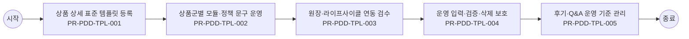

# Usecase: US-PDD-OPS-001 — 상품 상세 템플릿과 원장 운영

## Flowchart

> 단순 직렬 흐름. 분기·게이트웨이는 `00_INDEX.md` BPMN 다이어그램 참조.



## Process: PR-PDD-TPL-001 — 상품 상세 표준 템플릿 등록 {#process-PR-PDD-TPL-001}

```yaml
프로세스_ID: PR-PDD-TPL-001
프로세스명: 상품 상세 표준 템플릿 등록
설명: 운영자가 상품군별 필수 섹션, 모듈, 컴포넌트, 노출 순서를 등록한다.
관련_기능: [FN-PDD-TPL-OPS-001, FN-PDD-TEMPLATE-001]
```

| 항목 | 내용 |
| --- | --- |
| 액터 | 운영자 |
| 진입 조건 | 운영자가 상품 상세 템플릿과 원장 운영 업무를 시작하고 상품군, 운영 대상 상품군, 변경 사유, 배포 범위 중 최소 1개 기준이 확인된 경우 진입한다. |
| 종료 조건 | 상품 상세 표준 템플릿 등록 결과가 성공, 제한, 보완 필요 중 하나로 확정되고 PR-PDD-TPL-002 상품군별 모듈·정책 문구 운영로 넘길 입력값과 판단 근거가 저장되면 종료한다. |
| 선행 프로세스 | 업무 진입 조건 충족 |
| 후행 프로세스 | PR-PDD-TPL-002 상품군별 모듈·정책 문구 운영 |

### Function: FN-PDD-TPL-OPS-001

```yaml
기능_ID: FN-PDD-TPL-OPS-001
기능명: 템플릿·컴포넌트 운영 관리
설명: 상품군별 템플릿, 섹션, 컴포넌트, 문구, 이미지, 링크, 순서를 등록·검증해 운영 반영 결과를 생성한다.
관련_정책_그룹: [PG-PDD-TPL-001, PG-PDD-OPS-001, PG-PDD-ELIG-001, PG-PDD-KEYWORD-001, PG-PDD-ADMIN-001]
```

| 항목 | 내용 |
| --- | --- |
| 입력 정보 | 상품 ID, 상품군, 판매 상태, 대표 가격·혜택 정보 고객 진입 경로와 조회 세션 정보 상품 상세 템플릿의 필수 섹션과 노출 우선순위 고객에게 숨겨야 할 내부 코드·운영 문구 제외 기준 |
| 세부 기능 구성 | 템플릿 버전 컴포넌트 미리보기 반영 이력 |
| 출력 정보 | 고객용 상품 요약과 상세 섹션 노출 결과 상품군별 필수 정보 표시 여부 미노출·대체 안내 사유 상품 상세 조회와 비교·담기 전환 이력 |
| 처리 흐름 | (상태) 상품 상세 진입 → (액션) 템플릿·컴포넌트 운영 관리에 필요한 상품군·판매상태·핵심 속성을 원장 기준으로 조립 → (결과) 고객이 상품 목적과 가입 가능성을 먼저 이해할 수 있는 요약 영역 구성 (상태) 추가 설명 확인 → (액션) 미디어, 스펙, 후기, Q&A, 유의사항을 고객 의사결정 순서로 재배치 → (결과) 상품 이해에 필요한 정보와 내부 운영 문구를 분리 표시 (상태) 정보 부족 또는 노출 제한 발생 → (액션) 대체 설명, 상담 연결, 미노출 사유를 정책 기준으로 선택 → (결과) 빈 화면 없이 다음 탐색 또는 문의 경로 제공 |
| 실패/예외 케이스 | 상품 기준 정보가 누락되면 해당 섹션을 숨기지 않고 보완 필요 또는 상담 가능 경로를 안내한다. 내부 운영 코드나 원장 필드명이 고객 문구로 노출되면 배포를 제한한다. 미디어·후기·스펙 로딩 실패 시 핵심 요약과 가격·조건 판단은 유지한다. |

#### Policy Group: PG-PDD-TPL-001

```yaml
정책_ID: PG-PDD-TPL-001
정책명: 상품 상세 표준 템플릿 정책
설명: 상품군별 표준 템플릿, 섹션, 모듈, 문구 기준을 정의한다.
```

| Policy Item ID | 정책 항목명 | 정책 항목 |
| --- | --- | --- |
| `PI-PDD-TPL-001-01` | 표준 섹션 | 상품 상세 표준 템플릿은 핵심 요약, 혜택 구성, 이용 조건, 가격·혜택, 비교, 후기·Q&A, 유의 문구, 담기 행동 영역을 기본 섹션으로 둔다. 상품군별로 숨김은 허용하되 섹션 순서 기준은 유지한다. |
| `PI-PDD-TPL-001-02` | 상품군 특화 | 휴대폰은 단말 가격과 배송 유형, 요금제는 기본 혜택과 약정 비교, 로밍·부가서비스는 이용 조건·과금 방식·적용 시점·해지 조건을 필수 항목으로 표시한다. |
| `PI-PDD-TPL-001-03` | 앵커 구조 | 탭 또는 앵커 전환 시 스크롤과 선택 상태는 유지한다. 정보량이 많은 상품은 요약+상세 펼침으로 나누고, 고객이 담기 전에 확인해야 할 제한 조건은 접힌 영역 안에만 두지 않는다. |
| `PI-PDD-TPL-001-04` | 공통 모듈 | 가격, 상품 구성, 체감 혜택, 사용 방법, 고시 정보는 공통 모듈로 관리한다. 상품군별 데이터가 달라도 위치, 명칭, 단위, 문구 구조는 동일하게 유지한다. |
| `PI-PDD-TPL-001-05` | 상품군별 필수 템플릿 | 상품군별 표준 템플릿은 공통 모듈과 특화 모듈을 구분한다. 휴대폰은 단말·배송·공시지원금, 요금제는 데이터·약정·혜택, 부가서비스·로밍은 이용 조건·과금 방식·적용 시점·해지 조건을 필수 검토 항목으로 둔다. |
| `PI-PDD-TPL-001-06` | 플러스·구독 상품 안내 | 플러스 상품과 우주패스처럼 결합 구매 구조가 낯선 상품은 상품 상세 상단에서 개념, 동시 구매 조건, 할인 적용 방식, 해지 영향, 구독 전환 단계를 별도 안내한다. |
| `PI-PDD-TPL-001-07` | 상품군 CTA 기준 | 인터넷, B tv, 구독, 단품, 복합 상품은 담기, 바로가입, 바로결제, 구독하기 CTA를 상품군과 주문 방식에 맞게 구분한다. 고객에게 다음 단계가 장바구니인지 결제창인지 신청서인지 명확히 알려야 한다. |

#### Policy Group: PG-PDD-OPS-001

```yaml
정책_ID: PG-PDD-OPS-001
정책명: 운영자 템플릿·정책문구 관리 정책
설명: 운영자가 템플릿, 비교 기준, 정책 문구를 안전하게 운영하는 기준을 정의한다.
```

| Policy Item ID | 정책 항목명 | 정책 항목 |
| --- | --- | --- |
| `PI-PDD-OPS-001-01` | 버전 관리 | 템플릿, 정책 문구, 비교 기준, 상품 조합 정책 변경은 버전, 적용일, 변경자, 변경 전후, 영향 상품을 저장한다. |
| `PI-PDD-OPS-001-02` | 영향도 확인 | 운영 정책 변경 전에는 고객 판정 결과, 담기 가능성, 노출 문구, 기존 담기 상태에 미치는 영향을 미리 확인한다. |
| `PI-PDD-OPS-001-03` | 미리보기 | 운영자는 상품군, 고객 상태, 판매 상태, 재고 상태, 혜택 조건을 바꿔가며 상품 상세와 담기 문구를 미리보기로 확인할 수 있어야 한다. |
| `PI-PDD-OPS-001-04` | 변경 이력 | 정책 문구와 템플릿 변경 이력은 최소 1년 보관한다. 고객 안내에 영향을 준 변경은 고객 문의와 재현 검증이 가능해야 한다. |

#### Policy Group: PG-PDD-ELIG-001

```yaml
정책_ID: PG-PDD-ELIG-001
정책명: 가입·구매 가능성 사전 안내 정책
설명: 고객 상태, 가입 조건, 구매 제한, 불가 사유 사전 고지 기준을 정의한다.
```

| Policy Item ID | 정책 항목명 | 정책 항목 |
| --- | --- | --- |
| `PI-PDD-ELIG-001-01` | 사전 판정 | 가입·구매 가능 여부는 연령, 회선, 고객 등급, 지역, 재고, 보유 상품, 판매 기간, 채널 판매 가능성을 기준으로 주문 진입 전 또는 담기 직전에 판정한다. |
| `PI-PDD-ELIG-001-02` | 불가 사유 | 상품 선택 불가 시 재고 부족, 옵션 상태, 가입 조건 불충족, 중복 가입, 선행 조건 미충족, 판매 중지 중 하나 이상의 사유와 해결 방법을 함께 표시한다. |
| `PI-PDD-ELIG-001-03` | 비회원 전환 | 비회원은 구매·가입·개통을 완료할 수 없다. 비로그인 고객이 담기 또는 구매를 시도하면 로그인과 본인확인이 필요한 이유와 전환 이점을 먼저 안내한다. |
| `PI-PDD-ELIG-001-04` | 제한 고지 | 결제수단, 포인트, 쿠폰, 할인, 가입 가능 시점, 예약 가능 시점의 제한은 상세와 담기 단계에서 사전 고지한다. 제한 조건이 바뀌면 기존 선택 상태에 즉시 반영한다. |
| `PI-PDD-ELIG-001-05` | 연령·기간 유효성 | 가입 제한 기준연령은 시작 나이와 종료 나이의 범위가 유효한 경우에만 저장한다. 판매 기간, 예약 가능 시점, 가입 가능 시점이 있는 상품은 주문 전에 제한 조건을 표시한다. |
| `PI-PDD-ELIG-001-06` | 묶음 해지 제약 | 패키지 상품 또는 묶음 혜택은 구성 혜택별 개별 해지 가능 여부를 가입 전에 안내한다. 묶음 단위로만 해지 가능한 경우 고객에게 해지 영향과 환불 기준 참조 경로를 함께 제공한다. |

#### Policy Group: PG-PDD-KEYWORD-001

```yaml
정책_ID: PG-PDD-KEYWORD-001
정책명: 키워드·카테고리 운영 정책
설명: 검색 키워드, 노출 키워드, 카테고리 구조, 중복, 순서, 변경 이력 기준을 정의한다.
```

| Policy Item ID | 정책 항목명 | 정책 항목 |
| --- | --- | --- |
| `PI-PDD-KEYWORD-001-01` | 키워드 저장 단위 | 키워드 세트는 카테고리, 상품군, 노출 위치, 적용 기간을 기준으로 저장한다. 최소 1개 이상의 키워드가 있어야 저장할 수 있다. |
| `PI-PDD-KEYWORD-001-02` | 중복 제한 | 동일 조건의 키워드 세트와 동일 카테고리 내 중복 카테고리명은 등록을 제한한다. 중복 사유와 기존 항목으로 이동하는 경로를 제공한다. |
| `PI-PDD-KEYWORD-001-03` | 역할 구분 | 노출 키워드와 검색 키워드는 역할을 분리한다. 고객에게 보여주는 표현과 검색 매칭에 쓰는 표현이 다르면 운영자가 차이를 확인할 수 있어야 한다. |
| `PI-PDD-KEYWORD-001-04` | 카테고리 종속 | 카테고리를 변경하면 기존 키워드의 유지, 초기화, 재검증 여부를 안내한다. 키워드는 선택한 카테고리 기준으로 조회하고 전시여부 상태에 따라 입력 가능 여부를 제어한다. |
| `PI-PDD-KEYWORD-001-05` | 순서·이력 | 키워드와 카테고리 노출 순서는 운영자가 명시적으로 저장한다. 변경 시 식별번호, 변경 전후 순서, 변경자를 이력으로 저장한다. |
| `PI-PDD-KEYWORD-001-06` | 카테고리 삭제 | 상위 카테고리 삭제 시 하위 카테고리 또는 참조 상품이 있으면 삭제를 제한한다. 최대 4Depth를 초과하는 하위 카테고리 등록은 차단한다. |

#### Policy Group: PG-PDD-ADMIN-001

```yaml
정책_ID: PG-PDD-ADMIN-001
정책명: 운영 입력·검증·삭제 보호 정책
설명: 운영 데이터 등록, 수정, 삭제, 일괄 변경, 이미지 업로드, 승인, 변경 보호 기준을 정의한다.
```

| Policy Item ID | 정책 항목명 | 정책 항목 |
| --- | --- | --- |
| `PI-PDD-ADMIN-001-01` | 입력 검증 | 상품 등록·수정 시 필수값, 가격 형식, 이미지 규격, 노출순서, 유효기간, 카테고리 선택, 공통코드 변경 반영 여부를 저장 전에 검증한다. |
| `PI-PDD-ADMIN-001-02` | 삭제 보호 | 모상품, 판매정책, 카테고리, 부가서비스, 자급제 상품, 액세서리, 사은품 정책 삭제는 참조 데이터와 프론트 노출 영향이 없거나 승인된 예외인 경우에만 허용한다. |
| `PI-PDD-ADMIN-001-03` | 일괄 변경 부분 실패 | 전시·비전시, 공개·비공개, 사용여부 일괄 변경에서 일부 항목이 실패하면 성공 항목과 실패 항목을 분리해 표시하고 실패 항목은 기존 상태를 유지한다. |
| `PI-PDD-ADMIN-001-04` | 이미지 규격 | 이미지와 영상 등록은 권장 해상도, 파일 형식, 용량, 대체텍스트 기준을 사전 안내하고 기준 미달 시 저장을 제한하거나 보완 안내를 제공한다. |
| `PI-PDD-ADMIN-001-05` | 변경 보호 | 등록·수정 중 취소 또는 화면 전환이 발생하면 변경사항 유실 여부를 안내한다. 저장 완료 후에는 수정일, 수정자, 변경 항목을 이력으로 남긴다. |
| `PI-PDD-ADMIN-001-06` | 관리자 승인 | 잔여재고현황 다운로드처럼 영업 민감 정보가 포함된 자료는 관리자 승인 후 제공한다. 승인 권한, 승인 시각, 다운로드 이력은 감사 이력으로 저장한다. |

### Function: FN-PDD-TEMPLATE-001

```yaml
기능_ID: FN-PDD-TEMPLATE-001
기능명: 상품 상세 표준 템플릿 구성
설명: 상품군별 필수 섹션, 앵커, 공통·특화 모듈을 의사결정 순서로 구성해 상세 템플릿 결과를 생성한다.
관련_정책_그룹: [PG-PDD-SUMMARY-001, PG-PDD-TPL-001, PG-PDD-OPS-001]
```

| 항목 | 내용 |
| --- | --- |
| 입력 정보 | 상품 ID, 상품군, 판매 상태, 대표 가격·혜택 정보 고객 진입 경로와 조회 세션 정보 상품 상세 템플릿의 필수 섹션과 노출 우선순위 고객에게 숨겨야 할 내부 코드·운영 문구 제외 기준 |
| 세부 기능 구성 | 섹션 앵커 상품군 슬롯 공통 모듈 특화 모듈 |
| 출력 정보 | 고객용 상품 요약과 상세 섹션 노출 결과 상품군별 필수 정보 표시 여부 미노출·대체 안내 사유 상품 상세 조회와 비교·담기 전환 이력 |
| 처리 흐름 | (상태) 상품 상세 진입 → (액션) 상품 상세 표준 템플릿 구성에 필요한 상품군·판매상태·핵심 속성을 원장 기준으로 조립 → (결과) 고객이 상품 목적과 가입 가능성을 먼저 이해할 수 있는 요약 영역 구성 (상태) 추가 설명 확인 → (액션) 미디어, 스펙, 후기, Q&A, 유의사항을 고객 의사결정 순서로 재배치 → (결과) 상품 이해에 필요한 정보와 내부 운영 문구를 분리 표시 (상태) 정보 부족 또는 노출 제한 발생 → (액션) 대체 설명, 상담 연결, 미노출 사유를 정책 기준으로 선택 → (결과) 빈 화면 없이 다음 탐색 또는 문의 경로 제공 |
| 실패/예외 케이스 | 상품 기준 정보가 누락되면 해당 섹션을 숨기지 않고 보완 필요 또는 상담 가능 경로를 안내한다. 내부 운영 코드나 원장 필드명이 고객 문구로 노출되면 배포를 제한한다. 미디어·후기·스펙 로딩 실패 시 핵심 요약과 가격·조건 판단은 유지한다. |

#### Policy Group: PG-PDD-SUMMARY-001

```yaml
정책_ID: PG-PDD-SUMMARY-001
정책명: 상품 요약·미디어·스펙 표시 정책
설명: 상품 요약, 이미지, 미디어, 스펙, 후기, Q&A 표시 기준을 정의한다.
```

| Policy Item ID | 정책 항목명 | 정책 항목 |
| --- | --- | --- |
| `PI-PDD-SUMMARY-001-01` | 핵심 요약 | 상품 상세 요약은 상품명, 대표 이미지, 상품 유형, 가격·할인 유형, 핵심 혜택, 가입 가능성 중 최소 5개 항목을 상단에 제공한다. 고객 상태 기반 문구는 로그인 상태에서만 개인화한다. 상품정보 및 가격 확인은 고객이 담기 전 동일 요약 영역에서 수행할 수 있어야 한다. |
| `PI-PDD-SUMMARY-001-02` | 미디어 뷰어 | 상품 이미지, 배너, 동영상은 확대와 스와이프를 허용하고, 대체텍스트를 필수로 둔다. 미디어가 상품 조건을 설명하는 경우 동일 정보를 텍스트로도 제공한다. |
| `PI-PDD-SUMMARY-001-03` | 스펙 요약 | 상품 설명과 스펙은 요약과 상세 펼침으로 구분한다. 요약 영역에는 고객이 담기 전 판단해야 할 조건, 제한, 기간, 대상 여부를 우선 표시한다. |
| `PI-PDD-SUMMARY-001-04` | 상품 리뷰·평점·Q&A | 상품 리뷰·평점·Q&A 제공 영역은 최신순, 도움순, 유형별 필터를 제공한다. 신고·가림 대상은 운영 정책에 따라 제한하고, 답변 상태와 원문 이동 경로를 함께 제공한다. |
| `PI-PDD-SUMMARY-001-05` | 브랜드·판매주체·이행방식 | 상품 상세에는 브랜드, 판매주체, 즉시 사용·배송·설치·외부 제휴·전문 채널 연계 같은 이행방식을 명확히 표시한다. 고객이 주문 후 누가 이행하고 어디에서 처리되는지 알 수 있어야 한다. |

#### Policy Group: PG-PDD-TPL-001

```yaml
정책_ID: PG-PDD-TPL-001
정책명: 상품 상세 표준 템플릿 정책
설명: 상품군별 표준 템플릿, 섹션, 모듈, 문구 기준을 정의한다.
```

| Policy Item ID | 정책 항목명 | 정책 항목 |
| --- | --- | --- |
| `PI-PDD-TPL-001-01` | 표준 섹션 | 상품 상세 표준 템플릿은 핵심 요약, 혜택 구성, 이용 조건, 가격·혜택, 비교, 후기·Q&A, 유의 문구, 담기 행동 영역을 기본 섹션으로 둔다. 상품군별로 숨김은 허용하되 섹션 순서 기준은 유지한다. |
| `PI-PDD-TPL-001-02` | 상품군 특화 | 휴대폰은 단말 가격과 배송 유형, 요금제는 기본 혜택과 약정 비교, 로밍·부가서비스는 이용 조건·과금 방식·적용 시점·해지 조건을 필수 항목으로 표시한다. |
| `PI-PDD-TPL-001-03` | 앵커 구조 | 탭 또는 앵커 전환 시 스크롤과 선택 상태는 유지한다. 정보량이 많은 상품은 요약+상세 펼침으로 나누고, 고객이 담기 전에 확인해야 할 제한 조건은 접힌 영역 안에만 두지 않는다. |
| `PI-PDD-TPL-001-04` | 공통 모듈 | 가격, 상품 구성, 체감 혜택, 사용 방법, 고시 정보는 공통 모듈로 관리한다. 상품군별 데이터가 달라도 위치, 명칭, 단위, 문구 구조는 동일하게 유지한다. |
| `PI-PDD-TPL-001-05` | 상품군별 필수 템플릿 | 상품군별 표준 템플릿은 공통 모듈과 특화 모듈을 구분한다. 휴대폰은 단말·배송·공시지원금, 요금제는 데이터·약정·혜택, 부가서비스·로밍은 이용 조건·과금 방식·적용 시점·해지 조건을 필수 검토 항목으로 둔다. |
| `PI-PDD-TPL-001-06` | 플러스·구독 상품 안내 | 플러스 상품과 우주패스처럼 결합 구매 구조가 낯선 상품은 상품 상세 상단에서 개념, 동시 구매 조건, 할인 적용 방식, 해지 영향, 구독 전환 단계를 별도 안내한다. |
| `PI-PDD-TPL-001-07` | 상품군 CTA 기준 | 인터넷, B tv, 구독, 단품, 복합 상품은 담기, 바로가입, 바로결제, 구독하기 CTA를 상품군과 주문 방식에 맞게 구분한다. 고객에게 다음 단계가 장바구니인지 결제창인지 신청서인지 명확히 알려야 한다. |

#### Policy Group: PG-PDD-OPS-001

```yaml
정책_ID: PG-PDD-OPS-001
정책명: 운영자 템플릿·정책문구 관리 정책
설명: 운영자가 템플릿, 비교 기준, 정책 문구를 안전하게 운영하는 기준을 정의한다.
```

| Policy Item ID | 정책 항목명 | 정책 항목 |
| --- | --- | --- |
| `PI-PDD-OPS-001-01` | 버전 관리 | 템플릿, 정책 문구, 비교 기준, 상품 조합 정책 변경은 버전, 적용일, 변경자, 변경 전후, 영향 상품을 저장한다. |
| `PI-PDD-OPS-001-02` | 영향도 확인 | 운영 정책 변경 전에는 고객 판정 결과, 담기 가능성, 노출 문구, 기존 담기 상태에 미치는 영향을 미리 확인한다. |
| `PI-PDD-OPS-001-03` | 미리보기 | 운영자는 상품군, 고객 상태, 판매 상태, 재고 상태, 혜택 조건을 바꿔가며 상품 상세와 담기 문구를 미리보기로 확인할 수 있어야 한다. |
| `PI-PDD-OPS-001-04` | 변경 이력 | 정책 문구와 템플릿 변경 이력은 최소 1년 보관한다. 고객 안내에 영향을 준 변경은 고객 문의와 재현 검증이 가능해야 한다. |

## Process: PR-PDD-TPL-002 — 상품군별 모듈·정책 문구 운영 {#process-PR-PDD-TPL-002}

```yaml
프로세스_ID: PR-PDD-TPL-002
프로세스명: 상품군별 모듈·정책 문구 운영
설명: 운영자가 상품군별 구성 항목과 가입·불가 조건, 유의 문구를 버전 기준으로 관리한다.
관련_기능: [FN-PDD-TPL-OPS-001, FN-PDD-POLICY-001]
```

| 항목 | 내용 |
| --- | --- |
| 액터 | 운영자 |
| 진입 조건 | PR-PDD-TPL-001 상품 상세 표준 템플릿 등록 결과가 고객에게 표시되었고, 고객 또는 운영자가 다음 판단을 계속하기로 선택한 경우 진입한다. |
| 종료 조건 | 상품군별 모듈·정책 문구 운영 결과가 성공, 제한, 보완 필요 중 하나로 확정되고 PR-PDD-TPL-003 원장·라이프사이클 연동 검수로 넘길 입력값과 판단 근거가 저장되면 종료한다. |
| 선행 프로세스 | PR-PDD-TPL-001 상품 상세 표준 템플릿 등록 |
| 후행 프로세스 | PR-PDD-TPL-003 원장·라이프사이클 연동 검수 |

### Function: FN-PDD-TPL-OPS-001

```yaml
기능_ID: FN-PDD-TPL-OPS-001
기능명: 템플릿·컴포넌트 운영 관리
설명: 상품군별 템플릿, 섹션, 컴포넌트, 문구, 이미지, 링크, 순서를 등록·검증해 운영 반영 결과를 생성한다.
관련_정책_그룹: [PG-PDD-TPL-001, PG-PDD-OPS-001, PG-PDD-ELIG-001, PG-PDD-KEYWORD-001, PG-PDD-ADMIN-001]
```

| 항목 | 내용 |
| --- | --- |
| 입력 정보 | 상품 ID, 상품군, 판매 상태, 대표 가격·혜택 정보 고객 진입 경로와 조회 세션 정보 상품 상세 템플릿의 필수 섹션과 노출 우선순위 고객에게 숨겨야 할 내부 코드·운영 문구 제외 기준 |
| 세부 기능 구성 | 템플릿 버전 컴포넌트 미리보기 반영 이력 |
| 출력 정보 | 고객용 상품 요약과 상세 섹션 노출 결과 상품군별 필수 정보 표시 여부 미노출·대체 안내 사유 상품 상세 조회와 비교·담기 전환 이력 |
| 처리 흐름 | (상태) 상품 상세 진입 → (액션) 템플릿·컴포넌트 운영 관리에 필요한 상품군·판매상태·핵심 속성을 원장 기준으로 조립 → (결과) 고객이 상품 목적과 가입 가능성을 먼저 이해할 수 있는 요약 영역 구성 (상태) 추가 설명 확인 → (액션) 미디어, 스펙, 후기, Q&A, 유의사항을 고객 의사결정 순서로 재배치 → (결과) 상품 이해에 필요한 정보와 내부 운영 문구를 분리 표시 (상태) 정보 부족 또는 노출 제한 발생 → (액션) 대체 설명, 상담 연결, 미노출 사유를 정책 기준으로 선택 → (결과) 빈 화면 없이 다음 탐색 또는 문의 경로 제공 |
| 실패/예외 케이스 | 상품 기준 정보가 누락되면 해당 섹션을 숨기지 않고 보완 필요 또는 상담 가능 경로를 안내한다. 내부 운영 코드나 원장 필드명이 고객 문구로 노출되면 배포를 제한한다. 미디어·후기·스펙 로딩 실패 시 핵심 요약과 가격·조건 판단은 유지한다. |

#### Policy Group: PG-PDD-TPL-001

```yaml
정책_ID: PG-PDD-TPL-001
정책명: 상품 상세 표준 템플릿 정책
설명: 상품군별 표준 템플릿, 섹션, 모듈, 문구 기준을 정의한다.
```

| Policy Item ID | 정책 항목명 | 정책 항목 |
| --- | --- | --- |
| `PI-PDD-TPL-001-01` | 표준 섹션 | 상품 상세 표준 템플릿은 핵심 요약, 혜택 구성, 이용 조건, 가격·혜택, 비교, 후기·Q&A, 유의 문구, 담기 행동 영역을 기본 섹션으로 둔다. 상품군별로 숨김은 허용하되 섹션 순서 기준은 유지한다. |
| `PI-PDD-TPL-001-02` | 상품군 특화 | 휴대폰은 단말 가격과 배송 유형, 요금제는 기본 혜택과 약정 비교, 로밍·부가서비스는 이용 조건·과금 방식·적용 시점·해지 조건을 필수 항목으로 표시한다. |
| `PI-PDD-TPL-001-03` | 앵커 구조 | 탭 또는 앵커 전환 시 스크롤과 선택 상태는 유지한다. 정보량이 많은 상품은 요약+상세 펼침으로 나누고, 고객이 담기 전에 확인해야 할 제한 조건은 접힌 영역 안에만 두지 않는다. |
| `PI-PDD-TPL-001-04` | 공통 모듈 | 가격, 상품 구성, 체감 혜택, 사용 방법, 고시 정보는 공통 모듈로 관리한다. 상품군별 데이터가 달라도 위치, 명칭, 단위, 문구 구조는 동일하게 유지한다. |
| `PI-PDD-TPL-001-05` | 상품군별 필수 템플릿 | 상품군별 표준 템플릿은 공통 모듈과 특화 모듈을 구분한다. 휴대폰은 단말·배송·공시지원금, 요금제는 데이터·약정·혜택, 부가서비스·로밍은 이용 조건·과금 방식·적용 시점·해지 조건을 필수 검토 항목으로 둔다. |
| `PI-PDD-TPL-001-06` | 플러스·구독 상품 안내 | 플러스 상품과 우주패스처럼 결합 구매 구조가 낯선 상품은 상품 상세 상단에서 개념, 동시 구매 조건, 할인 적용 방식, 해지 영향, 구독 전환 단계를 별도 안내한다. |
| `PI-PDD-TPL-001-07` | 상품군 CTA 기준 | 인터넷, B tv, 구독, 단품, 복합 상품은 담기, 바로가입, 바로결제, 구독하기 CTA를 상품군과 주문 방식에 맞게 구분한다. 고객에게 다음 단계가 장바구니인지 결제창인지 신청서인지 명확히 알려야 한다. |

#### Policy Group: PG-PDD-OPS-001

```yaml
정책_ID: PG-PDD-OPS-001
정책명: 운영자 템플릿·정책문구 관리 정책
설명: 운영자가 템플릿, 비교 기준, 정책 문구를 안전하게 운영하는 기준을 정의한다.
```

| Policy Item ID | 정책 항목명 | 정책 항목 |
| --- | --- | --- |
| `PI-PDD-OPS-001-01` | 버전 관리 | 템플릿, 정책 문구, 비교 기준, 상품 조합 정책 변경은 버전, 적용일, 변경자, 변경 전후, 영향 상품을 저장한다. |
| `PI-PDD-OPS-001-02` | 영향도 확인 | 운영 정책 변경 전에는 고객 판정 결과, 담기 가능성, 노출 문구, 기존 담기 상태에 미치는 영향을 미리 확인한다. |
| `PI-PDD-OPS-001-03` | 미리보기 | 운영자는 상품군, 고객 상태, 판매 상태, 재고 상태, 혜택 조건을 바꿔가며 상품 상세와 담기 문구를 미리보기로 확인할 수 있어야 한다. |
| `PI-PDD-OPS-001-04` | 변경 이력 | 정책 문구와 템플릿 변경 이력은 최소 1년 보관한다. 고객 안내에 영향을 준 변경은 고객 문의와 재현 검증이 가능해야 한다. |

#### Policy Group: PG-PDD-ELIG-001

```yaml
정책_ID: PG-PDD-ELIG-001
정책명: 가입·구매 가능성 사전 안내 정책
설명: 고객 상태, 가입 조건, 구매 제한, 불가 사유 사전 고지 기준을 정의한다.
```

| Policy Item ID | 정책 항목명 | 정책 항목 |
| --- | --- | --- |
| `PI-PDD-ELIG-001-01` | 사전 판정 | 가입·구매 가능 여부는 연령, 회선, 고객 등급, 지역, 재고, 보유 상품, 판매 기간, 채널 판매 가능성을 기준으로 주문 진입 전 또는 담기 직전에 판정한다. |
| `PI-PDD-ELIG-001-02` | 불가 사유 | 상품 선택 불가 시 재고 부족, 옵션 상태, 가입 조건 불충족, 중복 가입, 선행 조건 미충족, 판매 중지 중 하나 이상의 사유와 해결 방법을 함께 표시한다. |
| `PI-PDD-ELIG-001-03` | 비회원 전환 | 비회원은 구매·가입·개통을 완료할 수 없다. 비로그인 고객이 담기 또는 구매를 시도하면 로그인과 본인확인이 필요한 이유와 전환 이점을 먼저 안내한다. |
| `PI-PDD-ELIG-001-04` | 제한 고지 | 결제수단, 포인트, 쿠폰, 할인, 가입 가능 시점, 예약 가능 시점의 제한은 상세와 담기 단계에서 사전 고지한다. 제한 조건이 바뀌면 기존 선택 상태에 즉시 반영한다. |
| `PI-PDD-ELIG-001-05` | 연령·기간 유효성 | 가입 제한 기준연령은 시작 나이와 종료 나이의 범위가 유효한 경우에만 저장한다. 판매 기간, 예약 가능 시점, 가입 가능 시점이 있는 상품은 주문 전에 제한 조건을 표시한다. |
| `PI-PDD-ELIG-001-06` | 묶음 해지 제약 | 패키지 상품 또는 묶음 혜택은 구성 혜택별 개별 해지 가능 여부를 가입 전에 안내한다. 묶음 단위로만 해지 가능한 경우 고객에게 해지 영향과 환불 기준 참조 경로를 함께 제공한다. |

#### Policy Group: PG-PDD-KEYWORD-001

```yaml
정책_ID: PG-PDD-KEYWORD-001
정책명: 키워드·카테고리 운영 정책
설명: 검색 키워드, 노출 키워드, 카테고리 구조, 중복, 순서, 변경 이력 기준을 정의한다.
```

| Policy Item ID | 정책 항목명 | 정책 항목 |
| --- | --- | --- |
| `PI-PDD-KEYWORD-001-01` | 키워드 저장 단위 | 키워드 세트는 카테고리, 상품군, 노출 위치, 적용 기간을 기준으로 저장한다. 최소 1개 이상의 키워드가 있어야 저장할 수 있다. |
| `PI-PDD-KEYWORD-001-02` | 중복 제한 | 동일 조건의 키워드 세트와 동일 카테고리 내 중복 카테고리명은 등록을 제한한다. 중복 사유와 기존 항목으로 이동하는 경로를 제공한다. |
| `PI-PDD-KEYWORD-001-03` | 역할 구분 | 노출 키워드와 검색 키워드는 역할을 분리한다. 고객에게 보여주는 표현과 검색 매칭에 쓰는 표현이 다르면 운영자가 차이를 확인할 수 있어야 한다. |
| `PI-PDD-KEYWORD-001-04` | 카테고리 종속 | 카테고리를 변경하면 기존 키워드의 유지, 초기화, 재검증 여부를 안내한다. 키워드는 선택한 카테고리 기준으로 조회하고 전시여부 상태에 따라 입력 가능 여부를 제어한다. |
| `PI-PDD-KEYWORD-001-05` | 순서·이력 | 키워드와 카테고리 노출 순서는 운영자가 명시적으로 저장한다. 변경 시 식별번호, 변경 전후 순서, 변경자를 이력으로 저장한다. |
| `PI-PDD-KEYWORD-001-06` | 카테고리 삭제 | 상위 카테고리 삭제 시 하위 카테고리 또는 참조 상품이 있으면 삭제를 제한한다. 최대 4Depth를 초과하는 하위 카테고리 등록은 차단한다. |

#### Policy Group: PG-PDD-ADMIN-001

```yaml
정책_ID: PG-PDD-ADMIN-001
정책명: 운영 입력·검증·삭제 보호 정책
설명: 운영 데이터 등록, 수정, 삭제, 일괄 변경, 이미지 업로드, 승인, 변경 보호 기준을 정의한다.
```

| Policy Item ID | 정책 항목명 | 정책 항목 |
| --- | --- | --- |
| `PI-PDD-ADMIN-001-01` | 입력 검증 | 상품 등록·수정 시 필수값, 가격 형식, 이미지 규격, 노출순서, 유효기간, 카테고리 선택, 공통코드 변경 반영 여부를 저장 전에 검증한다. |
| `PI-PDD-ADMIN-001-02` | 삭제 보호 | 모상품, 판매정책, 카테고리, 부가서비스, 자급제 상품, 액세서리, 사은품 정책 삭제는 참조 데이터와 프론트 노출 영향이 없거나 승인된 예외인 경우에만 허용한다. |
| `PI-PDD-ADMIN-001-03` | 일괄 변경 부분 실패 | 전시·비전시, 공개·비공개, 사용여부 일괄 변경에서 일부 항목이 실패하면 성공 항목과 실패 항목을 분리해 표시하고 실패 항목은 기존 상태를 유지한다. |
| `PI-PDD-ADMIN-001-04` | 이미지 규격 | 이미지와 영상 등록은 권장 해상도, 파일 형식, 용량, 대체텍스트 기준을 사전 안내하고 기준 미달 시 저장을 제한하거나 보완 안내를 제공한다. |
| `PI-PDD-ADMIN-001-05` | 변경 보호 | 등록·수정 중 취소 또는 화면 전환이 발생하면 변경사항 유실 여부를 안내한다. 저장 완료 후에는 수정일, 수정자, 변경 항목을 이력으로 남긴다. |
| `PI-PDD-ADMIN-001-06` | 관리자 승인 | 잔여재고현황 다운로드처럼 영업 민감 정보가 포함된 자료는 관리자 승인 후 제공한다. 승인 권한, 승인 시각, 다운로드 이력은 감사 이력으로 저장한다. |

### Function: FN-PDD-POLICY-001

```yaml
기능_ID: FN-PDD-POLICY-001
기능명: 가입·조합·혜택 정책 운영
설명: 가입·유지·해지 조건, 상품 관계, 혜택 정책, 담기 규칙을 운영한다.
관련_정책_그룹: [PG-PDD-OPS-001, PG-PDD-ELIG-001, PG-PDD-COMBO-001, PG-PDD-CATALOG-001, PG-PDD-LIFE-001, PG-PDD-SAVE-001]
```

| 항목 | 내용 |
| --- | --- |
| 입력 정보 | 정가, 할인, 약정, 혜택, 포인트, 사은품 적용 후보 고객 유형, 회선 상태, 보유 상품, 적용 가능 프로모션 예상 월 부담액과 1회성 비용 산정 기준 가격 변동, 혜택 제외, 유의사항 고지 기준 |
| 세부 기능 구성 | 가입 조건 상품 관계 혜택 정책 담기 규칙 |
| 출력 정보 | 예상 부담액, 할인·혜택 적용 결과 혜택 제외 또는 중복 제한 사유 고객 고지용 유의사항 가격·혜택 산정 이력 |
| 처리 흐름 | (상태) 가격·혜택 확인 요청 → (액션) 고객 상태와 상품 조건 기준으로 정가, 할인, 혜택, 예상 부담액을 산정 → (결과) 고객에게 적용 가능 금액과 제외 사유를 구분 표시 (상태) 혜택 조합 변경 → (액션) 중복 적용, 우선순위, 사은품·포인트·제휴카드 조건을 재계산 → (결과) 담기 전 예상 비용과 유의사항 갱신 (상태) 산정 근거 부족 또는 혜택 만료 → (액션) 미적용 사유와 실제 청구 차이 가능성을 고지 → (결과) 고객 오인 없이 비교·담기 판단 가능 |
| 실패/예외 케이스 | 혜택 산정 결과가 원장 또는 프로모션 기간과 불일치하면 예상 금액 표시를 보류하고 사유를 남긴다. 고객 조건을 확인할 수 없으면 확정 금액이 아니라 예상 범위와 확인 필요 항목으로 표시한다. 혜택 만료·소진·중복 불가가 발생하면 담기 전에 미적용 사유를 고지한다. |

#### Policy Group: PG-PDD-OPS-001

```yaml
정책_ID: PG-PDD-OPS-001
정책명: 운영자 템플릿·정책문구 관리 정책
설명: 운영자가 템플릿, 비교 기준, 정책 문구를 안전하게 운영하는 기준을 정의한다.
```

| Policy Item ID | 정책 항목명 | 정책 항목 |
| --- | --- | --- |
| `PI-PDD-OPS-001-01` | 버전 관리 | 템플릿, 정책 문구, 비교 기준, 상품 조합 정책 변경은 버전, 적용일, 변경자, 변경 전후, 영향 상품을 저장한다. |
| `PI-PDD-OPS-001-02` | 영향도 확인 | 운영 정책 변경 전에는 고객 판정 결과, 담기 가능성, 노출 문구, 기존 담기 상태에 미치는 영향을 미리 확인한다. |
| `PI-PDD-OPS-001-03` | 미리보기 | 운영자는 상품군, 고객 상태, 판매 상태, 재고 상태, 혜택 조건을 바꿔가며 상품 상세와 담기 문구를 미리보기로 확인할 수 있어야 한다. |
| `PI-PDD-OPS-001-04` | 변경 이력 | 정책 문구와 템플릿 변경 이력은 최소 1년 보관한다. 고객 안내에 영향을 준 변경은 고객 문의와 재현 검증이 가능해야 한다. |

#### Policy Group: PG-PDD-ELIG-001

```yaml
정책_ID: PG-PDD-ELIG-001
정책명: 가입·구매 가능성 사전 안내 정책
설명: 고객 상태, 가입 조건, 구매 제한, 불가 사유 사전 고지 기준을 정의한다.
```

| Policy Item ID | 정책 항목명 | 정책 항목 |
| --- | --- | --- |
| `PI-PDD-ELIG-001-01` | 사전 판정 | 가입·구매 가능 여부는 연령, 회선, 고객 등급, 지역, 재고, 보유 상품, 판매 기간, 채널 판매 가능성을 기준으로 주문 진입 전 또는 담기 직전에 판정한다. |
| `PI-PDD-ELIG-001-02` | 불가 사유 | 상품 선택 불가 시 재고 부족, 옵션 상태, 가입 조건 불충족, 중복 가입, 선행 조건 미충족, 판매 중지 중 하나 이상의 사유와 해결 방법을 함께 표시한다. |
| `PI-PDD-ELIG-001-03` | 비회원 전환 | 비회원은 구매·가입·개통을 완료할 수 없다. 비로그인 고객이 담기 또는 구매를 시도하면 로그인과 본인확인이 필요한 이유와 전환 이점을 먼저 안내한다. |
| `PI-PDD-ELIG-001-04` | 제한 고지 | 결제수단, 포인트, 쿠폰, 할인, 가입 가능 시점, 예약 가능 시점의 제한은 상세와 담기 단계에서 사전 고지한다. 제한 조건이 바뀌면 기존 선택 상태에 즉시 반영한다. |
| `PI-PDD-ELIG-001-05` | 연령·기간 유효성 | 가입 제한 기준연령은 시작 나이와 종료 나이의 범위가 유효한 경우에만 저장한다. 판매 기간, 예약 가능 시점, 가입 가능 시점이 있는 상품은 주문 전에 제한 조건을 표시한다. |
| `PI-PDD-ELIG-001-06` | 묶음 해지 제약 | 패키지 상품 또는 묶음 혜택은 구성 혜택별 개별 해지 가능 여부를 가입 전에 안내한다. 묶음 단위로만 해지 가능한 경우 고객에게 해지 영향과 환불 기준 참조 경로를 함께 제공한다. |

#### Policy Group: PG-PDD-COMBO-001

```yaml
정책_ID: PG-PDD-COMBO-001
정책명: 상품 조합·담기 가능성 정책
설명: 동시 주문, 중복 가입, 필수 구성, 담기 가능성 정책을 정의한다.
```

| Policy Item ID | 정책 항목명 | 정책 항목 |
| --- | --- | --- |
| `PI-PDD-COMBO-001-01` | 동시 주문 | 상품 유형별 동시 주문 가능 조합을 정책으로 정의한다. 단말+요금제+부가+구독은 허용 조합을 둘 수 있고, 단독 구매 상품은 함께 담기를 제한한다. |
| `PI-PDD-COMBO-001-02` | 중복가입 가능여부 확인 | 중복가입 가능여부 확인은 고객 회선과 계정 기준으로 수행한다. 중복 가입이 불가한 상품은 담기, 장바구니, 가입 단계에서 동일한 제한 사유를 표시한다. |
| `PI-PDD-COMBO-001-03` | 필수 구성 | 필수 옵션, 필수 요금제, 필수 프로그램, 그룹 구성 조건이 누락되면 담기를 제한한다. 고객에게 누락 항목과 대체 가능한 구성을 함께 제시한다. |
| `PI-PDD-COMBO-001-04` | 담기 판정 | 담기 가능 여부는 가입 가능 여부, 중복 보유, 선행 조건, 판매 상태, 재고·수량, 판매 기간, 채널 판매 가능성을 실행 시점에 재검증한다. |

#### Policy Group: PG-PDD-CATALOG-001

```yaml
정책_ID: PG-PDD-CATALOG-001
정책명: Product Catalog 연동 정책
설명: NOVA Product Catalog 기준 정보와 채널 표시·판정 연계 기준을 정의한다.
```

| Policy Item ID | 정책 항목명 | 정책 항목 |
| --- | --- | --- |
| `PI-PDD-CATALOG-001-01` | 상품 I/F | Product Catalog에서 상품, 마케팅, 서비스, 혜택, 정책, 가입조건, 가격 정보를 통합 수신한다. 채널은 원장 기준과 다른 임의 값을 표시하지 않는다. |
| `PI-PDD-CATALOG-001-02` | Spec/Item | Product Spec은 제공 단위, Item은 사용 단위로 구분한다. Item Type 관계가 있는 상품은 상세와 담기 모두에서 동일한 구성 관계를 사용한다. |
| `PI-PDD-CATALOG-001-03` | 상품 관계 | Product Offering과 마케팅 프로그램 관계는 동시 가입, 자동 가입, 자동 해지, 선가입·선해지 기준으로 판정한다. |
| `PI-PDD-CATALOG-001-04` | 정책 수신 | 가입 조건, 혜택 조건, 조합 정책, 제한 문구는 Product Catalog 또는 BSS 기준을 우선한다. 채널 보조 문구는 정책값을 덮어쓸 수 없다. |
| `PI-PDD-CATALOG-001-05` | 외부채널 연동 | 외부채널 상품 설정은 Product Catalog와 채널 운영값의 매핑을 기준으로 수신한다. 외부채널 또는 Product Catalog 연동 장애가 발생하면 고객 표시를 제한하거나 보조 안내로 전환하고, 채널 간 영향 확대 여부와 복구 결과를 이력으로 남긴다. |

#### Policy Group: PG-PDD-LIFE-001

```yaml
정책_ID: PG-PDD-LIFE-001
정책명: 상품 라이프사이클·코드 체계 정책
설명: 상품 라이프사이클, 코드 체계, 서비스 메타데이터 반영 기준을 정의한다.
```

| Policy Item ID | 정책 항목명 | 정책 항목 |
| --- | --- | --- |
| `PI-PDD-LIFE-001-01` | 라이프사이클 | 상품기획, 검토, 개발, 검증, 출시, 운영, 가입중단, 퇴출 상태는 채널 노출과 담기 가능성을 결정한다. 가입중단·퇴출 상품은 신규 담기를 제한한다. |
| `PI-PDD-LIFE-001-02` | 코드 체계 | 요금제, 부가서비스, 혜택, 단말, 서비스 코드는 구분 가능한 코드 체계로 수신한다. 신규 상품군이 추가되어도 채널 판매 불가가 발생하지 않도록 코드 유형을 확장 가능하게 둔다. |
| `PI-PDD-LIFE-001-03` | 메타데이터 | 전시 단위 기본 식별 정보 관리 대상에는 이미지, 마케팅 문구, Product 설명, 전사 상품·서비스 메타데이터가 포함된다. 채널은 NOVA 연동 데이터를 우선 사용하고 별도 운영 값은 제한한다. |
| `PI-PDD-LIFE-001-04` | 판매 상태 | 판매 가능, 판매 중지, 품절, 예약 판매, 채널 판매 제외 상태는 상품 상세와 담기 단계에서 동일하게 적용한다. |
| `PI-PDD-LIFE-001-05` | 전시 상태 코드 | 전시, 비전시, 사전예약, 판매종료, 사용, 미사용 상태는 표준 코드로 관리한다. 채널별 다른 표현을 쓰더라도 담기 가능성 판정은 같은 상태 코드를 따른다. |

#### Policy Group: PG-PDD-SAVE-001

```yaml
정책_ID: PG-PDD-SAVE-001
정책명: 담기 실행·다음 행동 정책
설명: 담기 실행, 상태 저장, 완료 후 다음 행동, 주문 전환 기준을 정의한다.
```

| Policy Item ID | 정책 항목명 | 정책 항목 |
| --- | --- | --- |
| `PI-PDD-SAVE-001-01` | 담기 저장 | 담기 성공 시 상품, 옵션, 프로그램, 혜택, 예상 비용, 판정 결과, 기준 시각을 저장한다. 동일 요청은 멱등 키 또는 동일 고객·상품·옵션·기준 시각으로 중복 요청 여부를 확인하고, 중복 요청이면 새 건을 만들지 않고 기존 담기 상태를 갱신한다. |
| `PI-PDD-SAVE-001-02` | 다음 행동 | 담기 완료 후 계속 탐색, 장바구니 이동, 바로 신청, 비교 계속하기 중 최소 3개 행동을 제공한다. 행동별로 현재 선택 기준의 핵심 혜택 또는 주의사항을 짧게 표시한다. |
| `PI-PDD-SAVE-001-03` | 주문 전환 | 바로 신청 또는 주문 전환 시 상품 상태, 가격, 재고, 혜택, 가입 가능성은 다시 확인한다. 변경이 있으면 변경 전후와 고객 선택지를 안내한다. |
| `PI-PDD-SAVE-001-04` | 재검증 | 담기 이후 장바구니 또는 주문으로 넘어갈 때 10분 이상 경과했거나 상품 상태가 바뀐 경우 재검증을 수행한다. 재검증 실패 시 담기 완료 상태는 유지하되 주문 전환은 제한한다. |
| `PI-PDD-SAVE-001-05` | CTA 의미 구분 | 담기와 구독하기는 장바구니 또는 신청 준비 단계로, 바로 결제하기는 결제 진입으로 구분한다. 상품 유형별 CTA 명칭과 다음 단계는 고객에게 혼동 없이 안내해야 한다. |
| `PI-PDD-SAVE-001-06` | 고객 표시 상태와 내부 상태 구분 | 고객 표시 상태는 탐색 가능, 담기 완료, 주문 전환 가능, 선택 불가처럼 고객 행동을 결정하는 문구로 관리한다. 내부 상태는 조건 확인 필요, 조합 충돌, 재고 부족, 인증 필요, 운영 반영 대기로 구분하고, 고객 행동을 제한할 때만 표시 상태를 변경한다. |

## Process: PR-PDD-TPL-003 — 원장·라이프사이클 연동 검수 {#process-PR-PDD-TPL-003}

```yaml
프로세스_ID: PR-PDD-TPL-003
프로세스명: 원장·라이프사이클 연동 검수
설명: 운영자가 Product Catalog와 라이프사이클 상태를 확인해 채널 노출과 판매 가능 상태를 검수한다.
관련_기능: [FN-PDD-CATALOG-001, FN-PDD-LIFECYCLE-001, FN-PDD-CODE-001]
```

| 항목 | 내용 |
| --- | --- |
| 액터 | 운영자 |
| 진입 조건 | PR-PDD-TPL-002 상품군별 모듈·정책 문구 운영 결과가 고객에게 표시되었고, 고객 또는 운영자가 다음 판단을 계속하기로 선택한 경우 진입한다. |
| 종료 조건 | 원장·라이프사이클 연동 검수 결과가 성공, 제한, 보완 필요 중 하나로 확정되고 PR-PDD-TPL-004 운영 입력·검증·삭제 보호로 넘길 입력값과 판단 근거가 저장되면 종료한다. |
| 선행 프로세스 | PR-PDD-TPL-002 상품군별 모듈·정책 문구 운영 |
| 후행 프로세스 | PR-PDD-TPL-004 운영 입력·검증·삭제 보호 |

### Function: FN-PDD-CATALOG-001

```yaml
기능_ID: FN-PDD-CATALOG-001
기능명: Product Catalog I/F 수신
설명: Product Offering, Spec, Item, 가격, 혜택, 가입 조건, 정책 정보를 수신·정합성 확인해 채널 표시·판정 기준을 생성한다.
관련_정책_그룹: [PG-PDD-ELIG-001, PG-PDD-CATALOG-001, PG-PDD-SAVE-001, PG-PDD-LIFE-001, PG-PDD-DEVICE-001]
```

| 항목 | 내용 |
| --- | --- |
| 입력 정보 | Product Catalog 상품 ID와 상품군·스펙·가격·혜택 메타데이터 상품 라이프사이클 상태와 판매 가능 여부 채널 노출 기준과 외부채널 매핑 정보 원장 변경 시각, 변경 주체, 검수 이력 |
| 세부 기능 구성 | Offering 수신 Spec/Item 가격·혜택 가입 조건 전시 상태 코드 |
| 출력 정보 | 운영 변경 결과와 배포 상태 검수 오류·경고·승인 필요 항목 고객 노출 영향도와 롤백 가능 여부 운영 변경·알림·조치 이력 |
| 처리 흐름 | (상태) 운영 변경 요청 → (액션) Product Catalog I/F 수신 대상의 상품군, 변경 사유, 검수 상태, 배포 범위를 확인 → (결과) 운영자가 변경 가능한 항목과 승인 필요 항목 구분 (상태) 검수·배포 준비 → (액션) Product Catalog, 판매 상태, 정책 문구, 외부채널 설정 간 불일치를 점검 → (결과) 고객 노출 전 오류·누락·충돌 항목 차단 (상태) 배포 후 이상 감지 → (액션) 실패율, 담기 전환율, 고객 문의, 알림 이력을 기준으로 영향 범위 산정 → (결과) 롤백, 보정, 재배포, 상담 공지 중 후속 조치 실행 |
| 실패/예외 케이스 | 운영 입력값이 상품군 필수 기준을 충족하지 않으면 저장보다 검수 보류를 우선한다. 배포 후 고객 영향이 큰 오류가 감지되면 자동 보정 대신 롤백 또는 임시 중단 기준을 적용한다. 외부채널 또는 Product Catalog 회신이 지연되면 고객 노출 상태와 운영 알림을 분리 관리한다. |

#### Policy Group: PG-PDD-ELIG-001

```yaml
정책_ID: PG-PDD-ELIG-001
정책명: 가입·구매 가능성 사전 안내 정책
설명: 고객 상태, 가입 조건, 구매 제한, 불가 사유 사전 고지 기준을 정의한다.
```

| Policy Item ID | 정책 항목명 | 정책 항목 |
| --- | --- | --- |
| `PI-PDD-ELIG-001-01` | 사전 판정 | 가입·구매 가능 여부는 연령, 회선, 고객 등급, 지역, 재고, 보유 상품, 판매 기간, 채널 판매 가능성을 기준으로 주문 진입 전 또는 담기 직전에 판정한다. |
| `PI-PDD-ELIG-001-02` | 불가 사유 | 상품 선택 불가 시 재고 부족, 옵션 상태, 가입 조건 불충족, 중복 가입, 선행 조건 미충족, 판매 중지 중 하나 이상의 사유와 해결 방법을 함께 표시한다. |
| `PI-PDD-ELIG-001-03` | 비회원 전환 | 비회원은 구매·가입·개통을 완료할 수 없다. 비로그인 고객이 담기 또는 구매를 시도하면 로그인과 본인확인이 필요한 이유와 전환 이점을 먼저 안내한다. |
| `PI-PDD-ELIG-001-04` | 제한 고지 | 결제수단, 포인트, 쿠폰, 할인, 가입 가능 시점, 예약 가능 시점의 제한은 상세와 담기 단계에서 사전 고지한다. 제한 조건이 바뀌면 기존 선택 상태에 즉시 반영한다. |
| `PI-PDD-ELIG-001-05` | 연령·기간 유효성 | 가입 제한 기준연령은 시작 나이와 종료 나이의 범위가 유효한 경우에만 저장한다. 판매 기간, 예약 가능 시점, 가입 가능 시점이 있는 상품은 주문 전에 제한 조건을 표시한다. |
| `PI-PDD-ELIG-001-06` | 묶음 해지 제약 | 패키지 상품 또는 묶음 혜택은 구성 혜택별 개별 해지 가능 여부를 가입 전에 안내한다. 묶음 단위로만 해지 가능한 경우 고객에게 해지 영향과 환불 기준 참조 경로를 함께 제공한다. |

#### Policy Group: PG-PDD-CATALOG-001

```yaml
정책_ID: PG-PDD-CATALOG-001
정책명: Product Catalog 연동 정책
설명: NOVA Product Catalog 기준 정보와 채널 표시·판정 연계 기준을 정의한다.
```

| Policy Item ID | 정책 항목명 | 정책 항목 |
| --- | --- | --- |
| `PI-PDD-CATALOG-001-01` | 상품 I/F | Product Catalog에서 상품, 마케팅, 서비스, 혜택, 정책, 가입조건, 가격 정보를 통합 수신한다. 채널은 원장 기준과 다른 임의 값을 표시하지 않는다. |
| `PI-PDD-CATALOG-001-02` | Spec/Item | Product Spec은 제공 단위, Item은 사용 단위로 구분한다. Item Type 관계가 있는 상품은 상세와 담기 모두에서 동일한 구성 관계를 사용한다. |
| `PI-PDD-CATALOG-001-03` | 상품 관계 | Product Offering과 마케팅 프로그램 관계는 동시 가입, 자동 가입, 자동 해지, 선가입·선해지 기준으로 판정한다. |
| `PI-PDD-CATALOG-001-04` | 정책 수신 | 가입 조건, 혜택 조건, 조합 정책, 제한 문구는 Product Catalog 또는 BSS 기준을 우선한다. 채널 보조 문구는 정책값을 덮어쓸 수 없다. |
| `PI-PDD-CATALOG-001-05` | 외부채널 연동 | 외부채널 상품 설정은 Product Catalog와 채널 운영값의 매핑을 기준으로 수신한다. 외부채널 또는 Product Catalog 연동 장애가 발생하면 고객 표시를 제한하거나 보조 안내로 전환하고, 채널 간 영향 확대 여부와 복구 결과를 이력으로 남긴다. |

#### Policy Group: PG-PDD-SAVE-001

```yaml
정책_ID: PG-PDD-SAVE-001
정책명: 담기 실행·다음 행동 정책
설명: 담기 실행, 상태 저장, 완료 후 다음 행동, 주문 전환 기준을 정의한다.
```

| Policy Item ID | 정책 항목명 | 정책 항목 |
| --- | --- | --- |
| `PI-PDD-SAVE-001-01` | 담기 저장 | 담기 성공 시 상품, 옵션, 프로그램, 혜택, 예상 비용, 판정 결과, 기준 시각을 저장한다. 동일 요청은 멱등 키 또는 동일 고객·상품·옵션·기준 시각으로 중복 요청 여부를 확인하고, 중복 요청이면 새 건을 만들지 않고 기존 담기 상태를 갱신한다. |
| `PI-PDD-SAVE-001-02` | 다음 행동 | 담기 완료 후 계속 탐색, 장바구니 이동, 바로 신청, 비교 계속하기 중 최소 3개 행동을 제공한다. 행동별로 현재 선택 기준의 핵심 혜택 또는 주의사항을 짧게 표시한다. |
| `PI-PDD-SAVE-001-03` | 주문 전환 | 바로 신청 또는 주문 전환 시 상품 상태, 가격, 재고, 혜택, 가입 가능성은 다시 확인한다. 변경이 있으면 변경 전후와 고객 선택지를 안내한다. |
| `PI-PDD-SAVE-001-04` | 재검증 | 담기 이후 장바구니 또는 주문으로 넘어갈 때 10분 이상 경과했거나 상품 상태가 바뀐 경우 재검증을 수행한다. 재검증 실패 시 담기 완료 상태는 유지하되 주문 전환은 제한한다. |
| `PI-PDD-SAVE-001-05` | CTA 의미 구분 | 담기와 구독하기는 장바구니 또는 신청 준비 단계로, 바로 결제하기는 결제 진입으로 구분한다. 상품 유형별 CTA 명칭과 다음 단계는 고객에게 혼동 없이 안내해야 한다. |
| `PI-PDD-SAVE-001-06` | 고객 표시 상태와 내부 상태 구분 | 고객 표시 상태는 탐색 가능, 담기 완료, 주문 전환 가능, 선택 불가처럼 고객 행동을 결정하는 문구로 관리한다. 내부 상태는 조건 확인 필요, 조합 충돌, 재고 부족, 인증 필요, 운영 반영 대기로 구분하고, 고객 행동을 제한할 때만 표시 상태를 변경한다. |

#### Policy Group: PG-PDD-LIFE-001

```yaml
정책_ID: PG-PDD-LIFE-001
정책명: 상품 라이프사이클·코드 체계 정책
설명: 상품 라이프사이클, 코드 체계, 서비스 메타데이터 반영 기준을 정의한다.
```

| Policy Item ID | 정책 항목명 | 정책 항목 |
| --- | --- | --- |
| `PI-PDD-LIFE-001-01` | 라이프사이클 | 상품기획, 검토, 개발, 검증, 출시, 운영, 가입중단, 퇴출 상태는 채널 노출과 담기 가능성을 결정한다. 가입중단·퇴출 상품은 신규 담기를 제한한다. |
| `PI-PDD-LIFE-001-02` | 코드 체계 | 요금제, 부가서비스, 혜택, 단말, 서비스 코드는 구분 가능한 코드 체계로 수신한다. 신규 상품군이 추가되어도 채널 판매 불가가 발생하지 않도록 코드 유형을 확장 가능하게 둔다. |
| `PI-PDD-LIFE-001-03` | 메타데이터 | 전시 단위 기본 식별 정보 관리 대상에는 이미지, 마케팅 문구, Product 설명, 전사 상품·서비스 메타데이터가 포함된다. 채널은 NOVA 연동 데이터를 우선 사용하고 별도 운영 값은 제한한다. |
| `PI-PDD-LIFE-001-04` | 판매 상태 | 판매 가능, 판매 중지, 품절, 예약 판매, 채널 판매 제외 상태는 상품 상세와 담기 단계에서 동일하게 적용한다. |
| `PI-PDD-LIFE-001-05` | 전시 상태 코드 | 전시, 비전시, 사전예약, 판매종료, 사용, 미사용 상태는 표준 코드로 관리한다. 채널별 다른 표현을 쓰더라도 담기 가능성 판정은 같은 상태 코드를 따른다. |

#### Policy Group: PG-PDD-DEVICE-001

```yaml
정책_ID: PG-PDD-DEVICE-001
정책명: 디바이스·액세서리·연동기기 운영 정책
설명: 디바이스, 액세서리, 자급제, 연동기기, 꼬리 단말기, 스마트홈/NUGU 운영 기준을 정의한다.
```

| Policy Item ID | 정책 항목명 | 정책 항목 |
| --- | --- | --- |
| `PI-PDD-DEVICE-001-01` | 디바이스 공개상태 | 디바이스 기본정보는 공개, 비공개, 사용, 미사용 상태를 구분한다. 다건 공개상태 변경은 부분 실패 기준과 변경 이력을 적용한다. |
| `PI-PDD-DEVICE-001-02` | 등록 완료 산출 | 디바이스 기본정보, 이미지, 특장점 등록 여부를 기준으로 등록완료 상태를 산출한다. 누락 항목이 있으면 프론트 반영 가능 상태로 보지 않는다. |
| `PI-PDD-DEVICE-001-03` | 프론트 반영 상태 | 디바이스, 액세서리, 인터넷/IPTV/셋톱박스, 사은품 정책은 사용여부, 전시기간, 매핑 상태를 기준으로 프론트 반영 여부를 산출하고 운영자가 확인할 수 있어야 한다. |
| `PI-PDD-DEVICE-001-04` | 삭제 영향 보호 | 액세서리, 꼬리 단말기, 연동기기, 자급제 상품 삭제는 연관 데이터와 고객 노출 영향 확인 후 허용한다. 삭제 대상 범위는 실행 전에 운영자에게 표시한다. |
| `PI-PDD-DEVICE-001-05` | 연동기기 라이프사이클 | 연동기기는 등록, 수정, 사용여부 변경, 삭제, 이력 조회 흐름을 가진다. SWING 연동 데이터는 자동 등록 가능하되 수신 기준과 예외 처리 이력을 남긴다. |
| `PI-PDD-DEVICE-001-06` | 외부채널 설정 | 외부 제휴처 판매용 모상품, 모상품그룹, 요금제, 부가서비스, 모바일 카테고리는 내부 상품 정책과 동일한 가입·판매·노출 기준을 적용한다. |

### Function: FN-PDD-LIFECYCLE-001

```yaml
기능_ID: FN-PDD-LIFECYCLE-001
기능명: 라이프사이클·상태 반영
설명: 상품기획, 검토, 개발, 검증, 출시, 운영, 가입중단, 퇴출 상태를 채널에 반영한다.
관련_정책_그룹: [PG-PDD-CATALOG-001, PG-PDD-LIFE-001, PG-PDD-ELIG-001]
```

| 항목 | 내용 |
| --- | --- |
| 입력 정보 | 운영 대상 상품군, 템플릿 버전, 변경 사유, 배포 범위 Product Catalog, 가격·혜택, 재고·판매 상태, 외부채널 설정값 검수 상태, 승인자, 배포 시점, 고객 노출 영향도 운영 변경 이력, 실패율, 전환율, 알림·에스컬레이션 기준 |
| 세부 기능 구성 | 상태 매핑 판매 가능 가입중단 퇴출 판매종료 메뉴 제어 전시·비전시 산출 |
| 출력 정보 | 운영 변경 결과와 배포 상태 검수 오류·경고·승인 필요 항목 고객 노출 영향도와 롤백 가능 여부 운영 변경·알림·조치 이력 |
| 처리 흐름 | (상태) 운영 변경 요청 → (액션) 라이프사이클·상태 반영 대상의 상품군, 변경 사유, 검수 상태, 배포 범위를 확인 → (결과) 운영자가 변경 가능한 항목과 승인 필요 항목 구분 (상태) 검수·배포 준비 → (액션) Product Catalog, 판매 상태, 정책 문구, 외부채널 설정 간 불일치를 점검 → (결과) 고객 노출 전 오류·누락·충돌 항목 차단 (상태) 배포 후 이상 감지 → (액션) 실패율, 담기 전환율, 고객 문의, 알림 이력을 기준으로 영향 범위 산정 → (결과) 롤백, 보정, 재배포, 상담 공지 중 후속 조치 실행 |
| 실패/예외 케이스 | 운영 입력값이 상품군 필수 기준을 충족하지 않으면 저장보다 검수 보류를 우선한다. 배포 후 고객 영향이 큰 오류가 감지되면 자동 보정 대신 롤백 또는 임시 중단 기준을 적용한다. 외부채널 또는 Product Catalog 회신이 지연되면 고객 노출 상태와 운영 알림을 분리 관리한다. |

#### Policy Group: PG-PDD-CATALOG-001

```yaml
정책_ID: PG-PDD-CATALOG-001
정책명: Product Catalog 연동 정책
설명: NOVA Product Catalog 기준 정보와 채널 표시·판정 연계 기준을 정의한다.
```

| Policy Item ID | 정책 항목명 | 정책 항목 |
| --- | --- | --- |
| `PI-PDD-CATALOG-001-01` | 상품 I/F | Product Catalog에서 상품, 마케팅, 서비스, 혜택, 정책, 가입조건, 가격 정보를 통합 수신한다. 채널은 원장 기준과 다른 임의 값을 표시하지 않는다. |
| `PI-PDD-CATALOG-001-02` | Spec/Item | Product Spec은 제공 단위, Item은 사용 단위로 구분한다. Item Type 관계가 있는 상품은 상세와 담기 모두에서 동일한 구성 관계를 사용한다. |
| `PI-PDD-CATALOG-001-03` | 상품 관계 | Product Offering과 마케팅 프로그램 관계는 동시 가입, 자동 가입, 자동 해지, 선가입·선해지 기준으로 판정한다. |
| `PI-PDD-CATALOG-001-04` | 정책 수신 | 가입 조건, 혜택 조건, 조합 정책, 제한 문구는 Product Catalog 또는 BSS 기준을 우선한다. 채널 보조 문구는 정책값을 덮어쓸 수 없다. |
| `PI-PDD-CATALOG-001-05` | 외부채널 연동 | 외부채널 상품 설정은 Product Catalog와 채널 운영값의 매핑을 기준으로 수신한다. 외부채널 또는 Product Catalog 연동 장애가 발생하면 고객 표시를 제한하거나 보조 안내로 전환하고, 채널 간 영향 확대 여부와 복구 결과를 이력으로 남긴다. |

#### Policy Group: PG-PDD-LIFE-001

```yaml
정책_ID: PG-PDD-LIFE-001
정책명: 상품 라이프사이클·코드 체계 정책
설명: 상품 라이프사이클, 코드 체계, 서비스 메타데이터 반영 기준을 정의한다.
```

| Policy Item ID | 정책 항목명 | 정책 항목 |
| --- | --- | --- |
| `PI-PDD-LIFE-001-01` | 라이프사이클 | 상품기획, 검토, 개발, 검증, 출시, 운영, 가입중단, 퇴출 상태는 채널 노출과 담기 가능성을 결정한다. 가입중단·퇴출 상품은 신규 담기를 제한한다. |
| `PI-PDD-LIFE-001-02` | 코드 체계 | 요금제, 부가서비스, 혜택, 단말, 서비스 코드는 구분 가능한 코드 체계로 수신한다. 신규 상품군이 추가되어도 채널 판매 불가가 발생하지 않도록 코드 유형을 확장 가능하게 둔다. |
| `PI-PDD-LIFE-001-03` | 메타데이터 | 전시 단위 기본 식별 정보 관리 대상에는 이미지, 마케팅 문구, Product 설명, 전사 상품·서비스 메타데이터가 포함된다. 채널은 NOVA 연동 데이터를 우선 사용하고 별도 운영 값은 제한한다. |
| `PI-PDD-LIFE-001-04` | 판매 상태 | 판매 가능, 판매 중지, 품절, 예약 판매, 채널 판매 제외 상태는 상품 상세와 담기 단계에서 동일하게 적용한다. |
| `PI-PDD-LIFE-001-05` | 전시 상태 코드 | 전시, 비전시, 사전예약, 판매종료, 사용, 미사용 상태는 표준 코드로 관리한다. 채널별 다른 표현을 쓰더라도 담기 가능성 판정은 같은 상태 코드를 따른다. |

#### Policy Group: PG-PDD-ELIG-001

```yaml
정책_ID: PG-PDD-ELIG-001
정책명: 가입·구매 가능성 사전 안내 정책
설명: 고객 상태, 가입 조건, 구매 제한, 불가 사유 사전 고지 기준을 정의한다.
```

| Policy Item ID | 정책 항목명 | 정책 항목 |
| --- | --- | --- |
| `PI-PDD-ELIG-001-01` | 사전 판정 | 가입·구매 가능 여부는 연령, 회선, 고객 등급, 지역, 재고, 보유 상품, 판매 기간, 채널 판매 가능성을 기준으로 주문 진입 전 또는 담기 직전에 판정한다. |
| `PI-PDD-ELIG-001-02` | 불가 사유 | 상품 선택 불가 시 재고 부족, 옵션 상태, 가입 조건 불충족, 중복 가입, 선행 조건 미충족, 판매 중지 중 하나 이상의 사유와 해결 방법을 함께 표시한다. |
| `PI-PDD-ELIG-001-03` | 비회원 전환 | 비회원은 구매·가입·개통을 완료할 수 없다. 비로그인 고객이 담기 또는 구매를 시도하면 로그인과 본인확인이 필요한 이유와 전환 이점을 먼저 안내한다. |
| `PI-PDD-ELIG-001-04` | 제한 고지 | 결제수단, 포인트, 쿠폰, 할인, 가입 가능 시점, 예약 가능 시점의 제한은 상세와 담기 단계에서 사전 고지한다. 제한 조건이 바뀌면 기존 선택 상태에 즉시 반영한다. |
| `PI-PDD-ELIG-001-05` | 연령·기간 유효성 | 가입 제한 기준연령은 시작 나이와 종료 나이의 범위가 유효한 경우에만 저장한다. 판매 기간, 예약 가능 시점, 가입 가능 시점이 있는 상품은 주문 전에 제한 조건을 표시한다. |
| `PI-PDD-ELIG-001-06` | 묶음 해지 제약 | 패키지 상품 또는 묶음 혜택은 구성 혜택별 개별 해지 가능 여부를 가입 전에 안내한다. 묶음 단위로만 해지 가능한 경우 고객에게 해지 영향과 환불 기준 참조 경로를 함께 제공한다. |

### Function: FN-PDD-CODE-001

```yaml
기능_ID: FN-PDD-CODE-001
기능명: 상품·서비스 코드 체계 관리
설명: 전시 단위 기본 식별 정보 관리와 요금제, 부가서비스, 혜택, 단말, 서비스 메타데이터의 통합 코드 체계를 관리한다.
관련_정책_그룹: [PG-PDD-CATALOG-001, PG-PDD-LIFE-001]
```

| 항목 | 내용 |
| --- | --- |
| 입력 정보 | Product Catalog 상품 ID와 상품군·스펙·가격·혜택 메타데이터 상품 라이프사이클 상태와 판매 가능 여부 채널 노출 기준과 외부채널 매핑 정보 원장 변경 시각, 변경 주체, 검수 이력 |
| 세부 기능 구성 | NA 코드 서비스 코드 메타데이터 상품 그룹 전시 식별 정보 |
| 출력 정보 | 운영 변경 결과와 배포 상태 검수 오류·경고·승인 필요 항목 고객 노출 영향도와 롤백 가능 여부 운영 변경·알림·조치 이력 |
| 처리 흐름 | (상태) 운영 변경 요청 → (액션) 상품·서비스 코드 체계 관리 대상의 상품군, 변경 사유, 검수 상태, 배포 범위를 확인 → (결과) 운영자가 변경 가능한 항목과 승인 필요 항목 구분 (상태) 검수·배포 준비 → (액션) Product Catalog, 판매 상태, 정책 문구, 외부채널 설정 간 불일치를 점검 → (결과) 고객 노출 전 오류·누락·충돌 항목 차단 (상태) 배포 후 이상 감지 → (액션) 실패율, 담기 전환율, 고객 문의, 알림 이력을 기준으로 영향 범위 산정 → (결과) 롤백, 보정, 재배포, 상담 공지 중 후속 조치 실행 |
| 실패/예외 케이스 | 운영 입력값이 상품군 필수 기준을 충족하지 않으면 저장보다 검수 보류를 우선한다. 배포 후 고객 영향이 큰 오류가 감지되면 자동 보정 대신 롤백 또는 임시 중단 기준을 적용한다. 외부채널 또는 Product Catalog 회신이 지연되면 고객 노출 상태와 운영 알림을 분리 관리한다. |

#### Policy Group: PG-PDD-CATALOG-001

```yaml
정책_ID: PG-PDD-CATALOG-001
정책명: Product Catalog 연동 정책
설명: NOVA Product Catalog 기준 정보와 채널 표시·판정 연계 기준을 정의한다.
```

| Policy Item ID | 정책 항목명 | 정책 항목 |
| --- | --- | --- |
| `PI-PDD-CATALOG-001-01` | 상품 I/F | Product Catalog에서 상품, 마케팅, 서비스, 혜택, 정책, 가입조건, 가격 정보를 통합 수신한다. 채널은 원장 기준과 다른 임의 값을 표시하지 않는다. |
| `PI-PDD-CATALOG-001-02` | Spec/Item | Product Spec은 제공 단위, Item은 사용 단위로 구분한다. Item Type 관계가 있는 상품은 상세와 담기 모두에서 동일한 구성 관계를 사용한다. |
| `PI-PDD-CATALOG-001-03` | 상품 관계 | Product Offering과 마케팅 프로그램 관계는 동시 가입, 자동 가입, 자동 해지, 선가입·선해지 기준으로 판정한다. |
| `PI-PDD-CATALOG-001-04` | 정책 수신 | 가입 조건, 혜택 조건, 조합 정책, 제한 문구는 Product Catalog 또는 BSS 기준을 우선한다. 채널 보조 문구는 정책값을 덮어쓸 수 없다. |
| `PI-PDD-CATALOG-001-05` | 외부채널 연동 | 외부채널 상품 설정은 Product Catalog와 채널 운영값의 매핑을 기준으로 수신한다. 외부채널 또는 Product Catalog 연동 장애가 발생하면 고객 표시를 제한하거나 보조 안내로 전환하고, 채널 간 영향 확대 여부와 복구 결과를 이력으로 남긴다. |

#### Policy Group: PG-PDD-LIFE-001

```yaml
정책_ID: PG-PDD-LIFE-001
정책명: 상품 라이프사이클·코드 체계 정책
설명: 상품 라이프사이클, 코드 체계, 서비스 메타데이터 반영 기준을 정의한다.
```

| Policy Item ID | 정책 항목명 | 정책 항목 |
| --- | --- | --- |
| `PI-PDD-LIFE-001-01` | 라이프사이클 | 상품기획, 검토, 개발, 검증, 출시, 운영, 가입중단, 퇴출 상태는 채널 노출과 담기 가능성을 결정한다. 가입중단·퇴출 상품은 신규 담기를 제한한다. |
| `PI-PDD-LIFE-001-02` | 코드 체계 | 요금제, 부가서비스, 혜택, 단말, 서비스 코드는 구분 가능한 코드 체계로 수신한다. 신규 상품군이 추가되어도 채널 판매 불가가 발생하지 않도록 코드 유형을 확장 가능하게 둔다. |
| `PI-PDD-LIFE-001-03` | 메타데이터 | 전시 단위 기본 식별 정보 관리 대상에는 이미지, 마케팅 문구, Product 설명, 전사 상품·서비스 메타데이터가 포함된다. 채널은 NOVA 연동 데이터를 우선 사용하고 별도 운영 값은 제한한다. |
| `PI-PDD-LIFE-001-04` | 판매 상태 | 판매 가능, 판매 중지, 품절, 예약 판매, 채널 판매 제외 상태는 상품 상세와 담기 단계에서 동일하게 적용한다. |
| `PI-PDD-LIFE-001-05` | 전시 상태 코드 | 전시, 비전시, 사전예약, 판매종료, 사용, 미사용 상태는 표준 코드로 관리한다. 채널별 다른 표현을 쓰더라도 담기 가능성 판정은 같은 상태 코드를 따른다. |

## Process: PR-PDD-TPL-004 — 운영 입력·검증·삭제 보호 {#process-PR-PDD-TPL-004}

```yaml
프로세스_ID: PR-PDD-TPL-004
프로세스명: 운영 입력·검증·삭제 보호
설명: 운영자가 상품 상세, 사은품, 카테고리, 키워드, 판매정책을 등록·수정·삭제할 때 필수값, 중복, 참조 데이터, 삭제 조건, 부분 실패 기준을 확인한다.
관련_기능: [FN-PDD-ADMIN-001, FN-PDD-AUDIT-001]
```

| 항목 | 내용 |
| --- | --- |
| 액터 | 운영자 |
| 진입 조건 | PR-PDD-TPL-003 원장·라이프사이클 연동 검수 결과가 고객에게 표시되었고, 고객 또는 운영자가 다음 판단을 계속하기로 선택한 경우 진입한다. |
| 종료 조건 | 운영 입력·검증·삭제 보호 결과가 성공, 제한, 보완 필요 중 하나로 확정되고 PR-PDD-TPL-005 후기·Q&A 운영 기준 관리로 넘길 입력값과 판단 근거가 저장되면 종료한다. |
| 선행 프로세스 | PR-PDD-TPL-003 원장·라이프사이클 연동 검수 |
| 후행 프로세스 | PR-PDD-TPL-005 후기·Q&A 운영 기준 관리 |

### Function: FN-PDD-ADMIN-001

```yaml
기능_ID: FN-PDD-ADMIN-001
기능명: 운영 입력·검증·삭제 보호
설명: 상품 상세 운영 데이터의 필수값, 중복, 참조 데이터, 삭제 조건, 일괄 변경 부분 실패, 승인 필요 여부를 검증한다.
관련_정책_그룹: [PG-PDD-ADMIN-001, PG-PDD-OPS-001, PG-PDD-AUDIT-001]
```

| 항목 | 내용 |
| --- | --- |
| 입력 정보 | 운영 대상 상품군, 템플릿 버전, 변경 사유, 배포 범위 Product Catalog, 가격·혜택, 재고·판매 상태, 외부채널 설정값 검수 상태, 승인자, 배포 시점, 고객 노출 영향도 운영 변경 이력, 실패율, 전환율, 알림·에스컬레이션 기준 |
| 세부 기능 구성 | 필수값 검증 참조 데이터 확인 삭제 조건 판정 부분 실패 처리 승인 요청 |
| 출력 정보 | 운영 변경 결과와 배포 상태 검수 오류·경고·승인 필요 항목 고객 노출 영향도와 롤백 가능 여부 운영 변경·알림·조치 이력 |
| 처리 흐름 | (상태) 운영 변경 요청 → (액션) 운영 입력·검증·삭제 보호 대상의 상품군, 변경 사유, 검수 상태, 배포 범위를 확인 → (결과) 운영자가 변경 가능한 항목과 승인 필요 항목 구분 (상태) 검수·배포 준비 → (액션) Product Catalog, 판매 상태, 정책 문구, 외부채널 설정 간 불일치를 점검 → (결과) 고객 노출 전 오류·누락·충돌 항목 차단 (상태) 배포 후 이상 감지 → (액션) 실패율, 담기 전환율, 고객 문의, 알림 이력을 기준으로 영향 범위 산정 → (결과) 롤백, 보정, 재배포, 상담 공지 중 후속 조치 실행 |
| 실패/예외 케이스 | 운영 입력값이 상품군 필수 기준을 충족하지 않으면 저장보다 검수 보류를 우선한다. 배포 후 고객 영향이 큰 오류가 감지되면 자동 보정 대신 롤백 또는 임시 중단 기준을 적용한다. 외부채널 또는 Product Catalog 회신이 지연되면 고객 노출 상태와 운영 알림을 분리 관리한다. |

#### Policy Group: PG-PDD-ADMIN-001

```yaml
정책_ID: PG-PDD-ADMIN-001
정책명: 운영 입력·검증·삭제 보호 정책
설명: 운영 데이터 등록, 수정, 삭제, 일괄 변경, 이미지 업로드, 승인, 변경 보호 기준을 정의한다.
```

| Policy Item ID | 정책 항목명 | 정책 항목 |
| --- | --- | --- |
| `PI-PDD-ADMIN-001-01` | 입력 검증 | 상품 등록·수정 시 필수값, 가격 형식, 이미지 규격, 노출순서, 유효기간, 카테고리 선택, 공통코드 변경 반영 여부를 저장 전에 검증한다. |
| `PI-PDD-ADMIN-001-02` | 삭제 보호 | 모상품, 판매정책, 카테고리, 부가서비스, 자급제 상품, 액세서리, 사은품 정책 삭제는 참조 데이터와 프론트 노출 영향이 없거나 승인된 예외인 경우에만 허용한다. |
| `PI-PDD-ADMIN-001-03` | 일괄 변경 부분 실패 | 전시·비전시, 공개·비공개, 사용여부 일괄 변경에서 일부 항목이 실패하면 성공 항목과 실패 항목을 분리해 표시하고 실패 항목은 기존 상태를 유지한다. |
| `PI-PDD-ADMIN-001-04` | 이미지 규격 | 이미지와 영상 등록은 권장 해상도, 파일 형식, 용량, 대체텍스트 기준을 사전 안내하고 기준 미달 시 저장을 제한하거나 보완 안내를 제공한다. |
| `PI-PDD-ADMIN-001-05` | 변경 보호 | 등록·수정 중 취소 또는 화면 전환이 발생하면 변경사항 유실 여부를 안내한다. 저장 완료 후에는 수정일, 수정자, 변경 항목을 이력으로 남긴다. |
| `PI-PDD-ADMIN-001-06` | 관리자 승인 | 잔여재고현황 다운로드처럼 영업 민감 정보가 포함된 자료는 관리자 승인 후 제공한다. 승인 권한, 승인 시각, 다운로드 이력은 감사 이력으로 저장한다. |

#### Policy Group: PG-PDD-OPS-001

```yaml
정책_ID: PG-PDD-OPS-001
정책명: 운영자 템플릿·정책문구 관리 정책
설명: 운영자가 템플릿, 비교 기준, 정책 문구를 안전하게 운영하는 기준을 정의한다.
```

| Policy Item ID | 정책 항목명 | 정책 항목 |
| --- | --- | --- |
| `PI-PDD-OPS-001-01` | 버전 관리 | 템플릿, 정책 문구, 비교 기준, 상품 조합 정책 변경은 버전, 적용일, 변경자, 변경 전후, 영향 상품을 저장한다. |
| `PI-PDD-OPS-001-02` | 영향도 확인 | 운영 정책 변경 전에는 고객 판정 결과, 담기 가능성, 노출 문구, 기존 담기 상태에 미치는 영향을 미리 확인한다. |
| `PI-PDD-OPS-001-03` | 미리보기 | 운영자는 상품군, 고객 상태, 판매 상태, 재고 상태, 혜택 조건을 바꿔가며 상품 상세와 담기 문구를 미리보기로 확인할 수 있어야 한다. |
| `PI-PDD-OPS-001-04` | 변경 이력 | 정책 문구와 템플릿 변경 이력은 최소 1년 보관한다. 고객 안내에 영향을 준 변경은 고객 문의와 재현 검증이 가능해야 한다. |

#### Policy Group: PG-PDD-AUDIT-001

```yaml
정책_ID: PG-PDD-AUDIT-001
정책명: 이력·성과·개선 정책
설명: 담기와 상품 상세의 판정·변경·성과·개선 이력 기준을 정의한다.
```

| Policy Item ID | 정책 항목명 | 정책 항목 |
| --- | --- | --- |
| `PI-PDD-AUDIT-001-01` | 판정 이력 | 가입 가능성, 담기 가능성, 조합 충돌, 재고 부족, 인증 필요 판정은 기준 시각과 판정 근거를 이력으로 저장한다. |
| `PI-PDD-AUDIT-001-02` | 변경 이력 | 상품 원장, 템플릿, 비교 기준, 마케팅 정보, 정책 문구 변경은 변경 전후와 승인 결과를 함께 저장한다. |
| `PI-PDD-AUDIT-001-03` | 성과 리포트 | 상품 상세과 담기 성과는 노출 수, 진입 수, 비교 이용 수, 담기 성공률, 실패율, 상담 전환율, 주문 전환율 기준으로 집계한다. |
| `PI-PDD-AUDIT-001-04` | 개선 추적 | 반복 실패 유형과 미조치 알림은 개선 대상 목록으로 관리한다. 조치 완료 후 동일 유형 재발 여부를 확인해 정책 또는 원장 개선으로 연결한다. |

### Function: FN-PDD-AUDIT-001

```yaml
기능_ID: FN-PDD-AUDIT-001
기능명: 변경·판정·알림 이력 저장
설명: 상품 원장 변경, 정책 판정, 담기 결과, 알림, 조치 결과 이력을 저장한다.
관련_정책_그룹: [PG-PDD-SAVE-001, PG-PDD-AUDIT-001, PG-PDD-CS-001, PG-PDD-MON-001, PG-PDD-ADMIN-001, PG-PDD-OPS-001]
```

| 항목 | 내용 |
| --- | --- |
| 입력 정보 | 운영 대상 상품군, 템플릿 버전, 변경 사유, 배포 범위 Product Catalog, 가격·혜택, 재고·판매 상태, 외부채널 설정값 검수 상태, 승인자, 배포 시점, 고객 노출 영향도 운영 변경 이력, 실패율, 전환율, 알림·에스컬레이션 기준 |
| 세부 기능 구성 | 변경 이력 판정 이력 알림 이력 조치 결과 |
| 출력 정보 | 운영 변경 결과와 배포 상태 검수 오류·경고·승인 필요 항목 고객 노출 영향도와 롤백 가능 여부 운영 변경·알림·조치 이력 |
| 처리 흐름 | (상태) 운영 변경 요청 → (액션) 변경·판정·알림 이력 저장 대상의 상품군, 변경 사유, 검수 상태, 배포 범위를 확인 → (결과) 운영자가 변경 가능한 항목과 승인 필요 항목 구분 (상태) 검수·배포 준비 → (액션) Product Catalog, 판매 상태, 정책 문구, 외부채널 설정 간 불일치를 점검 → (결과) 고객 노출 전 오류·누락·충돌 항목 차단 (상태) 배포 후 이상 감지 → (액션) 실패율, 담기 전환율, 고객 문의, 알림 이력을 기준으로 영향 범위 산정 → (결과) 롤백, 보정, 재배포, 상담 공지 중 후속 조치 실행 |
| 실패/예외 케이스 | 운영 입력값이 상품군 필수 기준을 충족하지 않으면 저장보다 검수 보류를 우선한다. 배포 후 고객 영향이 큰 오류가 감지되면 자동 보정 대신 롤백 또는 임시 중단 기준을 적용한다. 외부채널 또는 Product Catalog 회신이 지연되면 고객 노출 상태와 운영 알림을 분리 관리한다. |

#### Policy Group: PG-PDD-SAVE-001

```yaml
정책_ID: PG-PDD-SAVE-001
정책명: 담기 실행·다음 행동 정책
설명: 담기 실행, 상태 저장, 완료 후 다음 행동, 주문 전환 기준을 정의한다.
```

| Policy Item ID | 정책 항목명 | 정책 항목 |
| --- | --- | --- |
| `PI-PDD-SAVE-001-01` | 담기 저장 | 담기 성공 시 상품, 옵션, 프로그램, 혜택, 예상 비용, 판정 결과, 기준 시각을 저장한다. 동일 요청은 멱등 키 또는 동일 고객·상품·옵션·기준 시각으로 중복 요청 여부를 확인하고, 중복 요청이면 새 건을 만들지 않고 기존 담기 상태를 갱신한다. |
| `PI-PDD-SAVE-001-02` | 다음 행동 | 담기 완료 후 계속 탐색, 장바구니 이동, 바로 신청, 비교 계속하기 중 최소 3개 행동을 제공한다. 행동별로 현재 선택 기준의 핵심 혜택 또는 주의사항을 짧게 표시한다. |
| `PI-PDD-SAVE-001-03` | 주문 전환 | 바로 신청 또는 주문 전환 시 상품 상태, 가격, 재고, 혜택, 가입 가능성은 다시 확인한다. 변경이 있으면 변경 전후와 고객 선택지를 안내한다. |
| `PI-PDD-SAVE-001-04` | 재검증 | 담기 이후 장바구니 또는 주문으로 넘어갈 때 10분 이상 경과했거나 상품 상태가 바뀐 경우 재검증을 수행한다. 재검증 실패 시 담기 완료 상태는 유지하되 주문 전환은 제한한다. |
| `PI-PDD-SAVE-001-05` | CTA 의미 구분 | 담기와 구독하기는 장바구니 또는 신청 준비 단계로, 바로 결제하기는 결제 진입으로 구분한다. 상품 유형별 CTA 명칭과 다음 단계는 고객에게 혼동 없이 안내해야 한다. |
| `PI-PDD-SAVE-001-06` | 고객 표시 상태와 내부 상태 구분 | 고객 표시 상태는 탐색 가능, 담기 완료, 주문 전환 가능, 선택 불가처럼 고객 행동을 결정하는 문구로 관리한다. 내부 상태는 조건 확인 필요, 조합 충돌, 재고 부족, 인증 필요, 운영 반영 대기로 구분하고, 고객 행동을 제한할 때만 표시 상태를 변경한다. |

#### Policy Group: PG-PDD-AUDIT-001

```yaml
정책_ID: PG-PDD-AUDIT-001
정책명: 이력·성과·개선 정책
설명: 담기와 상품 상세의 판정·변경·성과·개선 이력 기준을 정의한다.
```

| Policy Item ID | 정책 항목명 | 정책 항목 |
| --- | --- | --- |
| `PI-PDD-AUDIT-001-01` | 판정 이력 | 가입 가능성, 담기 가능성, 조합 충돌, 재고 부족, 인증 필요 판정은 기준 시각과 판정 근거를 이력으로 저장한다. |
| `PI-PDD-AUDIT-001-02` | 변경 이력 | 상품 원장, 템플릿, 비교 기준, 마케팅 정보, 정책 문구 변경은 변경 전후와 승인 결과를 함께 저장한다. |
| `PI-PDD-AUDIT-001-03` | 성과 리포트 | 상품 상세과 담기 성과는 노출 수, 진입 수, 비교 이용 수, 담기 성공률, 실패율, 상담 전환율, 주문 전환율 기준으로 집계한다. |
| `PI-PDD-AUDIT-001-04` | 개선 추적 | 반복 실패 유형과 미조치 알림은 개선 대상 목록으로 관리한다. 조치 완료 후 동일 유형 재발 여부를 확인해 정책 또는 원장 개선으로 연결한다. |

#### Policy Group: PG-PDD-CS-001

```yaml
정책_ID: PG-PDD-CS-001
정책명: 상담·문의 맥락 전달 정책
설명: 상품 상세 문의와 담기 실패 상담 전환 시 전달 기준을 정의한다.
```

| Policy Item ID | 정책 항목명 | 정책 항목 |
| --- | --- | --- |
| `PI-PDD-CS-001-01` | 상담 문맥 | 상품 상세 또는 담기 단계에서 상담으로 전환하면 상품 ID, 선택 옵션, 회선, 비교 조건, 실패 사유, 시도 횟수, 최근 판정 결과를 상담 문맥으로 전달한다. |
| `PI-PDD-CS-001-02` | 실패 이력 | 상담 전환 이력에는 실패 유형, 발생 시각, 고객 선택, 상담 전환 여부, 최종 안내 결과를 저장한다. 고객이 같은 설명을 반복하지 않도록 상담 화면에서 참조 가능해야 한다. |
| `PI-PDD-CS-001-03` | 대체 안내 | 상담사는 상품 정책을 변경하지 않고 고객 조건에 맞는 대체 상품, 옵션, 신청 경로, 재시도 가능 시점을 안내한다. |

#### Policy Group: PG-PDD-MON-001

```yaml
정책_ID: PG-PDD-MON-001
정책명: 담기 모니터링·알림 정책
설명: 담기 활동, 불편 이벤트, 실시간 알림, 에스컬레이션 기준을 정의한다.
```

| Policy Item ID | 정책 항목명 | 정책 항목 |
| --- | --- | --- |
| `PI-PDD-MON-001-01` | 활동 현황 | 운영자는 상품, 옵션·조합, 고객 여정 단계, 담기 성공·실패, 실패 사유, 인증·연계 상태, 상담 전환 여부를 실시간으로 조회한다. |
| `PI-PDD-MON-001-02` | 불편 이벤트 | 불편 이벤트는 시스템 오류, 상품·정책 충돌, 판매 가능 상태 오류, 인증·연계 실패, 반복 실패, 이탈 급증, 상담 전환 급증으로 분류한다. |
| `PI-PDD-MON-001-03` | 실시간 알림 | 불편 이벤트가 기준을 초과하면 발생 시각, 이벤트 유형, 영향 상품·조합, 발생 규모, 주요 실패 사유, 권장 조치를 포함해 알림을 발송한다. |
| `PI-PDD-MON-001-04` | 에스컬레이션 | 미확인 또는 미조치 상태가 설정 시간 이상 지속되면 심각도와 담당 상품 기준으로 상위 담당자 또는 연관 운영 조직에 자동 에스컬레이션한다. |

#### Policy Group: PG-PDD-ADMIN-001

```yaml
정책_ID: PG-PDD-ADMIN-001
정책명: 운영 입력·검증·삭제 보호 정책
설명: 운영 데이터 등록, 수정, 삭제, 일괄 변경, 이미지 업로드, 승인, 변경 보호 기준을 정의한다.
```

| Policy Item ID | 정책 항목명 | 정책 항목 |
| --- | --- | --- |
| `PI-PDD-ADMIN-001-01` | 입력 검증 | 상품 등록·수정 시 필수값, 가격 형식, 이미지 규격, 노출순서, 유효기간, 카테고리 선택, 공통코드 변경 반영 여부를 저장 전에 검증한다. |
| `PI-PDD-ADMIN-001-02` | 삭제 보호 | 모상품, 판매정책, 카테고리, 부가서비스, 자급제 상품, 액세서리, 사은품 정책 삭제는 참조 데이터와 프론트 노출 영향이 없거나 승인된 예외인 경우에만 허용한다. |
| `PI-PDD-ADMIN-001-03` | 일괄 변경 부분 실패 | 전시·비전시, 공개·비공개, 사용여부 일괄 변경에서 일부 항목이 실패하면 성공 항목과 실패 항목을 분리해 표시하고 실패 항목은 기존 상태를 유지한다. |
| `PI-PDD-ADMIN-001-04` | 이미지 규격 | 이미지와 영상 등록은 권장 해상도, 파일 형식, 용량, 대체텍스트 기준을 사전 안내하고 기준 미달 시 저장을 제한하거나 보완 안내를 제공한다. |
| `PI-PDD-ADMIN-001-05` | 변경 보호 | 등록·수정 중 취소 또는 화면 전환이 발생하면 변경사항 유실 여부를 안내한다. 저장 완료 후에는 수정일, 수정자, 변경 항목을 이력으로 남긴다. |
| `PI-PDD-ADMIN-001-06` | 관리자 승인 | 잔여재고현황 다운로드처럼 영업 민감 정보가 포함된 자료는 관리자 승인 후 제공한다. 승인 권한, 승인 시각, 다운로드 이력은 감사 이력으로 저장한다. |

#### Policy Group: PG-PDD-OPS-001

```yaml
정책_ID: PG-PDD-OPS-001
정책명: 운영자 템플릿·정책문구 관리 정책
설명: 운영자가 템플릿, 비교 기준, 정책 문구를 안전하게 운영하는 기준을 정의한다.
```

| Policy Item ID | 정책 항목명 | 정책 항목 |
| --- | --- | --- |
| `PI-PDD-OPS-001-01` | 버전 관리 | 템플릿, 정책 문구, 비교 기준, 상품 조합 정책 변경은 버전, 적용일, 변경자, 변경 전후, 영향 상품을 저장한다. |
| `PI-PDD-OPS-001-02` | 영향도 확인 | 운영 정책 변경 전에는 고객 판정 결과, 담기 가능성, 노출 문구, 기존 담기 상태에 미치는 영향을 미리 확인한다. |
| `PI-PDD-OPS-001-03` | 미리보기 | 운영자는 상품군, 고객 상태, 판매 상태, 재고 상태, 혜택 조건을 바꿔가며 상품 상세와 담기 문구를 미리보기로 확인할 수 있어야 한다. |
| `PI-PDD-OPS-001-04` | 변경 이력 | 정책 문구와 템플릿 변경 이력은 최소 1년 보관한다. 고객 안내에 영향을 준 변경은 고객 문의와 재현 검증이 가능해야 한다. |

## Process: PR-PDD-TPL-005 — 후기·Q&A 운영 기준 관리 {#process-PR-PDD-TPL-005}

```yaml
프로세스_ID: PR-PDD-TPL-005
프로세스명: 후기·Q&A 운영 기준 관리
설명: 운영자가 구매후기와 Q&A의 공통 컬럼, 답변 상태, 개인정보 마스킹, 수정 이력, 결과 없음 안내 기준을 관리한다.
관련_기능: [FN-PDD-REVIEW-OPS-001, FN-PDD-REVIEW-001]
```

| 항목 | 내용 |
| --- | --- |
| 액터 | 운영자 |
| 진입 조건 | PR-PDD-TPL-004 운영 입력·검증·삭제 보호 결과가 고객에게 표시되었고, 고객 또는 운영자가 다음 판단을 계속하기로 선택한 경우 진입한다. |
| 종료 조건 | 상품 상세 템플릿과 원장 운영의 완료·중단·상담 전환 결과가 확정되고 운영 변경 이력, 검수 결과, 관련 정책 근거가 남으면 종료한다. |
| 선행 프로세스 | PR-PDD-TPL-004 운영 입력·검증·삭제 보호 |
| 후행 프로세스 | 결과 안내 또는 후속 업무 연결 |

### Function: FN-PDD-REVIEW-OPS-001

```yaml
기능_ID: FN-PDD-REVIEW-OPS-001
기능명: 후기·Q&A 운영 관리
설명: 구매후기와 Q&A의 공통 컬럼, 마스킹, 답변 상태, 답변 이력, 결과 없음 안내, 후기 작성 유도를 관리한다.
관련_정책_그룹: [PG-PDD-REVIEW-001, PG-PDD-AUDIT-001]
```

| 항목 | 내용 |
| --- | --- |
| 입력 정보 | 상품 ID, 상품군, 판매 상태, 대표 가격·혜택 정보 고객 진입 경로와 조회 세션 정보 상품 상세 템플릿의 필수 섹션과 노출 우선순위 고객에게 숨겨야 할 내부 코드·운영 문구 제외 기준 |
| 세부 기능 구성 | 공통 컬럼 작성자 마스킹 답변 상태 결과 없음 안내 후기 작성 유도 |
| 출력 정보 | 고객용 상품 요약과 상세 섹션 노출 결과 상품군별 필수 정보 표시 여부 미노출·대체 안내 사유 상품 상세 조회와 비교·담기 전환 이력 |
| 처리 흐름 | (상태) 상품 상세 진입 → (액션) 후기·Q&A 운영 관리에 필요한 상품군·판매상태·핵심 속성을 원장 기준으로 조립 → (결과) 고객이 상품 목적과 가입 가능성을 먼저 이해할 수 있는 요약 영역 구성 (상태) 추가 설명 확인 → (액션) 미디어, 스펙, 후기, Q&A, 유의사항을 고객 의사결정 순서로 재배치 → (결과) 상품 이해에 필요한 정보와 내부 운영 문구를 분리 표시 (상태) 정보 부족 또는 노출 제한 발생 → (액션) 대체 설명, 상담 연결, 미노출 사유를 정책 기준으로 선택 → (결과) 빈 화면 없이 다음 탐색 또는 문의 경로 제공 |
| 실패/예외 케이스 | 상품 기준 정보가 누락되면 해당 섹션을 숨기지 않고 보완 필요 또는 상담 가능 경로를 안내한다. 내부 운영 코드나 원장 필드명이 고객 문구로 노출되면 배포를 제한한다. 미디어·후기·스펙 로딩 실패 시 핵심 요약과 가격·조건 판단은 유지한다. |

#### Policy Group: PG-PDD-REVIEW-001

```yaml
정책_ID: PG-PDD-REVIEW-001
정책명: 후기·Q&A 운영 정책
설명: 구매후기, 평점, Q&A, 답변, 신고·가림, 마스킹, 결과 없음 처리 기준을 정의한다.
```

| Policy Item ID | 정책 항목명 | 정책 항목 |
| --- | --- | --- |
| `PI-PDD-REVIEW-001-01` | 공통 컬럼 | 구매후기와 Q&A는 상품군별로 다른 컬럼을 쓰더라도 고객 표시 기준은 작성자, 작성일, 평점, 유형, 답변 상태, 신고·가림 여부 중심으로 표준화한다. |
| `PI-PDD-REVIEW-001-02` | 마스킹 | 후기 작성자 정보는 개인정보가 드러나지 않도록 마스킹한다. 마스킹 전 원문은 권한 있는 운영자만 확인하고 조회 이력을 저장한다. |
| `PI-PDD-REVIEW-001-03` | 답변 상태 | Q&A 답변은 답변 등록 여부에 따라 미답변, 답변완료, 수정완료 상태를 자동 전환한다. 답변 수정 시 변경 전후와 수정자를 이력으로 저장한다. |
| `PI-PDD-REVIEW-001-04` | 결과 없음 | 후기 필터와 카테고리 탭을 동시에 적용해 결과가 없으면 조건 완화, 전체 후기 보기, 후기 작성 가능 여부 중 하나 이상을 안내한다. |
| `PI-PDD-REVIEW-001-05` | 후기 작성 유도 | 구매후기가 없는 상품에서 고객에게 구매 이력이 확인되면 후기 작성 유도 안내를 제공한다. 구매 이력이 없거나 작성 제한 상태인 고객에게는 작성 요청을 노출하지 않는다. |

#### Policy Group: PG-PDD-AUDIT-001

```yaml
정책_ID: PG-PDD-AUDIT-001
정책명: 이력·성과·개선 정책
설명: 담기와 상품 상세의 판정·변경·성과·개선 이력 기준을 정의한다.
```

| Policy Item ID | 정책 항목명 | 정책 항목 |
| --- | --- | --- |
| `PI-PDD-AUDIT-001-01` | 판정 이력 | 가입 가능성, 담기 가능성, 조합 충돌, 재고 부족, 인증 필요 판정은 기준 시각과 판정 근거를 이력으로 저장한다. |
| `PI-PDD-AUDIT-001-02` | 변경 이력 | 상품 원장, 템플릿, 비교 기준, 마케팅 정보, 정책 문구 변경은 변경 전후와 승인 결과를 함께 저장한다. |
| `PI-PDD-AUDIT-001-03` | 성과 리포트 | 상품 상세과 담기 성과는 노출 수, 진입 수, 비교 이용 수, 담기 성공률, 실패율, 상담 전환율, 주문 전환율 기준으로 집계한다. |
| `PI-PDD-AUDIT-001-04` | 개선 추적 | 반복 실패 유형과 미조치 알림은 개선 대상 목록으로 관리한다. 조치 완료 후 동일 유형 재발 여부를 확인해 정책 또는 원장 개선으로 연결한다. |

### Function: FN-PDD-REVIEW-001

```yaml
기능_ID: FN-PDD-REVIEW-001
기능명: 상품 리뷰·평점·Q&A 제공
설명: 상품 리뷰, 평점, Q&A와 구매후기 AI 요약을 최신순·도움순·유형별 필터와 신고·가림 기준으로 제공한다.
관련_정책_그룹: [PG-PDD-SUMMARY-001, PG-PDD-COMPARE-001, PG-PDD-AUDIT-001, PG-PDD-REVIEW-001]
```

| 항목 | 내용 |
| --- | --- |
| 입력 정보 | 상품 ID, 상품군, 판매 상태, 대표 가격·혜택 정보 고객 진입 경로와 조회 세션 정보 상품 상세 템플릿의 필수 섹션과 노출 우선순위 고객에게 숨겨야 할 내부 코드·운영 문구 제외 기준 |
| 세부 기능 구성 | 후기 목록 평점 요약 Q&A 필터 신고 처리 필터 완화 안내 |
| 출력 정보 | 고객용 상품 요약과 상세 섹션 노출 결과 상품군별 필수 정보 표시 여부 미노출·대체 안내 사유 상품 상세 조회와 비교·담기 전환 이력 |
| 처리 흐름 | (상태) 상품 상세 진입 → (액션) 상품 리뷰·평점·Q&A 제공에 필요한 상품군·판매상태·핵심 속성을 원장 기준으로 조립 → (결과) 고객이 상품 목적과 가입 가능성을 먼저 이해할 수 있는 요약 영역 구성 (상태) 추가 설명 확인 → (액션) 미디어, 스펙, 후기, Q&A, 유의사항을 고객 의사결정 순서로 재배치 → (결과) 상품 이해에 필요한 정보와 내부 운영 문구를 분리 표시 (상태) 정보 부족 또는 노출 제한 발생 → (액션) 대체 설명, 상담 연결, 미노출 사유를 정책 기준으로 선택 → (결과) 빈 화면 없이 다음 탐색 또는 문의 경로 제공 |
| 실패/예외 케이스 | 상품 기준 정보가 누락되면 해당 섹션을 숨기지 않고 보완 필요 또는 상담 가능 경로를 안내한다. 내부 운영 코드나 원장 필드명이 고객 문구로 노출되면 배포를 제한한다. 미디어·후기·스펙 로딩 실패 시 핵심 요약과 가격·조건 판단은 유지한다. |

#### Policy Group: PG-PDD-SUMMARY-001

```yaml
정책_ID: PG-PDD-SUMMARY-001
정책명: 상품 요약·미디어·스펙 표시 정책
설명: 상품 요약, 이미지, 미디어, 스펙, 후기, Q&A 표시 기준을 정의한다.
```

| Policy Item ID | 정책 항목명 | 정책 항목 |
| --- | --- | --- |
| `PI-PDD-SUMMARY-001-01` | 핵심 요약 | 상품 상세 요약은 상품명, 대표 이미지, 상품 유형, 가격·할인 유형, 핵심 혜택, 가입 가능성 중 최소 5개 항목을 상단에 제공한다. 고객 상태 기반 문구는 로그인 상태에서만 개인화한다. 상품정보 및 가격 확인은 고객이 담기 전 동일 요약 영역에서 수행할 수 있어야 한다. |
| `PI-PDD-SUMMARY-001-02` | 미디어 뷰어 | 상품 이미지, 배너, 동영상은 확대와 스와이프를 허용하고, 대체텍스트를 필수로 둔다. 미디어가 상품 조건을 설명하는 경우 동일 정보를 텍스트로도 제공한다. |
| `PI-PDD-SUMMARY-001-03` | 스펙 요약 | 상품 설명과 스펙은 요약과 상세 펼침으로 구분한다. 요약 영역에는 고객이 담기 전 판단해야 할 조건, 제한, 기간, 대상 여부를 우선 표시한다. |
| `PI-PDD-SUMMARY-001-04` | 상품 리뷰·평점·Q&A | 상품 리뷰·평점·Q&A 제공 영역은 최신순, 도움순, 유형별 필터를 제공한다. 신고·가림 대상은 운영 정책에 따라 제한하고, 답변 상태와 원문 이동 경로를 함께 제공한다. |
| `PI-PDD-SUMMARY-001-05` | 브랜드·판매주체·이행방식 | 상품 상세에는 브랜드, 판매주체, 즉시 사용·배송·설치·외부 제휴·전문 채널 연계 같은 이행방식을 명확히 표시한다. 고객이 주문 후 누가 이행하고 어디에서 처리되는지 알 수 있어야 한다. |

#### Policy Group: PG-PDD-COMPARE-001

```yaml
정책_ID: PG-PDD-COMPARE-001
정책명: 비교·추천·AI 요약 정책
설명: 상품 비교, AI 요약, 추천, 후기 요약, atomic view 기준을 정의한다.
```

| Policy Item ID | 정책 항목명 | 정책 항목 |
| --- | --- | --- |
| `PI-PDD-COMPARE-001-01` | 비교 기준 | 비교표는 상품군별 표준 속성, 단위, 용어, 노출 우선순위를 따른다. 요금제, 로밍, 약정, 보험, 웨이브, 단말 비교는 상품군별 필수 비교 항목을 다르게 둔다. |
| `PI-PDD-COMPARE-001-02` | AI 요약 | 상품 핵심 특징 AI 요약은 원장 정보 상위에 제공하되 생성 기준, 반영 시점, 요약 대상 범위, 원문 이동 경로를 함께 표시한다. |
| `PI-PDD-COMPARE-001-03` | 추천 근거 | AI 추천은 고객의 가입 정보, 데이터 사용량, 결합 여부, 보유 혜택, 월 예상 부담 중 사용한 기준을 표시한다. 고객이 조건을 수정하면 추천 결과를 재탐색할 수 있어야 한다. |
| `PI-PDD-COMPARE-001-04` | 후기 요약 | 상품 구매 후기 AI 요약은 장점과 단점을 균형 있게 제공한다. 요약만으로 판단하지 않도록 원문 후기, 평점 세부, Q&A로 이동할 수 있게 한다. |
| `PI-PDD-COMPARE-001-05` | atomic view | 상품 상세 AI atomic view는 고객 세그먼트, 가입·해지 맥락, 현재 상태에 맞춰 원장 정보를 재조립하되 원장 값과 다르게 표현할 수 없다. |
| `PI-PDD-COMPARE-001-06` | 상품군별 비교 템플릿 | 요금제, 로밍, 약정, 보험, 웨이브, 단말 비교는 각 상품군의 필수 비교 속성을 다르게 둔다. BSS 또는 Product Catalog에서 제공한 기준값을 사용하고 고객이 조건을 수정하면 비교 결과를 다시 산정한다. |
| `PI-PDD-COMPARE-001-07` | 대체 옵션 추천 | 선택한 색상·용량이 품절 또는 일시품절이면 재고가 있는 대체 색상·용량, 입고 알림, 다른 상품 비교 중 하나 이상을 제공한다. 대체 추천은 재고 기준 시각을 함께 표시한다. |

#### Policy Group: PG-PDD-AUDIT-001

```yaml
정책_ID: PG-PDD-AUDIT-001
정책명: 이력·성과·개선 정책
설명: 담기와 상품 상세의 판정·변경·성과·개선 이력 기준을 정의한다.
```

| Policy Item ID | 정책 항목명 | 정책 항목 |
| --- | --- | --- |
| `PI-PDD-AUDIT-001-01` | 판정 이력 | 가입 가능성, 담기 가능성, 조합 충돌, 재고 부족, 인증 필요 판정은 기준 시각과 판정 근거를 이력으로 저장한다. |
| `PI-PDD-AUDIT-001-02` | 변경 이력 | 상품 원장, 템플릿, 비교 기준, 마케팅 정보, 정책 문구 변경은 변경 전후와 승인 결과를 함께 저장한다. |
| `PI-PDD-AUDIT-001-03` | 성과 리포트 | 상품 상세과 담기 성과는 노출 수, 진입 수, 비교 이용 수, 담기 성공률, 실패율, 상담 전환율, 주문 전환율 기준으로 집계한다. |
| `PI-PDD-AUDIT-001-04` | 개선 추적 | 반복 실패 유형과 미조치 알림은 개선 대상 목록으로 관리한다. 조치 완료 후 동일 유형 재발 여부를 확인해 정책 또는 원장 개선으로 연결한다. |

#### Policy Group: PG-PDD-REVIEW-001

```yaml
정책_ID: PG-PDD-REVIEW-001
정책명: 후기·Q&A 운영 정책
설명: 구매후기, 평점, Q&A, 답변, 신고·가림, 마스킹, 결과 없음 처리 기준을 정의한다.
```

| Policy Item ID | 정책 항목명 | 정책 항목 |
| --- | --- | --- |
| `PI-PDD-REVIEW-001-01` | 공통 컬럼 | 구매후기와 Q&A는 상품군별로 다른 컬럼을 쓰더라도 고객 표시 기준은 작성자, 작성일, 평점, 유형, 답변 상태, 신고·가림 여부 중심으로 표준화한다. |
| `PI-PDD-REVIEW-001-02` | 마스킹 | 후기 작성자 정보는 개인정보가 드러나지 않도록 마스킹한다. 마스킹 전 원문은 권한 있는 운영자만 확인하고 조회 이력을 저장한다. |
| `PI-PDD-REVIEW-001-03` | 답변 상태 | Q&A 답변은 답변 등록 여부에 따라 미답변, 답변완료, 수정완료 상태를 자동 전환한다. 답변 수정 시 변경 전후와 수정자를 이력으로 저장한다. |
| `PI-PDD-REVIEW-001-04` | 결과 없음 | 후기 필터와 카테고리 탭을 동시에 적용해 결과가 없으면 조건 완화, 전체 후기 보기, 후기 작성 가능 여부 중 하나 이상을 안내한다. |
| `PI-PDD-REVIEW-001-05` | 후기 작성 유도 | 구매후기가 없는 상품에서 고객에게 구매 이력이 확인되면 후기 작성 유도 안내를 제공한다. 구매 이력이 없거나 작성 제한 상태인 고객에게는 작성 요청을 노출하지 않는다. |

---

## Cross-refs (this UC)

- 정의된 ID: `FN-PDD-ADMIN-001`, `FN-PDD-AUDIT-001`, `FN-PDD-CATALOG-001`, `FN-PDD-CODE-001`, `FN-PDD-LIFECYCLE-001`, `FN-PDD-POLICY-001`, `FN-PDD-REVIEW-001`, `FN-PDD-REVIEW-OPS-001`, `FN-PDD-TEMPLATE-001`, `FN-PDD-TPL-OPS-001`, `PG-PDD-ADMIN-001`, `PG-PDD-AUDIT-001`, `PG-PDD-CATALOG-001`, `PG-PDD-COMBO-001`, `PG-PDD-COMPARE-001`, `PG-PDD-CS-001`, `PG-PDD-DEVICE-001`, `PG-PDD-ELIG-001`, `PG-PDD-KEYWORD-001`, `PG-PDD-LIFE-001`, `PG-PDD-MON-001`, `PG-PDD-OPS-001`, `PG-PDD-REVIEW-001`, `PG-PDD-SAVE-001`, `PG-PDD-SUMMARY-001`, `PG-PDD-TPL-001`, `PI-PDD-ADMIN-001-01`, `PI-PDD-ADMIN-001-02`, `PI-PDD-ADMIN-001-03`, `PI-PDD-ADMIN-001-04`, `PI-PDD-ADMIN-001-05`, `PI-PDD-ADMIN-001-06`, `PI-PDD-AUDIT-001-01`, `PI-PDD-AUDIT-001-02`, `PI-PDD-AUDIT-001-03`, `PI-PDD-AUDIT-001-04`, `PI-PDD-CATALOG-001-01`, `PI-PDD-CATALOG-001-02`, `PI-PDD-CATALOG-001-03`, `PI-PDD-CATALOG-001-04`, `PI-PDD-CATALOG-001-05`, `PI-PDD-COMBO-001-01`, `PI-PDD-COMBO-001-02`, `PI-PDD-COMBO-001-03`, `PI-PDD-COMBO-001-04`, `PI-PDD-COMPARE-001-01`, `PI-PDD-COMPARE-001-02`, `PI-PDD-COMPARE-001-03`, `PI-PDD-COMPARE-001-04`, `PI-PDD-COMPARE-001-05`, `PI-PDD-COMPARE-001-06`, `PI-PDD-COMPARE-001-07`, `PI-PDD-CS-001-01`, `PI-PDD-CS-001-02`, `PI-PDD-CS-001-03`, `PI-PDD-DEVICE-001-01`, `PI-PDD-DEVICE-001-02`, `PI-PDD-DEVICE-001-03`, `PI-PDD-DEVICE-001-04`, `PI-PDD-DEVICE-001-05`, `PI-PDD-DEVICE-001-06`, `PI-PDD-ELIG-001-01`, `PI-PDD-ELIG-001-02`, `PI-PDD-ELIG-001-03`, `PI-PDD-ELIG-001-04`, `PI-PDD-ELIG-001-05`, `PI-PDD-ELIG-001-06`, `PI-PDD-KEYWORD-001-01`, `PI-PDD-KEYWORD-001-02`, `PI-PDD-KEYWORD-001-03`, `PI-PDD-KEYWORD-001-04`, `PI-PDD-KEYWORD-001-05`, `PI-PDD-KEYWORD-001-06`, `PI-PDD-LIFE-001-01`, `PI-PDD-LIFE-001-02`, `PI-PDD-LIFE-001-03`, `PI-PDD-LIFE-001-04`, `PI-PDD-LIFE-001-05`, `PI-PDD-MON-001-01`, `PI-PDD-MON-001-02`, `PI-PDD-MON-001-03`, `PI-PDD-MON-001-04`, `PI-PDD-OPS-001-01`, `PI-PDD-OPS-001-02`, `PI-PDD-OPS-001-03`, `PI-PDD-OPS-001-04`, `PI-PDD-REVIEW-001-01`, `PI-PDD-REVIEW-001-02`, `PI-PDD-REVIEW-001-03`, `PI-PDD-REVIEW-001-04`, `PI-PDD-REVIEW-001-05`, `PI-PDD-SAVE-001-01`, `PI-PDD-SAVE-001-02`, `PI-PDD-SAVE-001-03`, `PI-PDD-SAVE-001-04`, `PI-PDD-SAVE-001-05`, `PI-PDD-SAVE-001-06`, `PI-PDD-SUMMARY-001-01`, `PI-PDD-SUMMARY-001-02`, `PI-PDD-SUMMARY-001-03`, `PI-PDD-SUMMARY-001-04`, `PI-PDD-SUMMARY-001-05`, `PI-PDD-TPL-001-01`, `PI-PDD-TPL-001-02`, `PI-PDD-TPL-001-03`, `PI-PDD-TPL-001-04`, `PI-PDD-TPL-001-05`, `PI-PDD-TPL-001-06`, `PI-PDD-TPL-001-07`, `PR-PDD-TPL-001`, `PR-PDD-TPL-002`, `PR-PDD-TPL-003`, `PR-PDD-TPL-004`, `PR-PDD-TPL-005`, `US-PDD-OPS-001`
