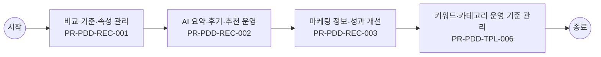

# Usecase: US-PDD-OPS-002 — 상품 비교·추천 기준 운영

## Flowchart

> 단순 직렬 흐름. 분기·게이트웨이는 `00_INDEX.md` BPMN 다이어그램 참조.



## Process: PR-PDD-REC-001 — 비교 기준·속성 관리 {#process-PR-PDD-REC-001}

```yaml
프로세스_ID: PR-PDD-REC-001
프로세스명: 비교 기준·속성 관리
설명: 운영자가 상품군별 비교 가능 속성, 단위, 용어, 노출 우선순위, 기본 비교세트를 관리한다.
관련_기능: [FN-PDD-COMPARE-001, FN-PDD-MARKETING-001]
```

| 항목 | 내용 |
| --- | --- |
| 액터 | 운영자 |
| 진입 조건 | 운영자가 상품 비교·추천 기준 운영 업무를 시작하고 상품군, 운영 대상 상품군, 변경 사유, 배포 범위 중 최소 1개 기준이 확인된 경우 진입한다. |
| 종료 조건 | 비교 기준·속성 관리 결과가 성공, 제한, 보완 필요 중 하나로 확정되고 PR-PDD-REC-002 AI 요약·후기·추천 운영로 넘길 입력값과 판단 근거가 저장되면 종료한다. |
| 선행 프로세스 | 업무 진입 조건 충족 |
| 후행 프로세스 | PR-PDD-REC-002 AI 요약·후기·추천 운영 |

### Function: FN-PDD-COMPARE-001

```yaml
기능_ID: FN-PDD-COMPARE-001
기능명: 상품 비교 기준 적용
설명: 상품군별 비교 속성과 고객 현재 조건을 기준으로 비교표를 구성한다.
관련_정책_그룹: [PG-PDD-COMPARE-001, PG-PDD-PRICE-001, PG-PDD-OPS-001]
```

| 항목 | 내용 |
| --- | --- |
| 입력 정보 | 상품 ID, 상품군, 판매 상태, 대표 가격·혜택 정보 고객 진입 경로와 조회 세션 정보 상품 상세 템플릿의 필수 섹션과 노출 우선순위 고객에게 숨겨야 할 내부 코드·운영 문구 제외 기준 |
| 세부 기능 구성 | 비교 속성 기본 비교세트 고객 기준값 조건 수정 요금제 비교 |
| 출력 정보 | 고객용 상품 요약과 상세 섹션 노출 결과 상품군별 필수 정보 표시 여부 미노출·대체 안내 사유 상품 상세 조회와 비교·담기 전환 이력 |
| 처리 흐름 | (상태) 상품 상세 진입 → (액션) 상품 비교 기준 적용에 필요한 상품군·판매상태·핵심 속성을 원장 기준으로 조립 → (결과) 고객이 상품 목적과 가입 가능성을 먼저 이해할 수 있는 요약 영역 구성 (상태) 추가 설명 확인 → (액션) 미디어, 스펙, 후기, Q&A, 유의사항을 고객 의사결정 순서로 재배치 → (결과) 상품 이해에 필요한 정보와 내부 운영 문구를 분리 표시 (상태) 정보 부족 또는 노출 제한 발생 → (액션) 대체 설명, 상담 연결, 미노출 사유를 정책 기준으로 선택 → (결과) 빈 화면 없이 다음 탐색 또는 문의 경로 제공 |
| 실패/예외 케이스 | 상품 기준 정보가 누락되면 해당 섹션을 숨기지 않고 보완 필요 또는 상담 가능 경로를 안내한다. 내부 운영 코드나 원장 필드명이 고객 문구로 노출되면 배포를 제한한다. 미디어·후기·스펙 로딩 실패 시 핵심 요약과 가격·조건 판단은 유지한다. |

#### Policy Group: PG-PDD-COMPARE-001

```yaml
정책_ID: PG-PDD-COMPARE-001
정책명: 비교·추천·AI 요약 정책
설명: 상품 비교, AI 요약, 추천, 후기 요약, atomic view 기준을 정의한다.
```

| Policy Item ID | 정책 항목명 | 정책 항목 |
| --- | --- | --- |
| `PI-PDD-COMPARE-001-01` | 비교 기준 | 비교표는 상품군별 표준 속성, 단위, 용어, 노출 우선순위를 따른다. 요금제, 로밍, 약정, 보험, 웨이브, 단말 비교는 상품군별 필수 비교 항목을 다르게 둔다. |
| `PI-PDD-COMPARE-001-02` | AI 요약 | 상품 핵심 특징 AI 요약은 원장 정보 상위에 제공하되 생성 기준, 반영 시점, 요약 대상 범위, 원문 이동 경로를 함께 표시한다. |
| `PI-PDD-COMPARE-001-03` | 추천 근거 | AI 추천은 고객의 가입 정보, 데이터 사용량, 결합 여부, 보유 혜택, 월 예상 부담 중 사용한 기준을 표시한다. 고객이 조건을 수정하면 추천 결과를 재탐색할 수 있어야 한다. |
| `PI-PDD-COMPARE-001-04` | 후기 요약 | 상품 구매 후기 AI 요약은 장점과 단점을 균형 있게 제공한다. 요약만으로 판단하지 않도록 원문 후기, 평점 세부, Q&A로 이동할 수 있게 한다. |
| `PI-PDD-COMPARE-001-05` | atomic view | 상품 상세 AI atomic view는 고객 세그먼트, 가입·해지 맥락, 현재 상태에 맞춰 원장 정보를 재조립하되 원장 값과 다르게 표현할 수 없다. |
| `PI-PDD-COMPARE-001-06` | 상품군별 비교 템플릿 | 요금제, 로밍, 약정, 보험, 웨이브, 단말 비교는 각 상품군의 필수 비교 속성을 다르게 둔다. BSS 또는 Product Catalog에서 제공한 기준값을 사용하고 고객이 조건을 수정하면 비교 결과를 다시 산정한다. |
| `PI-PDD-COMPARE-001-07` | 대체 옵션 추천 | 선택한 색상·용량이 품절 또는 일시품절이면 재고가 있는 대체 색상·용량, 입고 알림, 다른 상품 비교 중 하나 이상을 제공한다. 대체 추천은 재고 기준 시각을 함께 표시한다. |

#### Policy Group: PG-PDD-PRICE-001

```yaml
정책_ID: PG-PDD-PRICE-001
정책명: 가격·혜택·가치 표시 정책
설명: 가격, 할인, 혜택, 예상 부담, 마케팅 정보 표시 기준을 정의한다.
```

| Policy Item ID | 정책 항목명 | 정책 항목 |
| --- | --- | --- |
| `PI-PDD-PRICE-001-01` | 가격 기준 | 가격은 정가, 할인가, 실구매가, 예상 절감, 월 기준, 1회성 비용을 구분한다. 고객 상태가 반영된 실구매가는 담기 전까지 최신 조건으로 재산정한다. |
| `PI-PDD-PRICE-001-02` | 혜택 분리 | 쿠폰, 포인트, 제휴 혜택, 사은품, 마케팅 프로그램 혜택은 혜택별 적용 조건, 기간, 사용처, 제외 사유를 분리해 표시한다. 중복 적용 불가 혜택은 불가 사유를 함께 표시한다. |
| `PI-PDD-PRICE-001-03` | 공시지원금 | 단말 상품은 출고가, 공시지원금, 선택약정 할인 적용가, 약정 기간 차이를 비교 가능한 단위로 제공한다. 공시지원금 고지 기준은 고객이 담기 전 확인 가능한 위치에 둔다. |
| `PI-PDD-PRICE-001-04` | 마케팅 정보 | 제휴카드 할인, 사은품, 구매 유도 혜택은 적용 조건, 유지 조건, 제외 조건을 함께 표시한다. 마케팅 문구가 가격 또는 가입 가능성을 오인하게 하면 노출을 제한한다. |
| `PI-PDD-PRICE-001-05` | 실사용 빈도 가치 | 구독·혜택성 상품은 월 N회 사용 시 구독료 이상의 가치처럼 고객이 이해할 수 있는 실사용 빈도 예시를 제공한다. 예시는 과장 없이 적용 조건과 제외 조건을 함께 표시한다. |
| `PI-PDD-PRICE-001-06` | 선물가 문구 | 일반 가격과 동일한 선물가는 별도 선물가로 강조하지 않는다. 고객에게 가격 차이가 있는 것처럼 오인될 수 있는 툴팁이나 문구는 노출하지 않는다. |
| `PI-PDD-PRICE-001-07` | 구독가 비교 | 기존 일반 구독가와 T우주 또는 채널 내 구독가 혜택을 비교할 때는 월 기준 금액, 할인 기간, 할인 종료 후 금액, 적용 제외 조건을 함께 표시한다. |

#### Policy Group: PG-PDD-OPS-001

```yaml
정책_ID: PG-PDD-OPS-001
정책명: 운영자 템플릿·정책문구 관리 정책
설명: 운영자가 템플릿, 비교 기준, 정책 문구를 안전하게 운영하는 기준을 정의한다.
```

| Policy Item ID | 정책 항목명 | 정책 항목 |
| --- | --- | --- |
| `PI-PDD-OPS-001-01` | 버전 관리 | 템플릿, 정책 문구, 비교 기준, 상품 조합 정책 변경은 버전, 적용일, 변경자, 변경 전후, 영향 상품을 저장한다. |
| `PI-PDD-OPS-001-02` | 영향도 확인 | 운영 정책 변경 전에는 고객 판정 결과, 담기 가능성, 노출 문구, 기존 담기 상태에 미치는 영향을 미리 확인한다. |
| `PI-PDD-OPS-001-03` | 미리보기 | 운영자는 상품군, 고객 상태, 판매 상태, 재고 상태, 혜택 조건을 바꿔가며 상품 상세와 담기 문구를 미리보기로 확인할 수 있어야 한다. |
| `PI-PDD-OPS-001-04` | 변경 이력 | 정책 문구와 템플릿 변경 이력은 최소 1년 보관한다. 고객 안내에 영향을 준 변경은 고객 문의와 재현 검증이 가능해야 한다. |

### Function: FN-PDD-MARKETING-001

```yaml
기능_ID: FN-PDD-MARKETING-001
기능명: 마케팅·비교 콘텐츠 운영
설명: 제휴카드 할인, 사은품, 추천 컴포넌트, 비교 콘텐츠와 성과 개선 기준을 운영한다.
관련_정책_그룹: [PG-PDD-COMPARE-001, PG-PDD-OPS-001, PG-PDD-PRICE-001, PG-PDD-AUDIT-001, PG-PDD-STOCK-001]
```

| 항목 | 내용 |
| --- | --- |
| 입력 정보 | 운영 대상 상품군, 템플릿 버전, 변경 사유, 배포 범위 Product Catalog, 가격·혜택, 재고·판매 상태, 외부채널 설정값 검수 상태, 승인자, 배포 시점, 고객 노출 영향도 운영 변경 이력, 실패율, 전환율, 알림·에스컬레이션 기준 |
| 세부 기능 구성 | 제휴카드 사은품 추천 컴포넌트 성과 개선 |
| 출력 정보 | 운영 변경 결과와 배포 상태 검수 오류·경고·승인 필요 항목 고객 노출 영향도와 롤백 가능 여부 운영 변경·알림·조치 이력 |
| 처리 흐름 | (상태) 운영 변경 요청 → (액션) 마케팅·비교 콘텐츠 운영 대상의 상품군, 변경 사유, 검수 상태, 배포 범위를 확인 → (결과) 운영자가 변경 가능한 항목과 승인 필요 항목 구분 (상태) 검수·배포 준비 → (액션) Product Catalog, 판매 상태, 정책 문구, 외부채널 설정 간 불일치를 점검 → (결과) 고객 노출 전 오류·누락·충돌 항목 차단 (상태) 배포 후 이상 감지 → (액션) 실패율, 담기 전환율, 고객 문의, 알림 이력을 기준으로 영향 범위 산정 → (결과) 롤백, 보정, 재배포, 상담 공지 중 후속 조치 실행 |
| 실패/예외 케이스 | 운영 입력값이 상품군 필수 기준을 충족하지 않으면 저장보다 검수 보류를 우선한다. 배포 후 고객 영향이 큰 오류가 감지되면 자동 보정 대신 롤백 또는 임시 중단 기준을 적용한다. 외부채널 또는 Product Catalog 회신이 지연되면 고객 노출 상태와 운영 알림을 분리 관리한다. |

#### Policy Group: PG-PDD-COMPARE-001

```yaml
정책_ID: PG-PDD-COMPARE-001
정책명: 비교·추천·AI 요약 정책
설명: 상품 비교, AI 요약, 추천, 후기 요약, atomic view 기준을 정의한다.
```

| Policy Item ID | 정책 항목명 | 정책 항목 |
| --- | --- | --- |
| `PI-PDD-COMPARE-001-01` | 비교 기준 | 비교표는 상품군별 표준 속성, 단위, 용어, 노출 우선순위를 따른다. 요금제, 로밍, 약정, 보험, 웨이브, 단말 비교는 상품군별 필수 비교 항목을 다르게 둔다. |
| `PI-PDD-COMPARE-001-02` | AI 요약 | 상품 핵심 특징 AI 요약은 원장 정보 상위에 제공하되 생성 기준, 반영 시점, 요약 대상 범위, 원문 이동 경로를 함께 표시한다. |
| `PI-PDD-COMPARE-001-03` | 추천 근거 | AI 추천은 고객의 가입 정보, 데이터 사용량, 결합 여부, 보유 혜택, 월 예상 부담 중 사용한 기준을 표시한다. 고객이 조건을 수정하면 추천 결과를 재탐색할 수 있어야 한다. |
| `PI-PDD-COMPARE-001-04` | 후기 요약 | 상품 구매 후기 AI 요약은 장점과 단점을 균형 있게 제공한다. 요약만으로 판단하지 않도록 원문 후기, 평점 세부, Q&A로 이동할 수 있게 한다. |
| `PI-PDD-COMPARE-001-05` | atomic view | 상품 상세 AI atomic view는 고객 세그먼트, 가입·해지 맥락, 현재 상태에 맞춰 원장 정보를 재조립하되 원장 값과 다르게 표현할 수 없다. |
| `PI-PDD-COMPARE-001-06` | 상품군별 비교 템플릿 | 요금제, 로밍, 약정, 보험, 웨이브, 단말 비교는 각 상품군의 필수 비교 속성을 다르게 둔다. BSS 또는 Product Catalog에서 제공한 기준값을 사용하고 고객이 조건을 수정하면 비교 결과를 다시 산정한다. |
| `PI-PDD-COMPARE-001-07` | 대체 옵션 추천 | 선택한 색상·용량이 품절 또는 일시품절이면 재고가 있는 대체 색상·용량, 입고 알림, 다른 상품 비교 중 하나 이상을 제공한다. 대체 추천은 재고 기준 시각을 함께 표시한다. |

#### Policy Group: PG-PDD-OPS-001

```yaml
정책_ID: PG-PDD-OPS-001
정책명: 운영자 템플릿·정책문구 관리 정책
설명: 운영자가 템플릿, 비교 기준, 정책 문구를 안전하게 운영하는 기준을 정의한다.
```

| Policy Item ID | 정책 항목명 | 정책 항목 |
| --- | --- | --- |
| `PI-PDD-OPS-001-01` | 버전 관리 | 템플릿, 정책 문구, 비교 기준, 상품 조합 정책 변경은 버전, 적용일, 변경자, 변경 전후, 영향 상품을 저장한다. |
| `PI-PDD-OPS-001-02` | 영향도 확인 | 운영 정책 변경 전에는 고객 판정 결과, 담기 가능성, 노출 문구, 기존 담기 상태에 미치는 영향을 미리 확인한다. |
| `PI-PDD-OPS-001-03` | 미리보기 | 운영자는 상품군, 고객 상태, 판매 상태, 재고 상태, 혜택 조건을 바꿔가며 상품 상세와 담기 문구를 미리보기로 확인할 수 있어야 한다. |
| `PI-PDD-OPS-001-04` | 변경 이력 | 정책 문구와 템플릿 변경 이력은 최소 1년 보관한다. 고객 안내에 영향을 준 변경은 고객 문의와 재현 검증이 가능해야 한다. |

#### Policy Group: PG-PDD-PRICE-001

```yaml
정책_ID: PG-PDD-PRICE-001
정책명: 가격·혜택·가치 표시 정책
설명: 가격, 할인, 혜택, 예상 부담, 마케팅 정보 표시 기준을 정의한다.
```

| Policy Item ID | 정책 항목명 | 정책 항목 |
| --- | --- | --- |
| `PI-PDD-PRICE-001-01` | 가격 기준 | 가격은 정가, 할인가, 실구매가, 예상 절감, 월 기준, 1회성 비용을 구분한다. 고객 상태가 반영된 실구매가는 담기 전까지 최신 조건으로 재산정한다. |
| `PI-PDD-PRICE-001-02` | 혜택 분리 | 쿠폰, 포인트, 제휴 혜택, 사은품, 마케팅 프로그램 혜택은 혜택별 적용 조건, 기간, 사용처, 제외 사유를 분리해 표시한다. 중복 적용 불가 혜택은 불가 사유를 함께 표시한다. |
| `PI-PDD-PRICE-001-03` | 공시지원금 | 단말 상품은 출고가, 공시지원금, 선택약정 할인 적용가, 약정 기간 차이를 비교 가능한 단위로 제공한다. 공시지원금 고지 기준은 고객이 담기 전 확인 가능한 위치에 둔다. |
| `PI-PDD-PRICE-001-04` | 마케팅 정보 | 제휴카드 할인, 사은품, 구매 유도 혜택은 적용 조건, 유지 조건, 제외 조건을 함께 표시한다. 마케팅 문구가 가격 또는 가입 가능성을 오인하게 하면 노출을 제한한다. |
| `PI-PDD-PRICE-001-05` | 실사용 빈도 가치 | 구독·혜택성 상품은 월 N회 사용 시 구독료 이상의 가치처럼 고객이 이해할 수 있는 실사용 빈도 예시를 제공한다. 예시는 과장 없이 적용 조건과 제외 조건을 함께 표시한다. |
| `PI-PDD-PRICE-001-06` | 선물가 문구 | 일반 가격과 동일한 선물가는 별도 선물가로 강조하지 않는다. 고객에게 가격 차이가 있는 것처럼 오인될 수 있는 툴팁이나 문구는 노출하지 않는다. |
| `PI-PDD-PRICE-001-07` | 구독가 비교 | 기존 일반 구독가와 T우주 또는 채널 내 구독가 혜택을 비교할 때는 월 기준 금액, 할인 기간, 할인 종료 후 금액, 적용 제외 조건을 함께 표시한다. |

#### Policy Group: PG-PDD-AUDIT-001

```yaml
정책_ID: PG-PDD-AUDIT-001
정책명: 이력·성과·개선 정책
설명: 담기와 상품 상세의 판정·변경·성과·개선 이력 기준을 정의한다.
```

| Policy Item ID | 정책 항목명 | 정책 항목 |
| --- | --- | --- |
| `PI-PDD-AUDIT-001-01` | 판정 이력 | 가입 가능성, 담기 가능성, 조합 충돌, 재고 부족, 인증 필요 판정은 기준 시각과 판정 근거를 이력으로 저장한다. |
| `PI-PDD-AUDIT-001-02` | 변경 이력 | 상품 원장, 템플릿, 비교 기준, 마케팅 정보, 정책 문구 변경은 변경 전후와 승인 결과를 함께 저장한다. |
| `PI-PDD-AUDIT-001-03` | 성과 리포트 | 상품 상세과 담기 성과는 노출 수, 진입 수, 비교 이용 수, 담기 성공률, 실패율, 상담 전환율, 주문 전환율 기준으로 집계한다. |
| `PI-PDD-AUDIT-001-04` | 개선 추적 | 반복 실패 유형과 미조치 알림은 개선 대상 목록으로 관리한다. 조치 완료 후 동일 유형 재발 여부를 확인해 정책 또는 원장 개선으로 연결한다. |

#### Policy Group: PG-PDD-STOCK-001

```yaml
정책_ID: PG-PDD-STOCK-001
정책명: 재고·배송·예약판매 운영 정책
설명: 재고, 수량 제한, 배송 가능성, 예약판매, 시장 대응 운영 기준을 정의한다.
```

| Policy Item ID | 정책 항목명 | 정책 항목 |
| --- | --- | --- |
| `PI-PDD-STOCK-001-01` | 재고 기준 | 옵션별 재고 현황 표시와 수량 제한은 상품 선택 전과 담기 직전에 모두 확인한다. 재고 부족 시 수량 조정, 다른 옵션, 입고 알림을 제공한다. |
| `PI-PDD-STOCK-001-02` | 배송 가능성 | 배송, 픽업, 설치가 필요한 상품은 배송 유형과 지역·일정 조건을 기준으로 주문 가능 여부를 표시한다. |
| `PI-PDD-STOCK-001-03` | 예약판매 | 예약판매 상품은 사전 체크리스트, 입력값 세팅, 오픈 시각, 종료 시각, 수량 제한을 정책으로 관리한다. 시작 전에는 예약 가능 시점과 제한 조건을 안내한다. |
| `PI-PDD-STOCK-001-04` | 시장 대응 | 전략 단말과 시장 정책 변동은 추가지원금, 판매 상태, 마케팅 혜택에 영향을 주는 경우 운영자가 변경 기준과 반영 시점을 관리한다. |

## Process: PR-PDD-REC-002 — AI 요약·후기·추천 운영 {#process-PR-PDD-REC-002}

```yaml
프로세스_ID: PR-PDD-REC-002
프로세스명: AI 요약·후기·추천 운영
설명: 운영자가 AI 요약 대상, 추천 근거, 후기 요약 기준, 원문 이동 경로를 등록·검수하고 노출 가능 여부를 승인한다.
관련_기능: [FN-PDD-AI-001, FN-PDD-REVIEW-001]
```

| 항목 | 내용 |
| --- | --- |
| 액터 | 운영자 |
| 진입 조건 | PR-PDD-REC-001 비교 기준·속성 관리 결과가 고객에게 표시되었고, 고객 또는 운영자가 다음 판단을 계속하기로 선택한 경우 진입한다. |
| 종료 조건 | AI 요약·후기·추천 운영 결과가 성공, 제한, 보완 필요 중 하나로 확정되고 PR-PDD-REC-003 마케팅 정보·성과 개선로 넘길 입력값과 판단 근거가 저장되면 종료한다. |
| 선행 프로세스 | PR-PDD-REC-001 비교 기준·속성 관리 |
| 후행 프로세스 | PR-PDD-REC-003 마케팅 정보·성과 개선 |

### Function: FN-PDD-AI-001

```yaml
기능_ID: FN-PDD-AI-001
기능명: AI 요약·추천·atomic view
설명: 상품 원장, 후기, 고객 맥락을 바탕으로 AI 요약, 추천, atomic view를 생성한다.
관련_정책_그룹: [PG-PDD-COMPARE-001, PG-PDD-AUDIT-001]
```

| 항목 | 내용 |
| --- | --- |
| 입력 정보 | 상품 설명, 후기·Q&A, 비교 속성, 고객 질의 문맥 출처가 확인된 상품 기준 정보와 운영자가 승인한 문구 추천 제외 조건, 미충족 사유, 자동화 신뢰도 기준 AI 결과 고객 통제와 상담 전환 기준 |
| 세부 기능 구성 | AI 요약 추천 근거 후기 요약 atomic view 유사상품 AI 비교 |
| 출력 정보 | 고객용 상품 요약과 상세 섹션 노출 결과 상품군별 필수 정보 표시 여부 미노출·대체 안내 사유 상품 상세 조회와 비교·담기 전환 이력 |
| 처리 흐름 | (상태) 상품 상세 진입 → (액션) AI 요약·추천·atomic view에 필요한 상품군·판매상태·핵심 속성을 원장 기준으로 조립 → (결과) 고객이 상품 목적과 가입 가능성을 먼저 이해할 수 있는 요약 영역 구성 (상태) 추가 설명 확인 → (액션) 미디어, 스펙, 후기, Q&A, 유의사항을 고객 의사결정 순서로 재배치 → (결과) 상품 이해에 필요한 정보와 내부 운영 문구를 분리 표시 (상태) 정보 부족 또는 노출 제한 발생 → (액션) 대체 설명, 상담 연결, 미노출 사유를 정책 기준으로 선택 → (결과) 빈 화면 없이 다음 탐색 또는 문의 경로 제공 |
| 실패/예외 케이스 | 상품 기준 정보가 누락되면 해당 섹션을 숨기지 않고 보완 필요 또는 상담 가능 경로를 안내한다. 내부 운영 코드나 원장 필드명이 고객 문구로 노출되면 배포를 제한한다. 미디어·후기·스펙 로딩 실패 시 핵심 요약과 가격·조건 판단은 유지한다. |

#### Policy Group: PG-PDD-COMPARE-001

```yaml
정책_ID: PG-PDD-COMPARE-001
정책명: 비교·추천·AI 요약 정책
설명: 상품 비교, AI 요약, 추천, 후기 요약, atomic view 기준을 정의한다.
```

| Policy Item ID | 정책 항목명 | 정책 항목 |
| --- | --- | --- |
| `PI-PDD-COMPARE-001-01` | 비교 기준 | 비교표는 상품군별 표준 속성, 단위, 용어, 노출 우선순위를 따른다. 요금제, 로밍, 약정, 보험, 웨이브, 단말 비교는 상품군별 필수 비교 항목을 다르게 둔다. |
| `PI-PDD-COMPARE-001-02` | AI 요약 | 상품 핵심 특징 AI 요약은 원장 정보 상위에 제공하되 생성 기준, 반영 시점, 요약 대상 범위, 원문 이동 경로를 함께 표시한다. |
| `PI-PDD-COMPARE-001-03` | 추천 근거 | AI 추천은 고객의 가입 정보, 데이터 사용량, 결합 여부, 보유 혜택, 월 예상 부담 중 사용한 기준을 표시한다. 고객이 조건을 수정하면 추천 결과를 재탐색할 수 있어야 한다. |
| `PI-PDD-COMPARE-001-04` | 후기 요약 | 상품 구매 후기 AI 요약은 장점과 단점을 균형 있게 제공한다. 요약만으로 판단하지 않도록 원문 후기, 평점 세부, Q&A로 이동할 수 있게 한다. |
| `PI-PDD-COMPARE-001-05` | atomic view | 상품 상세 AI atomic view는 고객 세그먼트, 가입·해지 맥락, 현재 상태에 맞춰 원장 정보를 재조립하되 원장 값과 다르게 표현할 수 없다. |
| `PI-PDD-COMPARE-001-06` | 상품군별 비교 템플릿 | 요금제, 로밍, 약정, 보험, 웨이브, 단말 비교는 각 상품군의 필수 비교 속성을 다르게 둔다. BSS 또는 Product Catalog에서 제공한 기준값을 사용하고 고객이 조건을 수정하면 비교 결과를 다시 산정한다. |
| `PI-PDD-COMPARE-001-07` | 대체 옵션 추천 | 선택한 색상·용량이 품절 또는 일시품절이면 재고가 있는 대체 색상·용량, 입고 알림, 다른 상품 비교 중 하나 이상을 제공한다. 대체 추천은 재고 기준 시각을 함께 표시한다. |

#### Policy Group: PG-PDD-AUDIT-001

```yaml
정책_ID: PG-PDD-AUDIT-001
정책명: 이력·성과·개선 정책
설명: 담기와 상품 상세의 판정·변경·성과·개선 이력 기준을 정의한다.
```

| Policy Item ID | 정책 항목명 | 정책 항목 |
| --- | --- | --- |
| `PI-PDD-AUDIT-001-01` | 판정 이력 | 가입 가능성, 담기 가능성, 조합 충돌, 재고 부족, 인증 필요 판정은 기준 시각과 판정 근거를 이력으로 저장한다. |
| `PI-PDD-AUDIT-001-02` | 변경 이력 | 상품 원장, 템플릿, 비교 기준, 마케팅 정보, 정책 문구 변경은 변경 전후와 승인 결과를 함께 저장한다. |
| `PI-PDD-AUDIT-001-03` | 성과 리포트 | 상품 상세과 담기 성과는 노출 수, 진입 수, 비교 이용 수, 담기 성공률, 실패율, 상담 전환율, 주문 전환율 기준으로 집계한다. |
| `PI-PDD-AUDIT-001-04` | 개선 추적 | 반복 실패 유형과 미조치 알림은 개선 대상 목록으로 관리한다. 조치 완료 후 동일 유형 재발 여부를 확인해 정책 또는 원장 개선으로 연결한다. |

### Function: FN-PDD-REVIEW-001

```yaml
기능_ID: FN-PDD-REVIEW-001
기능명: 상품 리뷰·평점·Q&A 제공
설명: 상품 리뷰, 평점, Q&A와 구매후기 AI 요약을 최신순·도움순·유형별 필터와 신고·가림 기준으로 제공한다.
관련_정책_그룹: [PG-PDD-SUMMARY-001, PG-PDD-COMPARE-001, PG-PDD-AUDIT-001, PG-PDD-REVIEW-001]
```

| 항목 | 내용 |
| --- | --- |
| 입력 정보 | 상품 ID, 상품군, 판매 상태, 대표 가격·혜택 정보 고객 진입 경로와 조회 세션 정보 상품 상세 템플릿의 필수 섹션과 노출 우선순위 고객에게 숨겨야 할 내부 코드·운영 문구 제외 기준 |
| 세부 기능 구성 | 후기 목록 평점 요약 Q&A 필터 신고 처리 필터 완화 안내 |
| 출력 정보 | 고객용 상품 요약과 상세 섹션 노출 결과 상품군별 필수 정보 표시 여부 미노출·대체 안내 사유 상품 상세 조회와 비교·담기 전환 이력 |
| 처리 흐름 | (상태) 상품 상세 진입 → (액션) 상품 리뷰·평점·Q&A 제공에 필요한 상품군·판매상태·핵심 속성을 원장 기준으로 조립 → (결과) 고객이 상품 목적과 가입 가능성을 먼저 이해할 수 있는 요약 영역 구성 (상태) 추가 설명 확인 → (액션) 미디어, 스펙, 후기, Q&A, 유의사항을 고객 의사결정 순서로 재배치 → (결과) 상품 이해에 필요한 정보와 내부 운영 문구를 분리 표시 (상태) 정보 부족 또는 노출 제한 발생 → (액션) 대체 설명, 상담 연결, 미노출 사유를 정책 기준으로 선택 → (결과) 빈 화면 없이 다음 탐색 또는 문의 경로 제공 |
| 실패/예외 케이스 | 상품 기준 정보가 누락되면 해당 섹션을 숨기지 않고 보완 필요 또는 상담 가능 경로를 안내한다. 내부 운영 코드나 원장 필드명이 고객 문구로 노출되면 배포를 제한한다. 미디어·후기·스펙 로딩 실패 시 핵심 요약과 가격·조건 판단은 유지한다. |

#### Policy Group: PG-PDD-SUMMARY-001

```yaml
정책_ID: PG-PDD-SUMMARY-001
정책명: 상품 요약·미디어·스펙 표시 정책
설명: 상품 요약, 이미지, 미디어, 스펙, 후기, Q&A 표시 기준을 정의한다.
```

| Policy Item ID | 정책 항목명 | 정책 항목 |
| --- | --- | --- |
| `PI-PDD-SUMMARY-001-01` | 핵심 요약 | 상품 상세 요약은 상품명, 대표 이미지, 상품 유형, 가격·할인 유형, 핵심 혜택, 가입 가능성 중 최소 5개 항목을 상단에 제공한다. 고객 상태 기반 문구는 로그인 상태에서만 개인화한다. 상품정보 및 가격 확인은 고객이 담기 전 동일 요약 영역에서 수행할 수 있어야 한다. |
| `PI-PDD-SUMMARY-001-02` | 미디어 뷰어 | 상품 이미지, 배너, 동영상은 확대와 스와이프를 허용하고, 대체텍스트를 필수로 둔다. 미디어가 상품 조건을 설명하는 경우 동일 정보를 텍스트로도 제공한다. |
| `PI-PDD-SUMMARY-001-03` | 스펙 요약 | 상품 설명과 스펙은 요약과 상세 펼침으로 구분한다. 요약 영역에는 고객이 담기 전 판단해야 할 조건, 제한, 기간, 대상 여부를 우선 표시한다. |
| `PI-PDD-SUMMARY-001-04` | 상품 리뷰·평점·Q&A | 상품 리뷰·평점·Q&A 제공 영역은 최신순, 도움순, 유형별 필터를 제공한다. 신고·가림 대상은 운영 정책에 따라 제한하고, 답변 상태와 원문 이동 경로를 함께 제공한다. |
| `PI-PDD-SUMMARY-001-05` | 브랜드·판매주체·이행방식 | 상품 상세에는 브랜드, 판매주체, 즉시 사용·배송·설치·외부 제휴·전문 채널 연계 같은 이행방식을 명확히 표시한다. 고객이 주문 후 누가 이행하고 어디에서 처리되는지 알 수 있어야 한다. |

#### Policy Group: PG-PDD-COMPARE-001

```yaml
정책_ID: PG-PDD-COMPARE-001
정책명: 비교·추천·AI 요약 정책
설명: 상품 비교, AI 요약, 추천, 후기 요약, atomic view 기준을 정의한다.
```

| Policy Item ID | 정책 항목명 | 정책 항목 |
| --- | --- | --- |
| `PI-PDD-COMPARE-001-01` | 비교 기준 | 비교표는 상품군별 표준 속성, 단위, 용어, 노출 우선순위를 따른다. 요금제, 로밍, 약정, 보험, 웨이브, 단말 비교는 상품군별 필수 비교 항목을 다르게 둔다. |
| `PI-PDD-COMPARE-001-02` | AI 요약 | 상품 핵심 특징 AI 요약은 원장 정보 상위에 제공하되 생성 기준, 반영 시점, 요약 대상 범위, 원문 이동 경로를 함께 표시한다. |
| `PI-PDD-COMPARE-001-03` | 추천 근거 | AI 추천은 고객의 가입 정보, 데이터 사용량, 결합 여부, 보유 혜택, 월 예상 부담 중 사용한 기준을 표시한다. 고객이 조건을 수정하면 추천 결과를 재탐색할 수 있어야 한다. |
| `PI-PDD-COMPARE-001-04` | 후기 요약 | 상품 구매 후기 AI 요약은 장점과 단점을 균형 있게 제공한다. 요약만으로 판단하지 않도록 원문 후기, 평점 세부, Q&A로 이동할 수 있게 한다. |
| `PI-PDD-COMPARE-001-05` | atomic view | 상품 상세 AI atomic view는 고객 세그먼트, 가입·해지 맥락, 현재 상태에 맞춰 원장 정보를 재조립하되 원장 값과 다르게 표현할 수 없다. |
| `PI-PDD-COMPARE-001-06` | 상품군별 비교 템플릿 | 요금제, 로밍, 약정, 보험, 웨이브, 단말 비교는 각 상품군의 필수 비교 속성을 다르게 둔다. BSS 또는 Product Catalog에서 제공한 기준값을 사용하고 고객이 조건을 수정하면 비교 결과를 다시 산정한다. |
| `PI-PDD-COMPARE-001-07` | 대체 옵션 추천 | 선택한 색상·용량이 품절 또는 일시품절이면 재고가 있는 대체 색상·용량, 입고 알림, 다른 상품 비교 중 하나 이상을 제공한다. 대체 추천은 재고 기준 시각을 함께 표시한다. |

#### Policy Group: PG-PDD-AUDIT-001

```yaml
정책_ID: PG-PDD-AUDIT-001
정책명: 이력·성과·개선 정책
설명: 담기와 상품 상세의 판정·변경·성과·개선 이력 기준을 정의한다.
```

| Policy Item ID | 정책 항목명 | 정책 항목 |
| --- | --- | --- |
| `PI-PDD-AUDIT-001-01` | 판정 이력 | 가입 가능성, 담기 가능성, 조합 충돌, 재고 부족, 인증 필요 판정은 기준 시각과 판정 근거를 이력으로 저장한다. |
| `PI-PDD-AUDIT-001-02` | 변경 이력 | 상품 원장, 템플릿, 비교 기준, 마케팅 정보, 정책 문구 변경은 변경 전후와 승인 결과를 함께 저장한다. |
| `PI-PDD-AUDIT-001-03` | 성과 리포트 | 상품 상세과 담기 성과는 노출 수, 진입 수, 비교 이용 수, 담기 성공률, 실패율, 상담 전환율, 주문 전환율 기준으로 집계한다. |
| `PI-PDD-AUDIT-001-04` | 개선 추적 | 반복 실패 유형과 미조치 알림은 개선 대상 목록으로 관리한다. 조치 완료 후 동일 유형 재발 여부를 확인해 정책 또는 원장 개선으로 연결한다. |

#### Policy Group: PG-PDD-REVIEW-001

```yaml
정책_ID: PG-PDD-REVIEW-001
정책명: 후기·Q&A 운영 정책
설명: 구매후기, 평점, Q&A, 답변, 신고·가림, 마스킹, 결과 없음 처리 기준을 정의한다.
```

| Policy Item ID | 정책 항목명 | 정책 항목 |
| --- | --- | --- |
| `PI-PDD-REVIEW-001-01` | 공통 컬럼 | 구매후기와 Q&A는 상품군별로 다른 컬럼을 쓰더라도 고객 표시 기준은 작성자, 작성일, 평점, 유형, 답변 상태, 신고·가림 여부 중심으로 표준화한다. |
| `PI-PDD-REVIEW-001-02` | 마스킹 | 후기 작성자 정보는 개인정보가 드러나지 않도록 마스킹한다. 마스킹 전 원문은 권한 있는 운영자만 확인하고 조회 이력을 저장한다. |
| `PI-PDD-REVIEW-001-03` | 답변 상태 | Q&A 답변은 답변 등록 여부에 따라 미답변, 답변완료, 수정완료 상태를 자동 전환한다. 답변 수정 시 변경 전후와 수정자를 이력으로 저장한다. |
| `PI-PDD-REVIEW-001-04` | 결과 없음 | 후기 필터와 카테고리 탭을 동시에 적용해 결과가 없으면 조건 완화, 전체 후기 보기, 후기 작성 가능 여부 중 하나 이상을 안내한다. |
| `PI-PDD-REVIEW-001-05` | 후기 작성 유도 | 구매후기가 없는 상품에서 고객에게 구매 이력이 확인되면 후기 작성 유도 안내를 제공한다. 구매 이력이 없거나 작성 제한 상태인 고객에게는 작성 요청을 노출하지 않는다. |

## Process: PR-PDD-REC-003 — 마케팅 정보·성과 개선 {#process-PR-PDD-REC-003}

```yaml
프로세스_ID: PR-PDD-REC-003
프로세스명: 마케팅 정보·성과 개선
설명: 운영자가 제휴카드 할인, 사은품, 혜택성 정보, 전환 성과를 조회하고 구매 유도 콘텐츠 개선안을 반영한다.
관련_기능: [FN-PDD-MARKETING-001, FN-PDD-MONITOR-001]
```

| 항목 | 내용 |
| --- | --- |
| 액터 | 운영자 |
| 진입 조건 | PR-PDD-REC-002 AI 요약·후기·추천 운영 결과가 고객에게 표시되었고, 고객 또는 운영자가 다음 판단을 계속하기로 선택한 경우 진입한다. |
| 종료 조건 | 마케팅 정보·성과 개선 결과가 성공, 제한, 보완 필요 중 하나로 확정되고 PR-PDD-TPL-006 키워드·카테고리 운영 기준 관리로 넘길 입력값과 판단 근거가 저장되면 종료한다. |
| 선행 프로세스 | PR-PDD-REC-002 AI 요약·후기·추천 운영 |
| 후행 프로세스 | PR-PDD-TPL-006 키워드·카테고리 운영 기준 관리 |

### Function: FN-PDD-MARKETING-001

```yaml
기능_ID: FN-PDD-MARKETING-001
기능명: 마케팅·비교 콘텐츠 운영
설명: 제휴카드 할인, 사은품, 추천 컴포넌트, 비교 콘텐츠와 성과 개선 기준을 운영한다.
관련_정책_그룹: [PG-PDD-COMPARE-001, PG-PDD-OPS-001, PG-PDD-PRICE-001, PG-PDD-AUDIT-001, PG-PDD-STOCK-001]
```

| 항목 | 내용 |
| --- | --- |
| 입력 정보 | 운영 대상 상품군, 템플릿 버전, 변경 사유, 배포 범위 Product Catalog, 가격·혜택, 재고·판매 상태, 외부채널 설정값 검수 상태, 승인자, 배포 시점, 고객 노출 영향도 운영 변경 이력, 실패율, 전환율, 알림·에스컬레이션 기준 |
| 세부 기능 구성 | 제휴카드 사은품 추천 컴포넌트 성과 개선 |
| 출력 정보 | 운영 변경 결과와 배포 상태 검수 오류·경고·승인 필요 항목 고객 노출 영향도와 롤백 가능 여부 운영 변경·알림·조치 이력 |
| 처리 흐름 | (상태) 운영 변경 요청 → (액션) 마케팅·비교 콘텐츠 운영 대상의 상품군, 변경 사유, 검수 상태, 배포 범위를 확인 → (결과) 운영자가 변경 가능한 항목과 승인 필요 항목 구분 (상태) 검수·배포 준비 → (액션) Product Catalog, 판매 상태, 정책 문구, 외부채널 설정 간 불일치를 점검 → (결과) 고객 노출 전 오류·누락·충돌 항목 차단 (상태) 배포 후 이상 감지 → (액션) 실패율, 담기 전환율, 고객 문의, 알림 이력을 기준으로 영향 범위 산정 → (결과) 롤백, 보정, 재배포, 상담 공지 중 후속 조치 실행 |
| 실패/예외 케이스 | 운영 입력값이 상품군 필수 기준을 충족하지 않으면 저장보다 검수 보류를 우선한다. 배포 후 고객 영향이 큰 오류가 감지되면 자동 보정 대신 롤백 또는 임시 중단 기준을 적용한다. 외부채널 또는 Product Catalog 회신이 지연되면 고객 노출 상태와 운영 알림을 분리 관리한다. |

#### Policy Group: PG-PDD-COMPARE-001

```yaml
정책_ID: PG-PDD-COMPARE-001
정책명: 비교·추천·AI 요약 정책
설명: 상품 비교, AI 요약, 추천, 후기 요약, atomic view 기준을 정의한다.
```

| Policy Item ID | 정책 항목명 | 정책 항목 |
| --- | --- | --- |
| `PI-PDD-COMPARE-001-01` | 비교 기준 | 비교표는 상품군별 표준 속성, 단위, 용어, 노출 우선순위를 따른다. 요금제, 로밍, 약정, 보험, 웨이브, 단말 비교는 상품군별 필수 비교 항목을 다르게 둔다. |
| `PI-PDD-COMPARE-001-02` | AI 요약 | 상품 핵심 특징 AI 요약은 원장 정보 상위에 제공하되 생성 기준, 반영 시점, 요약 대상 범위, 원문 이동 경로를 함께 표시한다. |
| `PI-PDD-COMPARE-001-03` | 추천 근거 | AI 추천은 고객의 가입 정보, 데이터 사용량, 결합 여부, 보유 혜택, 월 예상 부담 중 사용한 기준을 표시한다. 고객이 조건을 수정하면 추천 결과를 재탐색할 수 있어야 한다. |
| `PI-PDD-COMPARE-001-04` | 후기 요약 | 상품 구매 후기 AI 요약은 장점과 단점을 균형 있게 제공한다. 요약만으로 판단하지 않도록 원문 후기, 평점 세부, Q&A로 이동할 수 있게 한다. |
| `PI-PDD-COMPARE-001-05` | atomic view | 상품 상세 AI atomic view는 고객 세그먼트, 가입·해지 맥락, 현재 상태에 맞춰 원장 정보를 재조립하되 원장 값과 다르게 표현할 수 없다. |
| `PI-PDD-COMPARE-001-06` | 상품군별 비교 템플릿 | 요금제, 로밍, 약정, 보험, 웨이브, 단말 비교는 각 상품군의 필수 비교 속성을 다르게 둔다. BSS 또는 Product Catalog에서 제공한 기준값을 사용하고 고객이 조건을 수정하면 비교 결과를 다시 산정한다. |
| `PI-PDD-COMPARE-001-07` | 대체 옵션 추천 | 선택한 색상·용량이 품절 또는 일시품절이면 재고가 있는 대체 색상·용량, 입고 알림, 다른 상품 비교 중 하나 이상을 제공한다. 대체 추천은 재고 기준 시각을 함께 표시한다. |

#### Policy Group: PG-PDD-OPS-001

```yaml
정책_ID: PG-PDD-OPS-001
정책명: 운영자 템플릿·정책문구 관리 정책
설명: 운영자가 템플릿, 비교 기준, 정책 문구를 안전하게 운영하는 기준을 정의한다.
```

| Policy Item ID | 정책 항목명 | 정책 항목 |
| --- | --- | --- |
| `PI-PDD-OPS-001-01` | 버전 관리 | 템플릿, 정책 문구, 비교 기준, 상품 조합 정책 변경은 버전, 적용일, 변경자, 변경 전후, 영향 상품을 저장한다. |
| `PI-PDD-OPS-001-02` | 영향도 확인 | 운영 정책 변경 전에는 고객 판정 결과, 담기 가능성, 노출 문구, 기존 담기 상태에 미치는 영향을 미리 확인한다. |
| `PI-PDD-OPS-001-03` | 미리보기 | 운영자는 상품군, 고객 상태, 판매 상태, 재고 상태, 혜택 조건을 바꿔가며 상품 상세와 담기 문구를 미리보기로 확인할 수 있어야 한다. |
| `PI-PDD-OPS-001-04` | 변경 이력 | 정책 문구와 템플릿 변경 이력은 최소 1년 보관한다. 고객 안내에 영향을 준 변경은 고객 문의와 재현 검증이 가능해야 한다. |

#### Policy Group: PG-PDD-PRICE-001

```yaml
정책_ID: PG-PDD-PRICE-001
정책명: 가격·혜택·가치 표시 정책
설명: 가격, 할인, 혜택, 예상 부담, 마케팅 정보 표시 기준을 정의한다.
```

| Policy Item ID | 정책 항목명 | 정책 항목 |
| --- | --- | --- |
| `PI-PDD-PRICE-001-01` | 가격 기준 | 가격은 정가, 할인가, 실구매가, 예상 절감, 월 기준, 1회성 비용을 구분한다. 고객 상태가 반영된 실구매가는 담기 전까지 최신 조건으로 재산정한다. |
| `PI-PDD-PRICE-001-02` | 혜택 분리 | 쿠폰, 포인트, 제휴 혜택, 사은품, 마케팅 프로그램 혜택은 혜택별 적용 조건, 기간, 사용처, 제외 사유를 분리해 표시한다. 중복 적용 불가 혜택은 불가 사유를 함께 표시한다. |
| `PI-PDD-PRICE-001-03` | 공시지원금 | 단말 상품은 출고가, 공시지원금, 선택약정 할인 적용가, 약정 기간 차이를 비교 가능한 단위로 제공한다. 공시지원금 고지 기준은 고객이 담기 전 확인 가능한 위치에 둔다. |
| `PI-PDD-PRICE-001-04` | 마케팅 정보 | 제휴카드 할인, 사은품, 구매 유도 혜택은 적용 조건, 유지 조건, 제외 조건을 함께 표시한다. 마케팅 문구가 가격 또는 가입 가능성을 오인하게 하면 노출을 제한한다. |
| `PI-PDD-PRICE-001-05` | 실사용 빈도 가치 | 구독·혜택성 상품은 월 N회 사용 시 구독료 이상의 가치처럼 고객이 이해할 수 있는 실사용 빈도 예시를 제공한다. 예시는 과장 없이 적용 조건과 제외 조건을 함께 표시한다. |
| `PI-PDD-PRICE-001-06` | 선물가 문구 | 일반 가격과 동일한 선물가는 별도 선물가로 강조하지 않는다. 고객에게 가격 차이가 있는 것처럼 오인될 수 있는 툴팁이나 문구는 노출하지 않는다. |
| `PI-PDD-PRICE-001-07` | 구독가 비교 | 기존 일반 구독가와 T우주 또는 채널 내 구독가 혜택을 비교할 때는 월 기준 금액, 할인 기간, 할인 종료 후 금액, 적용 제외 조건을 함께 표시한다. |

#### Policy Group: PG-PDD-AUDIT-001

```yaml
정책_ID: PG-PDD-AUDIT-001
정책명: 이력·성과·개선 정책
설명: 담기와 상품 상세의 판정·변경·성과·개선 이력 기준을 정의한다.
```

| Policy Item ID | 정책 항목명 | 정책 항목 |
| --- | --- | --- |
| `PI-PDD-AUDIT-001-01` | 판정 이력 | 가입 가능성, 담기 가능성, 조합 충돌, 재고 부족, 인증 필요 판정은 기준 시각과 판정 근거를 이력으로 저장한다. |
| `PI-PDD-AUDIT-001-02` | 변경 이력 | 상품 원장, 템플릿, 비교 기준, 마케팅 정보, 정책 문구 변경은 변경 전후와 승인 결과를 함께 저장한다. |
| `PI-PDD-AUDIT-001-03` | 성과 리포트 | 상품 상세과 담기 성과는 노출 수, 진입 수, 비교 이용 수, 담기 성공률, 실패율, 상담 전환율, 주문 전환율 기준으로 집계한다. |
| `PI-PDD-AUDIT-001-04` | 개선 추적 | 반복 실패 유형과 미조치 알림은 개선 대상 목록으로 관리한다. 조치 완료 후 동일 유형 재발 여부를 확인해 정책 또는 원장 개선으로 연결한다. |

#### Policy Group: PG-PDD-STOCK-001

```yaml
정책_ID: PG-PDD-STOCK-001
정책명: 재고·배송·예약판매 운영 정책
설명: 재고, 수량 제한, 배송 가능성, 예약판매, 시장 대응 운영 기준을 정의한다.
```

| Policy Item ID | 정책 항목명 | 정책 항목 |
| --- | --- | --- |
| `PI-PDD-STOCK-001-01` | 재고 기준 | 옵션별 재고 현황 표시와 수량 제한은 상품 선택 전과 담기 직전에 모두 확인한다. 재고 부족 시 수량 조정, 다른 옵션, 입고 알림을 제공한다. |
| `PI-PDD-STOCK-001-02` | 배송 가능성 | 배송, 픽업, 설치가 필요한 상품은 배송 유형과 지역·일정 조건을 기준으로 주문 가능 여부를 표시한다. |
| `PI-PDD-STOCK-001-03` | 예약판매 | 예약판매 상품은 사전 체크리스트, 입력값 세팅, 오픈 시각, 종료 시각, 수량 제한을 정책으로 관리한다. 시작 전에는 예약 가능 시점과 제한 조건을 안내한다. |
| `PI-PDD-STOCK-001-04` | 시장 대응 | 전략 단말과 시장 정책 변동은 추가지원금, 판매 상태, 마케팅 혜택에 영향을 주는 경우 운영자가 변경 기준과 반영 시점을 관리한다. |

### Function: FN-PDD-MONITOR-001

```yaml
기능_ID: FN-PDD-MONITOR-001
기능명: 담기 활동 모니터링
설명: 담기 성공·실패, 실패 유형, 상품·옵션, 고객군, 상담 전환 추이를 모니터링한다.
관련_정책_그룹: [PG-PDD-PRICE-001, PG-PDD-AUDIT-001, PG-PDD-MON-001, PG-PDD-FAIL-001]
```

| 항목 | 내용 |
| --- | --- |
| 입력 정보 | 고객 가입 상태, 회선/요금제/권한/인증 상태 선택 옵션, 필수 구성, 동시 주문 가능 상품, 재고·배송 조건 담기 가능 여부와 장바구니·주문 전환 대상 정보 상품 관계, 중복 가입, 판매 상태, 제한 사유 정책 |
| 세부 기능 구성 | 실시간 현황 실패율 전환율 고객군 분석 |
| 출력 정보 | 담기 가능 여부와 선택 구성 상태 수정 필요 옵션과 제한 사유 장바구니·주문·계속 탐색 전환값 상품 조합·재고·조건 판정 이력 |
| 처리 흐름 | (상태) 상품 구성 선택 → (액션) 담기 활동 모니터링 기준으로 옵션, 재고, 가입 조건, 상품 관계를 동시 검증 → (결과) 담기 가능, 보완 필요, 선택 불가 중 하나로 판정 (상태) 고객 조건 또는 선택값 변경 → (액션) 기존 선택 구성과 충돌 여부, 필수 구성 누락, 동시 주문 제한을 재확인 → (결과) 수정해야 할 항목과 유지 가능한 항목 분리 (상태) 담기 또는 다음 행동 요청 → (액션) 유효한 선택 구성만 상태 저장하고 장바구니·주문·계속 탐색 경로를 결정 → (결과) 고객 선택 맥락이 끊기지 않고 후속 업무로 전달 |
| 실패/예외 케이스 | 재고, 판매 상태, 가입 조건 중 하나라도 미확정이면 담기를 확정하지 않고 보완 가능한 항목을 안내한다. 선택 조합이 충돌하면 전체 초기화가 아니라 충돌 항목만 수정하도록 한다. 로그인·인증 후 복귀 시 기존 선택 구성이 사라지면 재선택 없이 복원 가능한 상태로 전환한다. |

#### Policy Group: PG-PDD-PRICE-001

```yaml
정책_ID: PG-PDD-PRICE-001
정책명: 가격·혜택·가치 표시 정책
설명: 가격, 할인, 혜택, 예상 부담, 마케팅 정보 표시 기준을 정의한다.
```

| Policy Item ID | 정책 항목명 | 정책 항목 |
| --- | --- | --- |
| `PI-PDD-PRICE-001-01` | 가격 기준 | 가격은 정가, 할인가, 실구매가, 예상 절감, 월 기준, 1회성 비용을 구분한다. 고객 상태가 반영된 실구매가는 담기 전까지 최신 조건으로 재산정한다. |
| `PI-PDD-PRICE-001-02` | 혜택 분리 | 쿠폰, 포인트, 제휴 혜택, 사은품, 마케팅 프로그램 혜택은 혜택별 적용 조건, 기간, 사용처, 제외 사유를 분리해 표시한다. 중복 적용 불가 혜택은 불가 사유를 함께 표시한다. |
| `PI-PDD-PRICE-001-03` | 공시지원금 | 단말 상품은 출고가, 공시지원금, 선택약정 할인 적용가, 약정 기간 차이를 비교 가능한 단위로 제공한다. 공시지원금 고지 기준은 고객이 담기 전 확인 가능한 위치에 둔다. |
| `PI-PDD-PRICE-001-04` | 마케팅 정보 | 제휴카드 할인, 사은품, 구매 유도 혜택은 적용 조건, 유지 조건, 제외 조건을 함께 표시한다. 마케팅 문구가 가격 또는 가입 가능성을 오인하게 하면 노출을 제한한다. |
| `PI-PDD-PRICE-001-05` | 실사용 빈도 가치 | 구독·혜택성 상품은 월 N회 사용 시 구독료 이상의 가치처럼 고객이 이해할 수 있는 실사용 빈도 예시를 제공한다. 예시는 과장 없이 적용 조건과 제외 조건을 함께 표시한다. |
| `PI-PDD-PRICE-001-06` | 선물가 문구 | 일반 가격과 동일한 선물가는 별도 선물가로 강조하지 않는다. 고객에게 가격 차이가 있는 것처럼 오인될 수 있는 툴팁이나 문구는 노출하지 않는다. |
| `PI-PDD-PRICE-001-07` | 구독가 비교 | 기존 일반 구독가와 T우주 또는 채널 내 구독가 혜택을 비교할 때는 월 기준 금액, 할인 기간, 할인 종료 후 금액, 적용 제외 조건을 함께 표시한다. |

#### Policy Group: PG-PDD-AUDIT-001

```yaml
정책_ID: PG-PDD-AUDIT-001
정책명: 이력·성과·개선 정책
설명: 담기와 상품 상세의 판정·변경·성과·개선 이력 기준을 정의한다.
```

| Policy Item ID | 정책 항목명 | 정책 항목 |
| --- | --- | --- |
| `PI-PDD-AUDIT-001-01` | 판정 이력 | 가입 가능성, 담기 가능성, 조합 충돌, 재고 부족, 인증 필요 판정은 기준 시각과 판정 근거를 이력으로 저장한다. |
| `PI-PDD-AUDIT-001-02` | 변경 이력 | 상품 원장, 템플릿, 비교 기준, 마케팅 정보, 정책 문구 변경은 변경 전후와 승인 결과를 함께 저장한다. |
| `PI-PDD-AUDIT-001-03` | 성과 리포트 | 상품 상세과 담기 성과는 노출 수, 진입 수, 비교 이용 수, 담기 성공률, 실패율, 상담 전환율, 주문 전환율 기준으로 집계한다. |
| `PI-PDD-AUDIT-001-04` | 개선 추적 | 반복 실패 유형과 미조치 알림은 개선 대상 목록으로 관리한다. 조치 완료 후 동일 유형 재발 여부를 확인해 정책 또는 원장 개선으로 연결한다. |

#### Policy Group: PG-PDD-MON-001

```yaml
정책_ID: PG-PDD-MON-001
정책명: 담기 모니터링·알림 정책
설명: 담기 활동, 불편 이벤트, 실시간 알림, 에스컬레이션 기준을 정의한다.
```

| Policy Item ID | 정책 항목명 | 정책 항목 |
| --- | --- | --- |
| `PI-PDD-MON-001-01` | 활동 현황 | 운영자는 상품, 옵션·조합, 고객 여정 단계, 담기 성공·실패, 실패 사유, 인증·연계 상태, 상담 전환 여부를 실시간으로 조회한다. |
| `PI-PDD-MON-001-02` | 불편 이벤트 | 불편 이벤트는 시스템 오류, 상품·정책 충돌, 판매 가능 상태 오류, 인증·연계 실패, 반복 실패, 이탈 급증, 상담 전환 급증으로 분류한다. |
| `PI-PDD-MON-001-03` | 실시간 알림 | 불편 이벤트가 기준을 초과하면 발생 시각, 이벤트 유형, 영향 상품·조합, 발생 규모, 주요 실패 사유, 권장 조치를 포함해 알림을 발송한다. |
| `PI-PDD-MON-001-04` | 에스컬레이션 | 미확인 또는 미조치 상태가 설정 시간 이상 지속되면 심각도와 담당 상품 기준으로 상위 담당자 또는 연관 운영 조직에 자동 에스컬레이션한다. |

#### Policy Group: PG-PDD-FAIL-001

```yaml
정책_ID: PG-PDD-FAIL-001
정책명: 불가·충돌·인증 복구 정책
설명: 선택 불가, 조합 충돌, 인증 필요, 실패 복구 기준을 정의한다.
```

| Policy Item ID | 정책 항목명 | 정책 항목 |
| --- | --- | --- |
| `PI-PDD-FAIL-001-01` | 불가 안내 | 선택 불가 또는 가입 불가가 발생하면 고객에게 상품, 옵션, 조건, 정책 중 어느 축에서 실패했는지 구분해 안내한다. 단순 오류 문구만 표시하는 것은 허용하지 않는다. |
| `PI-PDD-FAIL-001-02` | 충돌 복구 | 조합 충돌은 충돌 상품, 충돌 이유, 해제해야 할 항목, 대체 가능한 구성을 함께 제공한다. 고객이 수정하면 기존 비교·선택 상태로 복귀한다. |
| `PI-PDD-FAIL-001-03` | 인증 복귀 | 로그인, 회선 확인, 추가 인증이 필요하면 필요 사유를 먼저 설명한다. 인증 완료 후에는 고객이 선택한 상품, 옵션, 비교 조건, 이전 스크롤 위치 중 핵심 상태를 복원한다. |
| `PI-PDD-FAIL-001-04` | 대체 경로 | 담기 실패 시 대체 상품 보기, 조건 충족 방법 보기, 상담 연결, 나중에 다시 보기 중 최소 2개 이상의 후속 행동을 제공한다. |

## Process: PR-PDD-TPL-006 — 키워드·카테고리 운영 기준 관리 {#process-PR-PDD-TPL-006}

```yaml
프로세스_ID: PR-PDD-TPL-006
프로세스명: 키워드·카테고리 운영 기준 관리
설명: 운영자가 노출 키워드와 검색 키워드, 카테고리 최대 Depth, 정렬 순서, 삭제 제한과 변경 이력을 관리한다.
관련_기능: [FN-PDD-KEYWORD-001, FN-PDD-TPL-OPS-001]
```

| 항목 | 내용 |
| --- | --- |
| 액터 | 운영자 |
| 진입 조건 | PR-PDD-REC-003 마케팅 정보·성과 개선 결과가 고객에게 표시되었고, 고객 또는 운영자가 다음 판단을 계속하기로 선택한 경우 진입한다. |
| 종료 조건 | 상품 비교·추천 기준 운영의 완료·중단·상담 전환 결과가 확정되고 운영 변경 이력, 검수 결과, 관련 정책 근거가 남으면 종료한다. |
| 선행 프로세스 | PR-PDD-REC-003 마케팅 정보·성과 개선 |
| 후행 프로세스 | 결과 안내 또는 후속 업무 연결 |

### Function: FN-PDD-KEYWORD-001

```yaml
기능_ID: FN-PDD-KEYWORD-001
기능명: 키워드·카테고리 관리
설명: 검색·노출 키워드와 카테고리 구조의 저장 단위, 중복, 순서, 최대 Depth, 변경 이력을 관리한다.
관련_정책_그룹: [PG-PDD-KEYWORD-001, PG-PDD-ADMIN-001]
```

| 항목 | 내용 |
| --- | --- |
| 입력 정보 | 운영 대상 상품군, 템플릿 버전, 변경 사유, 배포 범위 Product Catalog, 가격·혜택, 재고·판매 상태, 외부채널 설정값 검수 상태, 승인자, 배포 시점, 고객 노출 영향도 운영 변경 이력, 실패율, 전환율, 알림·에스컬레이션 기준 |
| 세부 기능 구성 | 키워드 세트 중복 제한 카테고리 종속 순서 저장 Depth 검증 |
| 출력 정보 | 운영 변경 결과와 배포 상태 검수 오류·경고·승인 필요 항목 고객 노출 영향도와 롤백 가능 여부 운영 변경·알림·조치 이력 |
| 처리 흐름 | (상태) 운영 변경 요청 → (액션) 키워드·카테고리 관리 대상의 상품군, 변경 사유, 검수 상태, 배포 범위를 확인 → (결과) 운영자가 변경 가능한 항목과 승인 필요 항목 구분 (상태) 검수·배포 준비 → (액션) Product Catalog, 판매 상태, 정책 문구, 외부채널 설정 간 불일치를 점검 → (결과) 고객 노출 전 오류·누락·충돌 항목 차단 (상태) 배포 후 이상 감지 → (액션) 실패율, 담기 전환율, 고객 문의, 알림 이력을 기준으로 영향 범위 산정 → (결과) 롤백, 보정, 재배포, 상담 공지 중 후속 조치 실행 |
| 실패/예외 케이스 | 운영 입력값이 상품군 필수 기준을 충족하지 않으면 저장보다 검수 보류를 우선한다. 배포 후 고객 영향이 큰 오류가 감지되면 자동 보정 대신 롤백 또는 임시 중단 기준을 적용한다. 외부채널 또는 Product Catalog 회신이 지연되면 고객 노출 상태와 운영 알림을 분리 관리한다. |

#### Policy Group: PG-PDD-KEYWORD-001

```yaml
정책_ID: PG-PDD-KEYWORD-001
정책명: 키워드·카테고리 운영 정책
설명: 검색 키워드, 노출 키워드, 카테고리 구조, 중복, 순서, 변경 이력 기준을 정의한다.
```

| Policy Item ID | 정책 항목명 | 정책 항목 |
| --- | --- | --- |
| `PI-PDD-KEYWORD-001-01` | 키워드 저장 단위 | 키워드 세트는 카테고리, 상품군, 노출 위치, 적용 기간을 기준으로 저장한다. 최소 1개 이상의 키워드가 있어야 저장할 수 있다. |
| `PI-PDD-KEYWORD-001-02` | 중복 제한 | 동일 조건의 키워드 세트와 동일 카테고리 내 중복 카테고리명은 등록을 제한한다. 중복 사유와 기존 항목으로 이동하는 경로를 제공한다. |
| `PI-PDD-KEYWORD-001-03` | 역할 구분 | 노출 키워드와 검색 키워드는 역할을 분리한다. 고객에게 보여주는 표현과 검색 매칭에 쓰는 표현이 다르면 운영자가 차이를 확인할 수 있어야 한다. |
| `PI-PDD-KEYWORD-001-04` | 카테고리 종속 | 카테고리를 변경하면 기존 키워드의 유지, 초기화, 재검증 여부를 안내한다. 키워드는 선택한 카테고리 기준으로 조회하고 전시여부 상태에 따라 입력 가능 여부를 제어한다. |
| `PI-PDD-KEYWORD-001-05` | 순서·이력 | 키워드와 카테고리 노출 순서는 운영자가 명시적으로 저장한다. 변경 시 식별번호, 변경 전후 순서, 변경자를 이력으로 저장한다. |
| `PI-PDD-KEYWORD-001-06` | 카테고리 삭제 | 상위 카테고리 삭제 시 하위 카테고리 또는 참조 상품이 있으면 삭제를 제한한다. 최대 4Depth를 초과하는 하위 카테고리 등록은 차단한다. |

#### Policy Group: PG-PDD-ADMIN-001

```yaml
정책_ID: PG-PDD-ADMIN-001
정책명: 운영 입력·검증·삭제 보호 정책
설명: 운영 데이터 등록, 수정, 삭제, 일괄 변경, 이미지 업로드, 승인, 변경 보호 기준을 정의한다.
```

| Policy Item ID | 정책 항목명 | 정책 항목 |
| --- | --- | --- |
| `PI-PDD-ADMIN-001-01` | 입력 검증 | 상품 등록·수정 시 필수값, 가격 형식, 이미지 규격, 노출순서, 유효기간, 카테고리 선택, 공통코드 변경 반영 여부를 저장 전에 검증한다. |
| `PI-PDD-ADMIN-001-02` | 삭제 보호 | 모상품, 판매정책, 카테고리, 부가서비스, 자급제 상품, 액세서리, 사은품 정책 삭제는 참조 데이터와 프론트 노출 영향이 없거나 승인된 예외인 경우에만 허용한다. |
| `PI-PDD-ADMIN-001-03` | 일괄 변경 부분 실패 | 전시·비전시, 공개·비공개, 사용여부 일괄 변경에서 일부 항목이 실패하면 성공 항목과 실패 항목을 분리해 표시하고 실패 항목은 기존 상태를 유지한다. |
| `PI-PDD-ADMIN-001-04` | 이미지 규격 | 이미지와 영상 등록은 권장 해상도, 파일 형식, 용량, 대체텍스트 기준을 사전 안내하고 기준 미달 시 저장을 제한하거나 보완 안내를 제공한다. |
| `PI-PDD-ADMIN-001-05` | 변경 보호 | 등록·수정 중 취소 또는 화면 전환이 발생하면 변경사항 유실 여부를 안내한다. 저장 완료 후에는 수정일, 수정자, 변경 항목을 이력으로 남긴다. |
| `PI-PDD-ADMIN-001-06` | 관리자 승인 | 잔여재고현황 다운로드처럼 영업 민감 정보가 포함된 자료는 관리자 승인 후 제공한다. 승인 권한, 승인 시각, 다운로드 이력은 감사 이력으로 저장한다. |

### Function: FN-PDD-TPL-OPS-001

```yaml
기능_ID: FN-PDD-TPL-OPS-001
기능명: 템플릿·컴포넌트 운영 관리
설명: 상품군별 템플릿, 섹션, 컴포넌트, 문구, 이미지, 링크, 순서를 등록·검증해 운영 반영 결과를 생성한다.
관련_정책_그룹: [PG-PDD-TPL-001, PG-PDD-OPS-001, PG-PDD-ELIG-001, PG-PDD-KEYWORD-001, PG-PDD-ADMIN-001]
```

| 항목 | 내용 |
| --- | --- |
| 입력 정보 | 상품 ID, 상품군, 판매 상태, 대표 가격·혜택 정보 고객 진입 경로와 조회 세션 정보 상품 상세 템플릿의 필수 섹션과 노출 우선순위 고객에게 숨겨야 할 내부 코드·운영 문구 제외 기준 |
| 세부 기능 구성 | 템플릿 버전 컴포넌트 미리보기 반영 이력 |
| 출력 정보 | 고객용 상품 요약과 상세 섹션 노출 결과 상품군별 필수 정보 표시 여부 미노출·대체 안내 사유 상품 상세 조회와 비교·담기 전환 이력 |
| 처리 흐름 | (상태) 상품 상세 진입 → (액션) 템플릿·컴포넌트 운영 관리에 필요한 상품군·판매상태·핵심 속성을 원장 기준으로 조립 → (결과) 고객이 상품 목적과 가입 가능성을 먼저 이해할 수 있는 요약 영역 구성 (상태) 추가 설명 확인 → (액션) 미디어, 스펙, 후기, Q&A, 유의사항을 고객 의사결정 순서로 재배치 → (결과) 상품 이해에 필요한 정보와 내부 운영 문구를 분리 표시 (상태) 정보 부족 또는 노출 제한 발생 → (액션) 대체 설명, 상담 연결, 미노출 사유를 정책 기준으로 선택 → (결과) 빈 화면 없이 다음 탐색 또는 문의 경로 제공 |
| 실패/예외 케이스 | 상품 기준 정보가 누락되면 해당 섹션을 숨기지 않고 보완 필요 또는 상담 가능 경로를 안내한다. 내부 운영 코드나 원장 필드명이 고객 문구로 노출되면 배포를 제한한다. 미디어·후기·스펙 로딩 실패 시 핵심 요약과 가격·조건 판단은 유지한다. |

#### Policy Group: PG-PDD-TPL-001

```yaml
정책_ID: PG-PDD-TPL-001
정책명: 상품 상세 표준 템플릿 정책
설명: 상품군별 표준 템플릿, 섹션, 모듈, 문구 기준을 정의한다.
```

| Policy Item ID | 정책 항목명 | 정책 항목 |
| --- | --- | --- |
| `PI-PDD-TPL-001-01` | 표준 섹션 | 상품 상세 표준 템플릿은 핵심 요약, 혜택 구성, 이용 조건, 가격·혜택, 비교, 후기·Q&A, 유의 문구, 담기 행동 영역을 기본 섹션으로 둔다. 상품군별로 숨김은 허용하되 섹션 순서 기준은 유지한다. |
| `PI-PDD-TPL-001-02` | 상품군 특화 | 휴대폰은 단말 가격과 배송 유형, 요금제는 기본 혜택과 약정 비교, 로밍·부가서비스는 이용 조건·과금 방식·적용 시점·해지 조건을 필수 항목으로 표시한다. |
| `PI-PDD-TPL-001-03` | 앵커 구조 | 탭 또는 앵커 전환 시 스크롤과 선택 상태는 유지한다. 정보량이 많은 상품은 요약+상세 펼침으로 나누고, 고객이 담기 전에 확인해야 할 제한 조건은 접힌 영역 안에만 두지 않는다. |
| `PI-PDD-TPL-001-04` | 공통 모듈 | 가격, 상품 구성, 체감 혜택, 사용 방법, 고시 정보는 공통 모듈로 관리한다. 상품군별 데이터가 달라도 위치, 명칭, 단위, 문구 구조는 동일하게 유지한다. |
| `PI-PDD-TPL-001-05` | 상품군별 필수 템플릿 | 상품군별 표준 템플릿은 공통 모듈과 특화 모듈을 구분한다. 휴대폰은 단말·배송·공시지원금, 요금제는 데이터·약정·혜택, 부가서비스·로밍은 이용 조건·과금 방식·적용 시점·해지 조건을 필수 검토 항목으로 둔다. |
| `PI-PDD-TPL-001-06` | 플러스·구독 상품 안내 | 플러스 상품과 우주패스처럼 결합 구매 구조가 낯선 상품은 상품 상세 상단에서 개념, 동시 구매 조건, 할인 적용 방식, 해지 영향, 구독 전환 단계를 별도 안내한다. |
| `PI-PDD-TPL-001-07` | 상품군 CTA 기준 | 인터넷, B tv, 구독, 단품, 복합 상품은 담기, 바로가입, 바로결제, 구독하기 CTA를 상품군과 주문 방식에 맞게 구분한다. 고객에게 다음 단계가 장바구니인지 결제창인지 신청서인지 명확히 알려야 한다. |

#### Policy Group: PG-PDD-OPS-001

```yaml
정책_ID: PG-PDD-OPS-001
정책명: 운영자 템플릿·정책문구 관리 정책
설명: 운영자가 템플릿, 비교 기준, 정책 문구를 안전하게 운영하는 기준을 정의한다.
```

| Policy Item ID | 정책 항목명 | 정책 항목 |
| --- | --- | --- |
| `PI-PDD-OPS-001-01` | 버전 관리 | 템플릿, 정책 문구, 비교 기준, 상품 조합 정책 변경은 버전, 적용일, 변경자, 변경 전후, 영향 상품을 저장한다. |
| `PI-PDD-OPS-001-02` | 영향도 확인 | 운영 정책 변경 전에는 고객 판정 결과, 담기 가능성, 노출 문구, 기존 담기 상태에 미치는 영향을 미리 확인한다. |
| `PI-PDD-OPS-001-03` | 미리보기 | 운영자는 상품군, 고객 상태, 판매 상태, 재고 상태, 혜택 조건을 바꿔가며 상품 상세와 담기 문구를 미리보기로 확인할 수 있어야 한다. |
| `PI-PDD-OPS-001-04` | 변경 이력 | 정책 문구와 템플릿 변경 이력은 최소 1년 보관한다. 고객 안내에 영향을 준 변경은 고객 문의와 재현 검증이 가능해야 한다. |

#### Policy Group: PG-PDD-ELIG-001

```yaml
정책_ID: PG-PDD-ELIG-001
정책명: 가입·구매 가능성 사전 안내 정책
설명: 고객 상태, 가입 조건, 구매 제한, 불가 사유 사전 고지 기준을 정의한다.
```

| Policy Item ID | 정책 항목명 | 정책 항목 |
| --- | --- | --- |
| `PI-PDD-ELIG-001-01` | 사전 판정 | 가입·구매 가능 여부는 연령, 회선, 고객 등급, 지역, 재고, 보유 상품, 판매 기간, 채널 판매 가능성을 기준으로 주문 진입 전 또는 담기 직전에 판정한다. |
| `PI-PDD-ELIG-001-02` | 불가 사유 | 상품 선택 불가 시 재고 부족, 옵션 상태, 가입 조건 불충족, 중복 가입, 선행 조건 미충족, 판매 중지 중 하나 이상의 사유와 해결 방법을 함께 표시한다. |
| `PI-PDD-ELIG-001-03` | 비회원 전환 | 비회원은 구매·가입·개통을 완료할 수 없다. 비로그인 고객이 담기 또는 구매를 시도하면 로그인과 본인확인이 필요한 이유와 전환 이점을 먼저 안내한다. |
| `PI-PDD-ELIG-001-04` | 제한 고지 | 결제수단, 포인트, 쿠폰, 할인, 가입 가능 시점, 예약 가능 시점의 제한은 상세와 담기 단계에서 사전 고지한다. 제한 조건이 바뀌면 기존 선택 상태에 즉시 반영한다. |
| `PI-PDD-ELIG-001-05` | 연령·기간 유효성 | 가입 제한 기준연령은 시작 나이와 종료 나이의 범위가 유효한 경우에만 저장한다. 판매 기간, 예약 가능 시점, 가입 가능 시점이 있는 상품은 주문 전에 제한 조건을 표시한다. |
| `PI-PDD-ELIG-001-06` | 묶음 해지 제약 | 패키지 상품 또는 묶음 혜택은 구성 혜택별 개별 해지 가능 여부를 가입 전에 안내한다. 묶음 단위로만 해지 가능한 경우 고객에게 해지 영향과 환불 기준 참조 경로를 함께 제공한다. |

#### Policy Group: PG-PDD-KEYWORD-001

```yaml
정책_ID: PG-PDD-KEYWORD-001
정책명: 키워드·카테고리 운영 정책
설명: 검색 키워드, 노출 키워드, 카테고리 구조, 중복, 순서, 변경 이력 기준을 정의한다.
```

| Policy Item ID | 정책 항목명 | 정책 항목 |
| --- | --- | --- |
| `PI-PDD-KEYWORD-001-01` | 키워드 저장 단위 | 키워드 세트는 카테고리, 상품군, 노출 위치, 적용 기간을 기준으로 저장한다. 최소 1개 이상의 키워드가 있어야 저장할 수 있다. |
| `PI-PDD-KEYWORD-001-02` | 중복 제한 | 동일 조건의 키워드 세트와 동일 카테고리 내 중복 카테고리명은 등록을 제한한다. 중복 사유와 기존 항목으로 이동하는 경로를 제공한다. |
| `PI-PDD-KEYWORD-001-03` | 역할 구분 | 노출 키워드와 검색 키워드는 역할을 분리한다. 고객에게 보여주는 표현과 검색 매칭에 쓰는 표현이 다르면 운영자가 차이를 확인할 수 있어야 한다. |
| `PI-PDD-KEYWORD-001-04` | 카테고리 종속 | 카테고리를 변경하면 기존 키워드의 유지, 초기화, 재검증 여부를 안내한다. 키워드는 선택한 카테고리 기준으로 조회하고 전시여부 상태에 따라 입력 가능 여부를 제어한다. |
| `PI-PDD-KEYWORD-001-05` | 순서·이력 | 키워드와 카테고리 노출 순서는 운영자가 명시적으로 저장한다. 변경 시 식별번호, 변경 전후 순서, 변경자를 이력으로 저장한다. |
| `PI-PDD-KEYWORD-001-06` | 카테고리 삭제 | 상위 카테고리 삭제 시 하위 카테고리 또는 참조 상품이 있으면 삭제를 제한한다. 최대 4Depth를 초과하는 하위 카테고리 등록은 차단한다. |

#### Policy Group: PG-PDD-ADMIN-001

```yaml
정책_ID: PG-PDD-ADMIN-001
정책명: 운영 입력·검증·삭제 보호 정책
설명: 운영 데이터 등록, 수정, 삭제, 일괄 변경, 이미지 업로드, 승인, 변경 보호 기준을 정의한다.
```

| Policy Item ID | 정책 항목명 | 정책 항목 |
| --- | --- | --- |
| `PI-PDD-ADMIN-001-01` | 입력 검증 | 상품 등록·수정 시 필수값, 가격 형식, 이미지 규격, 노출순서, 유효기간, 카테고리 선택, 공통코드 변경 반영 여부를 저장 전에 검증한다. |
| `PI-PDD-ADMIN-001-02` | 삭제 보호 | 모상품, 판매정책, 카테고리, 부가서비스, 자급제 상품, 액세서리, 사은품 정책 삭제는 참조 데이터와 프론트 노출 영향이 없거나 승인된 예외인 경우에만 허용한다. |
| `PI-PDD-ADMIN-001-03` | 일괄 변경 부분 실패 | 전시·비전시, 공개·비공개, 사용여부 일괄 변경에서 일부 항목이 실패하면 성공 항목과 실패 항목을 분리해 표시하고 실패 항목은 기존 상태를 유지한다. |
| `PI-PDD-ADMIN-001-04` | 이미지 규격 | 이미지와 영상 등록은 권장 해상도, 파일 형식, 용량, 대체텍스트 기준을 사전 안내하고 기준 미달 시 저장을 제한하거나 보완 안내를 제공한다. |
| `PI-PDD-ADMIN-001-05` | 변경 보호 | 등록·수정 중 취소 또는 화면 전환이 발생하면 변경사항 유실 여부를 안내한다. 저장 완료 후에는 수정일, 수정자, 변경 항목을 이력으로 남긴다. |
| `PI-PDD-ADMIN-001-06` | 관리자 승인 | 잔여재고현황 다운로드처럼 영업 민감 정보가 포함된 자료는 관리자 승인 후 제공한다. 승인 권한, 승인 시각, 다운로드 이력은 감사 이력으로 저장한다. |

---

## Cross-refs (this UC)

- 정의된 ID: `FN-PDD-AI-001`, `FN-PDD-COMPARE-001`, `FN-PDD-KEYWORD-001`, `FN-PDD-MARKETING-001`, `FN-PDD-MONITOR-001`, `FN-PDD-REVIEW-001`, `FN-PDD-TPL-OPS-001`, `PG-PDD-ADMIN-001`, `PG-PDD-AUDIT-001`, `PG-PDD-COMPARE-001`, `PG-PDD-ELIG-001`, `PG-PDD-FAIL-001`, `PG-PDD-KEYWORD-001`, `PG-PDD-MON-001`, `PG-PDD-OPS-001`, `PG-PDD-PRICE-001`, `PG-PDD-REVIEW-001`, `PG-PDD-STOCK-001`, `PG-PDD-SUMMARY-001`, `PG-PDD-TPL-001`, `PI-PDD-ADMIN-001-01`, `PI-PDD-ADMIN-001-02`, `PI-PDD-ADMIN-001-03`, `PI-PDD-ADMIN-001-04`, `PI-PDD-ADMIN-001-05`, `PI-PDD-ADMIN-001-06`, `PI-PDD-AUDIT-001-01`, `PI-PDD-AUDIT-001-02`, `PI-PDD-AUDIT-001-03`, `PI-PDD-AUDIT-001-04`, `PI-PDD-COMPARE-001-01`, `PI-PDD-COMPARE-001-02`, `PI-PDD-COMPARE-001-03`, `PI-PDD-COMPARE-001-04`, `PI-PDD-COMPARE-001-05`, `PI-PDD-COMPARE-001-06`, `PI-PDD-COMPARE-001-07`, `PI-PDD-ELIG-001-01`, `PI-PDD-ELIG-001-02`, `PI-PDD-ELIG-001-03`, `PI-PDD-ELIG-001-04`, `PI-PDD-ELIG-001-05`, `PI-PDD-ELIG-001-06`, `PI-PDD-FAIL-001-01`, `PI-PDD-FAIL-001-02`, `PI-PDD-FAIL-001-03`, `PI-PDD-FAIL-001-04`, `PI-PDD-KEYWORD-001-01`, `PI-PDD-KEYWORD-001-02`, `PI-PDD-KEYWORD-001-03`, `PI-PDD-KEYWORD-001-04`, `PI-PDD-KEYWORD-001-05`, `PI-PDD-KEYWORD-001-06`, `PI-PDD-MON-001-01`, `PI-PDD-MON-001-02`, `PI-PDD-MON-001-03`, `PI-PDD-MON-001-04`, `PI-PDD-OPS-001-01`, `PI-PDD-OPS-001-02`, `PI-PDD-OPS-001-03`, `PI-PDD-OPS-001-04`, `PI-PDD-PRICE-001-01`, `PI-PDD-PRICE-001-02`, `PI-PDD-PRICE-001-03`, `PI-PDD-PRICE-001-04`, `PI-PDD-PRICE-001-05`, `PI-PDD-PRICE-001-06`, `PI-PDD-PRICE-001-07`, `PI-PDD-REVIEW-001-01`, `PI-PDD-REVIEW-001-02`, `PI-PDD-REVIEW-001-03`, `PI-PDD-REVIEW-001-04`, `PI-PDD-REVIEW-001-05`, `PI-PDD-STOCK-001-01`, `PI-PDD-STOCK-001-02`, `PI-PDD-STOCK-001-03`, `PI-PDD-STOCK-001-04`, `PI-PDD-SUMMARY-001-01`, `PI-PDD-SUMMARY-001-02`, `PI-PDD-SUMMARY-001-03`, `PI-PDD-SUMMARY-001-04`, `PI-PDD-SUMMARY-001-05`, `PI-PDD-TPL-001-01`, `PI-PDD-TPL-001-02`, `PI-PDD-TPL-001-03`, `PI-PDD-TPL-001-04`, `PI-PDD-TPL-001-05`, `PI-PDD-TPL-001-06`, `PI-PDD-TPL-001-07`, `PR-PDD-REC-001`, `PR-PDD-REC-002`, `PR-PDD-REC-003`, `PR-PDD-TPL-006`, `US-PDD-OPS-002`
