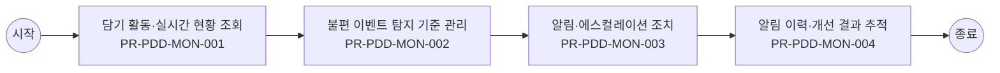

# Usecase: US-PDD-OPS-005 — 담기 불편 모니터링과 조치 운영

## Flowchart

> 단순 직렬 흐름. 분기·게이트웨이는 `00_INDEX.md` BPMN 다이어그램 참조.



## Process: PR-PDD-MON-001 — 담기 활동·실시간 현황 조회 {#process-PR-PDD-MON-001}

```yaml
프로세스_ID: PR-PDD-MON-001
프로세스명: 담기 활동·실시간 현황 조회
설명: 운영자가 담기 성공·실패, 상품, 옵션, 고객 여정 단계, 실패 사유, 상담 전환 현황을 조회한다.
관련_기능: [FN-PDD-MONITOR-001, FN-PDD-AUDIT-001]
```

| 항목 | 내용 |
| --- | --- |
| 액터 | 운영자 |
| 진입 조건 | 운영자가 담기 불편 모니터링과 조치 운영 업무를 시작하고 상품군, 운영 대상 상품군, 변경 사유, 배포 범위 중 최소 1개 기준이 확인된 경우 진입한다. |
| 종료 조건 | 담기 활동·실시간 현황 조회 결과가 성공, 제한, 보완 필요 중 하나로 확정되고 PR-PDD-MON-002 불편 이벤트 탐지 기준 관리로 넘길 입력값과 판단 근거가 저장되면 종료한다. |
| 선행 프로세스 | 업무 진입 조건 충족 |
| 후행 프로세스 | PR-PDD-MON-002 불편 이벤트 탐지 기준 관리 |

### Function: FN-PDD-MONITOR-001

```yaml
기능_ID: FN-PDD-MONITOR-001
기능명: 담기 활동 모니터링
설명: 담기 성공·실패, 실패 유형, 상품·옵션, 고객군, 상담 전환 추이를 모니터링한다.
관련_정책_그룹: [PG-PDD-PRICE-001, PG-PDD-AUDIT-001, PG-PDD-MON-001, PG-PDD-FAIL-001]
```

| 항목 | 내용 |
| --- | --- |
| 입력 정보 | 고객 가입 상태, 회선/요금제/권한/인증 상태 선택 옵션, 필수 구성, 동시 주문 가능 상품, 재고·배송 조건 담기 가능 여부와 장바구니·주문 전환 대상 정보 상품 관계, 중복 가입, 판매 상태, 제한 사유 정책 |
| 세부 기능 구성 | 실시간 현황 실패율 전환율 고객군 분석 |
| 출력 정보 | 담기 가능 여부와 선택 구성 상태 수정 필요 옵션과 제한 사유 장바구니·주문·계속 탐색 전환값 상품 조합·재고·조건 판정 이력 |
| 처리 흐름 | (상태) 상품 구성 선택 → (액션) 담기 활동 모니터링 기준으로 옵션, 재고, 가입 조건, 상품 관계를 동시 검증 → (결과) 담기 가능, 보완 필요, 선택 불가 중 하나로 판정 (상태) 고객 조건 또는 선택값 변경 → (액션) 기존 선택 구성과 충돌 여부, 필수 구성 누락, 동시 주문 제한을 재확인 → (결과) 수정해야 할 항목과 유지 가능한 항목 분리 (상태) 담기 또는 다음 행동 요청 → (액션) 유효한 선택 구성만 상태 저장하고 장바구니·주문·계속 탐색 경로를 결정 → (결과) 고객 선택 맥락이 끊기지 않고 후속 업무로 전달 |
| 실패/예외 케이스 | 재고, 판매 상태, 가입 조건 중 하나라도 미확정이면 담기를 확정하지 않고 보완 가능한 항목을 안내한다. 선택 조합이 충돌하면 전체 초기화가 아니라 충돌 항목만 수정하도록 한다. 로그인·인증 후 복귀 시 기존 선택 구성이 사라지면 재선택 없이 복원 가능한 상태로 전환한다. |

#### Policy Group: PG-PDD-PRICE-001

```yaml
정책_ID: PG-PDD-PRICE-001
정책명: 가격·혜택·가치 표시 정책
설명: 가격, 할인, 혜택, 예상 부담, 마케팅 정보 표시 기준을 정의한다.
```

| Policy Item ID | 정책 항목명 | 정책 항목 |
| --- | --- | --- |
| `PI-PDD-PRICE-001-01` | 가격 기준 | 가격은 정가, 할인가, 실구매가, 예상 절감, 월 기준, 1회성 비용을 구분한다. 고객 상태가 반영된 실구매가는 담기 전까지 최신 조건으로 재산정한다. |
| `PI-PDD-PRICE-001-02` | 혜택 분리 | 쿠폰, 포인트, 제휴 혜택, 사은품, 마케팅 프로그램 혜택은 혜택별 적용 조건, 기간, 사용처, 제외 사유를 분리해 표시한다. 중복 적용 불가 혜택은 불가 사유를 함께 표시한다. |
| `PI-PDD-PRICE-001-03` | 공시지원금 | 단말 상품은 출고가, 공시지원금, 선택약정 할인 적용가, 약정 기간 차이를 비교 가능한 단위로 제공한다. 공시지원금 고지 기준은 고객이 담기 전 확인 가능한 위치에 둔다. |
| `PI-PDD-PRICE-001-04` | 마케팅 정보 | 제휴카드 할인, 사은품, 구매 유도 혜택은 적용 조건, 유지 조건, 제외 조건을 함께 표시한다. 마케팅 문구가 가격 또는 가입 가능성을 오인하게 하면 노출을 제한한다. |
| `PI-PDD-PRICE-001-05` | 실사용 빈도 가치 | 구독·혜택성 상품은 월 N회 사용 시 구독료 이상의 가치처럼 고객이 이해할 수 있는 실사용 빈도 예시를 제공한다. 예시는 과장 없이 적용 조건과 제외 조건을 함께 표시한다. |
| `PI-PDD-PRICE-001-06` | 선물가 문구 | 일반 가격과 동일한 선물가는 별도 선물가로 강조하지 않는다. 고객에게 가격 차이가 있는 것처럼 오인될 수 있는 툴팁이나 문구는 노출하지 않는다. |
| `PI-PDD-PRICE-001-07` | 구독가 비교 | 기존 일반 구독가와 T우주 또는 채널 내 구독가 혜택을 비교할 때는 월 기준 금액, 할인 기간, 할인 종료 후 금액, 적용 제외 조건을 함께 표시한다. |

#### Policy Group: PG-PDD-AUDIT-001

```yaml
정책_ID: PG-PDD-AUDIT-001
정책명: 이력·성과·개선 정책
설명: 담기와 상품 상세의 판정·변경·성과·개선 이력 기준을 정의한다.
```

| Policy Item ID | 정책 항목명 | 정책 항목 |
| --- | --- | --- |
| `PI-PDD-AUDIT-001-01` | 판정 이력 | 가입 가능성, 담기 가능성, 조합 충돌, 재고 부족, 인증 필요 판정은 기준 시각과 판정 근거를 이력으로 저장한다. |
| `PI-PDD-AUDIT-001-02` | 변경 이력 | 상품 원장, 템플릿, 비교 기준, 마케팅 정보, 정책 문구 변경은 변경 전후와 승인 결과를 함께 저장한다. |
| `PI-PDD-AUDIT-001-03` | 성과 리포트 | 상품 상세과 담기 성과는 노출 수, 진입 수, 비교 이용 수, 담기 성공률, 실패율, 상담 전환율, 주문 전환율 기준으로 집계한다. |
| `PI-PDD-AUDIT-001-04` | 개선 추적 | 반복 실패 유형과 미조치 알림은 개선 대상 목록으로 관리한다. 조치 완료 후 동일 유형 재발 여부를 확인해 정책 또는 원장 개선으로 연결한다. |

#### Policy Group: PG-PDD-MON-001

```yaml
정책_ID: PG-PDD-MON-001
정책명: 담기 모니터링·알림 정책
설명: 담기 활동, 불편 이벤트, 실시간 알림, 에스컬레이션 기준을 정의한다.
```

| Policy Item ID | 정책 항목명 | 정책 항목 |
| --- | --- | --- |
| `PI-PDD-MON-001-01` | 활동 현황 | 운영자는 상품, 옵션·조합, 고객 여정 단계, 담기 성공·실패, 실패 사유, 인증·연계 상태, 상담 전환 여부를 실시간으로 조회한다. |
| `PI-PDD-MON-001-02` | 불편 이벤트 | 불편 이벤트는 시스템 오류, 상품·정책 충돌, 판매 가능 상태 오류, 인증·연계 실패, 반복 실패, 이탈 급증, 상담 전환 급증으로 분류한다. |
| `PI-PDD-MON-001-03` | 실시간 알림 | 불편 이벤트가 기준을 초과하면 발생 시각, 이벤트 유형, 영향 상품·조합, 발생 규모, 주요 실패 사유, 권장 조치를 포함해 알림을 발송한다. |
| `PI-PDD-MON-001-04` | 에스컬레이션 | 미확인 또는 미조치 상태가 설정 시간 이상 지속되면 심각도와 담당 상품 기준으로 상위 담당자 또는 연관 운영 조직에 자동 에스컬레이션한다. |

#### Policy Group: PG-PDD-FAIL-001

```yaml
정책_ID: PG-PDD-FAIL-001
정책명: 불가·충돌·인증 복구 정책
설명: 선택 불가, 조합 충돌, 인증 필요, 실패 복구 기준을 정의한다.
```

| Policy Item ID | 정책 항목명 | 정책 항목 |
| --- | --- | --- |
| `PI-PDD-FAIL-001-01` | 불가 안내 | 선택 불가 또는 가입 불가가 발생하면 고객에게 상품, 옵션, 조건, 정책 중 어느 축에서 실패했는지 구분해 안내한다. 단순 오류 문구만 표시하는 것은 허용하지 않는다. |
| `PI-PDD-FAIL-001-02` | 충돌 복구 | 조합 충돌은 충돌 상품, 충돌 이유, 해제해야 할 항목, 대체 가능한 구성을 함께 제공한다. 고객이 수정하면 기존 비교·선택 상태로 복귀한다. |
| `PI-PDD-FAIL-001-03` | 인증 복귀 | 로그인, 회선 확인, 추가 인증이 필요하면 필요 사유를 먼저 설명한다. 인증 완료 후에는 고객이 선택한 상품, 옵션, 비교 조건, 이전 스크롤 위치 중 핵심 상태를 복원한다. |
| `PI-PDD-FAIL-001-04` | 대체 경로 | 담기 실패 시 대체 상품 보기, 조건 충족 방법 보기, 상담 연결, 나중에 다시 보기 중 최소 2개 이상의 후속 행동을 제공한다. |

### Function: FN-PDD-AUDIT-001

```yaml
기능_ID: FN-PDD-AUDIT-001
기능명: 변경·판정·알림 이력 저장
설명: 상품 원장 변경, 정책 판정, 담기 결과, 알림, 조치 결과 이력을 저장한다.
관련_정책_그룹: [PG-PDD-SAVE-001, PG-PDD-AUDIT-001, PG-PDD-CS-001, PG-PDD-MON-001, PG-PDD-ADMIN-001, PG-PDD-OPS-001]
```

| 항목 | 내용 |
| --- | --- |
| 입력 정보 | 운영 대상 상품군, 템플릿 버전, 변경 사유, 배포 범위 Product Catalog, 가격·혜택, 재고·판매 상태, 외부채널 설정값 검수 상태, 승인자, 배포 시점, 고객 노출 영향도 운영 변경 이력, 실패율, 전환율, 알림·에스컬레이션 기준 |
| 세부 기능 구성 | 변경 이력 판정 이력 알림 이력 조치 결과 |
| 출력 정보 | 운영 변경 결과와 배포 상태 검수 오류·경고·승인 필요 항목 고객 노출 영향도와 롤백 가능 여부 운영 변경·알림·조치 이력 |
| 처리 흐름 | (상태) 운영 변경 요청 → (액션) 변경·판정·알림 이력 저장 대상의 상품군, 변경 사유, 검수 상태, 배포 범위를 확인 → (결과) 운영자가 변경 가능한 항목과 승인 필요 항목 구분 (상태) 검수·배포 준비 → (액션) Product Catalog, 판매 상태, 정책 문구, 외부채널 설정 간 불일치를 점검 → (결과) 고객 노출 전 오류·누락·충돌 항목 차단 (상태) 배포 후 이상 감지 → (액션) 실패율, 담기 전환율, 고객 문의, 알림 이력을 기준으로 영향 범위 산정 → (결과) 롤백, 보정, 재배포, 상담 공지 중 후속 조치 실행 |
| 실패/예외 케이스 | 운영 입력값이 상품군 필수 기준을 충족하지 않으면 저장보다 검수 보류를 우선한다. 배포 후 고객 영향이 큰 오류가 감지되면 자동 보정 대신 롤백 또는 임시 중단 기준을 적용한다. 외부채널 또는 Product Catalog 회신이 지연되면 고객 노출 상태와 운영 알림을 분리 관리한다. |

#### Policy Group: PG-PDD-SAVE-001

```yaml
정책_ID: PG-PDD-SAVE-001
정책명: 담기 실행·다음 행동 정책
설명: 담기 실행, 상태 저장, 완료 후 다음 행동, 주문 전환 기준을 정의한다.
```

| Policy Item ID | 정책 항목명 | 정책 항목 |
| --- | --- | --- |
| `PI-PDD-SAVE-001-01` | 담기 저장 | 담기 성공 시 상품, 옵션, 프로그램, 혜택, 예상 비용, 판정 결과, 기준 시각을 저장한다. 동일 요청은 멱등 키 또는 동일 고객·상품·옵션·기준 시각으로 중복 요청 여부를 확인하고, 중복 요청이면 새 건을 만들지 않고 기존 담기 상태를 갱신한다. |
| `PI-PDD-SAVE-001-02` | 다음 행동 | 담기 완료 후 계속 탐색, 장바구니 이동, 바로 신청, 비교 계속하기 중 최소 3개 행동을 제공한다. 행동별로 현재 선택 기준의 핵심 혜택 또는 주의사항을 짧게 표시한다. |
| `PI-PDD-SAVE-001-03` | 주문 전환 | 바로 신청 또는 주문 전환 시 상품 상태, 가격, 재고, 혜택, 가입 가능성은 다시 확인한다. 변경이 있으면 변경 전후와 고객 선택지를 안내한다. |
| `PI-PDD-SAVE-001-04` | 재검증 | 담기 이후 장바구니 또는 주문으로 넘어갈 때 10분 이상 경과했거나 상품 상태가 바뀐 경우 재검증을 수행한다. 재검증 실패 시 담기 완료 상태는 유지하되 주문 전환은 제한한다. |
| `PI-PDD-SAVE-001-05` | CTA 의미 구분 | 담기와 구독하기는 장바구니 또는 신청 준비 단계로, 바로 결제하기는 결제 진입으로 구분한다. 상품 유형별 CTA 명칭과 다음 단계는 고객에게 혼동 없이 안내해야 한다. |
| `PI-PDD-SAVE-001-06` | 고객 표시 상태와 내부 상태 구분 | 고객 표시 상태는 탐색 가능, 담기 완료, 주문 전환 가능, 선택 불가처럼 고객 행동을 결정하는 문구로 관리한다. 내부 상태는 조건 확인 필요, 조합 충돌, 재고 부족, 인증 필요, 운영 반영 대기로 구분하고, 고객 행동을 제한할 때만 표시 상태를 변경한다. |

#### Policy Group: PG-PDD-AUDIT-001

```yaml
정책_ID: PG-PDD-AUDIT-001
정책명: 이력·성과·개선 정책
설명: 담기와 상품 상세의 판정·변경·성과·개선 이력 기준을 정의한다.
```

| Policy Item ID | 정책 항목명 | 정책 항목 |
| --- | --- | --- |
| `PI-PDD-AUDIT-001-01` | 판정 이력 | 가입 가능성, 담기 가능성, 조합 충돌, 재고 부족, 인증 필요 판정은 기준 시각과 판정 근거를 이력으로 저장한다. |
| `PI-PDD-AUDIT-001-02` | 변경 이력 | 상품 원장, 템플릿, 비교 기준, 마케팅 정보, 정책 문구 변경은 변경 전후와 승인 결과를 함께 저장한다. |
| `PI-PDD-AUDIT-001-03` | 성과 리포트 | 상품 상세과 담기 성과는 노출 수, 진입 수, 비교 이용 수, 담기 성공률, 실패율, 상담 전환율, 주문 전환율 기준으로 집계한다. |
| `PI-PDD-AUDIT-001-04` | 개선 추적 | 반복 실패 유형과 미조치 알림은 개선 대상 목록으로 관리한다. 조치 완료 후 동일 유형 재발 여부를 확인해 정책 또는 원장 개선으로 연결한다. |

#### Policy Group: PG-PDD-CS-001

```yaml
정책_ID: PG-PDD-CS-001
정책명: 상담·문의 맥락 전달 정책
설명: 상품 상세 문의와 담기 실패 상담 전환 시 전달 기준을 정의한다.
```

| Policy Item ID | 정책 항목명 | 정책 항목 |
| --- | --- | --- |
| `PI-PDD-CS-001-01` | 상담 문맥 | 상품 상세 또는 담기 단계에서 상담으로 전환하면 상품 ID, 선택 옵션, 회선, 비교 조건, 실패 사유, 시도 횟수, 최근 판정 결과를 상담 문맥으로 전달한다. |
| `PI-PDD-CS-001-02` | 실패 이력 | 상담 전환 이력에는 실패 유형, 발생 시각, 고객 선택, 상담 전환 여부, 최종 안내 결과를 저장한다. 고객이 같은 설명을 반복하지 않도록 상담 화면에서 참조 가능해야 한다. |
| `PI-PDD-CS-001-03` | 대체 안내 | 상담사는 상품 정책을 변경하지 않고 고객 조건에 맞는 대체 상품, 옵션, 신청 경로, 재시도 가능 시점을 안내한다. |

#### Policy Group: PG-PDD-MON-001

```yaml
정책_ID: PG-PDD-MON-001
정책명: 담기 모니터링·알림 정책
설명: 담기 활동, 불편 이벤트, 실시간 알림, 에스컬레이션 기준을 정의한다.
```

| Policy Item ID | 정책 항목명 | 정책 항목 |
| --- | --- | --- |
| `PI-PDD-MON-001-01` | 활동 현황 | 운영자는 상품, 옵션·조합, 고객 여정 단계, 담기 성공·실패, 실패 사유, 인증·연계 상태, 상담 전환 여부를 실시간으로 조회한다. |
| `PI-PDD-MON-001-02` | 불편 이벤트 | 불편 이벤트는 시스템 오류, 상품·정책 충돌, 판매 가능 상태 오류, 인증·연계 실패, 반복 실패, 이탈 급증, 상담 전환 급증으로 분류한다. |
| `PI-PDD-MON-001-03` | 실시간 알림 | 불편 이벤트가 기준을 초과하면 발생 시각, 이벤트 유형, 영향 상품·조합, 발생 규모, 주요 실패 사유, 권장 조치를 포함해 알림을 발송한다. |
| `PI-PDD-MON-001-04` | 에스컬레이션 | 미확인 또는 미조치 상태가 설정 시간 이상 지속되면 심각도와 담당 상품 기준으로 상위 담당자 또는 연관 운영 조직에 자동 에스컬레이션한다. |

#### Policy Group: PG-PDD-ADMIN-001

```yaml
정책_ID: PG-PDD-ADMIN-001
정책명: 운영 입력·검증·삭제 보호 정책
설명: 운영 데이터 등록, 수정, 삭제, 일괄 변경, 이미지 업로드, 승인, 변경 보호 기준을 정의한다.
```

| Policy Item ID | 정책 항목명 | 정책 항목 |
| --- | --- | --- |
| `PI-PDD-ADMIN-001-01` | 입력 검증 | 상품 등록·수정 시 필수값, 가격 형식, 이미지 규격, 노출순서, 유효기간, 카테고리 선택, 공통코드 변경 반영 여부를 저장 전에 검증한다. |
| `PI-PDD-ADMIN-001-02` | 삭제 보호 | 모상품, 판매정책, 카테고리, 부가서비스, 자급제 상품, 액세서리, 사은품 정책 삭제는 참조 데이터와 프론트 노출 영향이 없거나 승인된 예외인 경우에만 허용한다. |
| `PI-PDD-ADMIN-001-03` | 일괄 변경 부분 실패 | 전시·비전시, 공개·비공개, 사용여부 일괄 변경에서 일부 항목이 실패하면 성공 항목과 실패 항목을 분리해 표시하고 실패 항목은 기존 상태를 유지한다. |
| `PI-PDD-ADMIN-001-04` | 이미지 규격 | 이미지와 영상 등록은 권장 해상도, 파일 형식, 용량, 대체텍스트 기준을 사전 안내하고 기준 미달 시 저장을 제한하거나 보완 안내를 제공한다. |
| `PI-PDD-ADMIN-001-05` | 변경 보호 | 등록·수정 중 취소 또는 화면 전환이 발생하면 변경사항 유실 여부를 안내한다. 저장 완료 후에는 수정일, 수정자, 변경 항목을 이력으로 남긴다. |
| `PI-PDD-ADMIN-001-06` | 관리자 승인 | 잔여재고현황 다운로드처럼 영업 민감 정보가 포함된 자료는 관리자 승인 후 제공한다. 승인 권한, 승인 시각, 다운로드 이력은 감사 이력으로 저장한다. |

#### Policy Group: PG-PDD-OPS-001

```yaml
정책_ID: PG-PDD-OPS-001
정책명: 운영자 템플릿·정책문구 관리 정책
설명: 운영자가 템플릿, 비교 기준, 정책 문구를 안전하게 운영하는 기준을 정의한다.
```

| Policy Item ID | 정책 항목명 | 정책 항목 |
| --- | --- | --- |
| `PI-PDD-OPS-001-01` | 버전 관리 | 템플릿, 정책 문구, 비교 기준, 상품 조합 정책 변경은 버전, 적용일, 변경자, 변경 전후, 영향 상품을 저장한다. |
| `PI-PDD-OPS-001-02` | 영향도 확인 | 운영 정책 변경 전에는 고객 판정 결과, 담기 가능성, 노출 문구, 기존 담기 상태에 미치는 영향을 미리 확인한다. |
| `PI-PDD-OPS-001-03` | 미리보기 | 운영자는 상품군, 고객 상태, 판매 상태, 재고 상태, 혜택 조건을 바꿔가며 상품 상세와 담기 문구를 미리보기로 확인할 수 있어야 한다. |
| `PI-PDD-OPS-001-04` | 변경 이력 | 정책 문구와 템플릿 변경 이력은 최소 1년 보관한다. 고객 안내에 영향을 준 변경은 고객 문의와 재현 검증이 가능해야 한다. |

## Process: PR-PDD-MON-002 — 불편 이벤트 탐지 기준 관리 {#process-PR-PDD-MON-002}

```yaml
프로세스_ID: PR-PDD-MON-002
프로세스명: 불편 이벤트 탐지 기준 관리
설명: 운영자가 시스템 오류, 정책 충돌, 판매 상태 오류, 인증·연계 실패, 반복 실패 기준을 설정하고 불편 이벤트를 모니터링해 조치 필요 여부를 판단한다.
관련_기능: [FN-PDD-MONITOR-001, FN-PDD-ALERT-001]
```

| 항목 | 내용 |
| --- | --- |
| 액터 | 운영자 |
| 진입 조건 | PR-PDD-MON-001 담기 활동·실시간 현황 조회 결과가 고객에게 표시되었고, 고객 또는 운영자가 다음 판단을 계속하기로 선택한 경우 진입한다. |
| 종료 조건 | 불편 이벤트 탐지 기준 관리 결과가 성공, 제한, 보완 필요 중 하나로 확정되고 PR-PDD-MON-003 알림·에스컬레이션 조치로 넘길 입력값과 판단 근거가 저장되면 종료한다. |
| 선행 프로세스 | PR-PDD-MON-001 담기 활동·실시간 현황 조회 |
| 후행 프로세스 | PR-PDD-MON-003 알림·에스컬레이션 조치 |

### Function: FN-PDD-MONITOR-001

```yaml
기능_ID: FN-PDD-MONITOR-001
기능명: 담기 활동 모니터링
설명: 담기 성공·실패, 실패 유형, 상품·옵션, 고객군, 상담 전환 추이를 모니터링한다.
관련_정책_그룹: [PG-PDD-PRICE-001, PG-PDD-AUDIT-001, PG-PDD-MON-001, PG-PDD-FAIL-001]
```

| 항목 | 내용 |
| --- | --- |
| 입력 정보 | 고객 가입 상태, 회선/요금제/권한/인증 상태 선택 옵션, 필수 구성, 동시 주문 가능 상품, 재고·배송 조건 담기 가능 여부와 장바구니·주문 전환 대상 정보 상품 관계, 중복 가입, 판매 상태, 제한 사유 정책 |
| 세부 기능 구성 | 실시간 현황 실패율 전환율 고객군 분석 |
| 출력 정보 | 담기 가능 여부와 선택 구성 상태 수정 필요 옵션과 제한 사유 장바구니·주문·계속 탐색 전환값 상품 조합·재고·조건 판정 이력 |
| 처리 흐름 | (상태) 상품 구성 선택 → (액션) 담기 활동 모니터링 기준으로 옵션, 재고, 가입 조건, 상품 관계를 동시 검증 → (결과) 담기 가능, 보완 필요, 선택 불가 중 하나로 판정 (상태) 고객 조건 또는 선택값 변경 → (액션) 기존 선택 구성과 충돌 여부, 필수 구성 누락, 동시 주문 제한을 재확인 → (결과) 수정해야 할 항목과 유지 가능한 항목 분리 (상태) 담기 또는 다음 행동 요청 → (액션) 유효한 선택 구성만 상태 저장하고 장바구니·주문·계속 탐색 경로를 결정 → (결과) 고객 선택 맥락이 끊기지 않고 후속 업무로 전달 |
| 실패/예외 케이스 | 재고, 판매 상태, 가입 조건 중 하나라도 미확정이면 담기를 확정하지 않고 보완 가능한 항목을 안내한다. 선택 조합이 충돌하면 전체 초기화가 아니라 충돌 항목만 수정하도록 한다. 로그인·인증 후 복귀 시 기존 선택 구성이 사라지면 재선택 없이 복원 가능한 상태로 전환한다. |

#### Policy Group: PG-PDD-PRICE-001

```yaml
정책_ID: PG-PDD-PRICE-001
정책명: 가격·혜택·가치 표시 정책
설명: 가격, 할인, 혜택, 예상 부담, 마케팅 정보 표시 기준을 정의한다.
```

| Policy Item ID | 정책 항목명 | 정책 항목 |
| --- | --- | --- |
| `PI-PDD-PRICE-001-01` | 가격 기준 | 가격은 정가, 할인가, 실구매가, 예상 절감, 월 기준, 1회성 비용을 구분한다. 고객 상태가 반영된 실구매가는 담기 전까지 최신 조건으로 재산정한다. |
| `PI-PDD-PRICE-001-02` | 혜택 분리 | 쿠폰, 포인트, 제휴 혜택, 사은품, 마케팅 프로그램 혜택은 혜택별 적용 조건, 기간, 사용처, 제외 사유를 분리해 표시한다. 중복 적용 불가 혜택은 불가 사유를 함께 표시한다. |
| `PI-PDD-PRICE-001-03` | 공시지원금 | 단말 상품은 출고가, 공시지원금, 선택약정 할인 적용가, 약정 기간 차이를 비교 가능한 단위로 제공한다. 공시지원금 고지 기준은 고객이 담기 전 확인 가능한 위치에 둔다. |
| `PI-PDD-PRICE-001-04` | 마케팅 정보 | 제휴카드 할인, 사은품, 구매 유도 혜택은 적용 조건, 유지 조건, 제외 조건을 함께 표시한다. 마케팅 문구가 가격 또는 가입 가능성을 오인하게 하면 노출을 제한한다. |
| `PI-PDD-PRICE-001-05` | 실사용 빈도 가치 | 구독·혜택성 상품은 월 N회 사용 시 구독료 이상의 가치처럼 고객이 이해할 수 있는 실사용 빈도 예시를 제공한다. 예시는 과장 없이 적용 조건과 제외 조건을 함께 표시한다. |
| `PI-PDD-PRICE-001-06` | 선물가 문구 | 일반 가격과 동일한 선물가는 별도 선물가로 강조하지 않는다. 고객에게 가격 차이가 있는 것처럼 오인될 수 있는 툴팁이나 문구는 노출하지 않는다. |
| `PI-PDD-PRICE-001-07` | 구독가 비교 | 기존 일반 구독가와 T우주 또는 채널 내 구독가 혜택을 비교할 때는 월 기준 금액, 할인 기간, 할인 종료 후 금액, 적용 제외 조건을 함께 표시한다. |

#### Policy Group: PG-PDD-AUDIT-001

```yaml
정책_ID: PG-PDD-AUDIT-001
정책명: 이력·성과·개선 정책
설명: 담기와 상품 상세의 판정·변경·성과·개선 이력 기준을 정의한다.
```

| Policy Item ID | 정책 항목명 | 정책 항목 |
| --- | --- | --- |
| `PI-PDD-AUDIT-001-01` | 판정 이력 | 가입 가능성, 담기 가능성, 조합 충돌, 재고 부족, 인증 필요 판정은 기준 시각과 판정 근거를 이력으로 저장한다. |
| `PI-PDD-AUDIT-001-02` | 변경 이력 | 상품 원장, 템플릿, 비교 기준, 마케팅 정보, 정책 문구 변경은 변경 전후와 승인 결과를 함께 저장한다. |
| `PI-PDD-AUDIT-001-03` | 성과 리포트 | 상품 상세과 담기 성과는 노출 수, 진입 수, 비교 이용 수, 담기 성공률, 실패율, 상담 전환율, 주문 전환율 기준으로 집계한다. |
| `PI-PDD-AUDIT-001-04` | 개선 추적 | 반복 실패 유형과 미조치 알림은 개선 대상 목록으로 관리한다. 조치 완료 후 동일 유형 재발 여부를 확인해 정책 또는 원장 개선으로 연결한다. |

#### Policy Group: PG-PDD-MON-001

```yaml
정책_ID: PG-PDD-MON-001
정책명: 담기 모니터링·알림 정책
설명: 담기 활동, 불편 이벤트, 실시간 알림, 에스컬레이션 기준을 정의한다.
```

| Policy Item ID | 정책 항목명 | 정책 항목 |
| --- | --- | --- |
| `PI-PDD-MON-001-01` | 활동 현황 | 운영자는 상품, 옵션·조합, 고객 여정 단계, 담기 성공·실패, 실패 사유, 인증·연계 상태, 상담 전환 여부를 실시간으로 조회한다. |
| `PI-PDD-MON-001-02` | 불편 이벤트 | 불편 이벤트는 시스템 오류, 상품·정책 충돌, 판매 가능 상태 오류, 인증·연계 실패, 반복 실패, 이탈 급증, 상담 전환 급증으로 분류한다. |
| `PI-PDD-MON-001-03` | 실시간 알림 | 불편 이벤트가 기준을 초과하면 발생 시각, 이벤트 유형, 영향 상품·조합, 발생 규모, 주요 실패 사유, 권장 조치를 포함해 알림을 발송한다. |
| `PI-PDD-MON-001-04` | 에스컬레이션 | 미확인 또는 미조치 상태가 설정 시간 이상 지속되면 심각도와 담당 상품 기준으로 상위 담당자 또는 연관 운영 조직에 자동 에스컬레이션한다. |

#### Policy Group: PG-PDD-FAIL-001

```yaml
정책_ID: PG-PDD-FAIL-001
정책명: 불가·충돌·인증 복구 정책
설명: 선택 불가, 조합 충돌, 인증 필요, 실패 복구 기준을 정의한다.
```

| Policy Item ID | 정책 항목명 | 정책 항목 |
| --- | --- | --- |
| `PI-PDD-FAIL-001-01` | 불가 안내 | 선택 불가 또는 가입 불가가 발생하면 고객에게 상품, 옵션, 조건, 정책 중 어느 축에서 실패했는지 구분해 안내한다. 단순 오류 문구만 표시하는 것은 허용하지 않는다. |
| `PI-PDD-FAIL-001-02` | 충돌 복구 | 조합 충돌은 충돌 상품, 충돌 이유, 해제해야 할 항목, 대체 가능한 구성을 함께 제공한다. 고객이 수정하면 기존 비교·선택 상태로 복귀한다. |
| `PI-PDD-FAIL-001-03` | 인증 복귀 | 로그인, 회선 확인, 추가 인증이 필요하면 필요 사유를 먼저 설명한다. 인증 완료 후에는 고객이 선택한 상품, 옵션, 비교 조건, 이전 스크롤 위치 중 핵심 상태를 복원한다. |
| `PI-PDD-FAIL-001-04` | 대체 경로 | 담기 실패 시 대체 상품 보기, 조건 충족 방법 보기, 상담 연결, 나중에 다시 보기 중 최소 2개 이상의 후속 행동을 제공한다. |

### Function: FN-PDD-ALERT-001

```yaml
기능_ID: FN-PDD-ALERT-001
기능명: 불편 이벤트 알림·에스컬레이션
설명: 담기 불편 이벤트 기준 초과 시 수신 대상, 채널, 심각도, 에스컬레이션을 처리한다.
관련_정책_그룹: [PG-PDD-MON-001, PG-PDD-FAIL-001, PG-PDD-AUDIT-001]
```

| 항목 | 내용 |
| --- | --- |
| 입력 정보 | 운영 대상 상품군, 템플릿 버전, 변경 사유, 배포 범위 Product Catalog, 가격·혜택, 재고·판매 상태, 외부채널 설정값 검수 상태, 승인자, 배포 시점, 고객 노출 영향도 운영 변경 이력, 실패율, 전환율, 알림·에스컬레이션 기준 |
| 세부 기능 구성 | 이벤트 기준 수신 대상 심각도 에스컬레이션 |
| 출력 정보 | 운영 변경 결과와 배포 상태 검수 오류·경고·승인 필요 항목 고객 노출 영향도와 롤백 가능 여부 운영 변경·알림·조치 이력 |
| 처리 흐름 | (상태) 운영 변경 요청 → (액션) 불편 이벤트 알림·에스컬레이션 대상의 상품군, 변경 사유, 검수 상태, 배포 범위를 확인 → (결과) 운영자가 변경 가능한 항목과 승인 필요 항목 구분 (상태) 검수·배포 준비 → (액션) Product Catalog, 판매 상태, 정책 문구, 외부채널 설정 간 불일치를 점검 → (결과) 고객 노출 전 오류·누락·충돌 항목 차단 (상태) 배포 후 이상 감지 → (액션) 실패율, 담기 전환율, 고객 문의, 알림 이력을 기준으로 영향 범위 산정 → (결과) 롤백, 보정, 재배포, 상담 공지 중 후속 조치 실행 |
| 실패/예외 케이스 | 운영 입력값이 상품군 필수 기준을 충족하지 않으면 저장보다 검수 보류를 우선한다. 배포 후 고객 영향이 큰 오류가 감지되면 자동 보정 대신 롤백 또는 임시 중단 기준을 적용한다. 외부채널 또는 Product Catalog 회신이 지연되면 고객 노출 상태와 운영 알림을 분리 관리한다. |

#### Policy Group: PG-PDD-MON-001

```yaml
정책_ID: PG-PDD-MON-001
정책명: 담기 모니터링·알림 정책
설명: 담기 활동, 불편 이벤트, 실시간 알림, 에스컬레이션 기준을 정의한다.
```

| Policy Item ID | 정책 항목명 | 정책 항목 |
| --- | --- | --- |
| `PI-PDD-MON-001-01` | 활동 현황 | 운영자는 상품, 옵션·조합, 고객 여정 단계, 담기 성공·실패, 실패 사유, 인증·연계 상태, 상담 전환 여부를 실시간으로 조회한다. |
| `PI-PDD-MON-001-02` | 불편 이벤트 | 불편 이벤트는 시스템 오류, 상품·정책 충돌, 판매 가능 상태 오류, 인증·연계 실패, 반복 실패, 이탈 급증, 상담 전환 급증으로 분류한다. |
| `PI-PDD-MON-001-03` | 실시간 알림 | 불편 이벤트가 기준을 초과하면 발생 시각, 이벤트 유형, 영향 상품·조합, 발생 규모, 주요 실패 사유, 권장 조치를 포함해 알림을 발송한다. |
| `PI-PDD-MON-001-04` | 에스컬레이션 | 미확인 또는 미조치 상태가 설정 시간 이상 지속되면 심각도와 담당 상품 기준으로 상위 담당자 또는 연관 운영 조직에 자동 에스컬레이션한다. |

#### Policy Group: PG-PDD-FAIL-001

```yaml
정책_ID: PG-PDD-FAIL-001
정책명: 불가·충돌·인증 복구 정책
설명: 선택 불가, 조합 충돌, 인증 필요, 실패 복구 기준을 정의한다.
```

| Policy Item ID | 정책 항목명 | 정책 항목 |
| --- | --- | --- |
| `PI-PDD-FAIL-001-01` | 불가 안내 | 선택 불가 또는 가입 불가가 발생하면 고객에게 상품, 옵션, 조건, 정책 중 어느 축에서 실패했는지 구분해 안내한다. 단순 오류 문구만 표시하는 것은 허용하지 않는다. |
| `PI-PDD-FAIL-001-02` | 충돌 복구 | 조합 충돌은 충돌 상품, 충돌 이유, 해제해야 할 항목, 대체 가능한 구성을 함께 제공한다. 고객이 수정하면 기존 비교·선택 상태로 복귀한다. |
| `PI-PDD-FAIL-001-03` | 인증 복귀 | 로그인, 회선 확인, 추가 인증이 필요하면 필요 사유를 먼저 설명한다. 인증 완료 후에는 고객이 선택한 상품, 옵션, 비교 조건, 이전 스크롤 위치 중 핵심 상태를 복원한다. |
| `PI-PDD-FAIL-001-04` | 대체 경로 | 담기 실패 시 대체 상품 보기, 조건 충족 방법 보기, 상담 연결, 나중에 다시 보기 중 최소 2개 이상의 후속 행동을 제공한다. |

#### Policy Group: PG-PDD-AUDIT-001

```yaml
정책_ID: PG-PDD-AUDIT-001
정책명: 이력·성과·개선 정책
설명: 담기와 상품 상세의 판정·변경·성과·개선 이력 기준을 정의한다.
```

| Policy Item ID | 정책 항목명 | 정책 항목 |
| --- | --- | --- |
| `PI-PDD-AUDIT-001-01` | 판정 이력 | 가입 가능성, 담기 가능성, 조합 충돌, 재고 부족, 인증 필요 판정은 기준 시각과 판정 근거를 이력으로 저장한다. |
| `PI-PDD-AUDIT-001-02` | 변경 이력 | 상품 원장, 템플릿, 비교 기준, 마케팅 정보, 정책 문구 변경은 변경 전후와 승인 결과를 함께 저장한다. |
| `PI-PDD-AUDIT-001-03` | 성과 리포트 | 상품 상세과 담기 성과는 노출 수, 진입 수, 비교 이용 수, 담기 성공률, 실패율, 상담 전환율, 주문 전환율 기준으로 집계한다. |
| `PI-PDD-AUDIT-001-04` | 개선 추적 | 반복 실패 유형과 미조치 알림은 개선 대상 목록으로 관리한다. 조치 완료 후 동일 유형 재발 여부를 확인해 정책 또는 원장 개선으로 연결한다. |

## Process: PR-PDD-MON-003 — 알림·에스컬레이션 조치 {#process-PR-PDD-MON-003}

```yaml
프로세스_ID: PR-PDD-MON-003
프로세스명: 알림·에스컬레이션 조치
설명: 운영자가 알림 수신 대상, 수신 채널, 미확인 기준, 상위 담당자 에스컬레이션을 관리한다.
관련_기능: [FN-PDD-ALERT-001, FN-PDD-AUDIT-001]
```

| 항목 | 내용 |
| --- | --- |
| 액터 | 운영자 |
| 진입 조건 | PR-PDD-MON-002 불편 이벤트 탐지 기준 관리 결과가 고객에게 표시되었고, 고객 또는 운영자가 다음 판단을 계속하기로 선택한 경우 진입한다. |
| 종료 조건 | 알림·에스컬레이션 조치 결과가 성공, 제한, 보완 필요 중 하나로 확정되고 PR-PDD-MON-004 알림 이력·개선 결과 추적로 넘길 입력값과 판단 근거가 저장되면 종료한다. |
| 선행 프로세스 | PR-PDD-MON-002 불편 이벤트 탐지 기준 관리 |
| 후행 프로세스 | PR-PDD-MON-004 알림 이력·개선 결과 추적 |

### Function: FN-PDD-ALERT-001

```yaml
기능_ID: FN-PDD-ALERT-001
기능명: 불편 이벤트 알림·에스컬레이션
설명: 담기 불편 이벤트 기준 초과 시 수신 대상, 채널, 심각도, 에스컬레이션을 처리한다.
관련_정책_그룹: [PG-PDD-MON-001, PG-PDD-FAIL-001, PG-PDD-AUDIT-001]
```

| 항목 | 내용 |
| --- | --- |
| 입력 정보 | 운영 대상 상품군, 템플릿 버전, 변경 사유, 배포 범위 Product Catalog, 가격·혜택, 재고·판매 상태, 외부채널 설정값 검수 상태, 승인자, 배포 시점, 고객 노출 영향도 운영 변경 이력, 실패율, 전환율, 알림·에스컬레이션 기준 |
| 세부 기능 구성 | 이벤트 기준 수신 대상 심각도 에스컬레이션 |
| 출력 정보 | 운영 변경 결과와 배포 상태 검수 오류·경고·승인 필요 항목 고객 노출 영향도와 롤백 가능 여부 운영 변경·알림·조치 이력 |
| 처리 흐름 | (상태) 운영 변경 요청 → (액션) 불편 이벤트 알림·에스컬레이션 대상의 상품군, 변경 사유, 검수 상태, 배포 범위를 확인 → (결과) 운영자가 변경 가능한 항목과 승인 필요 항목 구분 (상태) 검수·배포 준비 → (액션) Product Catalog, 판매 상태, 정책 문구, 외부채널 설정 간 불일치를 점검 → (결과) 고객 노출 전 오류·누락·충돌 항목 차단 (상태) 배포 후 이상 감지 → (액션) 실패율, 담기 전환율, 고객 문의, 알림 이력을 기준으로 영향 범위 산정 → (결과) 롤백, 보정, 재배포, 상담 공지 중 후속 조치 실행 |
| 실패/예외 케이스 | 운영 입력값이 상품군 필수 기준을 충족하지 않으면 저장보다 검수 보류를 우선한다. 배포 후 고객 영향이 큰 오류가 감지되면 자동 보정 대신 롤백 또는 임시 중단 기준을 적용한다. 외부채널 또는 Product Catalog 회신이 지연되면 고객 노출 상태와 운영 알림을 분리 관리한다. |

#### Policy Group: PG-PDD-MON-001

```yaml
정책_ID: PG-PDD-MON-001
정책명: 담기 모니터링·알림 정책
설명: 담기 활동, 불편 이벤트, 실시간 알림, 에스컬레이션 기준을 정의한다.
```

| Policy Item ID | 정책 항목명 | 정책 항목 |
| --- | --- | --- |
| `PI-PDD-MON-001-01` | 활동 현황 | 운영자는 상품, 옵션·조합, 고객 여정 단계, 담기 성공·실패, 실패 사유, 인증·연계 상태, 상담 전환 여부를 실시간으로 조회한다. |
| `PI-PDD-MON-001-02` | 불편 이벤트 | 불편 이벤트는 시스템 오류, 상품·정책 충돌, 판매 가능 상태 오류, 인증·연계 실패, 반복 실패, 이탈 급증, 상담 전환 급증으로 분류한다. |
| `PI-PDD-MON-001-03` | 실시간 알림 | 불편 이벤트가 기준을 초과하면 발생 시각, 이벤트 유형, 영향 상품·조합, 발생 규모, 주요 실패 사유, 권장 조치를 포함해 알림을 발송한다. |
| `PI-PDD-MON-001-04` | 에스컬레이션 | 미확인 또는 미조치 상태가 설정 시간 이상 지속되면 심각도와 담당 상품 기준으로 상위 담당자 또는 연관 운영 조직에 자동 에스컬레이션한다. |

#### Policy Group: PG-PDD-FAIL-001

```yaml
정책_ID: PG-PDD-FAIL-001
정책명: 불가·충돌·인증 복구 정책
설명: 선택 불가, 조합 충돌, 인증 필요, 실패 복구 기준을 정의한다.
```

| Policy Item ID | 정책 항목명 | 정책 항목 |
| --- | --- | --- |
| `PI-PDD-FAIL-001-01` | 불가 안내 | 선택 불가 또는 가입 불가가 발생하면 고객에게 상품, 옵션, 조건, 정책 중 어느 축에서 실패했는지 구분해 안내한다. 단순 오류 문구만 표시하는 것은 허용하지 않는다. |
| `PI-PDD-FAIL-001-02` | 충돌 복구 | 조합 충돌은 충돌 상품, 충돌 이유, 해제해야 할 항목, 대체 가능한 구성을 함께 제공한다. 고객이 수정하면 기존 비교·선택 상태로 복귀한다. |
| `PI-PDD-FAIL-001-03` | 인증 복귀 | 로그인, 회선 확인, 추가 인증이 필요하면 필요 사유를 먼저 설명한다. 인증 완료 후에는 고객이 선택한 상품, 옵션, 비교 조건, 이전 스크롤 위치 중 핵심 상태를 복원한다. |
| `PI-PDD-FAIL-001-04` | 대체 경로 | 담기 실패 시 대체 상품 보기, 조건 충족 방법 보기, 상담 연결, 나중에 다시 보기 중 최소 2개 이상의 후속 행동을 제공한다. |

#### Policy Group: PG-PDD-AUDIT-001

```yaml
정책_ID: PG-PDD-AUDIT-001
정책명: 이력·성과·개선 정책
설명: 담기와 상품 상세의 판정·변경·성과·개선 이력 기준을 정의한다.
```

| Policy Item ID | 정책 항목명 | 정책 항목 |
| --- | --- | --- |
| `PI-PDD-AUDIT-001-01` | 판정 이력 | 가입 가능성, 담기 가능성, 조합 충돌, 재고 부족, 인증 필요 판정은 기준 시각과 판정 근거를 이력으로 저장한다. |
| `PI-PDD-AUDIT-001-02` | 변경 이력 | 상품 원장, 템플릿, 비교 기준, 마케팅 정보, 정책 문구 변경은 변경 전후와 승인 결과를 함께 저장한다. |
| `PI-PDD-AUDIT-001-03` | 성과 리포트 | 상품 상세과 담기 성과는 노출 수, 진입 수, 비교 이용 수, 담기 성공률, 실패율, 상담 전환율, 주문 전환율 기준으로 집계한다. |
| `PI-PDD-AUDIT-001-04` | 개선 추적 | 반복 실패 유형과 미조치 알림은 개선 대상 목록으로 관리한다. 조치 완료 후 동일 유형 재발 여부를 확인해 정책 또는 원장 개선으로 연결한다. |

### Function: FN-PDD-AUDIT-001

```yaml
기능_ID: FN-PDD-AUDIT-001
기능명: 변경·판정·알림 이력 저장
설명: 상품 원장 변경, 정책 판정, 담기 결과, 알림, 조치 결과 이력을 저장한다.
관련_정책_그룹: [PG-PDD-SAVE-001, PG-PDD-AUDIT-001, PG-PDD-CS-001, PG-PDD-MON-001, PG-PDD-ADMIN-001, PG-PDD-OPS-001]
```

| 항목 | 내용 |
| --- | --- |
| 입력 정보 | 운영 대상 상품군, 템플릿 버전, 변경 사유, 배포 범위 Product Catalog, 가격·혜택, 재고·판매 상태, 외부채널 설정값 검수 상태, 승인자, 배포 시점, 고객 노출 영향도 운영 변경 이력, 실패율, 전환율, 알림·에스컬레이션 기준 |
| 세부 기능 구성 | 변경 이력 판정 이력 알림 이력 조치 결과 |
| 출력 정보 | 운영 변경 결과와 배포 상태 검수 오류·경고·승인 필요 항목 고객 노출 영향도와 롤백 가능 여부 운영 변경·알림·조치 이력 |
| 처리 흐름 | (상태) 운영 변경 요청 → (액션) 변경·판정·알림 이력 저장 대상의 상품군, 변경 사유, 검수 상태, 배포 범위를 확인 → (결과) 운영자가 변경 가능한 항목과 승인 필요 항목 구분 (상태) 검수·배포 준비 → (액션) Product Catalog, 판매 상태, 정책 문구, 외부채널 설정 간 불일치를 점검 → (결과) 고객 노출 전 오류·누락·충돌 항목 차단 (상태) 배포 후 이상 감지 → (액션) 실패율, 담기 전환율, 고객 문의, 알림 이력을 기준으로 영향 범위 산정 → (결과) 롤백, 보정, 재배포, 상담 공지 중 후속 조치 실행 |
| 실패/예외 케이스 | 운영 입력값이 상품군 필수 기준을 충족하지 않으면 저장보다 검수 보류를 우선한다. 배포 후 고객 영향이 큰 오류가 감지되면 자동 보정 대신 롤백 또는 임시 중단 기준을 적용한다. 외부채널 또는 Product Catalog 회신이 지연되면 고객 노출 상태와 운영 알림을 분리 관리한다. |

#### Policy Group: PG-PDD-SAVE-001

```yaml
정책_ID: PG-PDD-SAVE-001
정책명: 담기 실행·다음 행동 정책
설명: 담기 실행, 상태 저장, 완료 후 다음 행동, 주문 전환 기준을 정의한다.
```

| Policy Item ID | 정책 항목명 | 정책 항목 |
| --- | --- | --- |
| `PI-PDD-SAVE-001-01` | 담기 저장 | 담기 성공 시 상품, 옵션, 프로그램, 혜택, 예상 비용, 판정 결과, 기준 시각을 저장한다. 동일 요청은 멱등 키 또는 동일 고객·상품·옵션·기준 시각으로 중복 요청 여부를 확인하고, 중복 요청이면 새 건을 만들지 않고 기존 담기 상태를 갱신한다. |
| `PI-PDD-SAVE-001-02` | 다음 행동 | 담기 완료 후 계속 탐색, 장바구니 이동, 바로 신청, 비교 계속하기 중 최소 3개 행동을 제공한다. 행동별로 현재 선택 기준의 핵심 혜택 또는 주의사항을 짧게 표시한다. |
| `PI-PDD-SAVE-001-03` | 주문 전환 | 바로 신청 또는 주문 전환 시 상품 상태, 가격, 재고, 혜택, 가입 가능성은 다시 확인한다. 변경이 있으면 변경 전후와 고객 선택지를 안내한다. |
| `PI-PDD-SAVE-001-04` | 재검증 | 담기 이후 장바구니 또는 주문으로 넘어갈 때 10분 이상 경과했거나 상품 상태가 바뀐 경우 재검증을 수행한다. 재검증 실패 시 담기 완료 상태는 유지하되 주문 전환은 제한한다. |
| `PI-PDD-SAVE-001-05` | CTA 의미 구분 | 담기와 구독하기는 장바구니 또는 신청 준비 단계로, 바로 결제하기는 결제 진입으로 구분한다. 상품 유형별 CTA 명칭과 다음 단계는 고객에게 혼동 없이 안내해야 한다. |
| `PI-PDD-SAVE-001-06` | 고객 표시 상태와 내부 상태 구분 | 고객 표시 상태는 탐색 가능, 담기 완료, 주문 전환 가능, 선택 불가처럼 고객 행동을 결정하는 문구로 관리한다. 내부 상태는 조건 확인 필요, 조합 충돌, 재고 부족, 인증 필요, 운영 반영 대기로 구분하고, 고객 행동을 제한할 때만 표시 상태를 변경한다. |

#### Policy Group: PG-PDD-AUDIT-001

```yaml
정책_ID: PG-PDD-AUDIT-001
정책명: 이력·성과·개선 정책
설명: 담기와 상품 상세의 판정·변경·성과·개선 이력 기준을 정의한다.
```

| Policy Item ID | 정책 항목명 | 정책 항목 |
| --- | --- | --- |
| `PI-PDD-AUDIT-001-01` | 판정 이력 | 가입 가능성, 담기 가능성, 조합 충돌, 재고 부족, 인증 필요 판정은 기준 시각과 판정 근거를 이력으로 저장한다. |
| `PI-PDD-AUDIT-001-02` | 변경 이력 | 상품 원장, 템플릿, 비교 기준, 마케팅 정보, 정책 문구 변경은 변경 전후와 승인 결과를 함께 저장한다. |
| `PI-PDD-AUDIT-001-03` | 성과 리포트 | 상품 상세과 담기 성과는 노출 수, 진입 수, 비교 이용 수, 담기 성공률, 실패율, 상담 전환율, 주문 전환율 기준으로 집계한다. |
| `PI-PDD-AUDIT-001-04` | 개선 추적 | 반복 실패 유형과 미조치 알림은 개선 대상 목록으로 관리한다. 조치 완료 후 동일 유형 재발 여부를 확인해 정책 또는 원장 개선으로 연결한다. |

#### Policy Group: PG-PDD-CS-001

```yaml
정책_ID: PG-PDD-CS-001
정책명: 상담·문의 맥락 전달 정책
설명: 상품 상세 문의와 담기 실패 상담 전환 시 전달 기준을 정의한다.
```

| Policy Item ID | 정책 항목명 | 정책 항목 |
| --- | --- | --- |
| `PI-PDD-CS-001-01` | 상담 문맥 | 상품 상세 또는 담기 단계에서 상담으로 전환하면 상품 ID, 선택 옵션, 회선, 비교 조건, 실패 사유, 시도 횟수, 최근 판정 결과를 상담 문맥으로 전달한다. |
| `PI-PDD-CS-001-02` | 실패 이력 | 상담 전환 이력에는 실패 유형, 발생 시각, 고객 선택, 상담 전환 여부, 최종 안내 결과를 저장한다. 고객이 같은 설명을 반복하지 않도록 상담 화면에서 참조 가능해야 한다. |
| `PI-PDD-CS-001-03` | 대체 안내 | 상담사는 상품 정책을 변경하지 않고 고객 조건에 맞는 대체 상품, 옵션, 신청 경로, 재시도 가능 시점을 안내한다. |

#### Policy Group: PG-PDD-MON-001

```yaml
정책_ID: PG-PDD-MON-001
정책명: 담기 모니터링·알림 정책
설명: 담기 활동, 불편 이벤트, 실시간 알림, 에스컬레이션 기준을 정의한다.
```

| Policy Item ID | 정책 항목명 | 정책 항목 |
| --- | --- | --- |
| `PI-PDD-MON-001-01` | 활동 현황 | 운영자는 상품, 옵션·조합, 고객 여정 단계, 담기 성공·실패, 실패 사유, 인증·연계 상태, 상담 전환 여부를 실시간으로 조회한다. |
| `PI-PDD-MON-001-02` | 불편 이벤트 | 불편 이벤트는 시스템 오류, 상품·정책 충돌, 판매 가능 상태 오류, 인증·연계 실패, 반복 실패, 이탈 급증, 상담 전환 급증으로 분류한다. |
| `PI-PDD-MON-001-03` | 실시간 알림 | 불편 이벤트가 기준을 초과하면 발생 시각, 이벤트 유형, 영향 상품·조합, 발생 규모, 주요 실패 사유, 권장 조치를 포함해 알림을 발송한다. |
| `PI-PDD-MON-001-04` | 에스컬레이션 | 미확인 또는 미조치 상태가 설정 시간 이상 지속되면 심각도와 담당 상품 기준으로 상위 담당자 또는 연관 운영 조직에 자동 에스컬레이션한다. |

#### Policy Group: PG-PDD-ADMIN-001

```yaml
정책_ID: PG-PDD-ADMIN-001
정책명: 운영 입력·검증·삭제 보호 정책
설명: 운영 데이터 등록, 수정, 삭제, 일괄 변경, 이미지 업로드, 승인, 변경 보호 기준을 정의한다.
```

| Policy Item ID | 정책 항목명 | 정책 항목 |
| --- | --- | --- |
| `PI-PDD-ADMIN-001-01` | 입력 검증 | 상품 등록·수정 시 필수값, 가격 형식, 이미지 규격, 노출순서, 유효기간, 카테고리 선택, 공통코드 변경 반영 여부를 저장 전에 검증한다. |
| `PI-PDD-ADMIN-001-02` | 삭제 보호 | 모상품, 판매정책, 카테고리, 부가서비스, 자급제 상품, 액세서리, 사은품 정책 삭제는 참조 데이터와 프론트 노출 영향이 없거나 승인된 예외인 경우에만 허용한다. |
| `PI-PDD-ADMIN-001-03` | 일괄 변경 부분 실패 | 전시·비전시, 공개·비공개, 사용여부 일괄 변경에서 일부 항목이 실패하면 성공 항목과 실패 항목을 분리해 표시하고 실패 항목은 기존 상태를 유지한다. |
| `PI-PDD-ADMIN-001-04` | 이미지 규격 | 이미지와 영상 등록은 권장 해상도, 파일 형식, 용량, 대체텍스트 기준을 사전 안내하고 기준 미달 시 저장을 제한하거나 보완 안내를 제공한다. |
| `PI-PDD-ADMIN-001-05` | 변경 보호 | 등록·수정 중 취소 또는 화면 전환이 발생하면 변경사항 유실 여부를 안내한다. 저장 완료 후에는 수정일, 수정자, 변경 항목을 이력으로 남긴다. |
| `PI-PDD-ADMIN-001-06` | 관리자 승인 | 잔여재고현황 다운로드처럼 영업 민감 정보가 포함된 자료는 관리자 승인 후 제공한다. 승인 권한, 승인 시각, 다운로드 이력은 감사 이력으로 저장한다. |

#### Policy Group: PG-PDD-OPS-001

```yaml
정책_ID: PG-PDD-OPS-001
정책명: 운영자 템플릿·정책문구 관리 정책
설명: 운영자가 템플릿, 비교 기준, 정책 문구를 안전하게 운영하는 기준을 정의한다.
```

| Policy Item ID | 정책 항목명 | 정책 항목 |
| --- | --- | --- |
| `PI-PDD-OPS-001-01` | 버전 관리 | 템플릿, 정책 문구, 비교 기준, 상품 조합 정책 변경은 버전, 적용일, 변경자, 변경 전후, 영향 상품을 저장한다. |
| `PI-PDD-OPS-001-02` | 영향도 확인 | 운영 정책 변경 전에는 고객 판정 결과, 담기 가능성, 노출 문구, 기존 담기 상태에 미치는 영향을 미리 확인한다. |
| `PI-PDD-OPS-001-03` | 미리보기 | 운영자는 상품군, 고객 상태, 판매 상태, 재고 상태, 혜택 조건을 바꿔가며 상품 상세와 담기 문구를 미리보기로 확인할 수 있어야 한다. |
| `PI-PDD-OPS-001-04` | 변경 이력 | 정책 문구와 템플릿 변경 이력은 최소 1년 보관한다. 고객 안내에 영향을 준 변경은 고객 문의와 재현 검증이 가능해야 한다. |

## Process: PR-PDD-MON-004 — 알림 이력·개선 결과 추적 {#process-PR-PDD-MON-004}

```yaml
프로세스_ID: PR-PDD-MON-004
프로세스명: 알림 이력·개선 결과 추적
설명: 운영자가 알림 발생, 해제, 조치 담당자, 재발 여부를 조회하고 개선 결과와 재발 방지 조치를 추적한다.
관련_기능: [FN-PDD-AUDIT-001, FN-PDD-MONITOR-001]
```

| 항목 | 내용 |
| --- | --- |
| 액터 | 운영자 |
| 진입 조건 | PR-PDD-MON-003 알림·에스컬레이션 조치 결과가 고객에게 표시되었고, 고객 또는 운영자가 다음 판단을 계속하기로 선택한 경우 진입한다. |
| 종료 조건 | 담기 불편 모니터링과 조치 운영의 완료·중단·상담 전환 결과가 확정되고 운영 변경 이력, 검수 결과, 관련 정책 근거가 남으면 종료한다. |
| 선행 프로세스 | PR-PDD-MON-003 알림·에스컬레이션 조치 |
| 후행 프로세스 | 결과 안내 또는 후속 업무 연결 |

### Function: FN-PDD-AUDIT-001

```yaml
기능_ID: FN-PDD-AUDIT-001
기능명: 변경·판정·알림 이력 저장
설명: 상품 원장 변경, 정책 판정, 담기 결과, 알림, 조치 결과 이력을 저장한다.
관련_정책_그룹: [PG-PDD-SAVE-001, PG-PDD-AUDIT-001, PG-PDD-CS-001, PG-PDD-MON-001, PG-PDD-ADMIN-001, PG-PDD-OPS-001]
```

| 항목 | 내용 |
| --- | --- |
| 입력 정보 | 운영 대상 상품군, 템플릿 버전, 변경 사유, 배포 범위 Product Catalog, 가격·혜택, 재고·판매 상태, 외부채널 설정값 검수 상태, 승인자, 배포 시점, 고객 노출 영향도 운영 변경 이력, 실패율, 전환율, 알림·에스컬레이션 기준 |
| 세부 기능 구성 | 변경 이력 판정 이력 알림 이력 조치 결과 |
| 출력 정보 | 운영 변경 결과와 배포 상태 검수 오류·경고·승인 필요 항목 고객 노출 영향도와 롤백 가능 여부 운영 변경·알림·조치 이력 |
| 처리 흐름 | (상태) 운영 변경 요청 → (액션) 변경·판정·알림 이력 저장 대상의 상품군, 변경 사유, 검수 상태, 배포 범위를 확인 → (결과) 운영자가 변경 가능한 항목과 승인 필요 항목 구분 (상태) 검수·배포 준비 → (액션) Product Catalog, 판매 상태, 정책 문구, 외부채널 설정 간 불일치를 점검 → (결과) 고객 노출 전 오류·누락·충돌 항목 차단 (상태) 배포 후 이상 감지 → (액션) 실패율, 담기 전환율, 고객 문의, 알림 이력을 기준으로 영향 범위 산정 → (결과) 롤백, 보정, 재배포, 상담 공지 중 후속 조치 실행 |
| 실패/예외 케이스 | 운영 입력값이 상품군 필수 기준을 충족하지 않으면 저장보다 검수 보류를 우선한다. 배포 후 고객 영향이 큰 오류가 감지되면 자동 보정 대신 롤백 또는 임시 중단 기준을 적용한다. 외부채널 또는 Product Catalog 회신이 지연되면 고객 노출 상태와 운영 알림을 분리 관리한다. |

#### Policy Group: PG-PDD-SAVE-001

```yaml
정책_ID: PG-PDD-SAVE-001
정책명: 담기 실행·다음 행동 정책
설명: 담기 실행, 상태 저장, 완료 후 다음 행동, 주문 전환 기준을 정의한다.
```

| Policy Item ID | 정책 항목명 | 정책 항목 |
| --- | --- | --- |
| `PI-PDD-SAVE-001-01` | 담기 저장 | 담기 성공 시 상품, 옵션, 프로그램, 혜택, 예상 비용, 판정 결과, 기준 시각을 저장한다. 동일 요청은 멱등 키 또는 동일 고객·상품·옵션·기준 시각으로 중복 요청 여부를 확인하고, 중복 요청이면 새 건을 만들지 않고 기존 담기 상태를 갱신한다. |
| `PI-PDD-SAVE-001-02` | 다음 행동 | 담기 완료 후 계속 탐색, 장바구니 이동, 바로 신청, 비교 계속하기 중 최소 3개 행동을 제공한다. 행동별로 현재 선택 기준의 핵심 혜택 또는 주의사항을 짧게 표시한다. |
| `PI-PDD-SAVE-001-03` | 주문 전환 | 바로 신청 또는 주문 전환 시 상품 상태, 가격, 재고, 혜택, 가입 가능성은 다시 확인한다. 변경이 있으면 변경 전후와 고객 선택지를 안내한다. |
| `PI-PDD-SAVE-001-04` | 재검증 | 담기 이후 장바구니 또는 주문으로 넘어갈 때 10분 이상 경과했거나 상품 상태가 바뀐 경우 재검증을 수행한다. 재검증 실패 시 담기 완료 상태는 유지하되 주문 전환은 제한한다. |
| `PI-PDD-SAVE-001-05` | CTA 의미 구분 | 담기와 구독하기는 장바구니 또는 신청 준비 단계로, 바로 결제하기는 결제 진입으로 구분한다. 상품 유형별 CTA 명칭과 다음 단계는 고객에게 혼동 없이 안내해야 한다. |
| `PI-PDD-SAVE-001-06` | 고객 표시 상태와 내부 상태 구분 | 고객 표시 상태는 탐색 가능, 담기 완료, 주문 전환 가능, 선택 불가처럼 고객 행동을 결정하는 문구로 관리한다. 내부 상태는 조건 확인 필요, 조합 충돌, 재고 부족, 인증 필요, 운영 반영 대기로 구분하고, 고객 행동을 제한할 때만 표시 상태를 변경한다. |

#### Policy Group: PG-PDD-AUDIT-001

```yaml
정책_ID: PG-PDD-AUDIT-001
정책명: 이력·성과·개선 정책
설명: 담기와 상품 상세의 판정·변경·성과·개선 이력 기준을 정의한다.
```

| Policy Item ID | 정책 항목명 | 정책 항목 |
| --- | --- | --- |
| `PI-PDD-AUDIT-001-01` | 판정 이력 | 가입 가능성, 담기 가능성, 조합 충돌, 재고 부족, 인증 필요 판정은 기준 시각과 판정 근거를 이력으로 저장한다. |
| `PI-PDD-AUDIT-001-02` | 변경 이력 | 상품 원장, 템플릿, 비교 기준, 마케팅 정보, 정책 문구 변경은 변경 전후와 승인 결과를 함께 저장한다. |
| `PI-PDD-AUDIT-001-03` | 성과 리포트 | 상품 상세과 담기 성과는 노출 수, 진입 수, 비교 이용 수, 담기 성공률, 실패율, 상담 전환율, 주문 전환율 기준으로 집계한다. |
| `PI-PDD-AUDIT-001-04` | 개선 추적 | 반복 실패 유형과 미조치 알림은 개선 대상 목록으로 관리한다. 조치 완료 후 동일 유형 재발 여부를 확인해 정책 또는 원장 개선으로 연결한다. |

#### Policy Group: PG-PDD-CS-001

```yaml
정책_ID: PG-PDD-CS-001
정책명: 상담·문의 맥락 전달 정책
설명: 상품 상세 문의와 담기 실패 상담 전환 시 전달 기준을 정의한다.
```

| Policy Item ID | 정책 항목명 | 정책 항목 |
| --- | --- | --- |
| `PI-PDD-CS-001-01` | 상담 문맥 | 상품 상세 또는 담기 단계에서 상담으로 전환하면 상품 ID, 선택 옵션, 회선, 비교 조건, 실패 사유, 시도 횟수, 최근 판정 결과를 상담 문맥으로 전달한다. |
| `PI-PDD-CS-001-02` | 실패 이력 | 상담 전환 이력에는 실패 유형, 발생 시각, 고객 선택, 상담 전환 여부, 최종 안내 결과를 저장한다. 고객이 같은 설명을 반복하지 않도록 상담 화면에서 참조 가능해야 한다. |
| `PI-PDD-CS-001-03` | 대체 안내 | 상담사는 상품 정책을 변경하지 않고 고객 조건에 맞는 대체 상품, 옵션, 신청 경로, 재시도 가능 시점을 안내한다. |

#### Policy Group: PG-PDD-MON-001

```yaml
정책_ID: PG-PDD-MON-001
정책명: 담기 모니터링·알림 정책
설명: 담기 활동, 불편 이벤트, 실시간 알림, 에스컬레이션 기준을 정의한다.
```

| Policy Item ID | 정책 항목명 | 정책 항목 |
| --- | --- | --- |
| `PI-PDD-MON-001-01` | 활동 현황 | 운영자는 상품, 옵션·조합, 고객 여정 단계, 담기 성공·실패, 실패 사유, 인증·연계 상태, 상담 전환 여부를 실시간으로 조회한다. |
| `PI-PDD-MON-001-02` | 불편 이벤트 | 불편 이벤트는 시스템 오류, 상품·정책 충돌, 판매 가능 상태 오류, 인증·연계 실패, 반복 실패, 이탈 급증, 상담 전환 급증으로 분류한다. |
| `PI-PDD-MON-001-03` | 실시간 알림 | 불편 이벤트가 기준을 초과하면 발생 시각, 이벤트 유형, 영향 상품·조합, 발생 규모, 주요 실패 사유, 권장 조치를 포함해 알림을 발송한다. |
| `PI-PDD-MON-001-04` | 에스컬레이션 | 미확인 또는 미조치 상태가 설정 시간 이상 지속되면 심각도와 담당 상품 기준으로 상위 담당자 또는 연관 운영 조직에 자동 에스컬레이션한다. |

#### Policy Group: PG-PDD-ADMIN-001

```yaml
정책_ID: PG-PDD-ADMIN-001
정책명: 운영 입력·검증·삭제 보호 정책
설명: 운영 데이터 등록, 수정, 삭제, 일괄 변경, 이미지 업로드, 승인, 변경 보호 기준을 정의한다.
```

| Policy Item ID | 정책 항목명 | 정책 항목 |
| --- | --- | --- |
| `PI-PDD-ADMIN-001-01` | 입력 검증 | 상품 등록·수정 시 필수값, 가격 형식, 이미지 규격, 노출순서, 유효기간, 카테고리 선택, 공통코드 변경 반영 여부를 저장 전에 검증한다. |
| `PI-PDD-ADMIN-001-02` | 삭제 보호 | 모상품, 판매정책, 카테고리, 부가서비스, 자급제 상품, 액세서리, 사은품 정책 삭제는 참조 데이터와 프론트 노출 영향이 없거나 승인된 예외인 경우에만 허용한다. |
| `PI-PDD-ADMIN-001-03` | 일괄 변경 부분 실패 | 전시·비전시, 공개·비공개, 사용여부 일괄 변경에서 일부 항목이 실패하면 성공 항목과 실패 항목을 분리해 표시하고 실패 항목은 기존 상태를 유지한다. |
| `PI-PDD-ADMIN-001-04` | 이미지 규격 | 이미지와 영상 등록은 권장 해상도, 파일 형식, 용량, 대체텍스트 기준을 사전 안내하고 기준 미달 시 저장을 제한하거나 보완 안내를 제공한다. |
| `PI-PDD-ADMIN-001-05` | 변경 보호 | 등록·수정 중 취소 또는 화면 전환이 발생하면 변경사항 유실 여부를 안내한다. 저장 완료 후에는 수정일, 수정자, 변경 항목을 이력으로 남긴다. |
| `PI-PDD-ADMIN-001-06` | 관리자 승인 | 잔여재고현황 다운로드처럼 영업 민감 정보가 포함된 자료는 관리자 승인 후 제공한다. 승인 권한, 승인 시각, 다운로드 이력은 감사 이력으로 저장한다. |

#### Policy Group: PG-PDD-OPS-001

```yaml
정책_ID: PG-PDD-OPS-001
정책명: 운영자 템플릿·정책문구 관리 정책
설명: 운영자가 템플릿, 비교 기준, 정책 문구를 안전하게 운영하는 기준을 정의한다.
```

| Policy Item ID | 정책 항목명 | 정책 항목 |
| --- | --- | --- |
| `PI-PDD-OPS-001-01` | 버전 관리 | 템플릿, 정책 문구, 비교 기준, 상품 조합 정책 변경은 버전, 적용일, 변경자, 변경 전후, 영향 상품을 저장한다. |
| `PI-PDD-OPS-001-02` | 영향도 확인 | 운영 정책 변경 전에는 고객 판정 결과, 담기 가능성, 노출 문구, 기존 담기 상태에 미치는 영향을 미리 확인한다. |
| `PI-PDD-OPS-001-03` | 미리보기 | 운영자는 상품군, 고객 상태, 판매 상태, 재고 상태, 혜택 조건을 바꿔가며 상품 상세와 담기 문구를 미리보기로 확인할 수 있어야 한다. |
| `PI-PDD-OPS-001-04` | 변경 이력 | 정책 문구와 템플릿 변경 이력은 최소 1년 보관한다. 고객 안내에 영향을 준 변경은 고객 문의와 재현 검증이 가능해야 한다. |

### Function: FN-PDD-MONITOR-001

```yaml
기능_ID: FN-PDD-MONITOR-001
기능명: 담기 활동 모니터링
설명: 담기 성공·실패, 실패 유형, 상품·옵션, 고객군, 상담 전환 추이를 모니터링한다.
관련_정책_그룹: [PG-PDD-PRICE-001, PG-PDD-AUDIT-001, PG-PDD-MON-001, PG-PDD-FAIL-001]
```

| 항목 | 내용 |
| --- | --- |
| 입력 정보 | 고객 가입 상태, 회선/요금제/권한/인증 상태 선택 옵션, 필수 구성, 동시 주문 가능 상품, 재고·배송 조건 담기 가능 여부와 장바구니·주문 전환 대상 정보 상품 관계, 중복 가입, 판매 상태, 제한 사유 정책 |
| 세부 기능 구성 | 실시간 현황 실패율 전환율 고객군 분석 |
| 출력 정보 | 담기 가능 여부와 선택 구성 상태 수정 필요 옵션과 제한 사유 장바구니·주문·계속 탐색 전환값 상품 조합·재고·조건 판정 이력 |
| 처리 흐름 | (상태) 상품 구성 선택 → (액션) 담기 활동 모니터링 기준으로 옵션, 재고, 가입 조건, 상품 관계를 동시 검증 → (결과) 담기 가능, 보완 필요, 선택 불가 중 하나로 판정 (상태) 고객 조건 또는 선택값 변경 → (액션) 기존 선택 구성과 충돌 여부, 필수 구성 누락, 동시 주문 제한을 재확인 → (결과) 수정해야 할 항목과 유지 가능한 항목 분리 (상태) 담기 또는 다음 행동 요청 → (액션) 유효한 선택 구성만 상태 저장하고 장바구니·주문·계속 탐색 경로를 결정 → (결과) 고객 선택 맥락이 끊기지 않고 후속 업무로 전달 |
| 실패/예외 케이스 | 재고, 판매 상태, 가입 조건 중 하나라도 미확정이면 담기를 확정하지 않고 보완 가능한 항목을 안내한다. 선택 조합이 충돌하면 전체 초기화가 아니라 충돌 항목만 수정하도록 한다. 로그인·인증 후 복귀 시 기존 선택 구성이 사라지면 재선택 없이 복원 가능한 상태로 전환한다. |

#### Policy Group: PG-PDD-PRICE-001

```yaml
정책_ID: PG-PDD-PRICE-001
정책명: 가격·혜택·가치 표시 정책
설명: 가격, 할인, 혜택, 예상 부담, 마케팅 정보 표시 기준을 정의한다.
```

| Policy Item ID | 정책 항목명 | 정책 항목 |
| --- | --- | --- |
| `PI-PDD-PRICE-001-01` | 가격 기준 | 가격은 정가, 할인가, 실구매가, 예상 절감, 월 기준, 1회성 비용을 구분한다. 고객 상태가 반영된 실구매가는 담기 전까지 최신 조건으로 재산정한다. |
| `PI-PDD-PRICE-001-02` | 혜택 분리 | 쿠폰, 포인트, 제휴 혜택, 사은품, 마케팅 프로그램 혜택은 혜택별 적용 조건, 기간, 사용처, 제외 사유를 분리해 표시한다. 중복 적용 불가 혜택은 불가 사유를 함께 표시한다. |
| `PI-PDD-PRICE-001-03` | 공시지원금 | 단말 상품은 출고가, 공시지원금, 선택약정 할인 적용가, 약정 기간 차이를 비교 가능한 단위로 제공한다. 공시지원금 고지 기준은 고객이 담기 전 확인 가능한 위치에 둔다. |
| `PI-PDD-PRICE-001-04` | 마케팅 정보 | 제휴카드 할인, 사은품, 구매 유도 혜택은 적용 조건, 유지 조건, 제외 조건을 함께 표시한다. 마케팅 문구가 가격 또는 가입 가능성을 오인하게 하면 노출을 제한한다. |
| `PI-PDD-PRICE-001-05` | 실사용 빈도 가치 | 구독·혜택성 상품은 월 N회 사용 시 구독료 이상의 가치처럼 고객이 이해할 수 있는 실사용 빈도 예시를 제공한다. 예시는 과장 없이 적용 조건과 제외 조건을 함께 표시한다. |
| `PI-PDD-PRICE-001-06` | 선물가 문구 | 일반 가격과 동일한 선물가는 별도 선물가로 강조하지 않는다. 고객에게 가격 차이가 있는 것처럼 오인될 수 있는 툴팁이나 문구는 노출하지 않는다. |
| `PI-PDD-PRICE-001-07` | 구독가 비교 | 기존 일반 구독가와 T우주 또는 채널 내 구독가 혜택을 비교할 때는 월 기준 금액, 할인 기간, 할인 종료 후 금액, 적용 제외 조건을 함께 표시한다. |

#### Policy Group: PG-PDD-AUDIT-001

```yaml
정책_ID: PG-PDD-AUDIT-001
정책명: 이력·성과·개선 정책
설명: 담기와 상품 상세의 판정·변경·성과·개선 이력 기준을 정의한다.
```

| Policy Item ID | 정책 항목명 | 정책 항목 |
| --- | --- | --- |
| `PI-PDD-AUDIT-001-01` | 판정 이력 | 가입 가능성, 담기 가능성, 조합 충돌, 재고 부족, 인증 필요 판정은 기준 시각과 판정 근거를 이력으로 저장한다. |
| `PI-PDD-AUDIT-001-02` | 변경 이력 | 상품 원장, 템플릿, 비교 기준, 마케팅 정보, 정책 문구 변경은 변경 전후와 승인 결과를 함께 저장한다. |
| `PI-PDD-AUDIT-001-03` | 성과 리포트 | 상품 상세과 담기 성과는 노출 수, 진입 수, 비교 이용 수, 담기 성공률, 실패율, 상담 전환율, 주문 전환율 기준으로 집계한다. |
| `PI-PDD-AUDIT-001-04` | 개선 추적 | 반복 실패 유형과 미조치 알림은 개선 대상 목록으로 관리한다. 조치 완료 후 동일 유형 재발 여부를 확인해 정책 또는 원장 개선으로 연결한다. |

#### Policy Group: PG-PDD-MON-001

```yaml
정책_ID: PG-PDD-MON-001
정책명: 담기 모니터링·알림 정책
설명: 담기 활동, 불편 이벤트, 실시간 알림, 에스컬레이션 기준을 정의한다.
```

| Policy Item ID | 정책 항목명 | 정책 항목 |
| --- | --- | --- |
| `PI-PDD-MON-001-01` | 활동 현황 | 운영자는 상품, 옵션·조합, 고객 여정 단계, 담기 성공·실패, 실패 사유, 인증·연계 상태, 상담 전환 여부를 실시간으로 조회한다. |
| `PI-PDD-MON-001-02` | 불편 이벤트 | 불편 이벤트는 시스템 오류, 상품·정책 충돌, 판매 가능 상태 오류, 인증·연계 실패, 반복 실패, 이탈 급증, 상담 전환 급증으로 분류한다. |
| `PI-PDD-MON-001-03` | 실시간 알림 | 불편 이벤트가 기준을 초과하면 발생 시각, 이벤트 유형, 영향 상품·조합, 발생 규모, 주요 실패 사유, 권장 조치를 포함해 알림을 발송한다. |
| `PI-PDD-MON-001-04` | 에스컬레이션 | 미확인 또는 미조치 상태가 설정 시간 이상 지속되면 심각도와 담당 상품 기준으로 상위 담당자 또는 연관 운영 조직에 자동 에스컬레이션한다. |

#### Policy Group: PG-PDD-FAIL-001

```yaml
정책_ID: PG-PDD-FAIL-001
정책명: 불가·충돌·인증 복구 정책
설명: 선택 불가, 조합 충돌, 인증 필요, 실패 복구 기준을 정의한다.
```

| Policy Item ID | 정책 항목명 | 정책 항목 |
| --- | --- | --- |
| `PI-PDD-FAIL-001-01` | 불가 안내 | 선택 불가 또는 가입 불가가 발생하면 고객에게 상품, 옵션, 조건, 정책 중 어느 축에서 실패했는지 구분해 안내한다. 단순 오류 문구만 표시하는 것은 허용하지 않는다. |
| `PI-PDD-FAIL-001-02` | 충돌 복구 | 조합 충돌은 충돌 상품, 충돌 이유, 해제해야 할 항목, 대체 가능한 구성을 함께 제공한다. 고객이 수정하면 기존 비교·선택 상태로 복귀한다. |
| `PI-PDD-FAIL-001-03` | 인증 복귀 | 로그인, 회선 확인, 추가 인증이 필요하면 필요 사유를 먼저 설명한다. 인증 완료 후에는 고객이 선택한 상품, 옵션, 비교 조건, 이전 스크롤 위치 중 핵심 상태를 복원한다. |
| `PI-PDD-FAIL-001-04` | 대체 경로 | 담기 실패 시 대체 상품 보기, 조건 충족 방법 보기, 상담 연결, 나중에 다시 보기 중 최소 2개 이상의 후속 행동을 제공한다. |

---

## Cross-refs (this UC)

- 정의된 ID: `FN-PDD-ALERT-001`, `FN-PDD-AUDIT-001`, `FN-PDD-MONITOR-001`, `PG-PDD-ADMIN-001`, `PG-PDD-AUDIT-001`, `PG-PDD-CS-001`, `PG-PDD-FAIL-001`, `PG-PDD-MON-001`, `PG-PDD-OPS-001`, `PG-PDD-PRICE-001`, `PG-PDD-SAVE-001`, `PI-PDD-ADMIN-001-01`, `PI-PDD-ADMIN-001-02`, `PI-PDD-ADMIN-001-03`, `PI-PDD-ADMIN-001-04`, `PI-PDD-ADMIN-001-05`, `PI-PDD-ADMIN-001-06`, `PI-PDD-AUDIT-001-01`, `PI-PDD-AUDIT-001-02`, `PI-PDD-AUDIT-001-03`, `PI-PDD-AUDIT-001-04`, `PI-PDD-CS-001-01`, `PI-PDD-CS-001-02`, `PI-PDD-CS-001-03`, `PI-PDD-FAIL-001-01`, `PI-PDD-FAIL-001-02`, `PI-PDD-FAIL-001-03`, `PI-PDD-FAIL-001-04`, `PI-PDD-MON-001-01`, `PI-PDD-MON-001-02`, `PI-PDD-MON-001-03`, `PI-PDD-MON-001-04`, `PI-PDD-OPS-001-01`, `PI-PDD-OPS-001-02`, `PI-PDD-OPS-001-03`, `PI-PDD-OPS-001-04`, `PI-PDD-PRICE-001-01`, `PI-PDD-PRICE-001-02`, `PI-PDD-PRICE-001-03`, `PI-PDD-PRICE-001-04`, `PI-PDD-PRICE-001-05`, `PI-PDD-PRICE-001-06`, `PI-PDD-PRICE-001-07`, `PI-PDD-SAVE-001-01`, `PI-PDD-SAVE-001-02`, `PI-PDD-SAVE-001-03`, `PI-PDD-SAVE-001-04`, `PI-PDD-SAVE-001-05`, `PI-PDD-SAVE-001-06`, `PR-PDD-MON-001`, `PR-PDD-MON-002`, `PR-PDD-MON-003`, `PR-PDD-MON-004`, `US-PDD-OPS-005`
