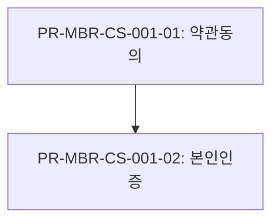

# EXPORTERS — 디자인팀/개발팀 export 변환기 가이드

> 코덱스/Claude Code/팀원이 변환기 작업을 이어갈 때 **가장 먼저 읽는 문서**.
> AGENTS.md §21이 시드 진입점이고, 본 문서는 상세 가이드·결정사항·미해결 항목을 담는다.

---

## 1. 개요

### 1.1 무엇을 하는가

`src/exporters/dev_format.py`는 ncstudio가 작성한 정책서 HTML을 디자인팀/개발팀 양쪽에 친화적인 산출물 6종으로 변환한다.

- **입력**: 정책서 HTML 1개 (예: `output/NC_회원가입탈퇴_정책서_Full_v1.0.html`)
- **출력**: `output/exports/<slug>/` 디렉토리 안 6종 산출물 + `diagrams/*.svg`
- **핵심 특성**: LLM 호출 0, stdlib만 사용, 결정적 변환 (같은 입력 → 같은 출력)

### 1.2 왜 만들었는가

정책서 HTML은 **사람이 읽는 컨설팅 문서** 형식이라 두 팀이 직접 활용하기 어렵다.

- **디자인팀**: AI 목업 도구(Claude Code, Cursor 등)에 정책서 한 장면을 input으로 넣고 싶지만, HTML 통째로는 너무 크고 화면 단위로 쪼개져 있지 않다.
- **개발팀**: ID 체계와 N:N 매핑(UC↔Process↔Function↔Policy)을 추적하고 싶지만, HTML 표를 일일이 cross-reference 해야 한다.

변환기는 이 갭을 메운다 — UC 단위로 4단 nesting 분리 + 평탄 N:N 매트릭스 + 통합 entities 모델 + 자동 검증.

### 1.2.1 정책서 표준 패턴 (중요)

정책서는 두 가지 패턴이 공존하며, 변환기는 둘 다 지원한다:

| | **최신 표준 (상품상세/담기 v0.11 이후)** | **Legacy (회원가입/탈퇴 등)** |
|---|---|---|
| 표 분류 | 의미적 CSS class (`process-list-table`, `state-transition-table` 등) | class 없음, 헤더 컬럼명으로만 식별 |
| UC ID 명시 | h4 section header `1) ... (US-XXX-XXX-XXX)` | PR↔UC slug 동일 (예: PR-MBR-CS-001 ↔ US-MBR-CS-001) |
| 다이어그램 class | multi-class (`diagram-wrap state-transition-diagram`) | single-class (`diagram-wrap`) |
| 변환기 메인 경로 | class-first 분류 + h4 fallback + multi-class regex | 헤더 fallback + slug derive |

**미래 정책서는 최신 표준 패턴을 따를 가능성이 높음**. 코덱스가 새 정책서를 만났을 때 표준 패턴이라고 가정하고 진단 진행. Legacy 패턴은 회원가입/탈퇴 baseline 회귀 보호용으로만 유지.

### 1.3 어떻게 동작하는가

```
HTML  ──parse_html──►  tables + policy_detail_items + title
       ──extract_entities──►  Entities (UC/Actor/Process/Function/PG/PI/State/Term/Transition)
       ──normalize_cross_refs──►  cross-references 양방향 보강
       ──build_hierarchy──►  3단 트리 (UC > Process > Function)
       ──collect_warnings──►  자동 검증 (broken_refs/orphans/N:N/ID 형식)
       ──build_diagrams──►  SVG → Mermaid 휴리스틱 (UC/State/BPMN 3종)
       ──[6종 artifact write]──►  output/exports/<slug>/
```

---

## 2. 명령·실행 예시

### 2.1 기본 명령

```bash
# 가상환경 활성화
source .venv/bin/activate

# 변환기 실행
python -m src.exporters.dev_format --input <html_path> [--output <dir>]
```

### 2.2 실행 예시

```bash
# input/samples/ 의 샘플 변환 (output/exports/<slug>/ 자동 결정)
python -m src.exporters.dev_format --input input/samples/NC_AI검색_정책서_간소화_v1.5.html

# 외부 HTML을 명시적 출력 디렉토리로 변환
python -m src.exporters.dev_format \
  --input ~/Downloads/Full_Example_회원가입탈퇴.html \
  --output output/exports/Full_Example_회원가입탈퇴_v_diagram_test
```

### 2.3 출력 디렉토리 자동 결정 규칙

`--output` 생략 시:

- input이 `output/` 내부에 있으면 → `output/exports/<slug>/`
- 그 외 → `<input_parent>/../output/exports/<slug>/`

`<slug>`는 입력 파일명에서 자동 생성. 충돌 시 기존 파일은 덮어씌워진다.

---

## 3. 산출물 6종 상세

### 3.1 `README.md` (자동 생성)

두 팀 담당자용 사용 가이드. 폴더 IA·활용 시나리오·ID 체계·변환 특성·다음 액션 포함.

`build_readme_md(ents)` 함수가 entity 카운트와 mapping.csv 행 수를 동적으로 채워 생성.

### 3.2 `00_INDEX.md`

Claude Code/AI 진입점. 핵심 표:

- UC 라우팅 표 (UC ID, name, 파일 경로, Process/Function/PG 카운트)
- 다이어그램 인덱스 (UC/State/BPMN 종류별 위치)
- 빠른 grep 패턴 (예: `grep -l "PR-MBR-CS-001-01" usecase_*.md`)

### 3.3 `usecase_*.md` × N

UC 단위 분리 파일. **4단 nesting**:

```
# UC: <name> (US-XXX)               ← Level 1
## Process: <name> (PR-XXX)         ← Level 2
### Function: <name> (FN-XXX)       ← Level 3
#### Policy Group: <name> (PG-XXX)  ← Level 4
   - Policy Item table (POL-XXX/PI-XXX, 내용)
```

각 헤더 아래 inline yaml frontmatter + meta 표 + 관련 다이어그램 Mermaid 본문 inline.

### 3.4 `mapping.csv`

평탄 N:N 매핑 매트릭스. 컬럼: `usecase_id, process_id, function_id, policy_group_id, policy_item_id, names...`

- Excel pivot으로 임의 cross-section 가능
- `grep`/`csvkit`/`pandas`로 자동 추적 가능
- Full_Example 산출물 기준 1601 data rows

### 3.5 `entities.yaml`

영문 키 + 평탄 + 양방향. 핵심 섹션:

- `meta`: source_html, extracted_at, topic
- `usecases`, `actors`, `processes`, `functions`, `policy_groups`, `policy_items`, `states`, `transitions`, `terms`
- `cross_refs`: UC ↔ Process ↔ Function ↔ PG ↔ PI 양방향 매핑
- `hierarchy`: 3단 트리 구조

### 3.6 `warnings.md`

자동 검증 결과. 6가지 카테고리:

- `broken_refs`: ID 참조 깨짐 (예: PR-XXX가 존재하지 않는 FN-XXX 참조)
- `orphans`: 어디에도 참조되지 않는 entity (예: Process에 매핑 안 된 Function)
- `N:N 불일치`: 양방향 매핑이 한쪽에만 있는 경우
- `ID 형식 위반`: 정의된 PREFIX_TO_TYPE 패턴 위반
- `Silent failure 의심`: 입력 신호(diagram-wrap 개수, state-transition 행 수, UC 정의 수 등) 대비 산출물이 비정상적으로 적으면 자동 감지. 새 정책서 변환 시 cold review 없이도 즉시 catch (P0).
- `Unknown ID prefix`: 셀/정책 상세에서 발견된 prefix가 PREFIX_TO_TYPE에 없으면 알람. 신규 ID 종류 도입 신호 (P2).

Full_Example 산출물 기준 **0 critical**. 상품상세/담기(v0.11) baseline 역시 0 critical.

### 3.7 `diagrams/*.svg`

UC/State/BPMN 다이어그램의 원본 SVG. Mermaid 본문 inline은 `usecase_*.md` / `00_INDEX.md`에 들어가고, SVG는 fallback 용.

휴리스틱 변환이라 정확도 100% 보장 안 함 → `notes:` 섹션에 신뢰도·미매핑 항목 명시.

---

## 4. 4단 nesting 구조 (디자인팀 mermaid 샘플 등가성)

디자인팀이 Slack으로 공유한 mermaid sample을 기준으로 `usecase_*.md`는 다음 4단 깊이를 따른다.

```markdown
# UC-001: 회원가입 신청

```yaml
id: US-MBR-CS-001
name: 회원가입 신청
actor_ids: [ACT-001]
```



## Process: 약관동의 (PR-MBR-CS-001-01)

```yaml
id: PR-MBR-CS-001-01
entry_condition: 회원가입 화면 진입
exit_condition: 약관 동의 완료
```

| 항목 | 값 |
|---|---|
| 선행 프로세스 | (없음) |
| 후행 프로세스 | PR-MBR-CS-001-02 |

### Function: 약관 표시 (FN-001)

```yaml
input_info: 약관 ID 목록
output_info: 약관 본문
processing_flow: ...
failure_cases: ...
```

#### Policy Group: 약관 정책 (PG-001)

| Policy Item ID | 내용 |
|---|---|
| POL-MBR-TERM-001-01 | 필수 약관 모두 동의 시 진행 |
| POL-MBR-TERM-001-02 | 선택 약관은 미동의 가능 |
```

같은 Function이 여러 Process에서 사용되면 각 Process 아래 반복 출력 (디자인팀 결정: 정보 응집 우선, 중복 OK).

---

## 5. 두 팀 피드백 핵심

### 5.1 개발팀 (Confluence "P3211")

- **ID 체계**: 모든 entity에 prefix-기반 ID 강제 (US/PR/FN/PG/POL/PI/ACT/ST/TM)
- **Hierarchy 3단**: UC > Process > Function 계위로 정리
- **용어 영문·데이터 딕셔너리**: terms 영문명 + entities.yaml 영문 키
- **문서 분리**: UC 단위 파일로 grep/Read 친화
- **PR→FN 참조**: 양방향 매핑 보존
- **기능 액터**: 각 Function이 어떤 Actor에 의해 실행되는지 명시

### 5.2 디자인팀 (Slack)

- **UC별 분리**: 화면 단위 mockup 생성 시 UC 한 개씩 input으로 사용
- **정보 응집**: 같은 화면에 필요한 Process/Function/PG/PI가 한 파일에 있어야 함
- **정책 누락 케이스 (재가입)**: 원본 HTML에 누락된 케이스가 변환에서도 누락되지 않게 warnings로 노출
- **ID 기반 매핑**: ID로 cross-link, 한국어 이름은 표시용
- **YAML vs 표 분리**: 메타데이터는 yaml block, 사람이 읽는 표는 markdown table

### 5.3 종합

Claude Code grep·Read tool 친화, mapping.csv가 N:N 핵심 navigator, UC 파일이 AI 목업 input.

---

## 6. 결정사항 (변경 금지)

이전 작업 + 이번 작업에서 합의·검증한 결정:

| # | 사항 | 결정 |
|---|---|---|
| **1** | 분리 단위 | UC 파일 + Process anchor (`{#process-PR-XXX-XX}`) |
| **2** | 정보 응집 | Claude 친화: yaml header + 메타 표 inline. 같은 Function 여러 Process에 반복 OK |
| **3** | 산출물 파일 | README.md + 00_INDEX.md + usecase_*.md × N + mapping.csv + entities.yaml + warnings.md + diagrams/*.svg |
| **4** | Tier 2/3 항목 | F(ID hierarchy 트리) + G(데이터 딕셔너리) + H(기능 액터 컬럼) + J(영문 placeholder) + K(aliases hook) |
| **5** | entities.yaml schema | 영문 키 + 평탄 + 양방향 + cross_refs/hierarchy 별도 |
| **6** | 다이어그램 처리 | 변환기 단독 SVG→Mermaid 휴리스틱 + entities 기반 보강 |
| **7** | usecase_*.md 구조 | 디자인팀 mermaid 샘플 등가 4단 nesting (Process > Function > PG > PI) |
| **8** | 컨텍스트 우선순위 | Mermaid 본문 inline + SVG fallback |
| **9** | PR↔FN 매핑 | 원본 HTML 두 source 충돌(22/22 PR) 시 변환기는 보존적 union 처리. 좁은 매핑은 HTML "5장 가. 기능 목록" 참조 |
| **10** | 상태 전이 UC 매핑 | 원본 상태 전이표에 UC ID 컬럼 없음. entities.yaml#transitions[]에서 직접 추적 |

이 10개를 변경하려면 두 팀 재합의가 필요하다.

---

## 7. 해결된 fix 이력 (참조용)

> **모든 cosmetic/Critical 2종은 이세션에서 처리됨.** 코덱스가 별도로 처리할 필요 없음.
> 새 정책서 변환 시 같은 부류 회귀가 생기지 않도록 회귀 테스트로 보호됨.

### 7.1 ~~PolicyItem content `- ` prefix strip~~ ✅ 해결

- 현상: `entities.yaml` / `usecase_*.md`의 PolicyItem 내용 일부가 `- ` 접두로 시작 (HTML 원본 `<li>` 잔재).
- Fix: `_finalize_policy_item`에서 leading bullet 제거 + 문장 끝 + 다음 bullet (`.- `) 패턴을 `. ` 공백으로 결합.
- 회귀 보호: `test_full_policy_content_no_leading_bullet`, `test_pdd_policy_content_no_leading_bullet`.

### 7.2 ~~세부 기능 구성 multiline rejoin~~ ✅ 해결 (이전 fix에서 이미 처리됨)

- 검토 결과: `Function.details` / `processing_flow` 모두 YAML block scalar (`|`)로 잘 출력 중. cosmetic 이슈 부재.
- HANDOVER 메모가 outdated였음 (Phase B 시점에 이미 해결).

### 7.3 ~~Critical: diagram-wrap multi-class 미지원~~ ✅ 해결 (`cfb5726`)

- 상품상세/담기 sample(v0.11)에서 발견. `<div class="diagram-wrap state-transition-diagram">` 같은 multi-class가 추출 0건.
- Fix: regex를 `\b...\b` 단어 경계 기반으로 변경.
- 회귀 보호: `test_pdd_diagrams_multiclass_extracted`.

### 7.4 ~~Critical: PR↔UC slug 가정 (h4 fallback 부재)~~ ✅ 해결 (`cfb5726`)

- PR slug(DTL/CMP/SEL)와 UC slug(CUS/OPS/CS/SYS)가 다른 분류 체계인 정책서에서 derive 실패. mapping.csv 28 rows로 잘림.
- Fix: `_extract_processes`에 `t.section_h4`의 `(US-XXX-XXX-XXX)` 추출 fallback 추가.
- 회귀 보호: `test_pdd_mapping_rich_via_h4_fallback`, `test_pdd_uc_files_rich`.

### 7.5 변환기 구조 메모 (코덱스 이해용)

§1.2.1 정책서 표준 패턴 참조. 변환기 내부 처리 경로 요약:

**최신 패턴 처리 경로 (상품상세/담기 이후)** — 메인 경로:
1. `classify_table` class-first 분류 — `CLASS_TO_BUCKET` (src/exporters/dev_format.py 상단)
2. `_extract_processes` h4 fallback — section header에서 `(US-XXX-XXX-XXX)` 추출
3. `extract_diagrams` multi-class regex — `\b...\b` 단어 경계 기반
4. `append_silent_failure_warnings` 자동 sanity check (P0 + P2)

**Legacy 호환 경로 (회원가입/탈퇴 등)** — 보조 경로, backward compat용:
1. `classify_table` 헤더 fallback — class 없는 표를 헤더 컬럼명으로 분류 (CLASS_TO_BUCKET 분기 통과 후 도달)
2. `_post_process` PR↔UC slug derive (line 580~620) — PR slug == UC slug일 때만 동작

**코덱스 작업 시 주의**: legacy 경로는 회원가입/탈퇴 baseline 회귀 보호용. 새 정책서는 표준 패턴이 default. legacy 경로 코드 변경 시 회원가입/탈퇴 baseline 회귀 테스트가 즉시 알람.

---

## 8. 다음 작업 candidates

### 8.1 회귀 테스트 확장

현재 `tests/test_dev_format.py`는 산출물 존재·entity 카운트·mapping.csv·warnings·4단 nesting 5종 검증. 추가 후보:

- 다른 입력 정책서(Full_Example, AI검색 외)에 대한 smoke test
- diagrams/*.svg → Mermaid 휴리스틱 정확도 회귀 (좌표 변환 결과 비교)
- `entities.yaml` schema validation (예: jsonschema로 영문 키 강제)
- mapping.csv → entities.yaml 일관성 cross-check

### 8.2 HTML 작성자 측 보완 (정책서 작성자 영역)

원본 HTML이 변경되면 변환기가 자연히 더 풍부한 산출물을 만들 수 있음:

- 용어 표에 영문명 컬럼 추가
- 기능 상세 표에 액터 row 추가
- 상태 전이표에 UC ID 컬럼 추가
- 정책 상세에 누락 케이스(예: 재가입) 명시
- 두 source(가. 기능 목록 vs 다. 프로세스 상세)의 PR↔FN 매핑 일치
- BPMN SVG에 task-id 명시 (현재 22 PR 중 0개에 task-id 부재)

### 8.3 다른 정책서 변환

`input/samples/`에 있는 다음 정책서들을 변환해서 입력 파일별 변환 품질 차이 점검:

- `NC_AI검색_정책서_간소화_v1.5.html`
- `NC_정책서_Full_v1.0_확정본.html`
- `NC_정책서_간소화_v1.0_확정본.html`

각 변환 결과를 `output/exports/<slug>/`에 보존하고 `warnings.md` critical을 0으로 유지.

### 8.4 변환기 기능 확장 (필요 시)

- `--format json` 옵션 (entities.yaml을 json으로도 출력)
- `--diff <prev_dir>` 옵션 (이전 변환과 비교해 changed entities만 표시)
- `--validate-only` 옵션 (warnings만 출력하고 산출물 안 씀)

이건 두 팀 요청이 들어왔을 때만 진행.

### 8.5 신규 정책서 회귀 위험 — 남은 검토 안건 2건

이세션에서 **P0 silent failure 자동 감지**와 **P2 unknown prefix 알람**은 fix 완료 (다음 §7 참조). 남은 P1·P3는 실제 변형 케이스가 발생할 때 처리하는 게 효율적이라 코덱스 검토 후 개발 대상으로 남김.

**회귀 보장 원칙 (남은 안건 공통)**:
- `pytest tests/test_dev_format.py -v`의 현재 20 PASS를 절대 깨지 않는다 (회원가입/탈퇴 + AI검색 + 상품상세/담기 baseline 모두 보호).
- 코드 변경 시 새 회귀 테스트도 함께 추가 (한 baseline에서만 동작하는 fix 금지).

#### 8.5.1 ~~P1 — 한국어 표기 변형 alias~~ (대부분 격하됨)

원래 안건: 새 정책서가 `"UC ID"`, `"PR명"` 같이 헤더 컬럼명을 바꾸면 분류 fail.

**격하 사유**: `classify_table`에 class-first 분류 도입(`CLASS_TO_BUCKET`). 최신 패턴 정책서는 의미적 class로 안전하게 분류되므로 컬럼명 변형 위험 대부분 해소.

남은 위험 케이스 (가능성 낮음):
- (a) class 없는 legacy 정책서가 컬럼명을 바꿔서 새로 들어올 때
- (b) 신규 정책서가 class를 빼버릴 때
- (c) h3 한국어 prefix 표기 변형 (`"가. "` → `"1. "` 등)

위 (a)(b)(c) 케이스가 실제 발생하면 P0 silent failure 감지가 즉시 catch함 (전체 entity 카운트가 0 또는 silent failure 의심에 표시).

**진행 시점**: P0 알람이 헤더/h3 매칭 실패를 catch한 시점에만.

#### 8.5.2 P3 — h4 UC ID 형식 다변화 대응

**문제**: `_extract_processes`의 h4 fallback (`cfb5726`)은 `(US-XXX-XXX-XXX)` 형식 가정. h4에 UC ID가 아예 없는 정책서 또는 `[US-XXX]`, `US-XXX :` 같은 다른 형식은 다시 fail.

**제안**:
1. `t.section_h3`도 검색 후보에 추가 (h3에 UC 정보 있는 패턴 정책서 대응)
2. process_detail vertical 표 안의 `유즈케이스 ID` row 추출도 fallback에 추가

**보호 안전망**: P0의 placeholder UC 비율 감지 (>80% 임계치) + UC×Process 연결 부족 감지가 이 경우 silent failure로 즉시 catch.

**진행 시점**: 새 정책서에서 P0 알람이 떴을 때 fallback 추가.

#### 8.5.3 운영 원칙

새 정책서 변환은 다음 순서를 권장:
1. `python -m src.exporters.dev_format --input <html>` 실행
2. `warnings.md`의 6 카테고리 모두 확인 (특히 `Silent failure 의심`, `Unknown ID prefix`)
3. 0건이면 sanity check 통과 → 산출물 검토로
4. >0건이면 위 §8.5.1·8.5.2 중 해당하는 fix 진행 + 회귀 테스트 추가

---

## 9. 코덱스 진입 권장 경로

새 코덱스 세션이 변환기 작업을 이어갈 때:

1. `AGENTS.md` 끝부분 §21 (시드 진입점) 읽기
2. **본 문서(`docs/EXPORTERS.md`)** 전체 읽기 — 결정사항·미해결·다음 작업 파악
3. `src/exporters/dev_format.py` 모듈 docstring (1~15줄) 읽기 — 모듈 구조 파악
4. 산출물 baseline 확인:
   - `output/exports/Full_Example_회원가입탈퇴_v_diagram_test/README.md` 읽기 (자동 생성된 두 팀용 가이드)
   - `output/exports/Full_Example_회원가입탈퇴_v_diagram_test/00_INDEX.md` 첫 50줄 읽기
   - `output/exports/Full_Example_회원가입탈퇴_v_diagram_test/usecase_US-MBR-CS-001.md` 읽기 (4단 nesting 예시)
5. 회귀 테스트 통과 확인:
   ```bash
   source .venv/bin/activate
   pytest tests/test_dev_format.py -v
   ```
6. 다음 작업 결정:
   - 미해결 cosmetic 2건 (§7) 마무리 → 작은 PR
   - 또는 다른 정책서 변환 (§8.3)
   - 또는 회귀 테스트 확장 (§8.1)

### 9.1 변환기 수정 시 체크리스트

- [ ] 결정사항 10개(§6) 위배 없는지 확인
- [ ] LLM 호출 추가 안 했는지 (AGENTS.md §21.5)
- [ ] stdlib 외 의존성 추가 안 했는지
- [ ] `pytest tests/test_dev_format.py -v` 통과
- [ ] `pytest` 전체 통과 (회귀 영향 확인)
- [ ] Full_Example 산출물 재생성 후 `warnings.md` critical 0 유지
- [ ] 본 문서(`docs/EXPORTERS.md`) 갱신 (변경사항이 결정사항에 영향 주면)

---

## 10. Git/Push 정책 (변환기 영역)

- 변환기 코드 변경(`src/exporters/dev_format.py` 등)은 별도 commit 단위로 분리 (정책서 본체 변경과 섞지 않기).
- 변환기 산출물(`output/exports/<slug>/`)은 입력 정책서가 안정 버전(v1.0 등)일 때만 commit. 작업 중 산출물은 untracked로 둠.
- 현재 origin push 시점은 사용자 결정 보류 상태 — `.claude/HANDOVER.md` 참조.
- Push 시 권장: 별도 브랜치(`feature/dev-format-*`) + GitHub PR. 직접 main push는 배포 trigger 영향 검증 필요.

---

## 11. FAQ

**Q. 변환기를 다시 실행하면 기존 산출물이 덮어씌워지는가?**
A. 예. `output/exports/<slug>/` 안 파일은 모두 새로 작성된다. 수동 편집한 산출물이 있으면 백업 필요.

**Q. 새 정책서를 변환했는데 warnings에 broken_refs가 많이 나온다.**
A. 99% 원본 HTML의 정합성 문제. `warnings.md`의 broken_refs 항목을 정책서 작성자에게 전달해 원본 수정 요청. 변환기 버그라면 `tests/test_dev_format.py`에 회귀 테스트 추가.

**Q. Mermaid 다이어그램이 부정확하다.**
A. 좌표 휴리스틱 변환이라 정확도 100% 보장 안 함. `usecase_*.md`의 mermaid 블록 옆 `notes:` 섹션에 신뢰도와 미매핑 항목 명시. 정확한 다이어그램은 `diagrams/*.svg` (원본) 참조.

**Q. 같은 Function이 여러 Process 아래 반복 출력되는 게 맞나?**
A. 결정사항 #2 (정보 응집)에 따라 의도적. 같은 화면 mockup 만들 때 한 파일 안에서 모든 정보를 보기 위함. mapping.csv로 중복 없이 navigation 가능.

**Q. PolicyItem ID가 POL- 와 PI- 두 종류 있다.**
A. 정책서마다 다름. PREFIX_TO_TYPE에서 두 prefix 모두 `policy_items`로 매핑. entities.yaml은 둘을 구분 없이 처리.
